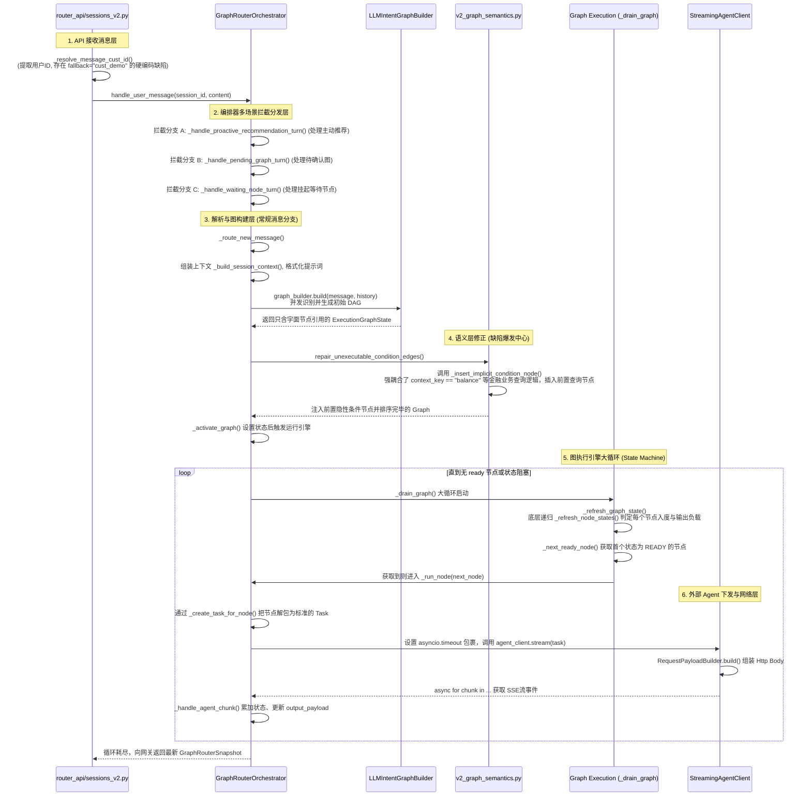

# 深度代码审查报告 (Code Review Report - 细粒度版)

> 审查范围：`@backend/src/router_api` & `@backend/src/router_core`
> 重点关注：意图路由 V2 流转的精准调用关系栈、函数级流转职责，以及深层耦合问题的具体定址与重构建议。

---

## 一、 核心流程调用关系与流转全景（V2 意图路由）

下面是用户发送消息后，整个后端 `router_api` 和 `router_core` 真实且完整的的执行链路拆解：



---

## 二、 核心步骤的精确级拆解与代码缺陷定址

我将通过上面的链路图，一步步指出代码的隐患发生行与重构建议：

### 步骤 1：API 接收与边界验证 (API 层)
- **调用位置：** `router_api/routes/sessions_v2.py`
  - 主函数：`post_message` (API 核心下发入口) 
  - 辅助提取函数：`_resolve_message_cust_id` 和 `_resolve_action_cust_id`。
  - 函数作用：从 Request Payload 中抽取 `cust_id` 供下层识别用户内存槽。
- 🚨 **精确缺陷定址：** `sessions_v2.py: 第 83 行与第 96 行`
- ❌ **问题表现：** `return "cust_demo"`。此时如果没有带上合法的 `cust_id` 或者上下文丢失，系统没有抛出 HTTP Error，而是返回了一个写死的“测试用户 ID”。线上若出现大量这类缺失，将导致不同的真实用户数据互相串联混合到 "cust_demo" 这个会话内存中去。
- ✅ **重构指南：**
  ```python
  # sessions_v2.py
  def _resolve_message_cust_id(orchestrator, session_id, request) -> str:
      if request.cust_id:
          return request.cust_id
      try:
          return orchestrator.snapshot(session_id).cust_id
      except KeyError:
          # 决不能 fallback，直接抛出 400
          raise HTTPException(status_code=400, detail="Missing required field: cust_id") 
  ```

### 步骤 2：图语义修补环节的“高优危险硬编码”
- **调用位置：** `router_core/v2_orchestrator.py`
  - 函数：`_route_new_message()` 中调用的外部修补能力
  - 接力调用点：`router_core/v2_graph_semantics.py` 的 `repair_unexecutable_condition_edges()`
- 🚨 **精确缺陷定址：** `v2_graph_semantics.py: 第10行 - 22行`, 以及核心地带的 `第194行 - 204行`
- ❌ **问题表现：** 
  代码开头定义了 `_CONTEXT_KEY_ALIASES = {"balance": {...}, "due_amount": {...}}` 等一堆属于金融系统的名词。
  紧接着在函数 `_insert_implicit_condition_node` 中：
  ```python
  def _insert_implicit_condition_node(...):
      title = producer_intent.name
      if context_key == "balance": # <--- 致命的特定领域硬编码！
          title = "查询账户余额"   # <--- 业务强耦合泄漏到了底层通用图引擎层！
  ```
  **影响评估：** 这是一个抽象编排器的大忌。这导致这段引擎不能脱开金融业务被其它产品（如政务路由、电商退货图）复用！
- ✅ **重构指南：**
  删掉 `v2_graph_semantics.py` 文件中的那两组全局映射变量。任何推断都不应该凭空出现，修改判断方法：**要求所有外部注入此系统的 `IntentDefinition`，在它的 YAML 或配置注册中增加 `graph_build_hints.provides_context_keys`**。引擎只负责动态查表获取 title，禁绝直接 `if context == "某词"`。

### 步骤 3：图状态机执行器（God Object 集中地）
- **调用位置：** `router_core/v2_orchestrator.py`
  - 主循环函数：`_drain_graph()`
  - 核心计算与更新函数：`_refresh_node_states()` 及 `_condition_matches_from_condition()`
- 🚨 **精确缺陷定址：** `v2_orchestrator.py: 第 1269 行 到 第 1357 行`
- ❌ **问题表现：** 
  这里的图拓扑遍历算法本身没什么大错，错在于**架构分层**。
  长达 1934 行的 `GraphRouterOrchestrator` 把所有东西包揽在身。在同一个类中它既在写 SQL-like 的内存数据获取 (`self.session_store.get_or_create`)，又在格式化极其长篇的大模型前缀咒语 (`_proactive_recommendation_context_summary`)，还把这 300 多行的图状态核心拓扑推导算法塞在一起。
  一旦你要在这个逻辑密室中给图加上并行机制，调试难度极高！
- ✅ **重构指南：**
  实施**数据层、应用逻辑与引擎执行的分离**：
  将 `_refresh_node_states`, `_condition_matches_from_condition`, `_next_ready_node` 抽取成独立文件 `router_core/execution_engine.py` (类 `ExecutionGraphEngine`)。它是个纯度极高的推导类，只接收 `GraphRouterSnapshot` 的图节点副本并返回转移结果，不涉及任何数据库调用和大模型知识。

### 步骤 4：Agent 取消链路的 URL 裁剪危险操作
- **调用位置：** `router_core/agent_client.py` 
  - 函数：`StreamingAgentClient.cancel()` -> 调用 `_cancel_url()`
- 🚨 **精确缺陷定址：** `agent_client.py: 第 310 行到 第 315 行`
- ❌ **问题表现：**
  在取消请求时，你为了停止挂起的第三方 Agent，采用了以下切尾巴方式：
  ```python
  def _cancel_url(self, agent_url: str) -> str:
      if agent_url.endswith("/run"):
          return agent_url[:-4] + "/cancel"
  ```
  这是非常违背规范的“隐形契约”。如果别的微服务提供了一个不是叫 `/run` 的入口（例如 `.../invoke`），这里会错误拼接成 `.../invoke/cancel`，引发线上的 HTTP 404 导致任务实际在后台没被强杀，最终出现性能泄露。
- ✅ **重构指南：**
  在 `router_core/domain.py` 给实体类 `IntentDefinition` 与底层 `Task` 加上清晰的属性约定：
  ```python
  @dataclass
  class Task:
      # ...
      agent_url: str
      agent_cancel_url: str | None = None # 显式加字段
  ```
  `agent_client.py` 必须依靠这个新字段来发网络请求。如果遇到部分老的数据没填 `agent_cancel_url`，打一句 Warning 日志并返回，不要去揣测和强行裁剪字符串。
