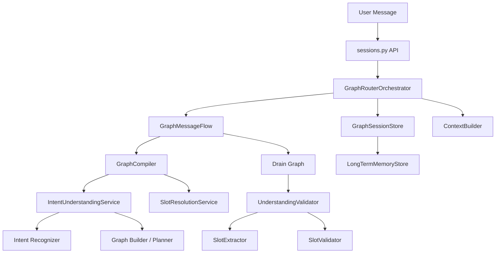
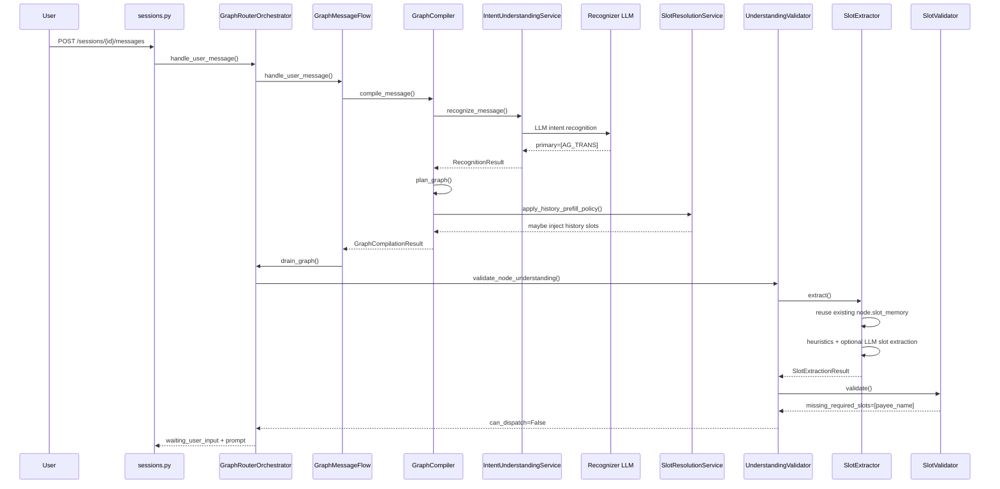
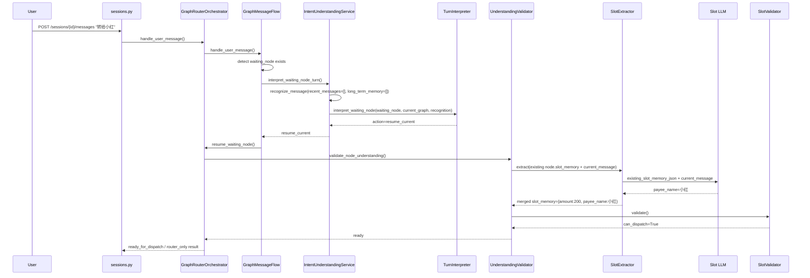
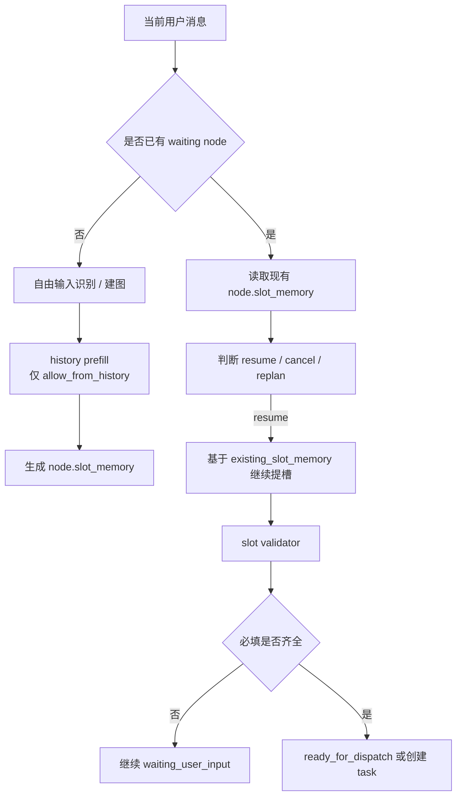

# Router Service 多轮提槽记忆机制详解

## 1. 文档目标

本文只讨论当前 `router-service` 中，**用户输入进入 router，到调用 agent 执行之前** 这一段的多轮提槽记忆机制。

重点回答以下问题：

1. 当前“记忆”分几层，分别存什么。
2. 一轮对话进入时，哪些上下文会进入意图识别。
3. 节点进入 `waiting_user_input` 之后，下一轮补槽到底复用了什么。
4. 长期记忆什么时候产生，什么时候被读取，什么时候会自动预填。
5. 当前实现的边界和局限在哪里。

本文基于当前代码实现，不写理想化方案，不把未实现能力写成已实现能力。

---

## 2. 一句话结论

当前多轮提槽的“记忆”不是一套泛化的聊天记忆系统，而是一个**受控、分层、可追溯**的机制：

1. **第一优先级是当前节点自己的 `slot_memory`**。  
   多轮补槽时，最核心的记忆来自当前 waiting node 自己已经收集到的槽位。

2. **第二优先级是受控历史复用**。  
   只有 `slot_schema.allow_from_history=true` 的槽位，才可能从历史任务或长期记忆中自动预填。

3. **长期记忆不是每一轮提槽都直接喂给提槽 LLM**。  
   当前实现里，长期记忆更主要用于：
   - 自由输入阶段的意图识别 / 建图
   - 建图后的 history prefill
   - 已标记为 history source 的槽位校验

4. **waiting node 阶段的提槽，主要依赖“已有节点状态 + 当前消息”**，而不是完整聊天历史。

所以当前机制更准确的描述是：

`多轮提槽记忆 = 当前节点状态 + 受控历史回填 + 到期归档的长期记忆`

而不是：

`完整对话上下文任意回忆 + 自动补齐`

---

## 3. 代码分层结构

### 3.1 总体层级



### 3.2 关键模块职责表

| 模块 | 文件 | 角色 | 与记忆的关系 |
|---|---|---|---|
| API 入口 | `backend/services/router-service/src/router_service/api/routes/sessions.py` | 接收 `/sessions/{id}/messages` 请求 | 不做记忆决策，只把消息交给 orchestrator |
| 顶层协调器 | `backend/services/router-service/src/router_service/core/graph/orchestrator.py` | 串起 message flow、graph drain、节点理解校验 | 负责构建 session context、读取长期记忆、推动 waiting node 恢复 |
| 消息流控制 | `backend/services/router-service/src/router_service/core/graph/message_flow.py` | 判断当前消息走新建图、pending graph、waiting node、guided selection 哪条分支 | 决定“这轮是不是补当前节点” |
| 编译器 | `backend/services/router-service/src/router_service/core/graph/compiler.py` | 自由输入阶段做识别、规划、history prefill | 历史槽位预填的主入口 |
| 语义理解服务 | `backend/services/router-service/src/router_service/core/recognition/understanding_service.py` | 做识别、waiting/pending turn 解释 | waiting node 阶段会先判断是补槽还是重规划 |
| 槽位解析服务 | `backend/services/router-service/src/router_service/core/slots/resolution_service.py` | 统一做 history prefill、recommendation default 合并、binding 重建 | 历史槽位自动注入的核心位置 |
| 节点理解校验器 | `backend/services/router-service/src/router_service/core/slots/understanding_validator.py` | 串联提槽和校验 | 多轮补槽的真实执行入口 |
| 提槽器 | `backend/services/router-service/src/router_service/core/slots/extractor.py` | 先复用已有槽位，再用启发式 + LLM 补缺失槽位 | 直接消费 `node.slot_memory` |
| 槽位校验器 | `backend/services/router-service/src/router_service/core/slots/validator.py` | 检查必填、歧义、非法槽位、history 允许性 | 决定能否 dispatch |
| Session Store | `backend/services/router-service/src/router_service/core/graph/session_store.py` | 管理 session 生命周期、TTL、过期归档 | 短期记忆和长期记忆的桥梁 |
| Long Term Memory | `backend/services/router-service/src/router_service/core/support/memory_store.py` | 按 `cust_id` 保存跨会话事实 | 当前为字符串化 memory facts |
| Context Builder | `backend/services/router-service/src/router_service/core/support/context_builder.py` | 组装 `recent_messages` 和 `long_term_memory` | 意图识别和 agent task context 的入口 |

---

## 4. 记忆分层模型

### 4.1 分层总览

| 层级 | 所属对象 | 主要字段 | 生命周期 | 主要用途 |
|---|---|---|---|---|
| 节点级记忆 | `GraphNodeState` | `slot_memory`、`slot_bindings`、`history_slot_keys` | 当前 graph 生命周期内 | 多轮补槽最核心的状态 |
| 会话级记忆 | `GraphSessionState` | `messages`、`tasks`、`candidate_intents` | session TTL 内 | 最近对话、已执行任务槽位、等待恢复状态 |
| 客户级长期记忆 | `LongTermMemoryStore` | `facts` | 跨 session | 跨会话复用稳定事实 |
| 外部默认值 | recommendation / guided selection | `slot_memory` | 当前请求内 | 不是历史记忆，但会作为默认槽位来源 |

### 4.2 节点级记忆

定义位置：

- `backend/services/router-service/src/router_service/core/shared/graph_domain.py`

核心字段：

```python
class GraphNodeState(BaseModel):
    slot_memory: dict[str, Any] = Field(default_factory=dict)
    slot_bindings: list[SlotBindingState] = Field(default_factory=list)
    history_slot_keys: list[str] = Field(default_factory=list)
```

这层是当前多轮补槽最重要的记忆。

含义分别是：

- `slot_memory`
  当前节点已经确认可继续使用的槽位值。

- `slot_bindings`
  每个槽位值来自哪里，证据文本是什么，是否被覆盖过。

- `history_slot_keys`
  哪些槽位是从 history / long-term memory 注入进来的，而不是来自当前消息。

### 4.3 会话级记忆

定义位置：

- `backend/services/router-service/src/router_service/core/shared/graph_domain.py`

核心字段：

```python
class GraphSessionState(BaseModel):
    messages: list[ChatMessage] = Field(default_factory=list)
    tasks: list[Task] = Field(default_factory=list)
    current_graph: ExecutionGraphState | None = None
    pending_graph: ExecutionGraphState | None = None
    active_node_id: str | None = None
```

这层保存：

- 最近的用户 / assistant 对话
- 当前 session 已创建过的 task 及其 `slot_memory`
- 当前 graph、pending graph、active node

这层的主要作用不是直接当成提槽真值，而是：

1. 为识别 / 规划构造 `recent_messages`
2. 为 history prefill 提供最近 task 的 `slot_memory`
3. 保存 waiting node，让下一轮能够继续补当前节点

### 4.4 客户级长期记忆

定义位置：

- `backend/services/router-service/src/router_service/core/support/memory_store.py`

当前长期记忆仍然是**字符串化 facts**，不是结构化 slot record。

典型内容类似：

```text
user: 帮我给小红转200
AG_TRANS: amount=200, payee_name=小红
```

这层的特点：

- 以 `cust_id` 为 key
- session 过期时归档进去
- 新 session 构建 context 时通过 `recall(cust_id)` 取回
- 目前没有字段级 TTL、confirmed 状态、冲突版本等 richer metadata

### 4.5 recommendation defaults 不是历史记忆

当前代码里还有一类“像记忆但不是记忆”的来源：

- guided selection
- proactive recommendation

这类值通过 `SlotResolutionService.apply_proactive_slot_defaults()` 注入 node。

它们的来源是：

- 上游推荐结果
- UI 结构化选择

不是历史复用，不属于长期记忆。

---

## 5. 关键数据流

### 5.1 `_build_session_context()`

代码位置：

- `backend/services/router-service/src/router_service/core/graph/orchestrator.py`

当前实现：

```python
def _build_session_context(self, session: GraphSessionState, task: Task | None = None) -> dict[str, Any]:
    long_term_memory = self.session_store.long_term_memory.recall(session.cust_id)
    return self.context_builder.build_task_context(session, task=task, long_term_memory=long_term_memory)
```

也就是说，**每次构建 session context 时，会读当前 `cust_id` 下的长期记忆**。

`ContextBuilder` 会把它和最近消息拼成：

- `recent_messages`
- `long_term_memory`

这两个字段主要用于：

1. 自由输入阶段的 intent recognition
2. graph planning / graph builder
3. agent task context

### 5.2 `history_slot_values()`

代码位置：

- `backend/services/router-service/src/router_service/core/slots/resolution_service.py`

当前逻辑会从两个地方收集可复用槽位：

1. `session.tasks` 中最近任务的 `slot_memory`
2. `long_term_memory` 中形如 `intent_code: key=value` 的文本

简化后逻辑是：

```python
for task in reversed(session.tasks):
    for key, value in task.slot_memory.items():
        values[key] = value

for entry in reversed(long_term_memory):
    parse "intent_code: key=value, ..."
```

这一步只是在**收集候选历史槽位**，还没有决定一定能注入。

### 5.3 `apply_history_prefill_policy()`

代码位置：

- `backend/services/router-service/src/router_service/core/slots/resolution_service.py`

这是当前历史注入最关键的步骤。

它会：

1. 先保留 node 原有 `slot_memory`
2. 用 `normalize_slot_memory()` 检查这些值是否 grounded
3. 用 `apply_history_slot_values()` 为缺失的、允许 history 的槽位注入值
4. 把注入的槽位标记到 `history_slot_keys`
5. 重建 `slot_bindings.source = HISTORY`
6. 如果确实复用了历史值，把 graph 置为 `WAITING_CONFIRMATION`

这说明当前实现是一个非常明确的策略：

- 历史值只能补缺失槽位，**不会覆盖当前显式值**
- 复用历史值后，不会直接静默执行
- 会把 graph 拉到确认态，要求用户确认

---

## 6. 第一轮自由输入时序

以输入：

```text
帮我转200
```

为例。

### 6.1 时序图



### 6.2 这一轮里“记忆”是怎么用的

这一轮主要会用到两类上下文：

1. `recent_messages`
2. `long_term_memory`

但要注意：

- 它们主要用于**意图识别 / 建图 / history prefill**
- 不代表提槽 LLM 会无条件看到它们全部内容

如果当前 graph 刚建出来，node 还没有历史槽位，那么第一轮补槽通常还是以：

- 当前消息
- node.source_fragment
- graph.source_message

为主。

---

## 7. waiting node 多轮补槽时序

以两轮转账为例：

第一轮：

```text
帮我转200
```

第二轮：

```text
转给小红
```

### 7.1 时序图



### 7.2 当前 waiting node 阶段最重要的事实

这是理解当前机制的关键：

1. waiting node 阶段，**不是重新从零做一遍自由输入识别 + 建图**。
2. 先做的是：
   - 这条新消息是在继续补当前节点？
   - 还是取消当前节点？
   - 还是表达了新目标，需要重规划？
3. 如果判断为 `resume_current`，才会进入真正的多轮补槽。

### 7.3 第二轮提槽时到底带了什么

在 `SlotExtractor.extract()` 里，当前多轮补槽主要使用这些输入：

- `node.slot_memory`
- `node.slot_bindings`
- `node.history_slot_keys`
- `graph_source_message`
- `node.source_fragment`
- `current_message`

其中最关键的是：

- `existing_slot_memory_json`

这意味着第二轮“转给小红”时，LLM / extractor 看到的不是一个空节点，而是：

```json
{
  "amount": "200"
}
```

再基于当前输入补出：

```json
{
  "payee_name": "小红"
}
```

### 7.4 一个非常重要的边界

当前 waiting node 阶段的提槽 LLM **没有直接接收 `long_term_memory_json`**。

也就是说：

- 自由输入阶段的识别 LLM：会看到 `long_term_memory`
- planning / builder：会看到 `long_term_memory`
- slot extractor LLM：当前只看到
  - `current_message`
  - `source_fragment`
  - `intent_json`
  - `existing_slot_memory_json`

这就是为什么当前多轮补槽更像“节点状态续写”，而不是“全量记忆问答”。

---

## 8. 记忆真正生效的位置

### 8.1 位置一：当前节点已有槽位续用

这是当前最主要的多轮记忆。

`SlotExtractor.extract()` 一上来就会先读 `node.slot_memory`，并尝试把已有 binding 规范化。

这意味着只要 node 还活着：

- 第一轮已经提到的金额
- 第一轮已经确认的收款人
- 第一轮已经从 recommendation 注入的默认值
- 第一轮已经从 history 注入的值

都不会丢。

### 8.2 位置二：compile 阶段的 history prefill

`GraphCompiler.compile_message()` 在 graph 构建后，会调用：

- `SlotResolutionService.apply_history_prefill_policy()`

这一步是**自动使用历史槽位**的唯一核心入口。

重点规则：

1. 只对 `allow_from_history=true` 的 slot 生效
2. 只填补缺失槽位
3. 不覆盖已有明确值
4. 一旦注入历史值，graph 进入确认态

### 8.3 位置三：session 过期后的长期记忆沉淀

`GraphSessionStore` 会在两个时机把 session 提升到长期记忆：

1. `get_or_create()` 发现 session 已过期
2. `purge_expired()` 清理过期 session

提升逻辑：

```mermaid
flowchart TD
    S[Expired Session] --> P[promote_session()]
    P --> M1[store last 5 messages]
    P --> M2[store each task.slot_memory]
    M1 --> LTM[LongTermMemoryStore facts]
    M2 --> LTM
```

当前提升内容包括：

1. 最近 5 条消息
2. 每个 task 的 `slot_memory`

这说明当前跨会话记忆的来源不是 graph node 本身，而是：

- session message
- task slot_memory

---

## 9. 覆盖与优先级规则

### 9.1 compile 阶段

在 compile 阶段，槽位来源优先级大致如下：

1. node 原生 `slot_memory`
2. proactive / recommendation defaults
3. history prefill 只补缺失值

也就是说：

- recommendation 默认值不会覆盖 node 里已有值
- history prefill 也不会覆盖已有值

### 9.2 waiting node 阶段

在多轮补槽阶段，`SlotExtractor._merge_items()` 的覆盖规则更细：

1. `overwrite_policy=always_overwrite`  
   新值直接覆盖旧值

2. `overwrite_policy=keep_original`  
   旧值保留

3. 如果旧值来自 `HISTORY` / `RECOMMENDATION`，新值来自 `USER_MESSAGE`  
   用户当前轮可以覆盖历史 / 推荐默认值

4. 如果旧值和新值都来自 `USER_MESSAGE`  
   只有在允许替换时才覆盖

### 9.3 对业务的含义

这套规则意味着当前系统的设计倾向是：

- 用户当前轮输入比历史值更可信
- recommendation / history 默认值只是候选来源
- 当前节点显式槽位不会被历史悄悄覆盖

---

## 10. 典型案例

## 10.1 案例一：两轮转账补槽

### 用户输入

第一轮：

```text
帮我转200
```

第二轮：

```text
转给小红
```

### 第一轮后内部状态

```json
{
  "intent_code": "AG_TRANS",
  "slot_memory": {
    "amount": "200"
  },
  "status": "waiting_user_input",
  "missing_required_slots": ["payee_name"]
}
```

### 第二轮后内部状态

```json
{
  "intent_code": "AG_TRANS",
  "slot_memory": {
    "amount": "200",
    "payee_name": "小红"
  },
  "status": "ready_for_dispatch"
}
```

### 为什么能补对

不是因为第二轮重新理解了完整需求，而是因为：

1. 第一轮的 `amount=200` 已经存在 node 里
2. 第二轮只需要补 `payee_name`
3. validator 发现必填槽位齐了，于是允许继续执行

---

## 10.2 案例二：允许 history 的稳定槽位自动预填

假设某个槽位定义是：

```json
{
  "slot_key": "payer_card_remark",
  "allow_from_history": true,
  "required": false
}
```

并且长期记忆里已有：

```text
AG_TRANS: payer_card_remark=工资卡
```

新一轮输入：

```text
给小红转200
```

compile 阶段可能得到：

```json
{
  "slot_memory": {
    "amount": "200",
    "payee_name": "小红",
    "payer_card_remark": "工资卡"
  },
  "history_slot_keys": ["payer_card_remark"]
}
```

但 graph 会被推到确认态，而不是直接静默执行。

这是当前实现比较保守、也比较合理的地方。

---

## 10.3 案例三：不允许 history 的槽位不会自动补

假设长期记忆里有：

```text
AG_TRANS: amount=500, payee_name=小红
```

如果当前 `amount`、`payee_name` 的 slot schema 配置为：

- `allow_from_history=false`

那么新一轮输入：

```text
再转一笔
```

系统不会因为记忆里有“500”和“小红”，就自动填出来。

这是当前设计里最重要的安全边界之一。

---

## 10.4 案例四：用户修改旧值

第一轮：

```text
给小红转200
```

第二轮：

```text
不对，转300
```

如果该槽位的 `overwrite_policy` 允许覆盖，当前轮用户消息可以替换原来的 `amount=200`。

这类覆盖的核心思想是：

- 当前用户明确修正值
- 当前消息优先级高于旧值

所以当前系统不是“有了记忆就不让改”，而是“可以记住，也允许显式更正”。

---

## 10.5 案例五：跨会话复用

Session A 在 30 分钟后过期，被提升到长期记忆。

可能提升出的 facts：

```text
user: 帮我给小红转200
AG_TRANS: amount=200, payee_name=小红
```

Session B 同一个 `cust_id` 再次发起请求时，`_build_session_context()` 会通过：

```python
self.session_store.long_term_memory.recall(session.cust_id)
```

把这些 facts 带回来。

但它们能否真正作用到当前 graph，仍然要经过：

1. recognition / planning 使用
2. history prefill gating
3. `allow_from_history`
4. grounding 校验

所以它是“可复用候选源”，不是“强制真值”。

---

## 11. 当前实现里没有发生的事

为了避免误解，这里单独列出当前**没有**发生的事情。

### 11.1 waiting node 提槽 LLM 不直接读取 long-term memory

当前 slot extraction LLM prompt 没有 `long_term_memory_json`。

这意味着你不能把当前机制理解成：

- “第二轮补槽时，模型会自己从长期记忆里回想所有历史事实”

这不是当前实现。

### 11.2 history prefill 不是每个 waiting turn 都重新做

`apply_history_prefill_policy()` 的主入口在 compile 阶段。

也就是说：

- 建图时会做一次 history 注入判断
- waiting node 每一轮恢复时，主要靠已有 `node.slot_memory`
- 不是每轮都重新去 long-term memory 里检索并自动塞回 node

### 11.3 当前长期记忆还不是结构化 memory record

`LongTermMemoryStore` 现在存的是字符串 facts，不是这种结构：

```json
{
  "slot_key": "payee_name",
  "value": "小红",
  "confirmed": true,
  "updated_at": "..."
}
```

所以当前长期记忆的能力是有限的：

- 可 recall
- 可解析部分 `key=value`
- 但不支持精细的 slot-level ranking / TTL / conflict resolution

### 11.4 session / memory 仍然是内存态

当前 `GraphSessionStore` 和 `LongTermMemoryStore` 都是 in-memory。

这意味着：

- Pod 重启后会丢
- 不适合当成真正持久的生产级跨会话记忆

---

## 12. 调试和观察方法

当前代码已经补了链路日志和 LLM 日志，排查多轮提槽时建议看三类信息：

### 12.1 看链路 trace

关键日志：

- `Router trace started`
- `Router stage started`
- `Router stage completed`

关注字段：

- `trace_id`
- `stage`
- `elapsed_ms`

### 12.2 看单次 LLM 调用

关键日志：

- `LLM call request`
- `LLM call response`
- `LLM call completed`

在多轮补槽里，你尤其要看：

- `existing_slot_memory_json`
- 当前 `message`
- LLM 返回的 `response_text`

### 12.3 看最终节点状态

排查记忆有没有生效时，最重要的几个字段是：

- `current_graph.nodes[].slot_memory`
- `current_graph.nodes[].slot_bindings`
- `current_graph.nodes[].history_slot_keys`
- `last_diagnostics`

如果你看到：

- `history_slot_keys` 有值
- `slot_bindings.source=history`

就说明当前节点真的复用了历史槽位，而不是只是在 prompt 里看到了过去文本。

---

## 13. 对当前机制的评价

### 13.1 优点

1. 记忆来源可追溯。  
   不是“模型自己记得”，而是有 `slot_bindings.source`。

2. 历史注入可控。  
   通过 `allow_from_history` 和 grounding 做了 gating。

3. 当前节点状态稳定。  
   waiting node 的多轮补槽主要依赖 node 自身状态，不容易丢上下文。

4. 推荐默认值、历史值、用户当前输入之间已经有了明确来源区分。

### 13.2 局限

1. 长期记忆仍然过于字符串化。
2. waiting node 阶段对长期记忆利用较弱。
3. in-memory store 不适合真正生产持久化。
4. 如果业务希望“像人一样主动记起很多历史细节”，当前实现并不追求这个方向。

---

## 14. 最终结论

当前 router 的多轮提槽记忆机制，可以概括为下面这张图：



如果只用一句话描述当前真实行为：

**当前多轮提槽依赖的是“节点状态续写”，历史记忆只在受控位置做候选补充，而不是把完整历史上下文直接交给模型自由发挥。**

