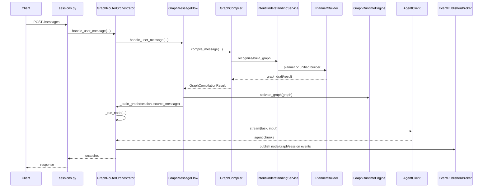

# Router Service 开发架构与代码导读

## 1. 文档目的

这份文档用于说明 `router-service` 当前代码的真实结构和主调用链，重点帮助开发者快速回答下面几个问题：

- 当前项目的整体架构是什么样的。
- 请求是如何从 API 层进入路由层，再进入 graph 执行层的。
- 意图识别、图构建、槽位填充、Agent 执行分别落在哪些模块。
- `core/graph` 下面每个文件到底负责什么，彼此如何协作。
- 当前代码已经拆分到什么程度，后续如果继续重构，应该从哪里下手。

这份文档基于当前分支最新代码整理，适用于现在的开发态，不再考虑旧 `router_service.core.xxx` 顶层兼容 shim。当前 `core` 顶层只保留分包，不再保留过渡层文件。

## 2. 代码总览

当前 `router-service` 的核心目录结构如下：

```text
backend/services/router-service/src/router_service/
├── api/
│   ├── app.py
│   ├── dependencies.py
│   ├── routes/sessions.py
│   └── sse/broker.py
├── catalog/
│   ├── intent_repository.py
│   ├── in_memory_intent_repository.py
│   ├── sql_intent_repository.py
│   └── postgres_intent_repository.py
├── core/
│   ├── __init__.py
│   ├── shared/
│   ├── support/
│   ├── prompts/
│   ├── recognition/
│   ├── slots/
│   └── graph/
├── models/
│   └── intent.py
├── settings.py
└── app.py
```

可以把它理解成 5 层：

1. `api/`
   负责 FastAPI 接口、请求模型、SSE 流式输出。

2. `catalog/`
   负责意图定义的持久化读取，数据来源可以是内存、SQL、Postgres。

3. `core/shared + core/support + core/prompts`
   负责基础数据模型、上下文构造、LLM/Agent 客户端、长时记忆、提示词模板。

4. `core/recognition + core/slots`
   负责意图识别、层级路由、统一理解、槽位抽取、槽位校验、历史信息复用。

5. `core/graph`
   负责把识别结果变成执行图，并驱动图执行、状态变更、事件发布、用户交互分流。

## 3. 一句话理解整体架构

这个服务本质上是一个“图驱动的意图路由器”：

- API 层接收用户消息或动作。
- 路由层先决定用户说的是什么事情。
- 如果能形成一个或多个可执行事项，就把它们编译成 `ExecutionGraphState`。
- graph 运行时按依赖顺序调度节点。
- 每个节点对应一个具体意图，背后通过 `AgentClient` 调目标 Agent。
- Agent 只负责节点执行与必要补充，真正的识别、路由、图构建、槽位填充都在 router 层完成。

用一张图表示：

```text
HTTP / SSE
   ↓
FastAPI Routes
   ↓
GraphRouterOrchestrator
   ├── GraphMessageFlow
   ├── GraphActionFlow
   ├── GraphStateSync
   ├── IntentUnderstandingService
   ├── GraphCompiler
   ├── UnderstandingValidator
   ├── GraphRuntimeEngine
   ├── GraphSnapshotPresenter / GraphEventPublisher
   └── StreamingAgentClient
```

## 4. 运行期装配

### 4.1 应用入口

[app.py](/root/intent-router/backend/services/router-service/src/router_service/api/app.py) 是 API 的主入口。

它做了几件事：

- 调用 `build_router_runtime()` 构建整套运行时对象。
- 在 FastAPI lifespan 中启动意图目录的定时刷新任务。
- 把 runtime 放到 `app.state.router_runtime` 中。
- 注册 `/health`、`/api/router/health`、`/api/router/v2/health`。
- 同时挂载 `/api/router` 和 `/api/router/v2` 两套路由前缀。

这里有个重要点：当前 `/api/router` 和 `/api/router/v2` 实际使用的是同一套新路由逻辑，只是挂了两个前缀。

### 4.2 依赖装配

[dependencies.py](/root/intent-router/backend/services/router-service/src/router_service/api/dependencies.py) 是整个运行时的装配中心。

`build_router_runtime()` 负责构造这些对象：

- `EventBroker`
- `LangChainLLMClient`
- `RepositoryIntentCatalog`
- `StreamingAgentClient`
- `HierarchicalIntentRecognizer` 或 `LLMIntentRecognizer`
- `SlotExtractor`
- `SlotValidator`
- `UnderstandingValidator`
- `LLMIntentGraphBuilder` 或 `None`
- `LLMIntentGraphPlanner` / `SequentialIntentGraphPlanner`
- `LLMGraphTurnInterpreter` / `BasicTurnInterpreter`
- `LLMProactiveRecommendationRouter` / `NullProactiveRecommendationRouter`
- `GraphRouterOrchestrator`

最终它返回一个 `RouterRuntime`：

- `event_broker`
- `llm_client`
- `intent_catalog`
- `agent_client`
- `orchestrator`

### 4.3 配置开关

[settings.py](/root/intent-router/backend/services/router-service/src/router_service/settings.py) 决定运行形态。当前最关键的开关有：

| 配置项 | 作用 |
| --- | --- |
| `ROUTER_V2_UNDERSTANDING_MODE` | `flat` 或 `hierarchical`，决定是否使用大类到小类的层级识别 |
| `ROUTER_V2_GRAPH_BUILD_MODE` | `legacy` 或 `unified`，决定是否使用统一识别建图 |
| `ROUTER_V2_PLANNING_POLICY` | `always`、`never`、`multi_intent_only`、`auto`，决定首轮消息何时进入重规划 |
| `ROUTER_INTENT_REFRESH_INTERVAL_SECONDS` | 意图目录刷新周期 |
| `ROUTER_INTENT_SWITCH_THRESHOLD` | 意图切换阈值，当前主要保留在 orchestrator 配置中 |
| `ROUTER_AGENT_TIMEOUT_SECONDS` | 节点执行超时时间 |
| `ROUTER_SSE_HEARTBEAT_SECONDS` | SSE 心跳间隔 |
| `ROUTER_SSE_MAX_IDLE_SECONDS` | SSE 最大空闲时长 |

### 4.4 模式矩阵

当前组合可以这样理解：

| 识别模式 | 建图模式 | 实际行为 |
| --- | --- | --- |
| `flat` | `legacy` | 先识别主意图，再按 `ROUTER_V2_PLANNING_POLICY` 选择重规划或轻量确定性编译 |
| `flat` | `unified` | 只有 `ROUTER_V2_PLANNING_POLICY=always` 时才启用 unified builder |
| `hierarchical` | `legacy` | 先做 domain 路由，再 leaf 路由，再按 `ROUTER_V2_PLANNING_POLICY` 决定是否走重规划 |
| `hierarchical` | `unified` | 当前装配上不会启用 unified builder，仍然走层级识别 + 策略化 graph 编译 |

原因在于 `dependencies.py` 中，`graph_builder` 只有在以下条件同时满足时才会启用：

- 有可用 LLM 客户端
- `router_v2_graph_build_mode == "unified"`
- `router_v2_planning_policy == "always"`
- `router_v2_understanding_mode != "hierarchical"`

### 4.5 规划策略

`ROUTER_V2_PLANNING_POLICY` 当前支持四种模式：

| 策略值 | 行为 |
| --- | --- |
| `always` | 所有首轮消息都走重规划；如果配置了 unified builder，也允许直接走 unified builder |
| `never` | 不走重规划，统一回落到确定性顺序编译 |
| `multi_intent_only` | 只有识别到多个主意图时才走重规划；单意图走确定性编译 |
| `auto` | 多意图一定走重规划；单意图只有在检测到条件、顺序、重复动作等复杂信号时才走重规划 |

这里有个关键边界：

- graph 仍然会创建
- 但“是否创建 graph”不再等于“是否调用重型 LLM planner”
- 简单单意图 graph 可以由确定性编译路径生成
- 只有多意图或复杂单意图才进入高成本规划

## 5. API 层接口与入口职责

[sessions.py](/root/intent-router/backend/services/router-service/src/router_service/api/routes/sessions.py) 是 router 服务的主要接口文件。

它暴露了下面这些接口：

- `POST /sessions`
  创建新会话。

- `GET /sessions/{session_id}`
  获取当前会话快照。

- `POST /sessions/{session_id}/messages`
  非流式发送用户消息。

- `POST /sessions/{session_id}/actions`
  非流式发送 graph action，例如确认 graph、取消 graph、取消节点。

- `POST /sessions/{session_id}/messages/stream`
  流式发送用户消息，内部通过 SSE 推送执行事件。

- `POST /sessions/{session_id}/actions/stream`
  流式发送动作。

- `GET /sessions/{session_id}/events`
  单独订阅会话事件流。

这层本身不做任何业务判断，职责很克制：

- 解析请求体。
- 归一化字段名。
- 兜底出 `cust_id`。
- 调 `GraphRouterOrchestrator`。
- 把 `snapshot` 或 SSE event 返回给前端。

## 6. 领域数据模型

### 6.1 意图与任务模型

这些定义在 [shared/domain.py](/root/intent-router/backend/services/router-service/src/router_service/core/shared/domain.py) 和 [models/intent.py](/root/intent-router/backend/services/router-service/src/router_service/models/intent.py)。

最重要的几个模型：

- `IntentDefinition`
  运行期的意图定义，来源于 catalog/repository。

- `IntentDomain`
  层级识别时的大类视图。一个 domain 下面挂多个 leaf intent。

- `IntentMatch`
  单条识别结果，包含 `intent_code`、`confidence`、`reason`。

- `Task`
  graph 节点真正发给 agent 的执行任务对象。

- `TaskEvent`
  SSE 推送的统一事件模型。

- `IntentSlotDefinition`
  槽位 schema，决定一个槽位是否必填、能否来自历史、能否来自推荐、值类型是什么。

- `IntentGraphBuildHints`
  与 graph 构建相关的意图提示，例如 `provides_context_keys`、`confirm_policy`、`max_nodes_per_message`。

### 6.2 图运行时模型

这些定义在 [shared/graph_domain.py](/root/intent-router/backend/services/router-service/src/router_service/core/shared/graph_domain.py)。

最重要的几个模型：

- `ExecutionGraphState`
  一次消息最终生成的执行图。

- `GraphNodeState`
  图里的节点，一个节点通常对应一个具体意图。

- `GraphEdge`
  节点间依赖边，可以是顺序边、条件边、并行边。

- `GraphCondition`
  条件边使用的条件表达式，支持：
  `left_key`、`operator`、`right_value`。

- `GraphSessionState`
  一个会话的总状态，里面同时持有：
  `messages`、`tasks`、`candidate_intents`、`current_graph`、`pending_graph`。

- `GraphRouterSnapshot`
  API 返回给前端的会话快照。

### 6.3 GraphStatus 与 GraphNodeStatus

两套状态要分开看：

`GraphNodeStatus` 表示节点状态：

- `draft`
- `blocked`
- `ready`
- `running`
- `waiting_user_input`
- `waiting_confirmation`
- `completed`
- `failed`
- `cancelled`
- `skipped`

`GraphStatus` 表示整张图状态：

- `draft`
- `waiting_confirmation`
- `running`
- `waiting_user_input`
- `waiting_confirmation_node`
- `partially_completed`
- `completed`
- `failed`
- `cancelled`

这里最容易混淆的是：

- `GraphStatus.WAITING_CONFIRMATION`
  指的是整张图待确认，还没真正执行。

- `GraphStatus.WAITING_CONFIRMATION_NODE`
  指的是图已经开始执行，但某个节点在等用户确认。

## 7. 当前 core 分包结构

[core/__init__.py](/root/intent-router/backend/services/router-service/src/router_service/core/__init__.py) 现在只保留分包说明，不再保留顶层 shim。

### 7.1 `core/shared`

职责是共享数据模型，尽量不放运行逻辑。

- [shared/domain.py](/root/intent-router/backend/services/router-service/src/router_service/core/shared/domain.py)
  定义 `IntentDefinition`、`Task`、`TaskEvent`、`TaskStatus`、`ChatMessage`、长时记忆模型。

- [shared/graph_domain.py](/root/intent-router/backend/services/router-service/src/router_service/core/shared/graph_domain.py)
  定义图、节点、边、条件、会话、推荐上下文等模型。

### 7.2 `core/support`

职责是基础支撑能力。

- [support/llm_client.py](/root/intent-router/backend/services/router-service/src/router_service/core/support/llm_client.py)
  LLM JSON 调用抽象和 LangChain 实现，外加 `llm_exception_is_retryable()`。

- [support/agent_client.py](/root/intent-router/backend/services/router-service/src/router_service/core/support/agent_client.py)
  调后端意图 Agent 的客户端，负责请求体拼装和流式读取。

- [support/context_builder.py](/root/intent-router/backend/services/router-service/src/router_service/core/support/context_builder.py)
  组装 `recent_messages`、`long_term_memory`、`task context`。

- [support/intent_catalog.py](/root/intent-router/backend/services/router-service/src/router_service/core/support/intent_catalog.py)
  从 repository 刷新 active intents，构建 domain 视图和 fallback intent。

- [support/memory_store.py](/root/intent-router/backend/services/router-service/src/router_service/core/support/memory_store.py)
  维护长时记忆，支持从过期 session 晋升消息和 slot memory。

### 7.3 `core/prompts`

- [prompts/prompt_templates.py](/root/intent-router/backend/services/router-service/src/router_service/core/prompts/prompt_templates.py)
  放各类 LLM 提示词模板和 prompt builder。

### 7.4 `core/recognition`

职责是“理解用户说的是什么”。

- [recognition/recognizer.py](/root/intent-router/backend/services/router-service/src/router_service/core/recognition/recognizer.py)
  基础 LLM 意图识别器。

- [recognition/domain_router.py](/root/intent-router/backend/services/router-service/src/router_service/core/recognition/domain_router.py)
  大类路由器。

- [recognition/leaf_intent_router.py](/root/intent-router/backend/services/router-service/src/router_service/core/recognition/leaf_intent_router.py)
  小类路由器。

- [recognition/hierarchical_intent_recognizer.py](/root/intent-router/backend/services/router-service/src/router_service/core/recognition/hierarchical_intent_recognizer.py)
  层级识别编排器。

- [recognition/understanding_service.py](/root/intent-router/backend/services/router-service/src/router_service/core/recognition/understanding_service.py)
  把识别、统一建图、等待态解释整合成一个服务。

### 7.5 `core/slots`

职责是“节点在真正分发给 agent 前，是否已经拿到了足够且可靠的槽位”。

- [slots/grounding.py](/root/intent-router/backend/services/router-service/src/router_service/core/slots/grounding.py)
  槽值归一化与 grounding 判定。

- [slots/extractor.py](/root/intent-router/backend/services/router-service/src/router_service/core/slots/extractor.py)
  从当前消息、节点片段、原始消息、历史记忆中抽槽。

- [slots/validator.py](/root/intent-router/backend/services/router-service/src/router_service/core/slots/validator.py)
  校验已抽出的槽位是否足够分发。

- [slots/understanding_validator.py](/root/intent-router/backend/services/router-service/src/router_service/core/slots/understanding_validator.py)
  把 extractor 和 validator 串起来，产出最终分发判定。

- [slots/resolution_service.py](/root/intent-router/backend/services/router-service/src/router_service/core/slots/resolution_service.py)
  管理历史预填、推荐默认值注入、slot bindings 重建。

### 7.6 `core/graph`

职责是“把识别结果变成执行图，并且让图跑起来”。

这部分是当前系统最核心的子系统，下面单独展开。

## 8. 主调用链

### 8.1 普通用户消息

普通消息的主链路如下：

```text
POST /sessions/{id}/messages
  → GraphRouterOrchestrator.handle_user_message
  → GraphMessageFlow.handle_user_message
  → GraphMessageFlow.route_new_message
  → GraphCompiler.compile_message
  → IntentUnderstandingService.recognize_message 或 build_graph_from_message
  → Planner / UnifiedBuilder
  → Graph semantic repair
  → Slot history prefill / proactive defaults
  → GraphRuntimeEngine.activate_graph
  → GraphRouterOrchestrator._drain_graph
  → GraphRouterOrchestrator._run_node
  → UnderstandingValidator.validate_node
  → StreamingAgentClient.stream
  → GraphEventPublisher.publish_*
  → snapshot 返回
```

### 8.2 普通消息时序图



### 8.3 等待节点时，用户补槽或改意图

如果当前 graph 已经在执行，某个节点因为缺槽位停住了，下一轮消息不会直接重新识别全局，而会先进入 waiting node 解释逻辑：

```text
handle_user_message
  → GraphMessageFlow.handle_user_message
  → get_waiting_node(session)
  → handle_waiting_node_turn
  → IntentUnderstandingService.interpret_waiting_node_turn
  → TurnInterpreter 给出 decision
```

`decision` 可能有三种常见结果：

- `resume_current`
  继续当前节点，把新消息当作补充槽位输入。

- `cancel_current`
  取消当前节点，再继续 drain graph。

- `replan`
  认为用户已经切换目标，取消当前 graph，然后用新消息重新规划。

这条链路是当前“用户中途反悔 / 补槽 / 改目标”能力的核心。

### 8.4 graph 待确认时，用户下一轮回复

如果 `pending_graph.status == waiting_confirmation`，下一轮消息不会走普通规划，而会先进入：

- `GraphMessageFlow.handle_pending_graph_turn`
- `IntentUnderstandingService.interpret_pending_graph_turn`
- `TurnInterpreter.interpret_pending_graph(...)`

决策结果可能是：

- `confirm_pending_graph`
- `cancel_pending_graph`
- `replan`
- `wait`

### 8.5 主动推荐场景

主动推荐消息的特殊链路是：

```text
handle_user_message(... proactive_recommendation=...)
  → GraphMessageFlow.handle_proactive_recommendation_turn
  → ProactiveRecommendationRouter.decide(...)
  → route_mode:
     - no_selection
     - direct_execute
     - interactive_graph
     - switch_to_free_dialog
```

这里的关键点：

- `direct_execute`
  会把 selected items 先转成 `GuidedSelectionPayload`，再走 guided selection graph。

- `interactive_graph`
  会把推荐上下文和选中的推荐项注入到 graph 编译阶段，生成可交互 graph。

- `switch_to_free_dialog`
  直接退回普通消息流程。

### 8.6 Action 链路

动作接口的链路比消息简单很多：

```text
POST /sessions/{id}/actions
  → GraphRouterOrchestrator.handle_action
  → GraphActionFlow.handle_action
  → confirm_pending_graph / cancel_pending_graph / cancel_current_node
  → snapshot
```

### 8.7 SSE 链路

SSE 的核心不是在 route 层做额外业务，而是：

- route 里起一个 `processing_task`
- 给当前 session 注册一个 `EventBroker` queue
- orchestrator 执行过程中不断发 `TaskEvent`
- `EventBroker` 把事件推给订阅者
- route 把事件编码为 SSE 输出

`GraphEventPublisher` 是事件生成器，`EventBroker` 是事件队列与分发器。

## 9. graph 子系统总览

当前 `core/graph` 是以下结构：

```text
core/graph/
├── __init__.py
├── action_flow.py
├── builder.py
├── compiler.py
├── message_flow.py
├── orchestrator.py
├── planner.py
├── presentation.py
├── recommendation_router.py
├── runtime.py
├── semantics.py
├── session_store.py
└── state_sync.py
```

可以按职责把它再拆成 5 类：

1. graph 编译
   `builder.py`、`planner.py`、`compiler.py`、`semantics.py`

2. graph 运行
   `runtime.py`、`orchestrator.py`

3. 用户交互分流
   `message_flow.py`、`action_flow.py`

4. 状态展示与事件
   `presentation.py`、`state_sync.py`

5. graph 辅助存储
   `session_store.py`

## 10. graph 包逐文件导读

### 10.1 `graph/__init__.py`

这个文件当前没有业务逻辑，只是包标记。

### 10.2 `graph/session_store.py`

文件： [session_store.py](/root/intent-router/backend/services/router-service/src/router_service/core/graph/session_store.py)

职责：

- 管理内存中的 `GraphSessionState`。
- 负责 `create`、`get`、`get_or_create`。
- 处理 session 过期。
- session 过期时，把历史消息和任务槽位晋升到 `LongTermMemoryStore`。

它解决的是“会话生命周期”和“短期会话状态 -> 长时记忆”的问题，不参与识别或执行决策。

### 10.3 `graph/state_sync.py`

文件： [state_sync.py](/root/intent-router/backend/services/router-service/src/router_service/core/graph/state_sync.py)

职责：

- 统一封装 graph/node/session 状态发布。
- 统一封装 graph 状态刷新。
- 统一桥接 runtime engine 和 slot resolution service。

它可以理解为 orchestrator 的“状态与事件外设层”。当前它承担了三类工作：

- 发布事件
  `publish_pending_graph`、`publish_graph_waiting_hint`、`publish_graph_state`、`publish_node_state`、`publish_session_state`、`publish_no_match_hint`

- 刷新 graph
  `refresh_graph_state`、`emit_graph_progress`

- 代理运行期能力
  `graph_status`、`next_ready_node`、`get_waiting_node`、`condition_matches_from_condition`

以及代理槽位相关能力：

- `apply_history_prefill_policy`
- `history_slot_values`
- `structured_slot_bindings`
- `rebuild_node_slot_bindings`
- `apply_proactive_slot_defaults`

这个文件的价值在于把 orchestrator 里“事件发布 + 状态同步 + slot bridge”这一块摘了出来。

### 10.4 `graph/action_flow.py`

文件： [action_flow.py](/root/intent-router/backend/services/router-service/src/router_service/core/graph/action_flow.py)

职责：

- 处理外部 action 请求。
- 管理 pending graph 的确认/取消。
- 管理当前 waiting node 的取消。
- 管理整个 current graph 的取消。

当前对外的主入口是：

- `handle_action()`
- `confirm_pending_graph()`
- `cancel_pending_graph()`
- `cancel_current_node()`
- `cancel_current_graph()`

被谁调用：

- 对外由 `GraphRouterOrchestrator.handle_action()` 调用。
- 对内也会被 `GraphMessageFlow` 调用，例如用户在 waiting node 状态下说“算了，换个事”，会触发取消当前节点或取消当前 graph。

它不负责：

- graph 规划
- 节点执行
- 槽位抽取

### 10.5 `graph/message_flow.py`

文件： [message_flow.py](/root/intent-router/backend/services/router-service/src/router_service/core/graph/message_flow.py)

职责：

- 统一处理所有“用户消息入口”。
- 决定一条消息究竟该走普通规划、guided selection、proactive recommendation、pending graph 解读，还是 waiting node 解读。

当前主入口：

- `handle_user_message()`

内部最重要的几段逻辑：

- `handle_proactive_recommendation_turn()`
  主动推荐场景分流。

- `handle_guided_selection_turn()`
  已知用户明确选择了哪些 intent 时，直接建 guided graph。

- `route_new_message()`
  普通消息编译 graph 的核心入口。

- `handle_pending_graph_turn()`
  graph 待确认阶段的解释逻辑。

- `handle_waiting_node_turn()`
  当前节点等待补充输入阶段的解释逻辑。

这个文件的关键价值是把“消息进入系统后应该走哪条业务路径”从 orchestrator 主类中拆了出来。

### 10.6 `graph/compiler.py`

文件： [compiler.py](/root/intent-router/backend/services/router-service/src/router_service/core/graph/compiler.py)

职责：

- 统一把“识别结果 + 上下文 + planner/builder + 槽位预处理”编译成 graph。

它是 graph 的“编译入口”，不是运行时。

它做的事情按顺序看：

1. 准备 `recent_messages` 和 `long_term_memory`
2. 过滤适合规划的 recent messages
3. 注入推荐上下文
4. 如果存在 unified builder 且规划策略为 `always`，则走 `build_graph_from_message()`
5. 否则先识别，拿到 `RecognitionResult`
6. 根据 `ROUTER_V2_PLANNING_POLICY` 决定：
   - 进入重型 planner
   - 或回落到确定性顺序编译
7. 若没有命中意图，则尝试 fallback intent
8. 对 graph 做语义修复 `repair_unexecutable_condition_edges()`
9. 注入 proactive recommendation 默认槽位
10. 应用历史槽位预填策略

它还额外提供：

- `build_guided_selection_graph()`
- `compile_proactive_interactive_graph()`
- 各种 recommendation/proactive summary 生成函数

### 10.7 `graph/planner.py`

文件： [planner.py](/root/intent-router/backend/services/router-service/src/router_service/core/graph/planner.py)

职责：

- 根据识别出的意图，规划 graph 结构。
- 解释 pending graph / waiting node 的用户回复意图。

这个文件里实际有两块能力：

1. graph planning
   - `SequentialIntentGraphPlanner`
   - `LLMIntentGraphPlanner`
   - `GraphPlanNormalizer`

2. turn interpretation
   - `BasicTurnInterpreter`
   - `LLMGraphTurnInterpreter`
   - `TurnDecisionPayload`

可以把它理解为“规划器 + 交互解释器”。

现在 `SequentialIntentGraphPlanner` 不只是“LLM planner 失败时的兜底”。

在 `ROUTER_V2_PLANNING_POLICY=never|multi_intent_only|auto` 的部分路径下，它也承担“轻量确定性编译”的职责：

- 单意图简单请求：不再调用重型 planner
- 多意图但显式关闭重规划：按识别顺序生成基础 graph
- 复杂单意图 / 多意图：仍然可以升级回 `LLMIntentGraphPlanner`

### 10.8 `graph/builder.py`

文件： [builder.py](/root/intent-router/backend/services/router-service/src/router_service/core/graph/builder.py)

职责：

- 在 unified build 模式下，一次性完成“识别 + graph draft 输出”。

与 `planner.py` 的区别是：

- `planner.py` 假设识别结果已经有了，然后负责规划图。
- `builder.py` 直接让 LLM 同时产出 `primary_intents`、`candidate_intents`、`nodes`、`edges`。

里面最核心的对象：

- `UnifiedGraphDraftPayload`
- `GraphDraftNormalizer`
- `LLMIntentGraphBuilder`

`GraphDraftNormalizer` 会把 LLM 草稿转换成真正的：

- `RecognitionResult`
- `ExecutionGraphState`

并在这个过程中完成：

- slot memory 归一化
- slot bindings 规范化
- confirmation policy 推导
- 历史槽位复用说明注入

### 10.9 `graph/semantics.py`

文件： [semantics.py](/root/intent-router/backend/services/router-service/src/router_service/core/graph/semantics.py)

职责：

- 修复图中的语义问题，尤其是条件边的可执行性。

它处理的是一个非常关键的问题：

如果 planner 或 builder 生成了一条条件边，但 graph 中并没有能提供对应上下文输出的节点，这条边在运行期就无法判断。

这个文件会尝试：

- 找已有的条件来源节点
- 从意图 hints 中推断隐式依赖
- 自动插入隐式条件节点
- 重写 edge 连接关系
- 重新整理 node position

所以它不是纯工具函数，而是“graph 语义修复器”。

### 10.10 `graph/runtime.py`

文件： [runtime.py](/root/intent-router/backend/services/router-service/src/router_service/core/graph/runtime.py)

职责：

- 决定节点什么时候 `READY`
- 决定节点什么时候 `SKIPPED`
- 决定整张图的 `GraphStatus`
- 决定下一步该执行哪个节点

它是 graph 的“纯运行规则层”，不直接调 agent、不直接发事件。

最关键的方法：

- `activate_graph()`
- `refresh_node_states()`
- `condition_matches()`
- `graph_status()`
- `next_ready_node()`
- `waiting_node()`
- `node_status_for_task_status()`
- `task_status_for_graph()`

所有“依赖是否满足、条件边是否命中、图什么时候算完成”的逻辑都在这里。

### 10.11 `graph/presentation.py`

文件： [presentation.py](/root/intent-router/backend/services/router-service/src/router_service/core/graph/presentation.py)

职责分成两块：

1. `GraphSnapshotPresenter`
   把 graph/node 状态转成前端可消费的 payload、交互卡片、描述文案。

2. `GraphEventPublisher`
   把 recognition、graph builder、graph、node、session 变化转成 `TaskEvent` 并发布。

它是“表示层”，负责把运行状态翻译成对外事件。

主要事件类别包括：

- `recognition.*`
- `graph_builder.*`
- `graph.*`
- `node.*`
- `session.*`
- `heartbeat`

### 10.12 `graph/recommendation_router.py`

文件： [recommendation_router.py](/root/intent-router/backend/services/router-service/src/router_service/core/graph/recommendation_router.py)

职责：

- 对主动推荐场景做语义分流。

它输入的是：

- 用户当前回复
- `ProactiveRecommendationPayload`

它输出的是：

- `ProactiveRecommendationRouteDecision`

也就是下面几种路由模式之一：

- `no_selection`
- `direct_execute`
- `interactive_graph`
- `switch_to_free_dialog`

### 10.13 `graph/orchestrator.py`

文件： [orchestrator.py](/root/intent-router/backend/services/router-service/src/router_service/core/graph/orchestrator.py)

这是当前 graph 子系统的总编排器，但已经不是单体大文件的旧形态。

它当前主要保留四类职责：

1. 构造 graph 运行时依赖
   - `GraphMessageFlow`
   - `GraphActionFlow`
   - `GraphStateSync`
   - `IntentUnderstandingService`
   - `GraphCompiler`

2. 对外主入口
   - `create_session()`
   - `snapshot()`
   - `handle_user_message()`
   - `handle_action()`

3. 节点执行主循环
   - `_drain_graph()`
   - `_run_node()`
   - `_create_task_for_node()`
   - `_handle_agent_chunk()`
   - `_fail_node()`
   - `_resume_waiting_node()`

4. 节点分发前的理解校验
   - `_validate_node_understanding()`
   - `_mark_node_waiting_for_slots()`

当前它最大的剩余职责仍然是“节点执行主循环”。如果后续继续拆分，最值得下手的就是这一块。

### 10.14 当前 graph 拆分状态

现在 graph 已经完成了三块拆分：

- `GraphStateSync`
- `GraphMessageFlow`
- `GraphActionFlow`

但还没有完成的一块是：

- node execution flow

也就是 `_drain_graph()`、`_run_node()`、`_create_task_for_node()`、`_handle_agent_chunk()` 还在 `orchestrator.py` 里面。

这个边界在阅读代码时一定要记住，不然会误以为 orchestrator 已经完全轻量化了。实际上它现在是“比以前清晰很多，但仍然保留执行核心”的状态。

## 11. recognition 子系统导读

### 11.1 `recognition/recognizer.py`

职责：

- 定义 `RecognitionResult`
- 抽象 `IntentRecognizer`
- 提供 `NullIntentRecognizer`
- 提供 `LLMIntentRecognizer`

LLM 识别器的核心逻辑是：

- 把 active intents 序列化成 prompt 变量
- 调 `llm_client.run_json(...)`
- 根据每个 intent 自己的阈值把结果分到 `primary` 和 `candidates`
- 按 `dispatch_priority` 和 `confidence` 排序

### 11.2 `recognition/domain_router.py`

职责：

- 把 `IntentDomain` 临时包装成“伪 intent”
- 复用底层 recognizer 去判断用户更像属于哪个 domain

这就是“大类识别”的实现承载点。

### 11.3 `recognition/leaf_intent_router.py`

职责：

- 在一个 domain 内继续选 leaf intent。

如果该 domain 只挂一个 leaf intent，并且允许 `allow_direct_single_leaf=True`，它会直接返回该 leaf intent，不再浪费一次 LLM 识别。

### 11.4 `recognition/hierarchical_intent_recognizer.py`

职责：

- 组合 `DomainRouter + LeafIntentRouter + fallback recognizer`。

工作方式：

1. 先从 active leaf intents 构造 domains。
2. 如果只有一个 domain，直接进 leaf 路由。
3. 如果有多个 domain，先 route domain，再 route leaf。
4. 把 domain confidence 和 leaf confidence 合成最终 leaf intent confidence。
5. 如果层级路由没有产出有效结果，再回退到 flat fallback recognizer。

这就是当前“大类 -> 小类”识别链条的代码落点。

### 11.5 `recognition/understanding_service.py`

职责：

- 统一封装：
  - `recognize_message`
  - `build_graph_from_message`
  - `interpret_pending_graph_turn`
  - `interpret_waiting_node_turn`

它的本质是“理解服务总线”，对上提供统一 API，对下调 recognizer、graph_builder、turn_interpreter、event_publisher。

## 12. slots 子系统导读

### 12.1 `slots/grounding.py`

职责：

- 对槽值做归一化。
- 判断槽值是否被消息文本 grounding。
- 支持从历史文本中填槽。

这是槽位体系的底层工具层。

### 12.2 `slots/extractor.py`

职责：

- 从多种文本源抽取槽位：
  - 当前消息
  - node source fragment
  - graph source message
  - long_term_memory

当前实现是“启发式 + LLM”混合：

- 先跑规则与启发式提取
- 需要时再调用 LLM 补抽
- 过程中会保留 slot binding source、source_text、confidence

### 12.3 `slots/validator.py`

职责：

- 判断抽出的槽位是否真的可靠，是否足够进入 agent 分发。

它会产出：

- `missing_required_slots`
- `ambiguous_slot_keys`
- `invalid_slot_keys`
- `prompt_message`
- `can_dispatch`

### 12.4 `slots/understanding_validator.py`

职责：

- 把 extractor 与 validator 串成一个“节点是否可以分发”的判定器。

也就是说，router 层真正拿来用的是 `UnderstandingValidator`，而不是单独调用 extractor 或 validator。

### 12.5 `slots/resolution_service.py`

职责：

- 在 graph 编译期和运行期管理槽位来源。

它负责三件事：

1. 历史预填
   `apply_history_prefill_policy()`

2. structured bindings 重建
   `rebuild_node_slot_bindings()`

3. 推荐默认值注入
   `apply_proactive_slot_defaults()`

它是 graph 与 slots 之间的重要桥梁。

## 13. 支撑层导读

### 13.1 `support/intent_catalog.py`

职责：

- 从 repository 刷新 active intents。
- 把 active intents 切成：
  - routable leaf intents
  - fallback intent
  - domains

大类/小类识别能成立，前提就是 catalog 这里先把 domain view 建好。

### 13.2 `support/context_builder.py`

职责：

- 构建 `recent_messages`
- 构建 task context

它本身非常薄，但被 graph 编译和任务恢复都依赖。

### 13.3 `support/memory_store.py`

职责：

- 维护 `LongTermMemoryStore`
- 支持 `recall()`
- 支持 session 过期时把最近消息与 task slot_memory 晋升为长时记忆

这就是当前 memory 注入的代码落点。

### 13.4 `support/llm_client.py`

职责：

- 统一 LLM JSON 调用协议
- 提供 LangChain 实现
- 定义 retryable 异常判断

项目里几乎所有需要 LLM 的地方都通过它进入。

### 13.5 `support/agent_client.py`

职责：

- 把 `Task` 转成 agent 请求体
- 调 agent 的流式接口
- 解析流式 chunk
- 支持取消任务

graph 运行时真正和“意图后端 agent”交互，就是通过它。

## 14. catalog 与 models 层

### 14.1 `models/intent.py`

这是意图注册模型定义层。

它定义了：

- `IntentPayload`
- `IntentRecord`
- `IntentFieldDefinition`
- `IntentSlotDefinition`
- `IntentGraphBuildHints`
- `GraphConfirmPolicy`

这个文件对 router 的意义非常大，因为很多运行逻辑都依赖这里的 schema 元数据：

- 槽位抽取靠 `IntentSlotDefinition`
- 条件治理和 graph 插边靠 `IntentGraphBuildHints.provides_context_keys`
- 自动确认/强制确认策略靠 `GraphConfirmPolicy`

### 14.2 `catalog/*`

职责是把意图定义持久化出来供 runtime 使用。

- `intent_repository.py`
  repository 抽象接口。

- `in_memory_intent_repository.py`
  内存版实现，多用于测试和本地。

- `sql_intent_repository.py`
  当前较常用的数据库实现。

- `postgres_intent_repository.py`
  Postgres 实现。

runtime 并不直接操作数据库，而是通过 `RepositoryIntentCatalog` 从 repository 拉取并刷新内存快照。

## 15. 事件与状态传播

事件传播链路如下：

```text
GraphRouterOrchestrator / IntentUnderstandingService
  → GraphEventPublisher
  → EventBroker.publish(event)
  → session queue
  → SSE route generator
  → Client
```

其中：

- `GraphSnapshotPresenter`
  决定对外展示什么样的 graph/node payload。

- `GraphEventPublisher`
  决定发什么事件、事件名是什么、payload 长什么样。

- `EventBroker`
  负责按 `session_id` 管理订阅队列和心跳。

这意味着：

- 如果你要改前端看到的 graph card 结构，优先看 `presentation.py`
- 如果你要改事件推送时机，优先看 `orchestrator.py`、`state_sync.py`、`presentation.py`
- 如果你要改 SSE 行为，优先看 `api/routes/sessions.py` 和 `api/sse/broker.py`

## 16. 当前代码阅读顺序

如果你第一次接手这套代码，最推荐的阅读顺序是：

1. [api/dependencies.py](/root/intent-router/backend/services/router-service/src/router_service/api/dependencies.py)
   先看运行时怎么装起来。

2. [shared/domain.py](/root/intent-router/backend/services/router-service/src/router_service/core/shared/domain.py)
   看任务、意图、事件模型。

3. [shared/graph_domain.py](/root/intent-router/backend/services/router-service/src/router_service/core/shared/graph_domain.py)
   看 graph 模型。

4. [graph/orchestrator.py](/root/intent-router/backend/services/router-service/src/router_service/core/graph/orchestrator.py)
   看总编排器现在还保留哪些职责。

5. [graph/message_flow.py](/root/intent-router/backend/services/router-service/src/router_service/core/graph/message_flow.py)
   看用户消息如何分流。

6. [graph/compiler.py](/root/intent-router/backend/services/router-service/src/router_service/core/graph/compiler.py)
   看 graph 是怎么被编译出来的。

7. [recognition/understanding_service.py](/root/intent-router/backend/services/router-service/src/router_service/core/recognition/understanding_service.py)
   看识别、统一建图、turn interpretation 是怎么接起来的。

8. [recognition/*.py](/root/intent-router/backend/services/router-service/src/router_service/core/recognition)
   看 flat/hierarchical 两种识别路径。

9. [slots/*.py](/root/intent-router/backend/services/router-service/src/router_service/core/slots)
   看 router 层槽位填充和校验逻辑。

10. [graph/runtime.py](/root/intent-router/backend/services/router-service/src/router_service/core/graph/runtime.py)
    看图状态机。

11. [graph/presentation.py](/root/intent-router/backend/services/router-service/src/router_service/core/graph/presentation.py)
    看事件和输出结构。

12. [support/agent_client.py](/root/intent-router/backend/services/router-service/src/router_service/core/support/agent_client.py)
    看节点最后如何触发后端 agent。

## 17. 当前结构的关键理解点

这里给出几条最容易看错、但最重要的结论。

### 17.1 router 层已经承担了槽位填充与分发前校验

这套实现不是“识别后马上交给 agent 再让 agent 补槽”。

真实流程是：

- router 先识别意图
- router 构建 graph
- router 在节点分发前用 `UnderstandingValidator` 做槽位抽取与校验
- 只有 `can_dispatch=True` 才真正把任务交给 agent

所以 router 层已经是“意图路由 + 槽位门禁 + 图编排”的统一入口。

### 17.2 条件不是槽位，条件是 graph edge 语义

当前代码里条件能力主要落在：

- `GraphCondition`
- `GraphEdge.condition`
- `GraphRuntimeEngine.condition_matches()`
- `graph/semantics.py`

也就是说，条件属于 graph 依赖关系的一部分，不属于普通槽位对象。

### 17.3 memory 注入已经存在两层

当前 memory 并不是完全没有：

- 短期记忆
  `session.messages` 和 `session.tasks`

- 长时记忆
  `LongTermMemoryStore`

这些信息会被注入到：

- recognition
- graph compilation
- slot history prefill
- node validation

### 17.4 当前 orchestrator 已经明显变干净，但还没彻底完成

已经拆出去的：

- 消息流
- 动作流
- 状态同步

仍然保留在 orchestrator 的重逻辑：

- drain graph 主循环
- 节点执行
- 节点创建
- agent chunk 处理
- 节点理解校验与阻塞

所以如果下一阶段继续演进，最自然的方向就是继续拆 node execution 相关逻辑。

## 18. 后续扩展建议

如果后续要继续开发，建议按下面的边界改：

### 18.1 新增一个意图

主要关注：

- `models/intent.py`
  设计好 `slot_schema`、`field_catalog`、`graph_build_hints`

- `catalog/*`
  把新意图注册进 repository

- `support/intent_catalog.py`
  运行时刷新后即可生效

### 18.2 调整层级路由

主要关注：

- `recognition/domain_router.py`
- `recognition/leaf_intent_router.py`
- `recognition/hierarchical_intent_recognizer.py`
- `api/dependencies.py`

### 18.3 调整 graph 规划或统一建图

主要关注：

- `graph/planner.py`
- `graph/builder.py`
- `graph/compiler.py`
- `graph/semantics.py`

### 18.4 调整槽位抽取与准确率

主要关注：

- `slots/extractor.py`
- `slots/validator.py`
- `slots/understanding_validator.py`
- `slots/resolution_service.py`
- `support/memory_store.py`

### 18.5 调整事件和前端展示

主要关注：

- `graph/presentation.py`
- `api/sse/broker.py`
- `api/routes/sessions.py`

## 19. 带着样例走代码

这一节不再抽象描述，而是直接用几条典型请求，把实际调用链和状态变化串起来。阅读建议是：

- 先看请求长什么样
- 再看它进入哪个入口
- 再看它在 `message_flow` / `action_flow` 里走了哪条分支
- 最后看 graph 和 node 的状态是怎么变的

### 19.1 样例一：单意图转账，但槽位不全，进入等待补槽

请求：

```json
POST /api/router/v2/sessions/{session_id}/messages
{
  "content": "帮我转账"
}
```

这条请求的典型行为是：

1. [sessions.py](/root/intent-router/backend/services/router-service/src/router_service/api/routes/sessions.py) 调 `orchestrator.handle_user_message(...)`
2. [orchestrator.py](/root/intent-router/backend/services/router-service/src/router_service/core/graph/orchestrator.py) 把入口转给 [message_flow.py](/root/intent-router/backend/services/router-service/src/router_service/core/graph/message_flow.py) 的 `handle_user_message()`
3. `message_flow` 判断当前不是：
   - proactive recommendation
   - guided selection
   - pending graph turn
   - waiting node turn
   所以进入 `route_new_message()`
4. `route_new_message()` 调 [compiler.py](/root/intent-router/backend/services/router-service/src/router_service/core/graph/compiler.py) 的 `compile_message()`
5. `compile_message()` 调 [recognition/understanding_service.py](/root/intent-router/backend/services/router-service/src/router_service/core/recognition/understanding_service.py)
   如果当前不是 unified build，就会先 `recognize_message()`，再按 `ROUTER_V2_PLANNING_POLICY` 决定是否进入重型 planner
6. 由于只有一个主意图，graph 往往直接是 `DRAFT`，不会先要求整图确认
7. `message_flow.route_new_message()` 激活 graph，然后回到 `orchestrator._drain_graph()`
8. `_drain_graph()` 找到第一个 `READY` 节点，进入 `_run_node()`
9. `_run_node()` 发现节点还没有 task，于是先 `_create_task_for_node()`
10. `_create_task_for_node()` 内部调用 `_validate_node_understanding()`
11. `_validate_node_understanding()` 调 [slots/understanding_validator.py](/root/intent-router/backend/services/router-service/src/router_service/core/slots/understanding_validator.py)
12. `UnderstandingValidator` 继续调用：
    - [slots/extractor.py](/root/intent-router/backend/services/router-service/src/router_service/core/slots/extractor.py)
    - [slots/validator.py](/root/intent-router/backend/services/router-service/src/router_service/core/slots/validator.py)
13. 因为“帮我转账”通常拿不到：
    - 收款人
    - 金额
    - 收款卡号
    - 收款人手机号后四位
    所以 `can_dispatch=False`
14. orchestrator 进入 `_mark_node_waiting_for_slots()`
15. 节点状态变成 `waiting_user_input`
16. graph 状态变成 `waiting_user_input`
17. 返回快照

你在代码里应该重点看：

- [message_flow.py](/root/intent-router/backend/services/router-service/src/router_service/core/graph/message_flow.py)
- [compiler.py](/root/intent-router/backend/services/router-service/src/router_service/core/graph/compiler.py)
- [orchestrator.py](/root/intent-router/backend/services/router-service/src/router_service/core/graph/orchestrator.py)
- [understanding_validator.py](/root/intent-router/backend/services/router-service/src/router_service/core/slots/understanding_validator.py)
- [extractor.py](/root/intent-router/backend/services/router-service/src/router_service/core/slots/extractor.py)
- [validator.py](/root/intent-router/backend/services/router-service/src/router_service/core/slots/validator.py)

这一类请求最重要的理解点是：

- router 并不会因为已经识别出 `transfer_money` 就立刻发给 agent
- 它会先做节点级槽位门禁
- 槽位不够时，graph 已经建立，但节点不会 dispatch

### 19.2 样例二：上一轮在等补槽，这一轮用户改目标

第一轮：

```json
POST /api/router/v2/sessions/{session_id}/messages
{
  "content": "帮我转账"
}
```

第二轮：

```json
POST /api/router/v2/sessions/{session_id}/messages
{
  "content": "算了，帮我查余额"
}
```

这一类请求的核心不是重新走普通规划，而是先走 waiting node turn。

实际链路：

1. 第二轮消息进入 `GraphMessageFlow.handle_user_message()`
2. `get_waiting_node(session)` 命中当前 waiting node
3. 进入 `handle_waiting_node_turn()`
4. `handle_waiting_node_turn()` 调 `IntentUnderstandingService.interpret_waiting_node_turn()`
5. 这里会先做一次轻量 recognition，用于判断用户到底是在：
   - 继续补槽
   - 取消当前节点
   - 改目标重规划
6. `TurnInterpreter.interpret_waiting_node(...)` 输出 `decision`
7. 如果判断为 `replan`：
   - `message_flow` 调 `cancel_current_graph(...)`
   - 然后再次调 `route_new_message(...)`
   - 用第二轮消息重新识别并建图

状态变化通常是：

- 旧 graph 被取消
- 新 graph 生成
- 新 graph 的第一个节点通常变为 `query_account_balance`
- 新 graph 如果仍缺必要槽位，则再次进入 `waiting_user_input`

你在代码里应该重点看：

- [message_flow.py](/root/intent-router/backend/services/router-service/src/router_service/core/graph/message_flow.py)
  重点是 `handle_waiting_node_turn()`
- [recognition/understanding_service.py](/root/intent-router/backend/services/router-service/src/router_service/core/recognition/understanding_service.py)
  重点是 `interpret_waiting_node_turn()`
- [planner.py](/root/intent-router/backend/services/router-service/src/router_service/core/graph/planner.py)
  重点是 `BasicTurnInterpreter` / `LLMGraphTurnInterpreter`
- [action_flow.py](/root/intent-router/backend/services/router-service/src/router_service/core/graph/action_flow.py)
  重点是 `cancel_current_graph()`

这一类请求最重要的理解点是：

- 用户第二轮消息并不总是“当前节点的补槽输入”
- router 先判断“是不是换目标了”
- 这就是 graph 路由层而不是 agent 层做控制的价值

### 19.3 样例三：多意图消息，先生成 pending graph，再由 action 确认

请求：

```json
POST /api/router/v2/sessions/{session_id}/messages
{
  "content": "先查余额，再给张三转账200元，卡号6222020100049999999，尾号1234"
}
```

典型行为：

1. `GraphMessageFlow.route_new_message()` 调 `GraphCompiler.compile_message()`
2. 识别层拿到多个主意图，例如：
   - `query_account_balance`
   - `transfer_money`
3. 因为是多意图，请求会进入重规划，planner 或 unified builder 生成多节点 graph
4. 因为是多节点 graph，通常会进入 `GraphStatus.WAITING_CONFIRMATION`
5. `message_flow.route_new_message()` 不会立即激活 graph，而是：
   - `session.pending_graph = graph`
   - `session.current_graph = None`
   - 发布 pending graph 事件
6. 前端拿到 graph card 后，用户点击“开始执行”

对应 action 请求：

```json
POST /api/router/v2/sessions/{session_id}/actions
{
  "action_code": "confirm_graph",
  "task_id": "session",
  "confirm_token": "..."
}
```

这条 action 的链路：

1. [sessions.py](/root/intent-router/backend/services/router-service/src/router_service/api/routes/sessions.py) 调 `orchestrator.handle_action(...)`
2. [orchestrator.py](/root/intent-router/backend/services/router-service/src/router_service/core/graph/orchestrator.py) 转给 [action_flow.py](/root/intent-router/backend/services/router-service/src/router_service/core/graph/action_flow.py)
3. `GraphActionFlow.confirm_pending_graph()` 做：
   - `graph_id` 校验
   - `confirm_token` 校验
   - `pending_graph -> current_graph`
   - `activate_graph()`
   - `drain_graph()`

接下来 graph 进入真正执行态，后续就回到 orchestrator 的节点执行主循环。

这一类请求最重要的理解点是：

- 多意图消息不会直接执行
- 先形成 `pending_graph`
- graph 确认动作不是 message 分支处理，而是 action 分支处理

### 19.4 样例四：guided selection 绕过自由识别

请求：

```json
POST /api/router/v2/sessions/{session_id}/messages
{
  "content": "",
  "guidedSelection": {
    "selectedIntents": [
      {
        "intentCode": "query_account_balance",
        "title": "查询账户余额",
        "slotMemory": {
          "card_number": "6222020100049999999",
          "phone_last_four": "1234"
        }
      },
      {
        "intentCode": "transfer_money",
        "title": "给张三转账",
        "slotMemory": {
          "recipient_name": "张三",
          "amount": "200",
          "recipient_card_number": "6222020200088888888",
          "recipient_phone_last_four": "1234"
        }
      }
    ]
  }
}
```

这条请求与普通消息最大的区别是：

- 不再依赖自由文本 recognition 决定 primary intent
- 直接根据前端或上游显式给出的 intent 列表建 graph

调用链：

1. `GraphMessageFlow.handle_user_message()` 发现 `guided_selection` 不为空
2. 进入 `handle_guided_selection_turn()`
3. 再进入 `route_guided_selection()`
4. `route_guided_selection()` 调 `GraphCompiler.build_guided_selection_graph()`
5. `build_guided_selection_graph()` 会：
   - 校验每个 selected intent 是否 active
   - 把传入的 `slotMemory` 归一化成节点 `slot_memory`
   - 为每个节点构建 `slot_bindings`
   - 默认按选择顺序串成 sequential edges
6. graph 创建后直接激活并开始 drain

这一类请求最重要的理解点是：

- guided selection 是“绕过识别，直接建图”
- 它非常适合承接推荐卡片、营销入口、前端引导式操作
- 它不是单独的执行模式，而是 message flow 的一个分支

### 19.5 样例五：主动推荐 direct execute 与 interactive graph 的分叉

请求形态：

```json
POST /api/router/v2/sessions/{session_id}/messages
{
  "content": "给妈妈那笔现在就办",
  "proactiveRecommendation": {
    "introText": "为你推荐以下事项",
    "sharedSlotMemory": {
      "card_number": "6222020100049999999"
    },
    "items": [
      {
        "recommendationItemId": "r1",
        "intentCode": "transfer_money",
        "title": "给妈妈转账",
        "slotMemory": {
          "recipient_name": "妈妈",
          "amount": "2000"
        },
        "allowDirectExecute": true
      }
    ]
  }
}
```

调用链：

1. `GraphMessageFlow.handle_user_message()` 发现存在 `proactive_recommendation`
2. 进入 `handle_proactive_recommendation_turn()`
3. 调 [recommendation_router.py](/root/intent-router/backend/services/router-service/src/router_service/core/graph/recommendation_router.py)
4. 推荐语义路由器给出 `route_mode`

接下来会出现两条典型路径。

路径 A：`direct_execute`

- 把被选中的推荐项转成 `GuidedSelectionPayload`
- 再走 `route_guided_selection()`
- 本质上变成“预填槽位的 guided selection graph”

路径 B：`interactive_graph`

- 进入 `route_proactive_interactive_graph()`
- `GraphCompiler.compile_proactive_interactive_graph()` 会把：
  - 推荐上下文
  - 用户本轮修改
  - shared slot memory
  - selected item defaults
  一起带入 graph 编译阶段

这个路径的意义在于：

- 如果用户只是确认一个推荐事项，走 direct execute 更快
- 如果用户对推荐事项做了修改，interactive graph 更合适，因为它允许 graph 重新组织关系和补充槽位

## 20. 结论

当前代码已经形成了比较清晰的结构：

- API 层负责接口与流式输出
- catalog 层负责意图注册表
- recognition 负责识别与等待态解释
- slots 负责槽位抽取、校验与预填
- graph 负责编译、执行、状态同步与用户交互分流

其中 `core/graph` 已经从单文件大编排器，演进为：

- `message_flow`
- `action_flow`
- `state_sync`
- `orchestrator`
- `runtime`
- `presentation`
- `compiler`
- `planner`
- `builder`
- `semantics`

这意味着当前系统已经具备继续做精细开发的基础：结构已经成形，边界已经出现，后续重点不再是“先把东西挪开”，而是“在明确边界上继续拆 node execution、提升理解与槽位准确率、增强条件治理能力”。
