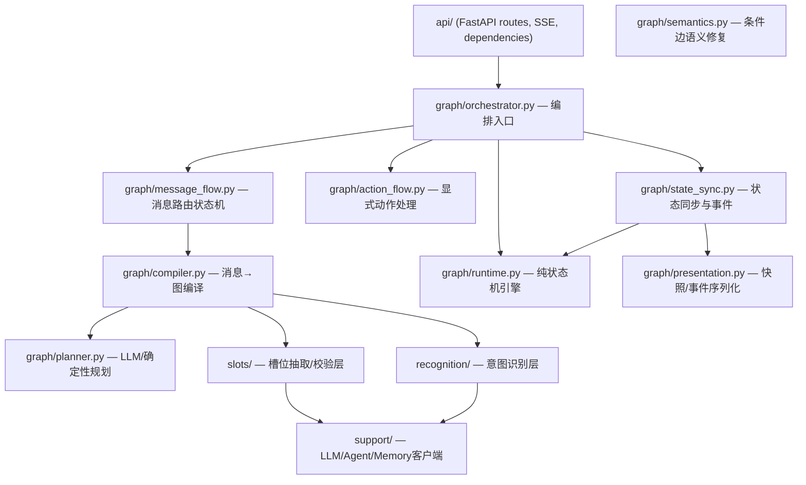

# Router-Service Code Review Report

> **Scope**: `backend/services/router-service/src/router_service/` — 全部 35+ 源码文件  
> **Review Date**: 2026-04-13  
> **Reviewer**: Antigravity AI  
> **Verdict**: 🟢 架构整体优秀 | 🟡 存在若干需要治理的性能与工程风险

---

## 一、总体评价

Router-service 的代码整体质量**处于高水准**。模块职责划分明确，接口设计干净（大量使用 Protocol/dataclass），命名和文档注释规范程度远超一般项目。以下是核心数据量级：

| 指标 | 数值 |
|------|------|
| 核心源文件 | 35+ |
| Orchestrator 行数 | 1063 |
| 单文件最大行数 | 672 (slot extractor) |
| 测试文件 | 29 |
| 环境变量配置项 | ~30 |

---

## 二、架构质量评估

### 2.1 亮点：模块拆分清晰，职责边界明确



**评价**：分层结构非常值得肯定：

- `runtime.py` (244行) 是**纯逻辑状态机**，不涉及 I/O、LLM、网络——这使得它极易测试和推理
- `presentation.py` 专职序列化，不混合业务逻辑
- `message_flow.py` 和 `action_flow.py` 将消息驱动和动作驱动完全分离
- `compiler.py` 独立出来负责"消息→图"的编译，与 Orchestrator 解耦

### 2.2 关注点：Orchestrator 的 "Thin Wrapper Delegation" 膨胀

> [!WARNING]
> [orchestrator.py](file:///Users/weipeng/Desktop/VIBE_WORK_SPACE/intent_router/intent-router/backend/services/router-service/src/router_service/core/graph/orchestrator.py) 1063 行中，**Line 800–1063（约 260 行）几乎全部是一行的 delegate wrapper**，形如：

```python
def _fallback_intent(self) -> IntentDefinition | None:
    getter = getattr(self.intent_catalog, "get_fallback_intent", None)
    ...
def _node_status_for_task_status(self, status):
    return self.state_sync.node_status_for_task_status(status)
def _guided_selection_display_content(self, guided_selection):
    return self.graph_compiler.guided_selection_display_content(guided_selection)
```

这些方法从 orchestrator 抽取出来后，被 `message_flow.py` 和 `action_flow.py` 通过 **回调函数** 的方式消费（如 `snapshot_session=self.snapshot`、`drain_graph=self._drain_graph`）。然而 orchestrator 上的这些 wrapper 仍然保留着，导致：

1. **代码膨胀**：260+ 行纯 delegation 代码增加了阅读负担
2. **隐含 API 表面**：外部代码（如 `GraphMessageFlow.__init__` 的 10+ 个 `Callable` 参数）没有对这些回调定义强类型协议
3. **维护成本**：添加一个新回调就需要在 3 个文件中同步更改

**建议**：引入一个 `OrchestratorCallbacks` Protocol 或 dataclass，将 ~15 个回调一次注入，减少散落的 wrapper。或者直接让 MessageFlow/ActionFlow 持有 orchestrator 引用（因为它们已经通过回调间接依赖了）。

### 2.3 亮点：Builder/Planner/Interpreter 的 LLM+Fallback 模式

整个项目对 LLM 调用的抽象模式非常一致：

```
LLM尝试 → 解析/校验 → 失败则降级到确定性 Fallback
```

这在 [LLMIntentRecognizer](file:///Users/weipeng/Desktop/VIBE_WORK_SPACE/intent_router/intent-router/backend/services/router-service/src/router_service/core/recognition/recognizer.py#L89-L184)、[LLMIntentGraphPlanner](file:///Users/weipeng/Desktop/VIBE_WORK_SPACE/intent_router/intent-router/backend/services/router-service/src/router_service/core/graph/planner.py#L317-L421)、[LLMGraphTurnInterpreter](file:///Users/weipeng/Desktop/VIBE_WORK_SPACE/intent_router/intent-router/backend/services/router-service/src/router_service/core/graph/planner.py#L423-L527) 中都一致执行。**对生产系统的 LLM 降级容错而言，这是正确实践。**

---

## 三、代码质量详评

### 3.1 🟢 优秀实践

| 项目 | 评估 |
|------|------|
| **类型注解** | 全面使用 `from __future__ import annotations`，所有公开方法/参数有完整类型签名 |
| **文档字符串** | 几乎每个类/方法都有 docstring，且为英文，质量整齐 |
| **不可变数据建模** | `@dataclass(slots=True, frozen=True)` 用于不可变值对象（如 `IntentDomain`），命名枚举（`StrEnum`）用于状态码 |
| **Pydantic 使用** | 模型定义统一用 Pydantic v2，带 `model_validator`、`Field` 约束、`ConfigDict` |
| **Protocol 接口** | `IntentRecognizer`、`IntentGraphPlanner`、`TurnInterpreter`、`JsonLLMClient`、`AgentClient` 全部是纯协议，不依赖基类继承 |
| **常量提取** | `TERMINAL_NODE_STATUSES`、`PLANNING_RECENT_MESSAGE_PREFIXES` 等集合常量统一定义在文件顶部 |

### 3.2 🟡 需要改进的点

#### 3.2.1 `TERMINAL_NODE_STATUSES` 定义重复 (DRY 违反)

```diff
# runtime.py:15-20
TERMINAL_NODE_STATUSES = {
    GraphNodeStatus.COMPLETED, GraphNodeStatus.FAILED,
    GraphNodeStatus.CANCELLED, GraphNodeStatus.SKIPPED,
}

# orchestrator.py:62-67  (同样的定义！)
TERMINAL_NODE_STATUSES = {
    GraphNodeStatus.COMPLETED, GraphNodeStatus.FAILED,
    GraphNodeStatus.CANCELLED, GraphNodeStatus.SKIPPED,
}

# action_flow.py:23-28  (又一份！)
TERMINAL_NODE_STATUSES = {
    GraphNodeStatus.COMPLETED, GraphNodeStatus.FAILED,
    GraphNodeStatus.CANCELLED, GraphNodeStatus.SKIPPED,
}
```

> **严重性**: 低 | **建议**: 提取到 `graph_domain.py` 或 `runtime.py` 统一导出。

#### 3.2.2 `_CURRENCY_TOKENS` 定义重复

[extractor.py:39-45](file:///Users/weipeng/Desktop/VIBE_WORK_SPACE/intent_router/intent-router/backend/services/router-service/src/router_service/core/slots/extractor.py#L39-L45) 和 [validator.py:12-18](file:///Users/weipeng/Desktop/VIBE_WORK_SPACE/intent_router/intent-router/backend/services/router-service/src/router_service/core/slots/validator.py#L12-L18) 各自独立定义了 `_CURRENCY_TOKENS`。  

> **建议**: 移至 `grounding.py` 统一管理。

#### 3.2.3 `_combined_text` 方法重复

同一个 `_combined_text` 辅助方法分别在 [extractor.py:631-639](file:///Users/weipeng/Desktop/VIBE_WORK_SPACE/intent_router/intent-router/backend/services/router-service/src/router_service/core/slots/extractor.py#L631-L639) 和 [validator.py:185-193](file:///Users/weipeng/Desktop/VIBE_WORK_SPACE/intent_router/intent-router/backend/services/router-service/src/router_service/core/slots/validator.py#L185-L193) 定义。

> **建议**: 提取为 `slots/` 包级别的共用函数。

#### 3.2.4 `_value_is_grounded` 方法近似重复

extractor 和 validator 内各自维护了一份 `_value_is_grounded`，含义和逻辑基本一致（都包含币种回退匹配逻辑）。

> **建议**: 统一到 `grounding.py` 模块。

#### 3.2.5 `slot_signature` 构建方式重复

在 `extractor.py` 中，以下方法各自独立构建 `slot_signature`：
- [_extract_currency_like_slot](file:///Users/weipeng/Desktop/VIBE_WORK_SPACE/intent_router/intent-router/backend/services/router-service/src/router_service/core/slots/extractor.py#L408-L438) 
- [_extract_string_slot](file:///Users/weipeng/Desktop/VIBE_WORK_SPACE/intent_router/intent-router/backend/services/router-service/src/router_service/core/slots/extractor.py#L440-L460)
- [_extract_account_number_match](file:///Users/weipeng/Desktop/VIBE_WORK_SPACE/intent_router/intent-router/backend/services/router-service/src/router_service/core/slots/extractor.py#L462-L497)
- [_extract_phone_last4_match](file:///Users/weipeng/Desktop/VIBE_WORK_SPACE/intent_router/intent-router/backend/services/router-service/src/router_service/core/slots/extractor.py#L499-L545)
- [_value_is_grounded](file:///Users/weipeng/Desktop/VIBE_WORK_SPACE/intent_router/intent-router/backend/services/router-service/src/router_service/core/slots/extractor.py#L641-L672)

每次都做相同的 `" ".join(part.lower() for part in (...) if part)` 字符串拼接，且与 validator 中同样逻辑重复。

> **建议**: 给 `IntentSlotDefinition` 加一个 `@cached_property` 的 `semantic_signature` 属性。

---

## 四、性能风险评估

### 4.1 🔴 关键：全量 `list_active()` 在每个热路径中重复调用

以下调用链表明 `self.intent_catalog.list_active()` 在单次用户请求中被调用 **至少 3-4 次**：

1. [compiler.py:134](file:///Users/weipeng/Desktop/VIBE_WORK_SPACE/intent_router/intent-router/backend/services/router-service/src/router_service/core/graph/compiler.py#L134) — `compile_message` 构建 `active_intents` 字典
2. [orchestrator.py:535](file:///Users/weipeng/Desktop/VIBE_WORK_SPACE/intent_router/intent-router/backend/services/router-service/src/router_service/core/graph/orchestrator.py#L535) — `_create_task_for_node` 构建 `active_intents` 字典
3. [compiler.py:259](file:///Users/weipeng/Desktop/VIBE_WORK_SPACE/intent_router/intent-router/backend/services/router-service/src/router_service/core/graph/compiler.py#L259) — `build_guided_selection_graph` 构建 `active_intents` 字典
4. [recognizer.py:119](file:///Users/weipeng/Desktop/VIBE_WORK_SPACE/intent_router/intent-router/backend/services/router-service/src/router_service/core/recognition/recognizer.py#L119) — `LLMIntentRecognizer.recognize` 过滤 active intents

每次都构建完整的 `{intent.intent_code: intent for intent in self.intent_catalog.list_active()}` 字典。当 intent 目录规模增长到 50+ 后，这些重复的遍历和字典构建是不必要的 CPU 开销。

> **建议**: 在 `RepositoryIntentCatalog` 中维护一个按 `intent_code` 索引的字典缓存，通过 `list_active_by_code()` 方法暴露，刷新时重建。

### 4.2 🟡 GraphSessionState.tasks 线性扫描

[orchestrator.py:861-868](file:///Users/weipeng/Desktop/VIBE_WORK_SPACE/intent_router/intent-router/backend/services/router-service/src/router_service/core/graph/orchestrator.py#L861-L868):

```python
def _get_task(self, session, task_id):
    for task in session.tasks:
        if task.task_id == task_id:
            return task
    return None
```

Session 的 tasks 列表会随多轮对话增长。对于单 session 内高频次查找（每次 `_run_node` 和 `cancel_*` 都调用），线性扫描的效率较低。

> **建议**: 在 `GraphSessionState` 上维护一个 `_tasks_by_id: dict[str, Task]` 索引。

### 4.3 🟡 Graph 节点/边查找为 O(N)

[graph_domain.py:165-178](file:///Users/weipeng/Desktop/VIBE_WORK_SPACE/intent_router/intent-router/backend/services/router-service/src/router_service/core/shared/graph_domain.py#L165-L178):

```python
def node_by_id(self, node_id):
    for node in self.nodes:
        if node.node_id == node_id: return node
    raise KeyError(...)

def incoming_edges(self, node_id):
    return [edge for edge in self.edges if edge.target_node_id == node_id]
```

`refresh_node_states` 对每个 non-terminal 节点调用 `incoming_edges` (O(E))，再对每条 incoming edge 调用 `node_by_id` (O(N))。对于 4-5 节点的图无所谓，但如果未来支持更大图（10+ 节点），复杂度为 O(N × E × N)。

> **建议**: 在 `ExecutionGraphState` 上维护 `_incoming_edges_index` 和 `_nodes_by_id` 懒索引。

### 4.4 🟡 LLM 调用: 每次流式请求都创建新 ChatOpenAI 实例

[llm_client.py:133-143](file:///Users/weipeng/Desktop/VIBE_WORK_SPACE/intent_router/intent-router/backend/services/router-service/src/router_service/core/support/llm_client.py#L133-L143):

```python
def _create_model(self, model=None):
    return ChatOpenAI(
        model_name=model or self.default_model,
        ...
        http_async_client=self.http_async_client,
    )
```

每次 `run_json` 调用都新建 `ChatOpenAI` 实例。如果 LangChain 的 `ChatOpenAI` 构造函数内部做了连接池初始化或元数据查询，这会成为不必要的开销。

> **建议**: 按 model name 缓存 `ChatOpenAI` 实例（内部它持有 httpx client）。注意传入了 `http_async_client`，所以实际 TCP 连接是复用的，但对象创建的开销仍值得衡量。

---

## 五、正确性与健壮性

### 5.1 🔴 `_drain_graph` 缺少最大迭代次数保护

[orchestrator.py:402-447](file:///Users/weipeng/Desktop/VIBE_WORK_SPACE/intent_router/intent-router/backend/services/router-service/src/router_service/core/graph/orchestrator.py#L402-L447):

```python
while True:
    await self._refresh_graph_state(session, graph)
    # ...
    next_node = self._next_ready_node(graph)
    if next_node is None:
        return
    await self._run_node(session, graph, next_node, seed_input)
    # ...
```

虽然设计意图是图天然有限，但如果 `_run_node` 由于 bug 导致节点状态没有正确更新到 terminal，则此循环将**无限运行**。`asyncio.timeout` 只保护单节点执行，不保护整个 drain 循环。

> **建议**: 增加 `max_drain_iterations`（如 `len(graph.nodes) * 3`），超限则强制将图标记为 FAILED 并退出。

### 5.2 🟡 `condition_matches` 的类型比较安全性

[runtime.py:120-146](file:///Users/weipeng/Desktop/VIBE_WORK_SPACE/intent_router/intent-router/backend/services/router-service/src/router_service/core/graph/runtime.py#L120-L146):

```python
if isinstance(current_value, (int, float)) and isinstance(threshold, (int, float)):
    left = float(current_value)
    right = float(threshold)
else:
    left = current_value
    right = threshold
try:
    if operator == ">": return left > right
    ...
except TypeError:
    return False
```

当 `left` 是 `str`、`right` 是 `int` 时，Python 3 的 `>` 比较会直接抛 `TypeError`，被 catch 后静默返回 `False`。这虽然安全，但**静默的类型不匹配意味着 condition 评估失败时无法被追踪排查**。

> **建议**: 在 `except TypeError` 分支记录 warning log，包含 `left_key`, `left`, `right`, `operator`。

### 5.3 🟡 `cancel_current_graph` 中没有 Agent 取消错误的汇总反馈

[action_flow.py:119-137](file:///Users/weipeng/Desktop/VIBE_WORK_SPACE/intent_router/intent-router/backend/services/router-service/src/router_service/core/graph/action_flow.py#L119-L137):

```python
for node in graph.nodes:
    ...
    try:
        await self.agent_client.cancel(...)
    except Exception as exc:
        logger.warning("Failed to cancel graph task %s: %s", task.task_id, exc)
```

多节点取消时如果多个 Agent 都超时/失败，只产生分散的 warning 日志，调用方没有任何反馈。

> **建议**: 汇总失败数量/节点信息到 graph 的 `output_payload` 或 cancel event 中。

### 5.4 🟡 Session 过期无主动清理

[graph_domain.py:202-205](file:///Users/weipeng/Desktop/VIBE_WORK_SPACE/intent_router/intent-router/backend/services/router-service/src/router_service/core/shared/graph_domain.py#L202-L205):

```python
def is_expired(self, now=None):
    return current >= self.expires_at
```

`is_expired` 方法存在，但**没有任何地方主动调用它来清理过期 session**。在 `GraphSessionStore` 和 `handle_user_message` 中都没有过期检查。

> **建议**: 
> 1. 在 `get_or_create` 时检查过期并重置
> 2. 在 `run_intent_catalog_refresh` 后台循环中加一个定期清理逻辑

### 5.5 🟡 LongTermMemoryStore 的无界增长

[memory_store.py](file:///Users/weipeng/Desktop/VIBE_WORK_SPACE/intent_router/intent-router/backend/services/router-service/src/router_service/core/support/memory_store.py) 的 `promote_session` 不断 append 到 `facts` 列表，没有容量上限或淘汰策略。当同一客户长期对话时，内存持续增长。

> **建议**: 设置 `max_facts_per_customer`（如 100），超限时淘汰最旧的 facts。

---

## 六、安全与配置

### 6.1 🟡 `.env` 文件加载逻辑过于激进

[settings.py:14-58](file:///Users/weipeng/Desktop/VIBE_WORK_SPACE/intent_router/intent-router/backend/services/router-service/src/router_service/settings.py#L14-L58):

`_env_search_roots()` 从 CWD 开始，沿 `__file__` 所在目录向上遍历到 `.git` 为止，扫描所有 `.env` 和 `.env.local`。在容器化部署中，如果 CWD 不是预期目录，可能意外加载到其他项目的 `.env` 文件。

> **建议**: 在生产环境（`env != "dev"`）中禁用本地文件扫描，仅使用进程级环境变量。

### 6.2 🟢 敏感数据处理恰当

- API Key 通过 `ROUTER_LLM_API_KEY` 环境变量注入，不在代码中硬编码
- 出错时日志不会打印 key 本身
- `llm_headers` 的 JSON 解析做了类型校验

---

## 七、测试评估

### 7.1 测试覆盖分布

| 模块 | 测试文件 | 评估 |
|------|----------|------|
| Graph Runtime | `test_v2_graph_runtime.py` | ✅ 覆盖基本状态转移 |
| Graph Compiler | `test_graph_compiler.py` (新增) | ✅ 新增 |
| Slot Extractor | `test_slot_extractor.py` | ✅ 覆盖启发式抽取 |
| Slot Validator | `test_slot_validator.py` | ✅ 覆盖校验逻辑 |
| Understanding Validator | `test_understanding_validator.py` | ✅ 覆盖集成 |
| Domain Router | `test_domain_router.py` | ✅ 覆盖域路由 |
| Hierarchical Recognizer | `test_hierarchical_intent_recognizer.py` | ✅ 覆盖分层识别 |
| Leaf Router | `test_leaf_intent_router.py` | ✅ 覆盖叶子路由 |
| Router API (E2E) | `test_router_api_v2.py` (90KB!) | ✅ 非常全面 |
| **Message Flow** | *无专项测试* | ❌ 缺失 |
| **Action Flow** | *无专项测试* | ❌ 缺失 |
| **State Sync** | *无专项测试* | ❌ 缺失 |
| **Presentation** | `test_v2_presentation.py` | ✅ 有覆盖 |
| **Semantics (Edge Repair)** | *未确认* | ⚠️ 需验证 |
| **Agent Client** | *无专项测试* | ❌ 缺失 |
| **Session Store** | *无专项测试* | ❌ 缺失 |

### 7.2 关键测试缺口

> [!IMPORTANT]
> 以下模块对生产稳定性至关重要，但缺少单元/集成测试：

1. **`GraphMessageFlow`** — 消息路由的核心决策逻辑（pending graph turn、waiting node turn、proactive recommendation 等），仅通过 `test_router_api_v2.py` 的 E2E 间接覆盖
2. **`GraphActionFlow`** — `cancel_current_graph`, `confirm_pending_graph` 等动作的正确性校验
3. **`StreamingAgentClient`** — 下游 HTTP SSE/JSON 流解析的各种边界场景（非法 JSON、状态码错误、空流等）
4. **`GraphStateSync`** — 状态同步逻辑（skipped node 事件发布、graph progress 计算）

---

## 八、代码复杂度热点

### 8.1 [extractor.py](file:///Users/weipeng/Desktop/VIBE_WORK_SPACE/intent_router/intent-router/backend/services/router-service/src/router_service/core/slots/extractor.py) — 672 行（最大文件）

这是业务逻辑最密集的文件，包含：
- 6 个编译正则表达式
- 币种映射字典
- 启发式抽取、LLM 抽取、合并逻辑
- grounding 校验
- overwrite 策略判断

**建议**：按关注点拆分为：
- `slot_heuristics.py` — 正则/规则抽取
- `slot_llm_extractor.py` — LLM 交互
- `slot_merger.py` — 合并和冲突解决
- 保留 `extractor.py` 作为 facade

### 8.2 [planner.py](file:///Users/weipeng/Desktop/VIBE_WORK_SPACE/intent_router/intent-router/backend/services/router-service/src/router_service/core/graph/planner.py) — 527 行

承载了 5 种类/Protocol：
- `GraphPlanConditionPayload`, `GraphPlanNodePayload`, `GraphPlanEdgePayload`, `GraphPlanningPayload` — LLM 响应模型
- `GraphPlanNormalizer` — 规划结果规范化
- `TurnDecisionPayload` — 轮次解释结果
- `SequentialIntentGraphPlanner` — 确定性回退
- `LLMIntentGraphPlanner` — LLM 规划
- `BasicTurnInterpreter`, `LLMGraphTurnInterpreter` — 轮次解释

**建议**：将 `TurnInterpreter` 相关类（3个）拆到 `turn_interpreter.py`。

---

## 九、设计改进建议（按优先级排序）

| # | 优先级 | 改进项 | 影响范围 | 预估工作量 |
|---|--------|--------|----------|------------|
| 1 | **P0** | `_drain_graph` 增加最大迭代保护 | orchestrator | < 1h |
| 2 | **P0** | Session 过期检查与主动清理 | session_store | 2-3h |
| 3 | **P1** | 消除 `TERMINAL_NODE_STATUSES` / `_CURRENCY_TOKENS` / `_combined_text` 等重复定义 | 跨 5 文件 | 1-2h |
| 4 | **P1** | 缓存 `list_active()` 为 `dict[str, IntentDefinition]` | intent_catalog | 2h |
| 5 | **P1** | 补充 MessageFlow / ActionFlow / AgentClient 单元测试 | tests | 1-2d |
| 6 | **P2** | LongTermMemoryStore 增加容量上限和淘汰策略 | memory_store | 2h |
| 7 | **P2** | `condition_matches` 的 TypeError 路径增加 warning 日志 | runtime | < 30min |
| 8 | **P2** | 将 orchestrator 的 delegate wrappers 整合为回调协议 | orchestrator, flow | 4-6h |
| 9 | **P3** | 拆分 `extractor.py` 为 heuristics/llm/merger | slots | 3-4h |
| 10 | **P3** | Graph 节点/边查找加索引缓存 | graph_domain | 2h |

---

## 十、与设计文档的一致性

对照 **《层级意图路由与条件槽位治理改造方案》** 中的设计目标，当前代码的实现程度如下：

| 设计目标 | 当前状态 | 评估 |
|----------|----------|------|
| DomainRouter + LeafRouter 分层路由 | ✅ `recognition/domain_router.py` + `leaf_intent_router.py` + `hierarchical_intent_recognizer.py` | 已实现，通过环境变量切换 |
| SlotExtractor 独立模块 | ✅ `slots/extractor.py` 含 heuristics + LLM | 已实现 |
| UnderstandingValidator 前置门控 | ✅ `slots/understanding_validator.py` 协调 extractor + validator | 已实现 |
| GraphCompiler 独立编译器 | ✅ `graph/compiler.py` 含 planning policy 切换 | 已实现 |
| 条件与槽位分仓存储 | ✅ `node.slot_memory` vs `edge.condition` | 已实现 |
| ConditionExtractor 独立模块 | ❌ 未实现，按设计方案推后 | 符合 Phase 7 路线图 |
| 结构化记忆模型 (MemorySlotRecord) | ❌ 仍为 string-based recall | 待 Phase 5 实施 |
| `domain_code` 字段 | ✅ `IntentPayload` 和 `IntentDefinition` 已包含 | 已落地 |

---

## 十一、总结

Router-service 是一个**设计精良、代码规范**的 LLM 编排系统。其核心架构（纯状态机 runtime + 语义修复 + LLM Fallback 降级）已经经过充分验证。主要风险点不在架构设计层面，而在以下工程层面：

1. **防御性编程不足** — `_drain_graph` 无界循环、session 无过期清理、内存无上限
2. **代码重复** — 5-6 处常量/辅助方法重复定义
3. **测试覆盖偏 E2E** — 核心 Flow 类缺少隔离的单元测试
4. **性能可预见瓶颈** — `list_active()` 重复调用、线性查找

这些问题的修复工作量可控（预估 3-5 个工作日），修复后系统的长期可维护性和生产稳定性将显著提升。
