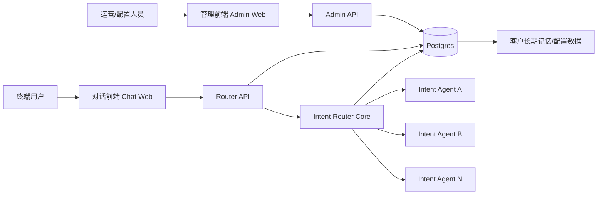
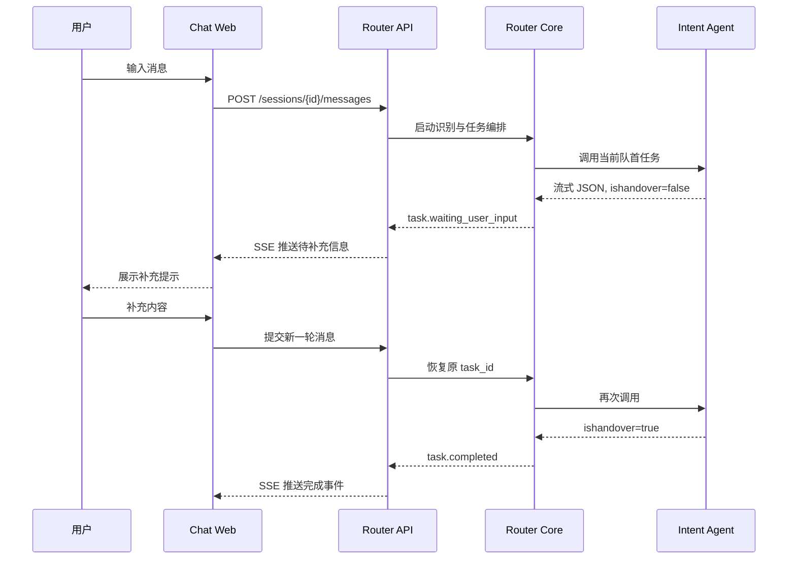
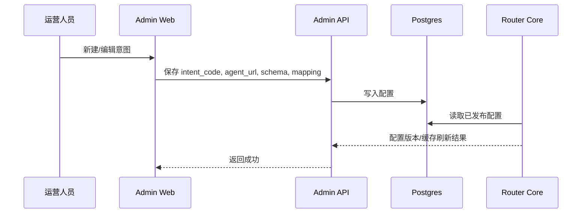

# 基于 DeerFlow 借鉴的系统架构设计

## 1. 文档目标
本文档基于 DeerFlow 的公开仓库结构与 README 思路，提炼适合本项目的架构借鉴点，用于指导四个核心部分的设计与搭建：

- 对话前端
- 管理前端
- 管理后端
- 意图路由服务后端

注意：这里是“借鉴思路”，不是照搬 DeerFlow。我们保留其分层、流式、状态驱动和配置驱动的优点，但不引入其研究型多 Agent、沙箱执行、子代理体系等复杂能力。

## 2. 从 DeerFlow 借鉴什么，不借鉴什么
### 2.1 借鉴点
基于 DeerFlow 公开 README 与前后端目录结构，可以明确借鉴以下思路：

- 前端采用 Next.js App Router，并把页面层与核心业务逻辑分离
- 后端把“运行时核心逻辑”和“对外 API 层”拆开，而不是把所有逻辑写在路由处理器里
- 通过统一入口层聚合前端与后端服务，降低前端跨域和服务发现复杂度
- 把流式交互作为一等公民，前端围绕 SSE/流式事件而不是只围绕一次性响应设计
- 用配置驱动系统扩展能力，而不是把每个业务能力硬编码到主流程里

### 2.2 不直接采用的部分
以下内容不适合当前阶段直接引入：

- DeerFlow 的研究型多 Agent 编排
- 沙箱执行、文件系统隔离、代码执行工具链
- 子代理并发执行体系
- 面向深度研究场景的复杂工具生态

### 2.3 对我们的落地改造
我们把 DeerFlow 的“Lead Agent + Gateway API”思想改造成：

- `Intent Router Core`：负责意图识别、任务状态机、任务恢复、请求组装、Agent 调度
- `Router API`：负责对话接入、SSE 推送、会话与任务查询
- `Admin API`：负责意图注册、Agent 配置、Prompt 模板、运营查询
- `Fallback Agent`：作为独立 Agent 服务，仅在无匹配意图时由 Router 分发调用

这是对 DeerFlow 分层方式的借鉴，不是对其业务模型的复制。这个结论是基于 DeerFlow 公开 README 与目录说明的推断。

## 3. 目标系统总览
### 3.1 总体架构



### 3.2 设计原则
- V1 先保证串行、多轮、可恢复、可观测
- 用户交互必须围绕任务状态机来设计
- 意图注册信息必须足够结构化，能够直接驱动请求组装
- 前端页面层保持轻，核心逻辑下沉到独立模块
- Router Core 必须独立于 Web 框架，便于后续测试和演进
- `admin-api` 与 `router-api` 必须分开部署和发布
- `admin-api` 默认单副本，`router-api` 支持多副本扩容
- Router 只做识别与分发，不直接承载业务意图执行逻辑

## 4. 四个核心部分的职责
### 4.1 对话前端
对话前端负责用户会话体验，不负责意图判断本身。核心职责：

- 发送用户消息与会话上下文
- 订阅 Router API 的 SSE 事件流
- 展示当前激活任务、排队任务、候选意图与历史任务
- 当收到 `task.waiting_user_input` 时，引导用户补充信息
- 将新的用户补充继续提交到同一会话

界面上建议至少有三块：

- 聊天消息流
- 当前任务卡片
- 队列任务侧栏

### 4.2 管理前端
管理前端负责配置与运营，不与用户对话混在一起。核心职责：

- 创建、编辑、启停意图
- 配置 `agent_url`、`request_schema`、`field_mapping`
- 配置识别 Prompt、阈值与调度优先级
- 查看会话、任务、失败原因、流转时间线
- 回放某次识别与任务执行

### 4.3 管理后端
管理后端负责对配置型数据进行治理。核心职责：

- 提供意图注册 CRUD
- 提供 Agent 配置和 Prompt 模板管理
- 提供阈值、开关、灰度配置
- 提供会话和任务的查询接口
- 对 Router 运行所需配置提供只读发布视图

### 4.4 意图路由服务后端
这是系统核心。其内部建议拆为 `Router API + Router Core` 两层：

- `Router API`：接收消息、输出 SSE、暴露查询接口
- `Router Core`：上下文组装、多意图识别、候选意图判定、任务队列、状态机、Agent 调用、恢复原任务

并且在部署层维持以下约束：

- `Admin API` 与 `Router API` 为独立 Deployment
- `Admin API` 单实例，`Router API` 可横向扩展
- 每个 Deployment 必须声明 `resources.requests.cpu` 与 `resources.requests.memory`

## 5. 推荐分层与目录
为了快速搭建且保持清晰，建议采用“前后端分仓式目录，但在同一仓库管理”的结构：

```text
frontend/
  apps/
    chat-web/
    admin-web/
  packages/
    ui/
    api-client/
    shared-types/

backend/
  src/
    router_core/
      context/
      recognizer/
      candidates/
      task_queue/
      state_machine/
      agent_client/
      memory/
      prompting/
    router_api/
      app.py
      routers/
      sse/
    admin_api/
      app.py
      routers/
    persistence/
    models/
    config/
  tests/

infra/
  nginx/
  docker/

docs/
```

这样借鉴了 DeerFlow 的“前端独立、后端独立、后端内部按职责分模块”的方式，但更适合当前这个意图路由项目。

## 6. 关键交互链路
### 6.1 用户对话链路



### 6.2 管理配置链路



## 7. 关键借鉴点的落地方式
### 7.1 借鉴 DeerFlow 的前端分层
DeerFlow 前端把页面、组件和 `core` 业务逻辑分开。这里建议照着这个原则做：

- `app/` 只处理路由与页面装配
- `components/` 只处理展示与交互
- `core/` 处理消息流、任务流、SSE 订阅、状态聚合

这样后续对话前端和管理前端都不会把业务逻辑写散在页面文件里。

### 7.2 借鉴 DeerFlow 的后端分层
DeerFlow 后端区分了运行时核心与 Gateway API。我们建议：

- `router_core/` 只放纯业务能力，不依赖 FastAPI Request/Response
- `router_api/` 只做入参校验、SSE 输出、鉴权、会话接口
- `admin_api/` 只做管理面 CRUD 与查询

这样后续即使替换 Web 框架，核心路由逻辑也不用重写。

### 7.3 借鉴 DeerFlow 的统一入口
DeerFlow 用统一反向代理对接前端、LangGraph 与 Gateway。我们建议 V1 也保留统一入口思路：

- `/chat` -> Chat Web
- `/admin` -> Admin Web
- `/api/router/*` -> Router API
- `/api/admin/*` -> Admin API

开发阶段可以先不强依赖 Nginx，但目录和路径规则先按统一入口设计，避免后续重构路由。

## 8. 数据与基础设施建议
### 8.1 存储
- `Postgres`：意图配置、客户长期记忆、会话归档、消息、任务、事件、Prompt 模板
- 短期会话记忆：Router Pod 内存，按 `session_id` 保存 30 分钟
- `pgvector` 或等价能力：后续长期记忆检索可选

### 8.2 核心表
- `intents`
- `intent_versions`
- `sessions`
- `messages`
- `tasks`
- `task_events`
- `prompt_templates`
- `agent_endpoints`

### 8.3 外部服务
- 各意图 Agent 以独立 URL 服务接入
- Router 通过统一 HTTP 流式客户端调用
- Agent 不直接操作主库，只通过协议与 Router 通信

## 9. MVP 先做什么
为了先看效果，第一阶段不要一上来把所有能力做满，建议只做下面这组：

- 对话前端：聊天页 + 当前任务卡 + SSE 订阅
- 管理前端：意图列表页 + 创建/编辑页
- 管理后端：意图 CRUD + Prompt 配置 + 查询接口
- 路由后端：多意图识别、候选意图、串行任务队列、`ishandover` 恢复、SSE 推送
- 数据层：Postgres + Pod 内存短期记忆

首个演示路径建议固定为：

1. 在管理端注册两个意图
2. 在对话端输入多意图消息
3. 第一个任务返回 `ishandover=false`
4. 前端收到 SSE 并提示用户补充
5. 用户补充后恢复原任务
6. 第一个任务完成后继续第二个任务
7. 管理端可查看整条任务时间线

## 10. 搭建顺序
建议按下面顺序推进：

1. 先搭目录骨架和统一命名
2. 先做 `Admin API + intents` 数据模型
3. 再做 `Router Core` 的状态机与任务模型
4. 再做 `Router API` 的消息入口和 SSE 出口
5. 再做 `Chat Web` 的消息流与任务卡片
6. 最后补 `Admin Web` 的配置页面和查询页面

这个顺序的原因是：没有结构化意图注册，就没有稳定的识别输入；没有 Router Core 状态机，就无法正确做前端流式体验。

## 11. 结论
对我们最有价值的 DeerFlow 思想不是“多 Agent 很强”，而是它的工程组织方式：

- 前端分层清晰
- 后端运行时与管理 API 分离
- 流式交互是系统主路径
- 扩展能力依赖配置和模块边界，而不是硬编码

因此，本项目建议采用“Next.js 双前端 + FastAPI 双 API + 独立 Router Core + Postgres + Pod 内存短期记忆”的架构路线。这样既能快速搭出效果，也为后续细化识别策略、任务编排和观测能力留出空间。

## 12. 参考来源
以下为本次借鉴所参考的 DeerFlow 公开资料：

- DeerFlow 仓库主页：https://github.com/bytedance/deer-flow
- DeerFlow 前端 README：https://github.com/bytedance/deer-flow/blob/main/frontend/README.md
- DeerFlow 后端 README：https://github.com/bytedance/deer-flow/blob/main/backend/README.md
