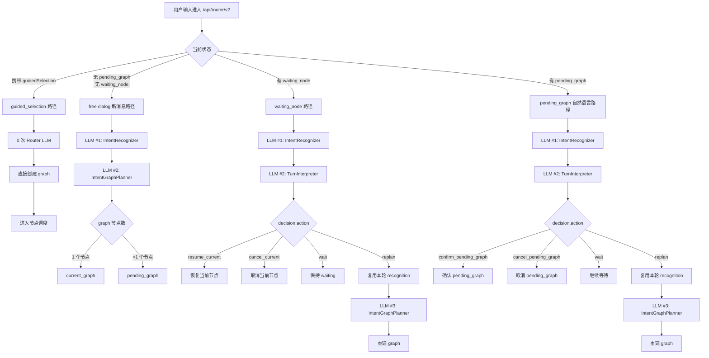
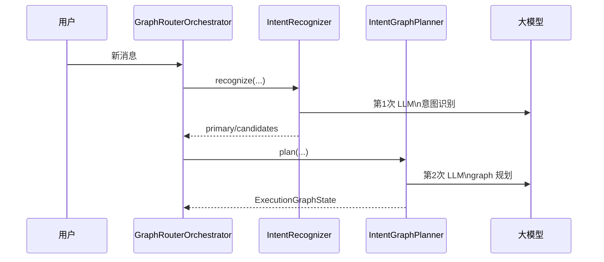
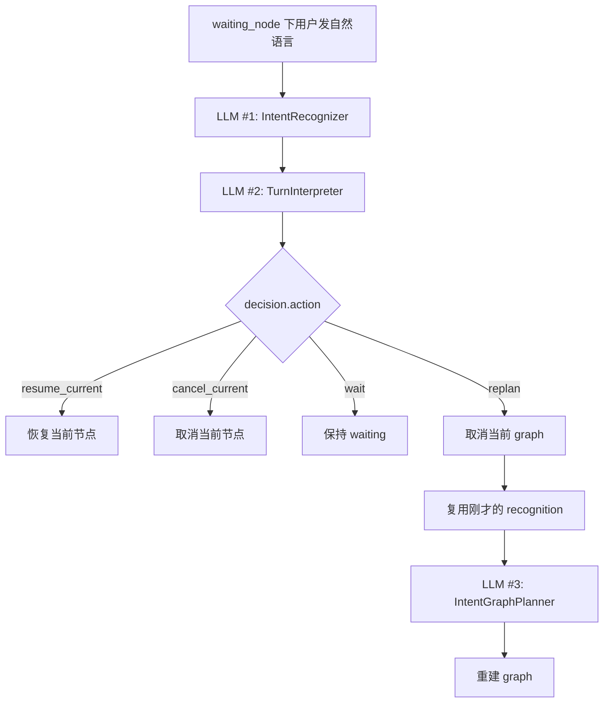
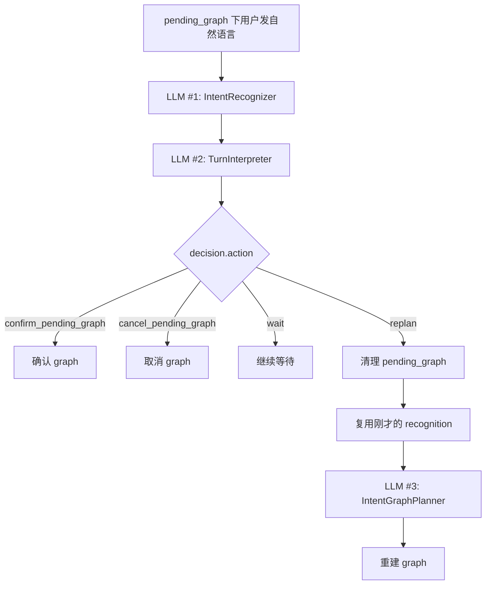

# V2 当前 Router 侧 LLM 调用流程

本文只讨论当前 `/api/router/v2` 的 **Router 侧** 真实执行逻辑。

不讨论：

- V1
- 前端
- 下游 business agent 自己内部可能发生的 LLM 调用

也就是说，本文只回答一个问题：

- **V2 Router 在什么分支下，会调用 `recognizer`、`graph planner`、`turn interpreter` 这三类 LLM？**

## 1. 结论先说

当前 V2 Router 侧有 3 类独立的 LLM 角色：

1. `IntentRecognizer`
   负责识别当前消息命中了哪些 intent
2. `IntentGraphPlanner`
   负责把识别结果转成 graph
3. `TurnInterpreter`
   负责在 `waiting_node` / `pending_graph` 场景下，判断这条新消息是在补充、取消、确认，还是要求重规划

这 3 类不是同一次请求，也不是同一个 prompt。

但当前 V2 还有一条容易被忽略的首轮入口：

- 如果请求直接携带 `guidedSelection`
- Router 会跳过 `recognizer` 和 `graph planner`
- 直接按 selected intents 建图

所以本文实际讨论的是两种首轮模式：

- `free dialog`：会发生 Router 侧 LLM 调用
- `guided selection`：首轮是 **0 次 Router 侧 LLM**

最容易误解的一点是：

- `graph planner` 不是“recognize 的一部分”
- 它是一次独立的 LLM 调用
- 但它 **只会在建图或重规划时触发**
- 普通补槽不会调用 `graph planner`

## 2. 当前 V2 的入口分流

`GraphRouterOrchestrator.handle_user_message()` 当前是按状态分流的：

- 如果有 `guidedSelection`，先走 `guided_selection` 直达路径
- 如果有 `pending_graph`，走 `pending_graph` 自然语言处理
- 否则如果有 `waiting_node`，走 `waiting_node` 自然语言处理
- 否则走“首轮新消息 / 新建图”处理

对应代码入口：

- [v2_orchestrator.py:155](/root/intent-router/backend/src/router_core/v2_orchestrator.py#L155)
- [v2_orchestrator.py:160](/root/intent-router/backend/src/router_core/v2_orchestrator.py#L160)
- [v2_orchestrator.py:164](/root/intent-router/backend/src/router_core/v2_orchestrator.py#L164)
- [v2_orchestrator.py:169](/root/intent-router/backend/src/router_core/v2_orchestrator.py#L169)

## 3. 一张总图

下面这张图只画 **Router 侧** LLM，不把下游 agent 混进去。



## 4. 首轮新消息

适用前提：

- 当前没有 `guidedSelection`
- 当前没有 `pending_graph`
- 当前没有 `waiting_node`

这条路径的逻辑最简单：

1. 先做一次 `recognize`
2. 再做一次 `graph planner`

代码链路：

- [v2_orchestrator.py:199](/root/intent-router/backend/src/router_core/v2_orchestrator.py#L199)
- [v2_orchestrator.py:208](/root/intent-router/backend/src/router_core/v2_orchestrator.py#L208)
- [v2_orchestrator.py:234](/root/intent-router/backend/src/router_core/v2_orchestrator.py#L234)

其中：

- `recognize` 发生在 [v2_orchestrator.py:210](/root/intent-router/backend/src/router_core/v2_orchestrator.py#L210)
- `graph planner` 发生在 [v2_orchestrator.py:234](/root/intent-router/backend/src/router_core/v2_orchestrator.py#L234)

而 `graph planner` 内部确实是一次独立 LLM 调用：

- [v2_planner.py:239](/root/intent-router/backend/src/router_core/v2_planner.py#L239)

因此：

- **首轮建图 = 2 次 Router 侧 LLM**
- `recognizer` 和 `planner` 不是同一次

### 4.1 Guided Selection 首轮路径

如果请求体里直接带了：

- `guidedSelection.selectedIntents[]`

那么 Router 会直接：

1. 校验 selected intents 是否存在
2. 归一化每个 selected intent 的 `slotMemory`
3. 按已选顺序生成 graph nodes / edges
4. 立刻进入 graph runtime

因此这条路径是：

- **0 次 Router 侧 LLM**

注意：

- 这不等于整个系统 0 次 LLM
- 如果某个节点槽位不完整，对应 agent 仍可能进入自己的多轮补充或 LLM 槽位解析



## 5. Waiting Node 自然语言补充

适用前提：

- 当前 `current_graph` 中有一个 `waiting_node`
- 用户继续发自然语言

代码链路：

- [v2_orchestrator.py:618](/root/intent-router/backend/src/router_core/v2_orchestrator.py#L618)

这条路径固定先做两步：

1. `recognize`
2. `turn interpreter`

对应代码：

- [v2_orchestrator.py:624](/root/intent-router/backend/src/router_core/v2_orchestrator.py#L624)
- [v2_orchestrator.py:634](/root/intent-router/backend/src/router_core/v2_orchestrator.py#L634)

而 `turn interpreter` 内部也是一次独立 LLM 调用：

- [v2_planner.py:443](/root/intent-router/backend/src/router_core/v2_planner.py#L443)

### 5.1 普通补槽

如果 `decision.action == resume_current`：

- 只会恢复当前 node
- **不会再调用 graph planner**

代码：

- [v2_orchestrator.py:640](/root/intent-router/backend/src/router_core/v2_orchestrator.py#L640)

因此这条分支是：

- **2 次 Router 侧 LLM**
- `recognizer + turn interpreter`

### 5.2 用户要求重规划

如果 `decision.action == replan`：

- 先取消当前 graph
- 然后调用 `_route_new_message(...)`
- 但这里会把刚才那次 `recognition` 直接传进去

代码：

- [v2_orchestrator.py:647](/root/intent-router/backend/src/router_core/v2_orchestrator.py#L647)
- [v2_orchestrator.py:649](/root/intent-router/backend/src/router_core/v2_orchestrator.py#L649)

这意味着：

- **不会再做第二次 `recognize`**
- 只会额外再做一次 `graph planner`

所以这条分支总共是：

- `recognizer`
- `turn interpreter`
- `graph planner`

也就是：

- **3 次 Router 侧 LLM**



## 6. Pending Graph 的两种入口

这里一定要分开看，因为“按钮动作”和“自然语言消息”完全不是同一条链路。

### 6.1 `/actions` 按钮确认 / 取消

适用前提：

- 当前有 `pending_graph`
- 用户点击 `confirm_graph` / `cancel_graph`

这条路径 **不经过 `handle_user_message()`**，而是走：

- [v2_orchestrator.py:172](/root/intent-router/backend/src/router_core/v2_orchestrator.py#L172)

对应代码：

- [v2_orchestrator.py:187](/root/intent-router/backend/src/router_core/v2_orchestrator.py#L187)
- [v2_orchestrator.py:190](/root/intent-router/backend/src/router_core/v2_orchestrator.py#L190)

这条路径：

- 不会做 `recognize`
- 不会做 `turn interpreter`
- 不会做 `graph planner`

因此：

- **0 次 Router 侧 LLM**

```mermaid
flowchart TD
    A[用户点击 confirm_graph/cancel_graph] --> B[/api/router/v2/actions]
    B --> C[GraphRouterOrchestrator.handle_action]
    C -->|confirm_graph| D[_confirm_pending_graph]
    C -->|cancel_graph| E[_cancel_pending_graph]
```

### 6.2 `pending_graph` 下用户发自然语言

适用前提：

- 当前有 `pending_graph`
- 用户不是点按钮，而是继续发自然语言

代码链路：

- [v2_orchestrator.py:584](/root/intent-router/backend/src/router_core/v2_orchestrator.py#L584)

这条路径先固定做两步：

1. `recognize`
2. `turn interpreter`

对应代码：

- [v2_orchestrator.py:588](/root/intent-router/backend/src/router_core/v2_orchestrator.py#L588)
- [v2_orchestrator.py:595](/root/intent-router/backend/src/router_core/v2_orchestrator.py#L595)

#### 6.2.1 自然语言确认 / 取消 / 等待

如果 `decision.action` 是：

- `confirm_pending_graph`
- `cancel_pending_graph`
- `wait`

那么都 **不会** 再调用 `graph planner`。

代码：

- [v2_orchestrator.py:600](/root/intent-router/backend/src/router_core/v2_orchestrator.py#L600)
- [v2_orchestrator.py:603](/root/intent-router/backend/src/router_core/v2_orchestrator.py#L603)
- [v2_orchestrator.py:616](/root/intent-router/backend/src/router_core/v2_orchestrator.py#L616)

因此这几条分支都是：

- **2 次 Router 侧 LLM**

#### 6.2.2 自然语言要求重规划

如果 `decision.action == replan`：

- 会清掉当前 `pending_graph`
- 调 `_route_new_message(...)`
- 同样复用这次已经拿到的 `recognition`

代码：

- [v2_orchestrator.py:606](/root/intent-router/backend/src/router_core/v2_orchestrator.py#L606)
- [v2_orchestrator.py:608](/root/intent-router/backend/src/router_core/v2_orchestrator.py#L608)

因此这条分支也是：

- `recognizer`
- `turn interpreter`
- `graph planner`

也就是：

- **3 次 Router 侧 LLM**



## 7. 当前 Router 侧 LLM 次数表

下面这张表 **只统计 Router 侧**，不把下游 agent 算进去。

| 场景 | Router 侧会经过哪些 LLM | 次数 |
| --- | --- | --- |
| 首轮新消息建图 | `recognizer + graph planner` | 2 |
| waiting_node 普通补槽 | `recognizer + turn interpreter` | 2 |
| waiting_node 重规划 | `recognizer + turn interpreter + graph planner` | 3 |
| pending_graph 按钮确认/取消 | 无 | 0 |
| pending_graph 自然语言确认/取消/继续等待 | `recognizer + turn interpreter` | 2 |
| pending_graph 自然语言重规划 | `recognizer + turn interpreter + graph planner` | 3 |

## 8. 最容易混淆的 3 个点

### 8.1 `recognizer` 和 `graph planner` 不是一回事

它们当前是两次独立的 LLM 请求：

- `recognizer` 只负责“命中了哪些 intent”
- `graph planner` 只负责“怎么把这些 intent 组织成 graph”

### 8.2 普通补槽不会经过 `graph planner`

`waiting_node` 下如果只是 `resume_current`，不会重建 graph。

所以普通补槽路径只有：

- `recognizer`
- `turn interpreter`

### 8.3 `replan` 不会重复做第二次 `recognize`

无论是 `waiting_node` 还是 `pending_graph`，只要走 `replan`：

- 都会复用本轮已经拿到的 `recognition`
- 然后只额外补一次 `graph planner`

所以 `replan` 不是“重新走一整遍全部流程”，而是：

- 先做 `recognize`
- 再做 `turn interpreter`
- 最后补一次 `graph planner`

## 9. 这张图对后续优化意味着什么

如果后面要压缩 Router 侧 LLM 次数，最直接的两条路是：

1. 把“首轮建图”的 `recognizer + graph planner` 合成一次
2. 把“waiting / pending_graph”的 `recognizer + turn interpreter` 合成一次

这样当前最常见的两类路径就能收敛成：

- 新消息建图：1 次 Router LLM
- waiting/pending_graph 决策：1 次 Router LLM

这会比当前拆层式调用更接近你要的动态 graph runtime。
