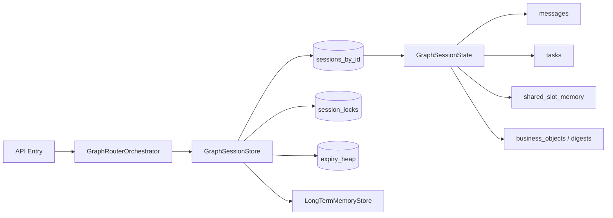
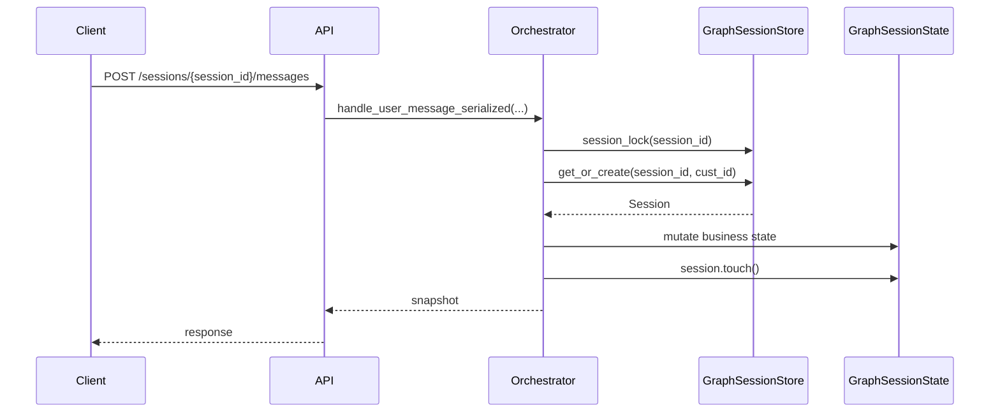
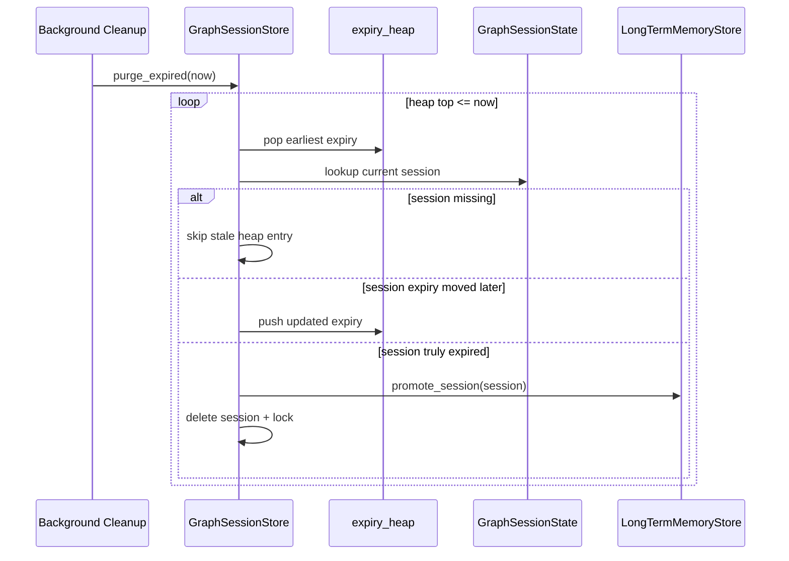
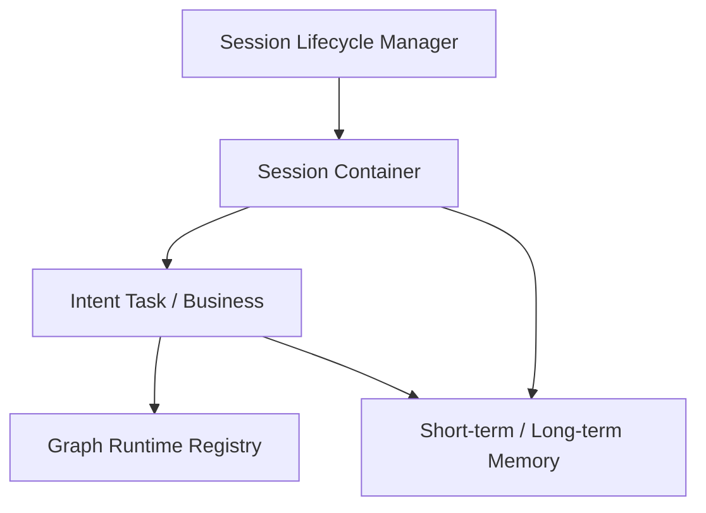

# router-service Session Store 浅层优化设计 v0.2

## 1. 目标

本轮只做 `session_store` 的浅层优化，不改业务状态机、不改意图识别/提槽逻辑、不改 API 契约，先解决当前实现里最明显的运行时问题：

- session 过期清理依赖全表扫描
- session 基数变大时，cleanup 会放大长尾
- 现有 session 生命周期元数据与业务状态耦合较紧，但本轮先不做大拆分

## 2. 范围与边界

本轮会做：

- 优化 `GraphSessionStore` 的过期索引与清理路径
- 保持 `create/get/get_or_create/session_lock/purge_expired` 的对外语义不变
- 保持 session 业务对象 `GraphSessionState` 的字段结构不变
- 保持过期后转长期记忆的业务效果不变

本轮不会做：

- 不引入新的 sidecar / Redis / 外部生命周期管理器
- 不改 graph / business / task 的业务状态流转
- 不改变 session 超时策略本身
- 不改 `/messages` 返回完整 snapshot 的 API 形态

## 3. 设计原则

### 3.1 保持业务效果不变

以下行为必须保持：

- 用户绑定 `session_id` 的使用方式不变
- session 空闲超时后仍然会被清理
- 清理前仍然会将 session 内容提升到长期记忆
- 多意图、多任务、公共槽位、挂起恢复等逻辑不受影响

### 3.2 只换存储索引，不换业务对象

`GraphSessionState` 仍然是当前轮次和业务上下文的承载对象，本轮不拆字段，只优化 store 内部如何追踪和清理它。

## 4. 浅层优化后的结构

### 4.1 核心变化

`GraphSessionStore` 内部由原来的：

- `dict(session_id -> session)`
- cleanup 时全表扫描

改为：

- `sessions_by_id`
- `session_locks`
- `expiry_heap(min-heap)`

其中：

- `sessions_by_id` 仍然是 session 的主存储
- `expiry_heap` 只负责快速找到“理论上最早到期”的 session
- `session_lock` 仍然按 `session_id` 串行化同一会话内的并发修改

## 5. 关键路径

### 5.1 请求路径

说明：

- 本轮不改变 `session.touch()` 的调用方式
- session 续期后的 deadline 不要求立刻重排所有索引
- 旧 deadline 在 cleanup 时通过懒校正处理

### 5.2 清理路径

说明：

- 旧实现是“每次 cleanup 都扫全量 session”
- 新实现是“只处理堆顶到期候选”
- 对于已经被续期的 session，cleanup 会做懒校正，而不是误删

## 6. 为什么这是低风险改动

### 6.1 不改外部接口

以下接口保持不变：

- `create(cust_id, session_id=None)`
- `get(session_id)`
- `get_or_create(session_id, cust_id)`
- `session_lock(session_id)`
- `purge_expired()`

### 6.2 不改 session 内容结构

以下业务字段不移动：

- `messages`
- `tasks`
- `shared_slot_memory`
- `business_objects`
- `business_memory_digests`
- `current_graph`
- `pending_graph`

### 6.3 不改清理语义

session 仍然是：

- 到期后才清理
- 清理前先做长期记忆提升

## 7. 当前已知限制

这次优化主要解决 cleanup 的时间复杂度问题，但不解决下面这些结构性问题：

### 7.1 session 本体仍然偏重

`GraphSessionState` 里仍然持有：

- 历史消息
- task 列表
- business objects
- graph runtime

所以 session 数量持续增长时，内存仍然会上涨。

### 7.2 graph 生命周期仍然绑定在 session 容器内

当前 graph 还是 session 下的重对象。按照后续规划，graph 应该可以早于 session 释放，但本轮不动这一层。

### 7.3 snapshot 返回体仍然偏大

`/messages` 当前仍然默认返回完整 session snapshot，这部分序列化成本仍在。

## 8. 下一阶段推荐拆分

本轮优化之后，后续推荐的结构应当是：

含义：

- `Session Container`：只保留用户会话级上下文
- `Lifecycle Manager`：只管空闲、续期、过期、清理
- `Intent Task / Business`：只管意图任务生命周期
- `Graph Runtime Registry`：只管活跃 graph 重对象
- `Memory`：只管 digest、共享槽位、长期记忆提升

## 9. 本轮验收口径

本轮以以下标准验收：

- 功能逻辑与业务效果不变
- 现有 session 相关回归通过
- `create_only` 高并发场景下的 `p99/max` 有改善
- 真实消息入口在高并发段至少不退化，或出现可解释的局部改善

