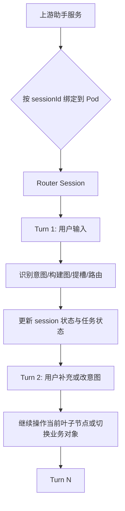
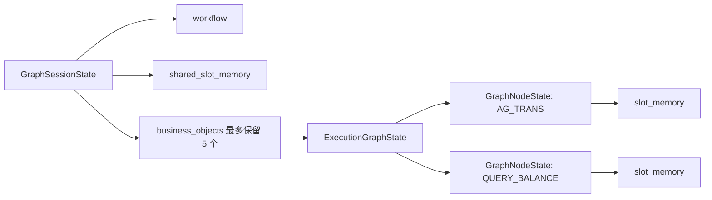
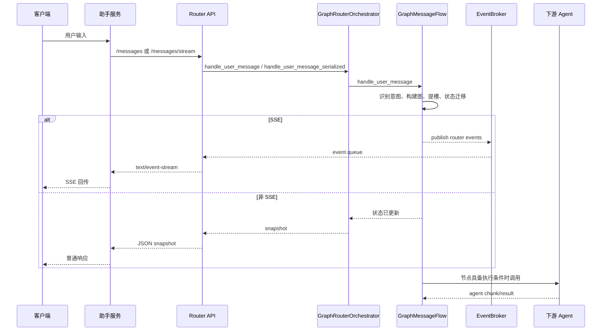
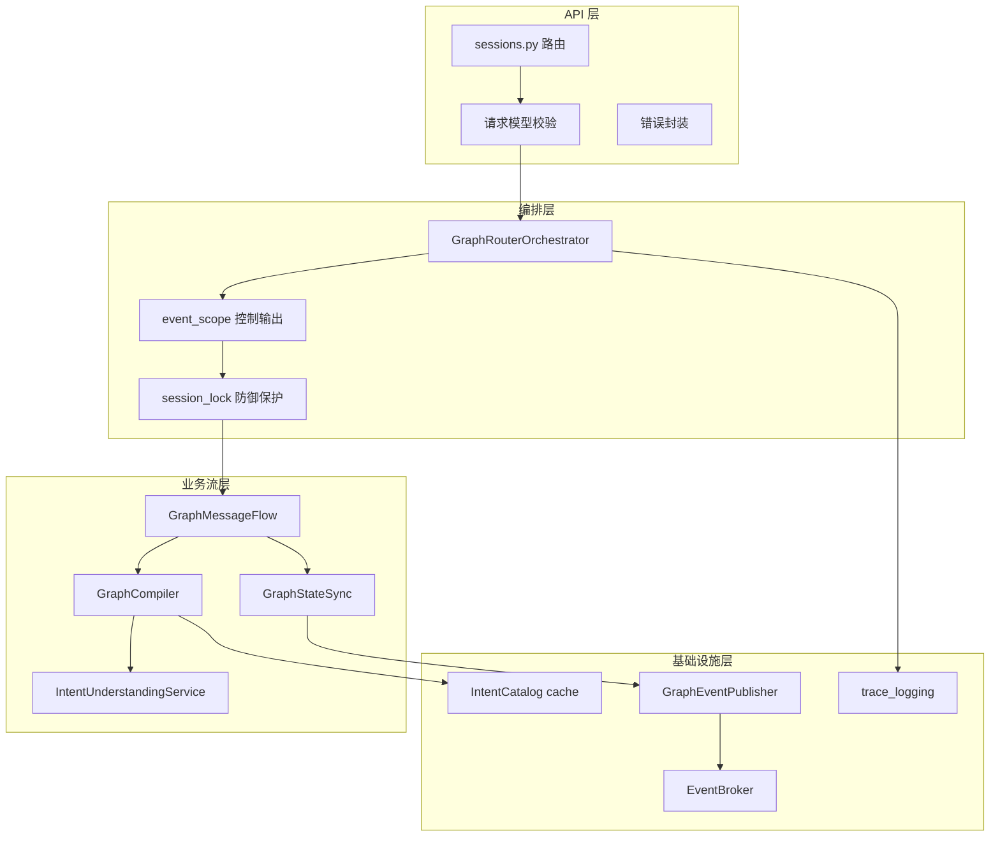
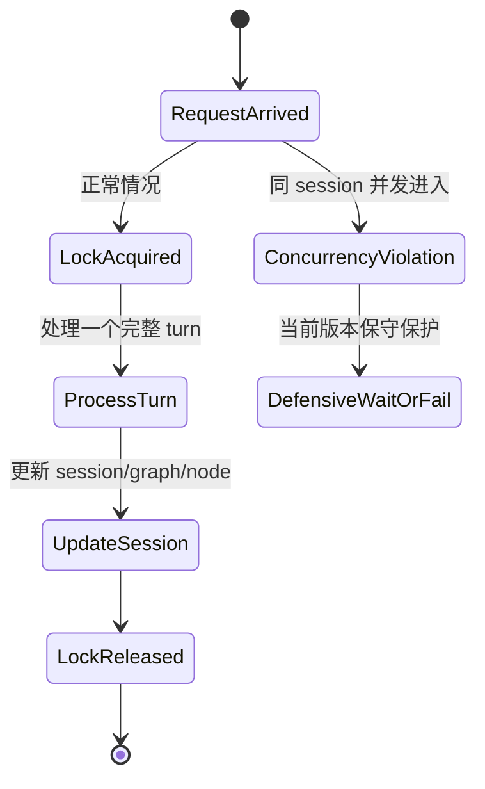

# Router Service Session Turn 与事件输出设计复盘 v0.2

## 背景

本轮优化不是为了单纯压测，而是重新校准 `router-service` 的业务边界：`sessionId` 表示一个用户在一段时间内的连续对话流，上游助手服务保证同一个 `sessionId` 不会并发进入 router。同一个用户可能有多意图、穿插意图、改意图，但这些都是同一条 session 流中的顺序 turn 和叶子任务操作，不是同 session 内的并发执行模型。

因此，性能优化必须服从这几个前提：

- SSE 与非 SSE 只影响输出通道，不影响业务编排逻辑。
- 响应安全链路不能为了压测绕开，API 仍应走 FastAPI/Pydantic 的请求校验、异常封装和返回编码路径。
- session 锁不是业务排队机制，只是防御式一致性保护。
- 日志、事件、序列化的优化要集中在基础设施层，避免在业务代码里散落大量压测分支。

## 当前结论

### 1. Session 是串行 Turn 流



同一个 `sessionId` 下，不应假设会有两个请求同时处理。多意图和穿插意图表现为：

- 一个 turn 里识别出多个叶子意图，形成一个图或多个业务对象。
- 后续 turn 对当前等待节点补槽。
- 用户表达新事项时，当前业务对象可以挂起，新业务对象进入焦点。
- 用户取消、确认、改意图时，本质上是当前 graph/node 的顺序状态迁移。

### 2. Graph/Node 是 Session 内的业务运行对象



当前设计下：

- `GraphSessionState` 是用户会话总容器。
- `ExecutionGraphState` 是一次业务规划或意图任务图。
- `GraphNodeState` 是叶子意图运行对象。
- 节点结束后，公共槽位可以进入 `shared_slot_memory`。
- graph 或业务对象可以早于 session 释放；session 结束时，后续 memory runtime 再做 dump。

这与后续 memory sidecar 规划一致：memory runtime 更适合管 session 开头和结尾，session 存活期间优先使用 router 进程内 cache 读写。

## SSE 与非 SSE

SSE 不是另一套业务逻辑。它只是把同一条 router turn 中产生的事件流式返回给上游。



代码边界：

- 普通接口：`POST /api/router/v2/sessions/{session_id}/messages`、`POST /api/router/v2/sessions/{session_id}/actions`。
- SSE 接口：`POST /api/router/v2/sessions/{session_id}/messages/stream`、`POST /api/router/v2/sessions/{session_id}/actions/stream`。
- 两类入口都进入 `GraphRouterOrchestrator` 和 `GraphMessageFlow`。
- `emit_events` 只控制 `GraphEventPublisher.event_scope()` 是否输出事件。
- 非 SSE 不构造/发布 SSE payload，但不跳过识别、编排、提槽、状态迁移、agent 调用条件判断。

## 调用泳道



## Session 锁定位

当前 `session_store.session_lock(session_id)` 的定位是防御式保护，而不是预期中的业务排队能力。



设计判断：

- 正常生产路径下，同一个 `sessionId` 不会并发进入，因此锁不应成为吞吐瓶颈。
- 当前保留 session 级锁，是为了防御测试、异常重试或上游契约尚未完全落地时的状态一致性风险。
- 后续如果上游契约稳定，可以考虑把同 session 并发视为协议违例，返回 `409 Conflict` 或等价业务错误，而不是长时间等待。

## 响应校验与性能边界

本轮不采用“直接返回裸 `ORJSONResponse` 绕开 API 处理”的方式做性能优化。理由：

- 生产上线前需要安全流水线、请求模型校验、错误封装和响应结构检查。
- 性能问题应该优先从业务对象拷贝、事件构造、日志开销、catalog 查询、LLM I/O、agent I/O 等边界处理。
- 压测脚本中的 `trust_env=False` 是测量修正，避免本机代理污染，不改变服务业务行为。

当前保留的优化方向：

- `trace_logging` 集中判断日志级别，避免 INFO/DEBUG 关闭时还构造 trace payload。
- `GraphEventPublisher.event_scope()` 集中控制事件输出，非 SSE 请求不构造 SSE payload。
- `EventBroker.publish()` 在无订阅者时直接返回，不创建无用队列。
- session snapshot 响应使用显式 Pydantic response model，避免裸 dict 进入通用 `jsonable_encoder` 的深度递归路径。
- intent catalog 使用只读 mapping 与局部 cache，减少每次 turn 的重复 dict 构造。
- 性能测试 fake LLM 只替代 LLM I/O，不跳过 graph、slot、session、router-only 等业务路径。
- 本地 debug server 默认关闭 uvicorn access log，需要排查 HTTP 明细时再显式开启。

## 待办

- 基于上游助手服务契约，评估是否将同 session 并发从锁等待调整为协议违例错误。
- 后续 memory runtime 实现时，保持“session 开始加载长期记忆、session 存活期本地 cache、session 结束 dump”的边界。
- 单 Pod 多 worker 方案需要基于进程内 session cache 归属来设计，不能让同一个 `sessionId` 在多个 worker 内漂移。
- 压测报告需分别标注 fake LLM、真实 LLM、SSE、非 SSE、router_only、agent barrier 等模式，避免把测试模式结论混为生产能力。

## 本轮验证

功能回归：

- `pytest backend/tests -q`
- 结果：`238 passed, 4 skipped`

短阶梯定位：

| flow_mode | 并发 | RPS | p99 | max | 成功率 | 说明 |
| --- | ---: | ---: | ---: | ---: | ---: | --- |
| `create_then_message` | 20 | 397.17 | 198.89ms | 371.70ms | 100% | 每轮两次 HTTP 串行：先建 session，再发 message |
| `create_then_message` | 60 | 347.63 | 1134.23ms | 2627.57ms | 100% | 更像接口组合压测，不代表单次用户 turn |
| `message_auto_create` | 20 | 788.69 | 131.69ms | 249.55ms | 100% | 单 HTTP turn，缺 session 时自动创建 |
| `message_auto_create` | 60 | 744.26 | 737.47ms | 1482.78ms | 100% | 业务 turn 路径已能支撑 60 并发 |

长阶梯基准：

测试命令等价于：

```bash
python scripts/run_router_perf_ladder.py \
  --base-url http://127.0.0.1:8012 \
  --concurrency-steps 10,20,30,40,50,60,70 \
  --duration-seconds 60 \
  --timeout-seconds 30 \
  --execution-mode router_only \
  --content 给小明转500元 \
  --flow-mode message_auto_create
```

| 并发 | RPS | p50 | p95 | p99 | max | 成功率 |
| ---: | ---: | ---: | ---: | ---: | ---: | ---: |
| 10 | 1697.11 | 3.20ms | 20.70ms | 48.23ms | 254.70ms | 100% |
| 20 | 1270.57 | 8.01ms | 52.46ms | 89.59ms | 352.83ms | 100% |
| 30 | 1179.52 | 14.93ms | 78.55ms | 144.03ms | 950.90ms | 100% |
| 40 | 1162.26 | 21.77ms | 101.72ms | 180.41ms | 958.23ms | 100% |
| 50 | 955.87 | 32.06ms | 156.26ms | 323.79ms | 1591.47ms | 100% |
| 60 | 1094.38 | 37.17ms | 155.29ms | 248.85ms | 1599.20ms | 100% |
| 70 | 967.87 | 48.17ms | 211.45ms | 376.83ms | 2396.74ms | 100% |

长阶梯进程峰值：

- CPU：`88.6%`
- RSS：`2737.41MB`

RSS 需要单独解释：`message_auto_create` 在 7 分钟内创建了约 50 万个新 session，且当前 session TTL 是 30 分钟，压测期间不会自然释放，因此这是极端新 session 压测造成的内存累计，不等价于同一批用户稳定会话下的常驻内存。后续 memory runtime 和 session cleanup 策略落地后，需要补一轮“固定 session 池”和“session 到期清理”的内存专项测试。
