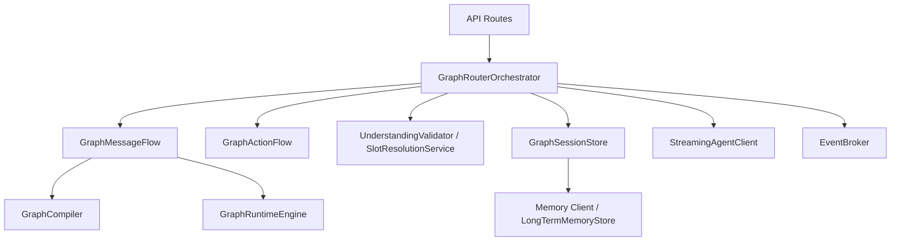
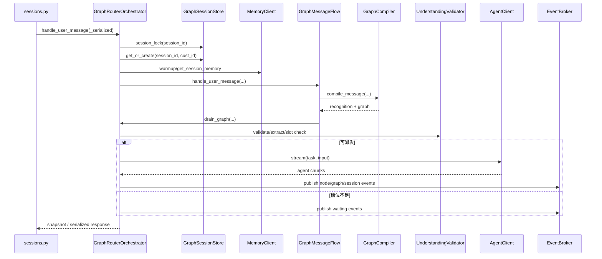
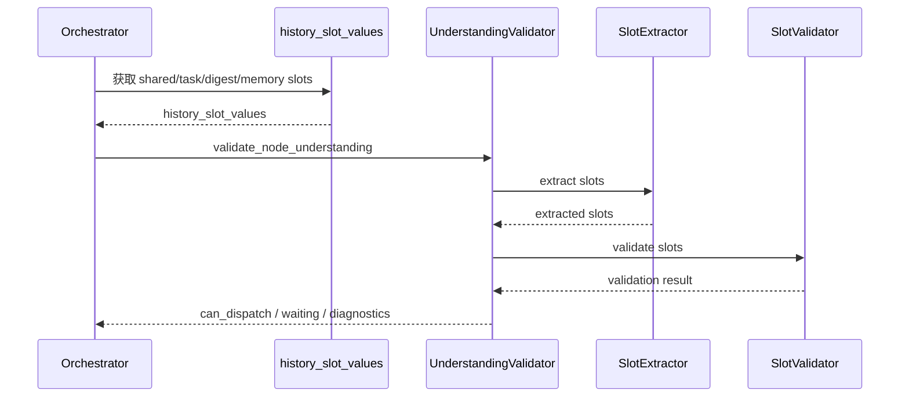
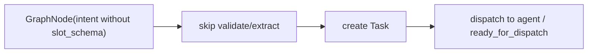
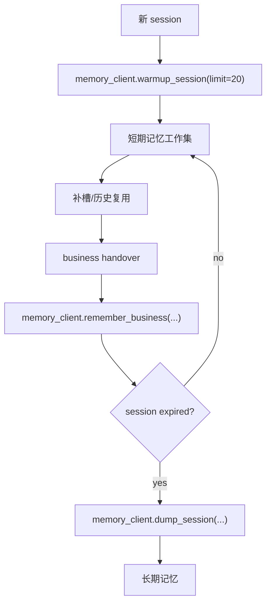
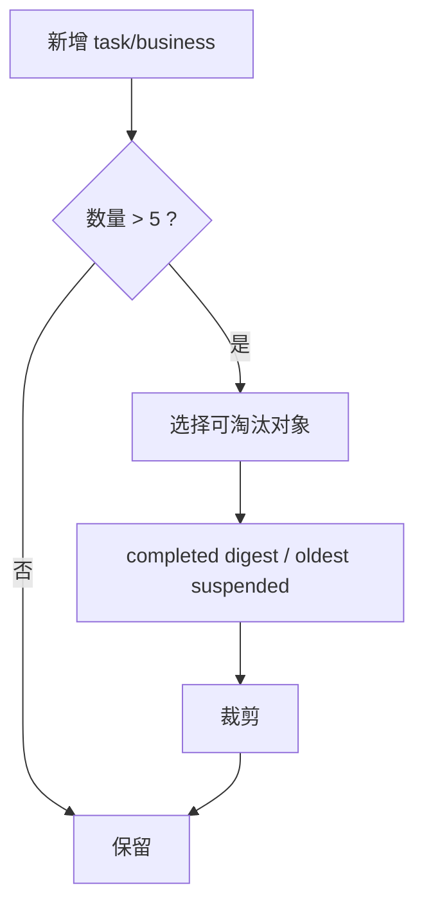

# Router Service 功能说明文档 v0.2

状态：设计对齐稿  
更新时间：2026-04-19  
适用分支：`test/v3-concurrency-test`

## 1. 文档目标

本文档以“功能和调用链”为中心，回答 4 个问题：

1. Router 对外提供哪些能力。
2. 一条消息是如何穿过 API、Session、识别、编图、补槽、派发的。
3. 记忆服务在什么位置读写。
4. v0.2 相比当前实现要新增或收敛哪些功能点。

## 2. 功能总览

v0.2 目标功能分为 10 类：

1. Session 管理
2. Message 处理
3. Action 处理
4. 多 Business 编排
5. Router 侧槽位提取与校验
6. 记忆读写闭环
7. 无槽位意图直达派发
8. SSE 事件推送
9. 过期清理与长期记忆 dump
10. 多进程 session 绑定约束

## 3. 对外接口

### 3.1 Session 接口

1. `POST /api/router/sessions`
2. `POST /api/router/v2/sessions`
3. `GET /api/router/sessions/{session_id}`
4. `GET /api/router/v2/sessions/{session_id}`

### 3.2 Message 接口

1. `POST /api/router/sessions/{session_id}/messages`
2. `POST /api/router/v2/sessions/{session_id}/messages`
3. `POST /api/router/sessions/{session_id}/messages/stream`
4. `POST /api/router/v2/sessions/{session_id}/messages/stream`

### 3.3 Action 接口

1. `POST /api/router/sessions/{session_id}/actions`
2. `POST /api/router/v2/sessions/{session_id}/actions`
3. `POST /api/router/sessions/{session_id}/actions/stream`
4. `POST /api/router/v2/sessions/{session_id}/actions/stream`

### 3.4 SSE 接口

1. `GET /api/router/sessions/{session_id}/events`
2. `GET /api/router/v2/sessions/{session_id}/events`

## 4. 功能模块图



## 5. 启动装配功能

### 5.1 当前装配链

```text
FastAPI app
  -> get_settings()
  -> build_router_runtime()
      -> GraphSessionStore
      -> EventBroker
      -> JsonLLMClient / FastPerfLLMClient
      -> RepositoryIntentCatalog
      -> Recognizer / Builder / Planner
      -> SlotExtractor / SlotValidator / UnderstandingValidator
      -> GraphRouterOrchestrator
```

### 5.2 v0.2 装配增量

需要新增以下装配能力：

1. `memory_recall_limit=20`
2. `session_max_tasks=5`
3. `session_max_businesses=5`
4. `memory_client` 抽象，先兼容本地 `LongTermMemoryStore`
5. `no-slot direct dispatch` 开关内聚到 orchestrator config

## 6. Message 主调用链

### 6.1 总体调用图



### 6.2 入口预处理

Message 主链前必须完成 6 步：

1. 获取 session 级锁。
2. `get_or_create(session_id, cust_id)`。
3. 如果 session 首次创建，则从长期记忆 warmup。
4. 恢复可恢复的挂起 business。
5. 当前用户消息写入 transcript。
6. 按 `executionMode` 设置 `router_only` 语义。

## 7. 详细分支说明

### 7.1 分支一：自由对话消息

调用关系：

```text
handle_user_message
  -> GraphMessageFlow.handle_user_message
  -> _handle_free_dialog_message
  -> GraphCompiler.compile_message
  -> attach_business(graph)
  -> drain_graph
```

说明：

1. 用于普通自然语言输入。
2. 先识别，再建图，再进入执行推进。

### 7.2 分支二：等待补槽消息

调用关系：

```text
handle_user_message
  -> GraphMessageFlow.handle_user_message
  -> interpret_waiting_node_turn
  -> _resume_waiting_node
  -> drain_graph
```

说明：

1. 当前 graph 上已有 waiting node。
2. Router 把当前消息当作补槽输入，不重新创建新 graph。
3. 会优先复用短期记忆中的公共槽位。

### 7.3 分支三：待确认图消息

调用关系：

```text
handle_user_message
  -> GraphMessageFlow.handle_user_message
  -> interpret_pending_graph_turn
  -> confirm_graph / cancel_graph / switch
  -> activate_graph
  -> drain_graph
```

说明：

1. graph 处于 `WAITING_CONFIRMATION`。
2. 用户的确认/取消/改写都会先经过 turn interpreter。

### 7.4 分支四：guided selection / recommendation

调用关系：

```text
handle_user_message
  -> GraphMessageFlow.handle_user_message
  -> build_guided_selection_graph / recommendation_router.decide
  -> attach_business(graph)
  -> drain_graph
```

### 7.5 分支五：穿插新意图

调用关系：

```text
handle_user_message
  -> detect intent switch / graph interrupt
  -> suspend_focus_business(reason)
  -> attach_business(new_graph)
  -> drain_graph(new_graph)
```

说明：

1. 旧业务被挂起。
2. 新业务成为 focus。
3. 旧业务在当前 focus/pending 清空后可恢复。

## 8. Graph 编译功能

### 8.1 识别与建图链

```mermaid
flowchart TD
    input["message + recent_messages + long_term_memory"] --> recognize["IntentUnderstandingService"]
    recognize --> recog["recognize_message / build_graph_from_message"]
    recog --> matches["primary matches"]
    matches --> plan{"use heavy planner?"}
    plan -->|yes| llmplanner["LLMIntentGraphPlanner"]
    plan -->|no| seq["SequentialIntentGraphPlanner"]
    llmplanner --> graph["ExecutionGraphState"]
    seq --> graph
    graph --> repair["repair_unexecutable_condition_edges"]
    repair --> prefill["apply_history_prefill_policy"]
```

### 8.2 v0.2 规划策略要求

1. `planning_policy=auto` 不再依赖 regex 复杂句判断。
2. 自动重规划只依据：
   - primary match 数量
   - intent catalog 中的 `graph_build_hints`
   - graph builder 显式结果

## 9. 槽位功能

### 9.1 有槽位意图处理链



### 9.2 无槽位意图处理链



说明：

1. 无槽位意图不走 LLM 补槽链。
2. 可直接生成 task。
3. `router_only` 下直接标记 `READY_FOR_DISPATCH`。

### 9.3 历史槽位来源

v0.2 的历史槽位来源顺序：

1. `session.shared_slot_memory`
2. 仍在运行中的 `session.tasks[].slot_memory`
3. `business_memory_digests[].slot_memory`
4. memory sidecar 返回的 session 短期记忆
5. warmup 后注入的长期记忆工作集

## 10. 记忆功能

### 10.1 当前读写点

现有代码里的关键读写点如下：

```text
_build_session_context()
  -> long_term_memory.recall(cust_id)

GraphSessionStore.get_or_create()
  -> session expired 时 promote_session()

GraphSessionStore.purge_expired()
  -> promote_session()

_finalize_handover_business_with()
  -> session.finalize_business()
```

### 10.2 v0.2 读写闭环



### 10.3 业务 handover 功能定义

handover 发生时需要完成 4 件事：

1. 生成 `BusinessMemoryDigest`
2. 合并 `shared_slot_memory`
3. 移除与该业务相关的 task 和 live business object
4. 将 digest 和公共槽位写入 memory sidecar

## 11. Action 功能

### 11.1 `confirm_graph`

调用关系：

```text
POST /actions
  -> GraphActionFlow.handle_action
  -> confirm_graph
  -> activate_graph
  -> drain_graph
```

### 11.2 `cancel_graph`

调用关系：

```text
POST /actions
  -> GraphActionFlow.handle_action
  -> cancel_current_graph / cancel_pending_graph
  -> cancel downstream tasks
  -> publish graph.cancelled
```

### 11.3 `cancel_node`

调用关系：

```text
POST /actions
  -> GraphActionFlow.handle_action
  -> find waiting/running node
  -> agent_client.cancel(task_id)
  -> publish node.cancelled
```

## 12. Session 上限功能

### 12.1 控制点

v0.2 需要在两个位置做上限控制：

1. `session.attach_business(...)` 后检查 business 数量。
2. `session.tasks.append(task)` 后检查 task 数量。

### 12.2 裁剪规则



约束：

1. 当前 focus business 不裁剪。
2. pending business 不裁剪。
3. 与当前 graph node 绑定的运行中 task 不裁剪。

## 13. 多进程绑定功能

### 13.1 功能定义

Router 在多进程或多 Pod 下需要具备以下保证：

1. 同一 `session_id` 的写操作不能并发破坏状态。
2. session 过期和 dump 不应重复执行。

### 13.2 v0.2 方案

当前阶段的功能要求是：

1. 通过 Ingress/Service Mesh 对 `session_id` 做 sticky 路由。
2. Router 内仍保留本地 `session_lock`。
3. sidecar 负责记忆持久化，但不接管 graph runtime。

## 14. 与当前代码的改造点

| 模块 | 当前情况 | v0.2 调整 |
| --- | --- | --- |
| `core/graph/compiler.py` | auto planning 依赖 regex | 改成结构化判断 |
| `core/support/perf_llm_client.py` | regex 抽槽 + 默认猜值 | 改成固定夹具返回 |
| `core/shared/graph_domain.py` | session 无任务/业务上限 | 增加 `enforce_*_limit` |
| `core/graph/orchestrator.py` | 无槽位也走校验链 | 增加 no-slot short path |
| `core/graph/session_store.py` | recall 默认 10，进程内 long-term only | 提升召回到 20，并预留 memory client 接口 |

## 15. 输出物

v0.2 完成后，对外应有以下产物：

1. 更新后的需求、功能、架构、用户故事、用户旅程文档。
2. 新增场景用例文档。
3. 代码层面的无 regex/fallback、session 限流、无槽位直达优化。
