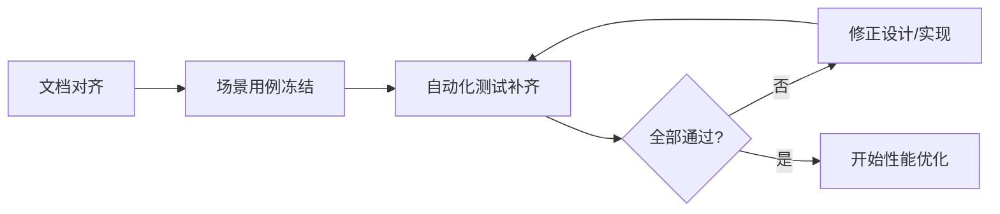

# Router Service 场景用例文档 v0.2

状态：测试基线稿  
更新时间：2026-04-19  
适用分支：`test/v3-concurrency-test`

## 1. 文档目标

本文档用于把需求、用户旅程和功能设计落成可执行场景。完成标准是：

1. 先明确场景。
2. 核心场景具备自动化测试。
3. 场景测试全部通过后，再进行性能优化。

## 2. 场景总览矩阵

## 3. 场景清单

### S01 新 session 预热长期记忆

目标：

1. 新 session 启动时召回最近 20 条长期记忆。
2. 召回结果进入短期工作集。

前置条件：

1. 用户存在历史长期记忆。

期望：

1. `warmup_session(limit=20)` 被调用。
2. 后续识别和补槽可读到这些记忆。

### S02 有槽位意图补槽

目标：

1. 有 slot schema 的意图走 Router 补槽。
2. 缺槽时进入 waiting。

期望：

1. 当前轮未补齐时 graph/node 进入 waiting。
2. 补齐后可创建 task 并派发。

### S03 历史公共槽位复用

目标：

1. 当前意图可复用历史公共槽位。

前置条件：

1. session 短期记忆中已有 `shared_slot_memory`。

期望：

1. `history_slot_values` 能合并公共槽位。
2. 被复用槽位带有 history 来源。

### S04 无槽位意图直接路由

目标：

1. 无槽位意图不进入补槽验证慢路径。

期望：

1. 不调用 slot extraction/validation。
2. 直接生成 task 或 `READY_FOR_DISPATCH`。

### S05 多意图并存

目标：

1. 一个 session 内可存在多个 business object。

期望：

1. `workflow.focus/pending/suspended` 正确切换。
2. 当前 focus business 可和挂起业务并存。

### S06 穿插意图挂起与恢复

目标：

1. 用户中断当前业务后发起新意图。
2. 新业务结束后恢复旧业务。

期望：

1. 旧业务进入 suspended。
2. 新业务 handover 后能恢复旧业务。

### S07 business handover 写短期记忆

目标：

1. `finalize_business` 后业务摘要和共享槽位进入短期记忆。

期望：

1. live task 被清理。
2. `shared_slot_memory` 更新。
3. `business_memory_digests` 追加。

### S08 session 过期 dump 长期记忆

目标：

1. session 过期清理前把短期记忆写入长期记忆。

期望：

1. `purge_expired` 或 `get_or_create` 发现过期时会 promote/dump。
2. 新 session 可重新召回。

### S09 session/task 上限保护

目标：

1. session 最多保留 5 个任务和 5 个活跃/挂起业务。

期望：

1. 新增时自动裁剪可淘汰对象。
2. 当前 focus/pending 不被误删。

### S10 无 regex / 无默认猜值

目标：

1. runtime 主链去掉 regex 业务判断和默认猜值。

期望：

1. `GraphCompiler` 的 auto planning 不再使用 regex。
2. `FastPerfLLMClient` 不再通过 regex 抽槽或猜值。

### S11 router_only ready_for_dispatch

目标：

1. router_only 下有能力在 Router 侧停住，不调 agent。

期望：

1. 图状态为 `ready_for_dispatch`。
2. 业务 handover 后仍能沉淀记忆。

### S12 60 并发性能优化后验证

目标：

1. 在核心场景都通过后，再验证性能优化效果。

期望：

1. 去掉无效 LLM 路径。
2. p99 较当前基线下降。
3. 不以牺牲场景正确性换性能。

## 4. 自动化测试映射

| 场景 | 自动化测试方向 |
| --- | --- |
| S01 | session/memory warmup test |
| S02 | graph/orchestrator waiting -> resume test |
| S03 | history slot merge test |
| S04 | no-slot direct dispatch test |
| S05 | multi-business workflow test |
| S06 | suspend + restore test |
| S07 | finalize_business / router_only handover test |
| S08 | session_store expiry promote test |
| S09 | task/business limit test |
| S10 | code path no-regex/no-default-guess test |
| S11 | router_only ready_for_dispatch test |
| S12 | perf case / benchmark verification |

## 5. 执行顺序

## 6. 本轮必须通过的最小集

P0 场景如下：

1. S03 历史公共槽位复用
2. S04 无槽位意图直接路由
3. S06 穿插意图挂起与恢复
4. S07 business handover 写短期记忆
5. S08 session 过期 dump 长期记忆
6. S09 session/task 上限保护
7. S10 无 regex / 无默认猜值
8. S11 router_only ready_for_dispatch

只有这些核心场景全部通过，才进入 S12 性能优化阶段。
