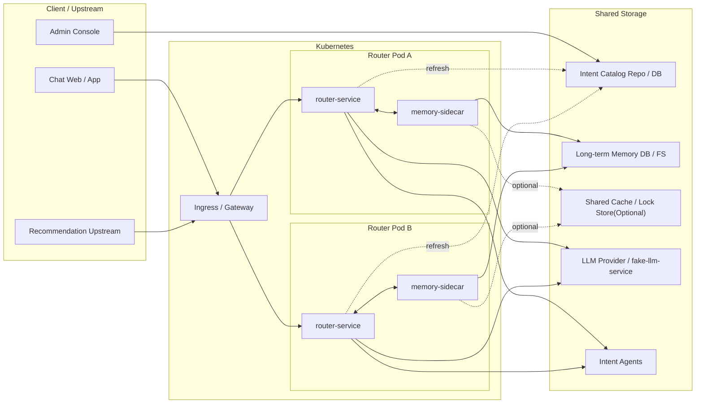
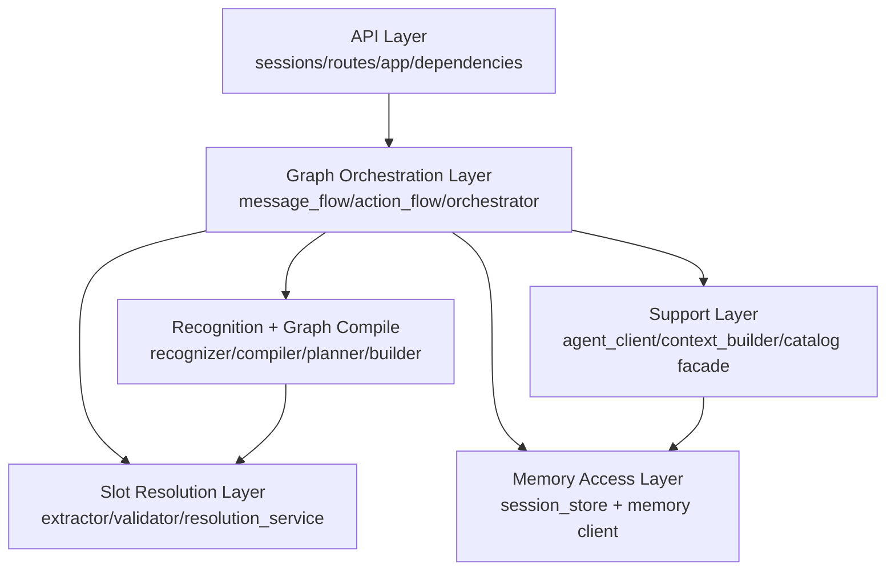
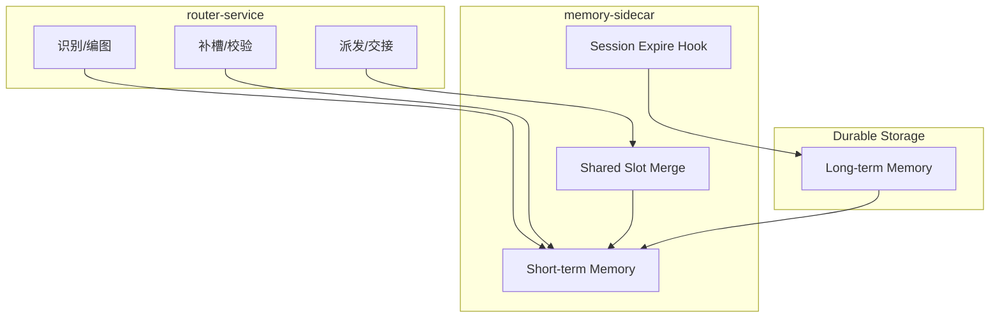
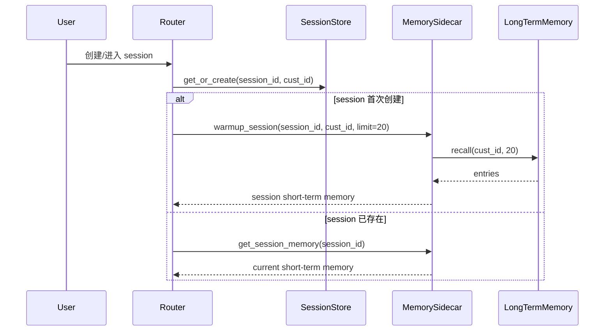
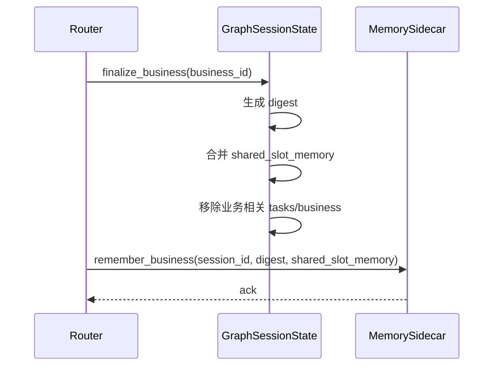
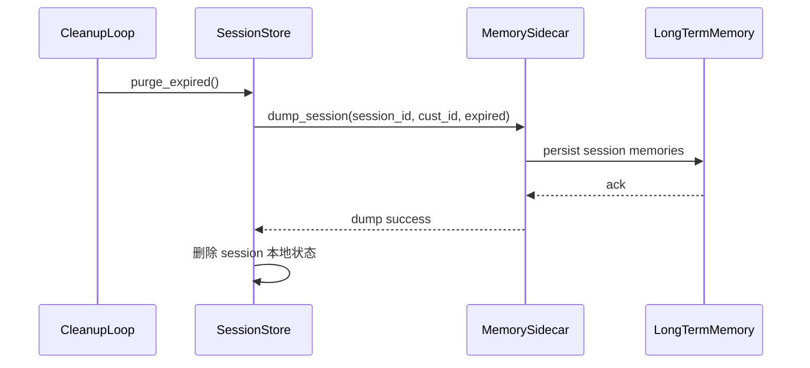
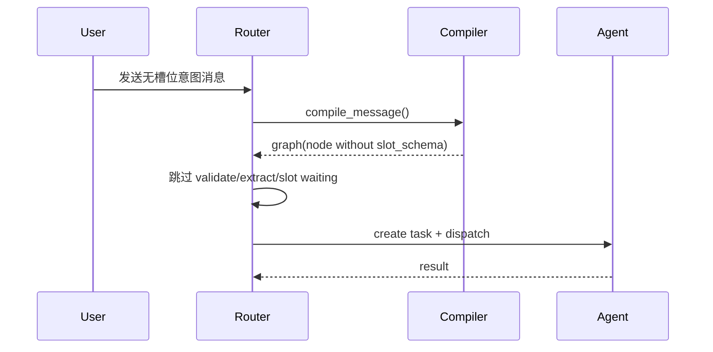
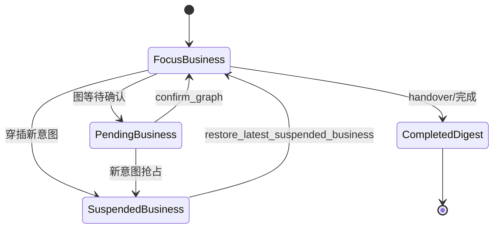

# Router Service 架构设计文档 v0.2

状态：设计对齐稿  
更新时间：2026-04-19  
适用分支：`test/v3-concurrency-test`

## 1. 文档目标

本文档从架构视角定义 `router-service` v0.2 的演进方向，重点回答：

1. Router、Memory Sidecar、Agent、长期记忆的边界是什么。
2. Session、Business、Task 的运行时模型如何稳定。
3. 多进程和 k8s 下如何保证 session 一致性。
4. 哪些现有实现要保留，哪些要收敛或移除。

## 2. 架构原则

v0.2 采用以下原则：

1. Router 负责意图控制，不负责业务兜底猜测。
2. Session 是运行容器，Business 是编排单元，Task 是执行单元。
3. 记忆分层，短期和长期职责分离。
4. 同一 session 的并发修改必须串行化。
5. 无槽位意图走最短路径。
6. 所有“猜一个”的 regex/fallback 逻辑从 runtime 主链中移除。

## 3. 总体架构

### 3.1 目标部署拓扑



### 3.2 边界划分

| 组件 | 责任 | 不负责 |
| --- | --- | --- |
| `router-service` | 意图识别、graph 编排、Router 侧补槽、状态推进、Agent 调度 | 长期记忆持久化细节、业务猜值 |
| `memory-sidecar` | 短期记忆缓存、session dump、长期记忆读写代理 | 意图识别、graph 编排 |
| `intent-agent` | 单意图业务执行 | 跨意图路由与 session 编排 |
| `admin-service` | 目录治理、配置管理 | 运行时路由 |

## 4. 逻辑架构

### 4.1 分层图



### 4.2 核心运行时对象

```mermaid
classDiagram
    class GraphSessionState {
        +session_id
        +cust_id
        +messages[]
        +tasks[]
        +shared_slot_memory{}
        +business_memory_digests[]
        +business_objects[]
        +workflow
        +touch()
        +finalize_business()
    }

    class SessionWorkflowState {
        +focus_business_id
        +pending_business_id
        +suspended_business_ids[]
        +completed_business_ids[]
    }

    class BusinessObjectState {
        +business_id
        +graph
        +router_only_mode
        +status
        +ishandover
    }

    class ExecutionGraphState {
        +graph_id
        +status
        +nodes[]
        +edges[]
        +actions[]
    }

    class GraphNodeState {
        +node_id
        +intent_code
        +status
        +slot_memory{}
        +task_id
    }

    class Task {
        +task_id
        +intent_code
        +status
        +slot_memory{}
    }

    GraphSessionState --> SessionWorkflowState
    GraphSessionState --> BusinessObjectState
    BusinessObjectState --> ExecutionGraphState
    ExecutionGraphState --> GraphNodeState
    GraphNodeState --> Task
```

## 5. Memory Sidecar 架构

### 5.1 设计目标

Memory Sidecar 的目标是把以下职责从 Router 进程中抽离：

1. 短期记忆缓存。
2. 业务摘要与公共槽位持久化。
3. session 过期时向长期记忆 dump。
4. 新 session 启动时召回长期记忆。

### 5.2 Memory 分层



### 5.3 记忆对象模型

| 对象 | 粒度 | 说明 |
| --- | --- | --- |
| `session_memory` | session | 当前 session 的短期工作集 |
| `shared_slot_memory` | session | 公共槽位键值和来源元数据 |
| `business_digest` | business | handover 后保留的业务摘要 |
| `long_term_memory_entry` | cust | 可跨 session 回忆的长期事实 |

### 5.4 Sidecar 关键接口

建议 Sidecar 暴露 5 组接口：

1. `warmup_session(session_id, cust_id, limit=20)`
2. `get_session_memory(session_id)`
3. `remember_business(session_id, business_digest, shared_slot_memory)`
4. `upsert_shared_slots(session_id, slot_bindings)`
5. `dump_session(session_id, cust_id, reason=expired)`

## 6. 关键时序

### 6.1 新 Session 冷启动时序



### 6.2 单业务 handover 时序



### 6.3 Session 过期时序



### 6.4 无槽位意图最短路径



## 7. Session / Business / Task 生命周期

### 7.1 状态关系



### 7.2 上限策略

v0.2 约束如下：

1. `tasks` 最多保留 5 个运行态任务。
2. `business_objects` 最多保留 5 个活跃/挂起业务。
3. `completed_business_digests` 可单独保留更长，但 session 内工作集仍需裁剪。

淘汰顺序：

1. 已完成并已摘要化的业务优先移出工作集。
2. 最老挂起业务次之。
3. 当前 focus business 和 pending business 不允许被自动淘汰。

## 8. 多进程与一致性设计

### 8.1 问题

当前 `GraphSessionStore` 使用进程内字典和 `asyncio.Lock`。这只对单进程有效。多 worker / 多 Pod 下会出现：

1. 同一 session 被不同实例同时修改。
2. 某个 Pod 的内存 session 对其他 Pod 不可见。
3. 过期清理与长期记忆 dump 可能重复执行。

### 8.2 推荐方案

优先采用两阶段方案：

#### 方案 A：Session Sticky

1. Ingress 基于 `session_id` 做一致性哈希。
2. 同一 session 固定落到同一 Pod。
3. Router 内仍保留本地 session lock。

优点：

1. 改造小。
2. 对现有 `GraphSessionStore` 侵入最小。

缺点：

1. Pod 漂移或扩缩容时 session 迁移复杂。
2. Sidecar 仍需要持久化关键记忆。

#### 方案 B：外置状态

1. Session store 外置到 Redis / DB。
2. 分布式锁替代 `asyncio.Lock`。
3. Memory 和 Session 状态都由共享存储承载。

优点：

1. Router 近似无状态。
2. 更适合水平扩容。

缺点：

1. 改造大。
2. 读写延迟和事务边界更复杂。

### 8.3 v0.2 结论

v0.2 先按以下顺序推进：

1. Router 运行时先做 session sticky 约束。
2. 记忆侧先抽象 sidecar client。
3. 后续再推进 session store 外置。

## 9. 当前代码与目标架构差距

| 领域 | 当前实现 | v0.2 目标 |
| --- | --- | --- |
| session store | 进程内字典 | 保留兼容实现，但为 sidecar/外置状态预留接口 |
| long-term memory | 进程内 `LongTermMemoryStore` | 作为 sidecar 的本地适配实现或 fallback adapter |
| graph auto planning | 含 regex 复杂句判断 | 基于结构化匹配数量和 catalog hints |
| perf llm path | 含 regex 和默认猜值 | 固定夹具/结构化返回，不做猜值 |
| no-slot intent | 仍走完整理解校验链 | 直接 dispatch short path |
| task/business limit | 未封顶 | session 内强制上限 5 |

## 10. 演进步骤

### 10.1 第一步

1. 补齐文档。
2. 明确调用关系、时序和场景。
3. 明确禁止 regex/fallback。

### 10.2 第二步

1. 增加 session/task/business 上限控制。
2. 无槽位意图直接派发。
3. 去掉 runtime regex。
4. 调整长期记忆召回条数到 20。

### 10.3 第三步

1. 引入 memory client 抽象。
2. 将 `GraphSessionStore` 与记忆写入点解耦。
3. 为 sidecar 接入做准备。

## 11. 风险

1. 如果没有 sticky session，多 worker 下本地锁无效。
2. 如果记忆结构仍是字符串拼接，后续 sidecar 接口会有二次迁移成本。
3. 如果无槽位短路判断不严谨，可能误跳过必要确认。
4. 如果只去掉 regex 但没补足结构化依据，某些旧场景识别率会下降。
