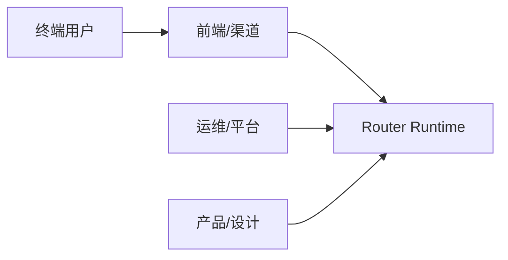
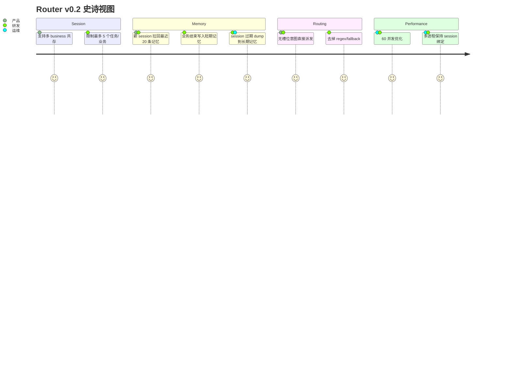
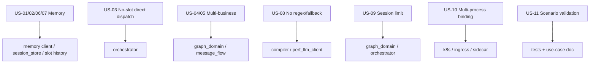

# Router Service 用户故事文档 v0.2

状态：设计对齐稿  
更新时间：2026-04-19  
适用分支：`test/v3-concurrency-test`

## 1. 文档目标

本文档将 Router v0.2 的需求转成用户故事，用于产品、研发、测试统一验收口径。

## 2. 角色定义

角色说明：

1. 终端用户：发起自然语言请求、补槽、确认、取消。
2. 前端/渠道：调用 session/message/action/SSE 接口。
3. 产品/设计：定义多意图、补槽、记忆复用的交互。
4. 运维/平台：负责 k8s、sidecar、session sticky 和性能目标。

## 3. 史诗视图

## 4. 用户故事列表

### US-01 新 Session 记忆预热

作为终端用户，  
我希望在新 session 开始时 Router 能回忆我最近的历史事实，  
从而减少重复输入。

验收标准：

1. 新 session 创建后会拉取最近 20 条长期记忆。
2. 这些记忆会进入短期工作集，而不是每次直接扫长期库。
3. 历史记忆只作为补槽参考，不可伪造用户当前明确表达。

### US-02 公共槽位复用

作为终端用户，  
我希望已经提供过的公共槽位能被后续意图复用，  
从而避免重复填写卡号、收款人、账号等信息。

验收标准：

1. 已确认的公共槽位会写入短期记忆。
2. 后续补槽时 Router 可从短期记忆复用这些槽位。
3. 被复用的槽位必须带来源标识，便于解释和覆盖。

### US-03 无槽位意图直接执行

作为终端用户，  
我希望对不需要补槽的意图，Router 直接进入执行，  
从而缩短响应时间。

验收标准：

1. 当 `intent.slot_schema` 为空时，Router 不走补槽校验慢路径。
2. 该意图可直接进入 task 创建和派发。
3. `router_only` 模式下直接停在 `READY_FOR_DISPATCH`。

### US-04 多意图并存

作为终端用户，  
我希望在一个 session 里可以连续办理多个事项，  
从而不用为每个意图新开会话。

验收标准：

1. 一个 session 可创建多个 business object。
2. 系统能明确 focus、pending、suspended 的业务状态。
3. 新业务可抢占当前业务，旧业务可恢复。

### US-05 穿插意图恢复

作为终端用户，  
我希望在补槽过程中临时插入一个新需求后，  
还能回到原来的业务继续处理。

验收标准：

1. 插入新意图时当前业务可被挂起。
2. 新业务结束后可恢复最近挂起业务。
3. 恢复后保留之前的槽位和上下文状态。

### US-06 业务 handover 释放内存

作为平台研发，  
我希望业务结束后 Router 释放 live graph/task 内存，  
同时保留后续仍可复用的业务摘要和公共槽位。

验收标准：

1. `finalize_business` 后 live task 被清理。
2. 业务摘要会写入短期记忆。
3. 共享槽位会沉淀为 session 级共享事实。

### US-07 Session 过期转长期记忆

作为平台研发，  
我希望 session 过期时自动把短期记忆 dump 到长期记忆，  
从而形成完整记忆闭环。

验收标准：

1. 过期 session 被清理前会触发 dump。
2. dump 包含业务摘要、公共槽位和必要 turn 摘要。
3. 下一次新 session 能召回这些内容。

### US-08 无 regex / 无兜底

作为产品负责人，  
我希望 Router 不再通过正则和默认猜值决定业务行为，  
从而保证路由结果可解释、可治理。

验收标准：

1. runtime 主链中不再使用 regex 识别复杂图或抽槽。
2. perf/fake 路径也不做默认猜值。
3. 识别不到时显式进入 no-match、waiting 或 need-confirmation。

### US-09 Session 上限保护

作为平台研发，  
我希望一个 session 内的任务和业务对象有上限，  
从而避免内存膨胀和状态失控。

验收标准：

1. session 最多保留 5 个运行态任务。
2. session 最多保留 5 个活跃/挂起业务对象。
3. 超限时按规则裁剪，不影响当前焦点业务。

### US-10 多进程 Session 绑定

作为运维工程师，  
我希望多进程和多 Pod 部署时同一 session 能保持一致路由，  
从而避免状态竞争。

验收标准：

1. 平台层支持基于 `session_id` 的 sticky 路由。
2. 同一 session 的并发请求不会同时修改不同副本上的状态。
3. sidecar/后续外置状态方案与 sticky 方案兼容。

### US-11 场景测试先通过再优化

作为项目负责人，  
我希望所有场景用例先被明确、被测试、被跑通，  
然后再做性能优化，  
从而确保优化不会破坏业务闭环。

验收标准：

1. 文档中存在完整场景用例集。
2. 核心场景具备可执行测试。
3. 只有在场景测试通过后才进入性能优化阶段。

## 5. 故事与模块映射

## 6. 优先级

| 优先级 | 故事 |
| --- | --- |
| P0 | US-02, US-03, US-04, US-06, US-08, US-09, US-11 |
| P1 | US-01, US-05, US-07, US-10 |

## 7. 验收方式

每个故事都要通过以下三个层次验收：

1. 文档验收：需求、功能、架构、旅程、用例文档均已覆盖。
2. 自动化验收：核心场景测试可执行且通过。
3. 性能验收：场景通过后，再进行性能优化和验证。
