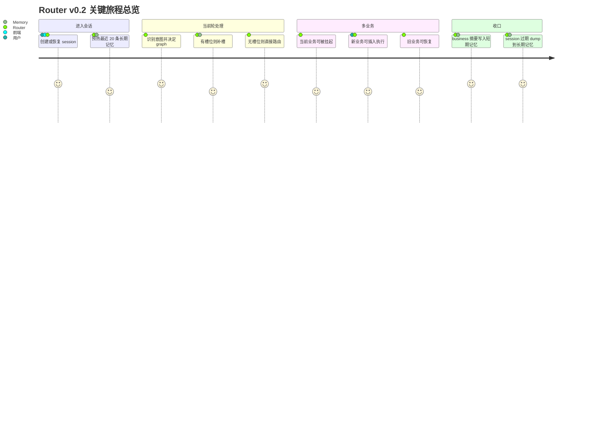
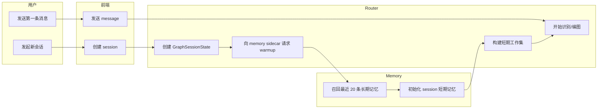
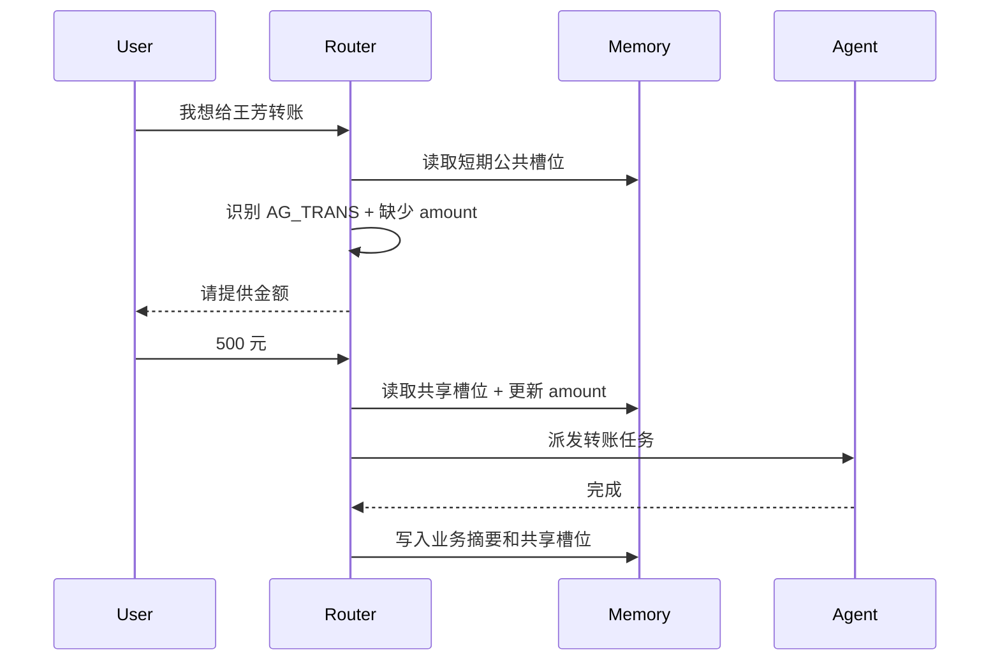
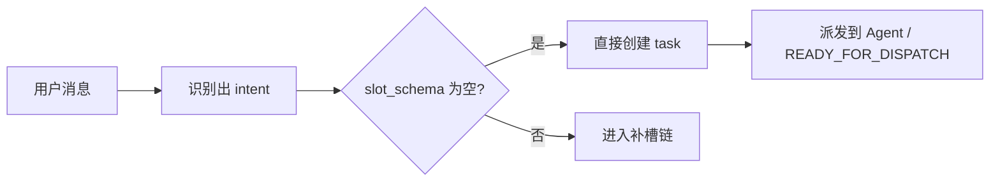
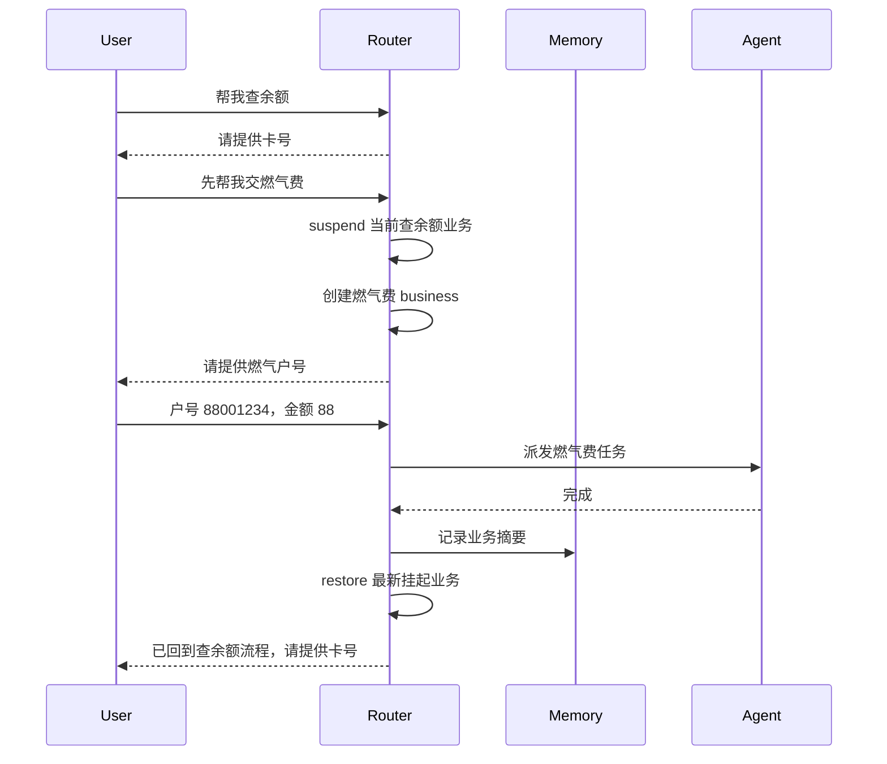
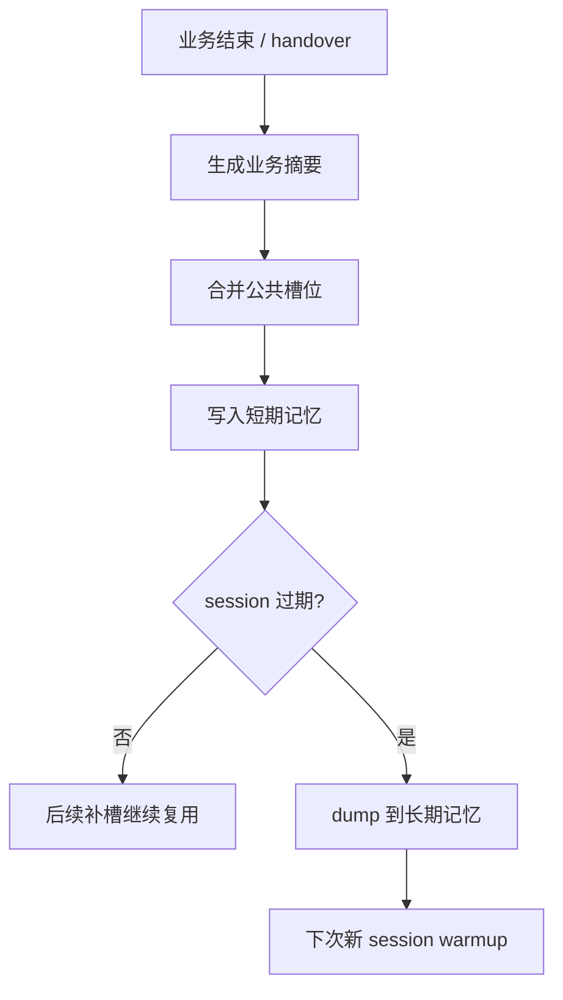
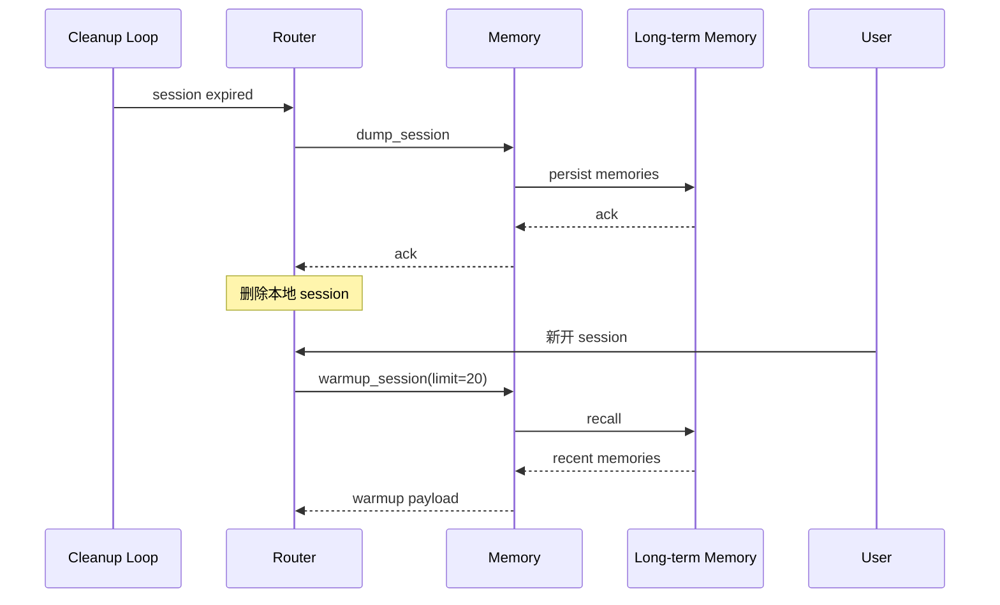
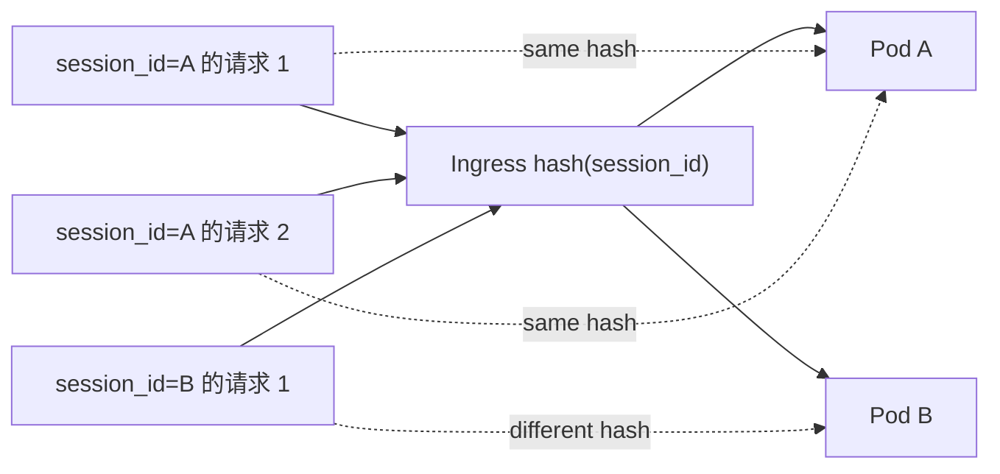
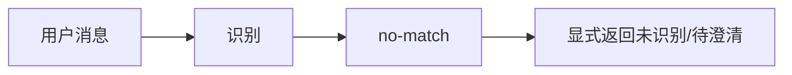
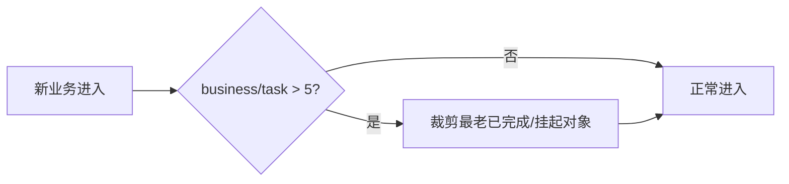

# Router Service 用户旅程文档 v0.2

状态：设计对齐稿  
更新时间：2026-04-19  
适用分支：`test/v3-concurrency-test`

## 1. 文档目标

本文档用旅程和泳道方式呈现 Router v0.2 的关键体验路径，避免只停留在文字描述。

## 2. 旅程总览

## 3. 旅程一：新 Session 启动并复用长期记忆

### 3.1 泳道图

### 3.2 关键体验点

1. 用户无需重新输入稳定事实。
2. 历史记忆只做辅助，不应覆盖当前明确表达。

## 4. 旅程二：有槽位意图，先补槽再执行

### 4.1 时序图

### 4.2 旅程节点

| 阶段 | 用户感知 | Router 动作 |
| --- | --- | --- |
| 首轮识别 | 识别到要转账 | 建图并判断缺槽 |
| 补槽追问 | 请求补充金额 | waiting node |
| 二轮补槽 | 补齐金额 | 历史槽位合并 |
| 派发执行 | 进入执行 | 创建 task 并 dispatch |
| 收口沉淀 | 结果可复用 | handover 写短期记忆 |

## 5. 旅程三：无槽位意图直接路由

### 5.1 最短路径图

### 5.2 关键要求

1. 用户不应感知额外补槽等待。
2. 响应时间应显著短于有槽位路径。

## 6. 旅程四：穿插意图与恢复

### 6.1 泳道图

### 6.2 关键体验点

1. 当前业务状态不能丢。
2. 新业务结束后能回到原业务。
3. session 内业务切换要明确。

## 7. 旅程五：业务结束后的记忆闭环

### 7.1 记忆闭环图

### 7.2 关键体验点

1. 用户已提供过的信息在后续能继续用。
2. Router 释放 live graph/task，但不丢可复用事实。

## 8. 旅程六：Session 过期与重新进入

### 8.1 时序图

## 9. 旅程七：多进程场景下的 session 绑定

### 9.1 平台旅程图

### 9.2 关键平台要求

1. 同一 session 尽量落同一 Pod。
2. session lock 只在 sticky 成立时才可靠。
3. Sidecar 记忆必须支持 Pod 重建后的恢复。

## 10. 失败旅程

### 10.1 无法识别

要求：

1. 不允许 regex 偷偷猜一个意图。
2. 不允许默认猜槽位值。

### 10.2 达到 session 上限

要求：

1. 当前焦点业务不能被自动裁掉。
2. 需要在日志和诊断里可见。

## 11. 旅程与测试映射

| 旅程 | 对应用例方向 |
| --- | --- |
| 新 session warmup | 长期记忆召回 20 条 |
| 有槽位补槽 | shared slot/history slot 复用 |
| 无槽位直达 | no-slot direct dispatch |
| 穿插意图恢复 | suspend + restore |
| 业务 handover | digest + shared slot persist |
| session 过期 | purge + dump |
| 多进程绑定 | sticky session 设计验证 |
