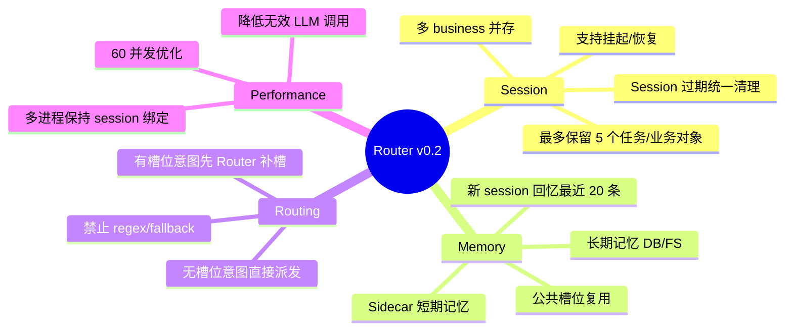
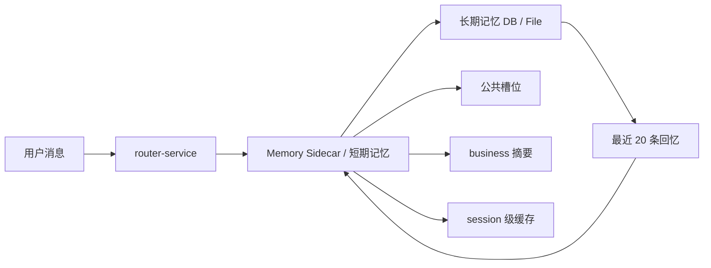
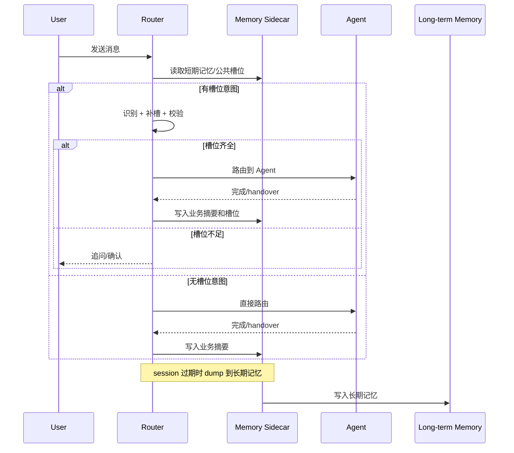
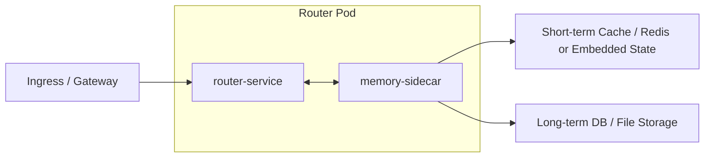

# Router Service 需求说明文档 v0.2

状态：设计对齐稿  
更新时间：2026-04-19  
适用分支：`test/v3-concurrency-test`

## 1. 文档目标

本文档用于对齐 `router-service` 下一阶段的目标边界。重点不是复述现状，而是明确以下问题：

1. Router 在多意图、多任务、穿插会话下到底负责什么。
2. 记忆能力如何形成短期记忆到长期记忆的闭环。
3. Session、Business、Task 的关系如何稳定落地。
4. 什么能力必须去掉，尤其是正则和兜底式推断。
5. 性能目标和多进程部署约束是什么。

## 2. 背景与问题

当前 `router-service` 已具备基础闭环：

1. 能识别意图并构建 graph。
2. 能在 Router 侧做部分槽位提取。
3. 能管理 waiting node、pending graph、router_only 等流程。
4. 能将 business handover 后压缩为 digest。

但当前仍有 5 类核心问题：

1. 记忆只有进程内 `session_store + long_term_memory_store`，不适合 k8s 多副本。
2. session 支持多 business，但生命周期、上限、恢复和淘汰策略不完整。
3. 仍存在基于正则和启发式兜底的路由/补槽逻辑，与目标架构冲突。
4. 无槽位意图没有走到“直接路由”这个最短路径。
5. 60 并发下 p99 接近 4s，说明调用链、状态存取和无效 LLM 路径仍可优化。

## 3. 目标定义

### 3.1 核心目标

本阶段目标有 6 个：

1. 为 Router 引入 sidecar 形态的记忆服务设计。
2. 建立 session 内多任务/多 business 的统一模型。
3. 明确短期记忆、长期记忆和公共槽位的读写闭环。
4. 去掉 runtime 中的 regex/fallback 式业务判断。
5. 在不破坏现有主链路的前提下优化延迟与吞吐。
6. 为后续需求、功能、设计和测试对齐提供统一基线。

### 3.2 非目标

本阶段不包含：

1. 直接把长期记忆接入最终生产数据库选型。
2. 直接引入真正的子智能体调度。
3. 重写整个 graph runtime。
4. 对所有 agent 协议做大改。

## 4. 需求总图

## 5. 业务需求

### 5.1 Session 与多业务对象

Router 必须支持一个 session 内存在多个意图任务，原因包括：

1. 多意图一轮进入。
2. 用户在 waiting/pending 期间插入新意图。
3. 同一 session 内业务被挂起后恢复。

因此需要明确：

1. `session` 是容器，不是单 graph。
2. `business object` 是 graph 的运行时载体。
3. `task` 是 agent 执行单元，不等同于 business。
4. `workflow` 负责描述 focus、pending、suspended、completed。

### 5.2 Session 上限控制

为了防止 session 失控膨胀，需要引入上限约束：

1. 活跃和保留的 task 数量上限为 5。
2. 活跃和挂起的 business object 数量上限为 5。
3. 当超过上限时，不允许继续无限累积。
4. 淘汰必须遵循“先已完成、再最老挂起、绝不淘汰当前 focus/pending”的原则。

### 5.3 槽位处理职责

Router 的槽位职责必须明确分成两类：

1. 有槽位 schema 的意图：
   - 由 Router 负责补槽、校验、历史复用、确认。
2. 无槽位 schema 的意图：
   - Router 不再走补槽验证重链路，直接进入派发或 graph 编排。

### 5.4 记忆闭环

记忆闭环分 4 个阶段：

1. 新 session 启动：
   - 从长期记忆召回最近 20 条，注入 sidecar 短期记忆。
2. session 运行中：
   - Router 从短期记忆读取公共槽位和已完成业务槽位。
3. 单个意图结束：
   - Router 释放本地业务对象，把业务摘要、槽位和公共槽位写入 sidecar。
4. session 过期：
   - sidecar 将短期记忆 dump 到长期记忆存储。

### 5.5 禁止兜底

这一条是硬约束：

1. Router 运行时不得依赖正则做业务识别和业务补槽。
2. Router 不得使用“猜一个默认槽位值”这种兜底。
3. 无法识别时应返回 no-match、waiting、need-confirmation 等显式状态。
4. 意图和槽位判断必须来自目录、schema、LLM structured output 或记忆服务返回。

## 6. 记忆需求

### 6.1 记忆类型

需要定义两类记忆：

1. 短期记忆
   - session 级
   - 低延迟可覆盖
   - 保存公共槽位、业务摘要、最近 turn、短期上下文
2. 长期记忆
   - 跨 session
   - 可回忆最近 N 条
   - 保存用户级稳定事实和历史业务摘要

### 6.2 记忆读写规则

| 场景 | 写入对象 | 写入内容 | 读取时机 |
| --- | --- | --- | --- |
| business handover | 短期记忆 | graph 摘要、slot_memory、shared slots | 后续补槽/继续追问 |
| waiting node 补槽 | 不强制写长期 | 必要时更新短期公共槽位 | 当前 turn |
| session 过期 | 长期记忆 | 短期记忆快照/摘要 | 新 session 启动 |
| 新 session 创建 | 短期记忆 | 最近 20 条长期回忆初始化 | session 第一次识别/补槽 |

### 6.3 公共槽位需求

公共槽位需要满足：

1. 可跨 intent 复用。
2. 有明确来源和更新时间。
3. 能区分用户显式提供与历史回填。
4. 后写入的高置信值可覆盖旧值，但必须保留来源元数据。

重点对象通常包括：

1. 账号/卡号类。
2. 收款人类。
3. 金额币种类。
4. 用户确认后的稳定偏好。

## 7. 产品流程需求

### 7.1 标准路径

### 7.2 新 session 冷启动

新 session 第一次进入时，Router 需要：

1. 创建 session 壳。
2. 从记忆服务拉取最近 20 条长期记忆。
3. 将长期记忆转成短期工作集。
4. 后续识别、补槽只读短期工作集，不直接遍历长期存储。

### 7.3 穿插意图

当用户在当前业务未结束时插入新意图，Router 需要：

1. 判断是否中断当前 focus business。
2. 必要时挂起当前 business。
3. 为新意图创建新 business/task。
4. 在新业务结束后允许恢复最近挂起业务。

## 8. 性能需求

### 8.1 目标

当前已知问题是 60 并发下 p99 接近 4s。v0.2 目标是：

1. 降低不必要的 LLM 调用次数。
2. 无槽位意图走短路路径。
3. 将记忆读写从进程内对象演进为可外置 sidecar。
4. 为多进程部署做 session 绑定设计，避免串行锁失效。

### 8.2 性能敏感点

需要重点关注：

1. graph compile 时的识别/规划链。
2. slot extraction 和 validation 的重复调用。
3. session 上下文构建时对 memory 的重复读取。
4. 过期 session 清理和长期记忆 dump。
5. 多 worker 下同一 session 的并发竞争。

## 9. 部署需求

### 9.1 k8s 拓扑

Router 部署在 k8s 上时，记忆能力采用 sidecar 模式：

### 9.2 多进程 / 多副本约束

必须明确两种可选方案，至少落地其一：

1. Ingress 层做基于 `session_id` 的一致性哈希，把同一 session 固定到同一 Pod。
2. Session store、memory store、lock store 外置，Router worker 无状态化。

在 v0.2 设计里，推荐顺序是：

1. 先做 session sticky。
2. 再逐步外置 session 状态和 memory 写入。

## 10. 验收标准

### 10.1 功能验收

1. 新 session 能拉取最近 20 条长期记忆。
2. 业务 handover 后能写入短期记忆。
3. session 过期后能 dump 到长期记忆。
4. 无槽位意图不再走补槽慢路径。
5. session/task/business 有明确上限，且不会无限增长。
6. runtime 业务主链不再依赖 regex/fallback。

### 10.2 产品验收

1. 多意图与穿插意图下，用户能感知当前焦点业务。
2. 历史公共槽位可以在下一轮补槽中被复用。
3. Router 不再“猜值”，无法确定时显式追问。

### 10.3 工程验收

1. 架构文档、功能文档、用户故事、用户旅程和场景用例均已更新到 `v0.2`。
2. 文档中包含部署图、时序图、泳道图、调用关系图。
3. 优化前先有明确的场景用例集。

## 11. 开放问题

当前仍需后续评审确认的问题：

1. sidecar 与 Router 的通信协议是 HTTP、gRPC 还是 unix socket。
2. 长期记忆最终落 Redis、Postgres、对象存储还是文件系统。
3. session 上限达到 5 时，是拒绝新业务还是优先淘汰最老挂起业务。
4. 共享槽位覆盖策略是否需要按 `slot_key` 单独配置。
