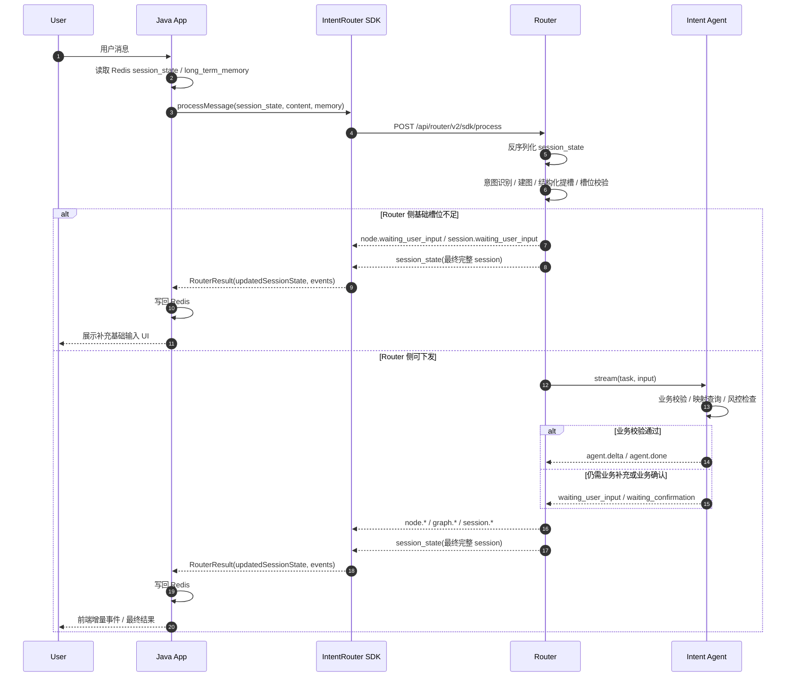
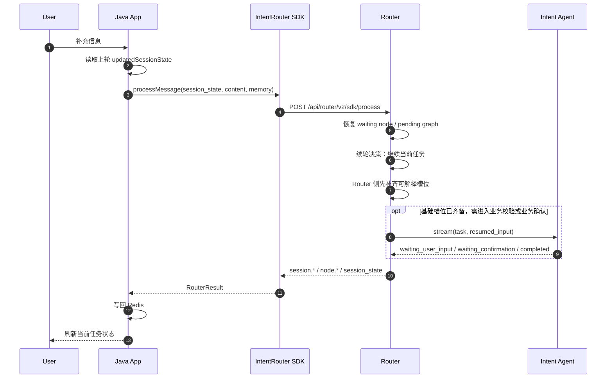
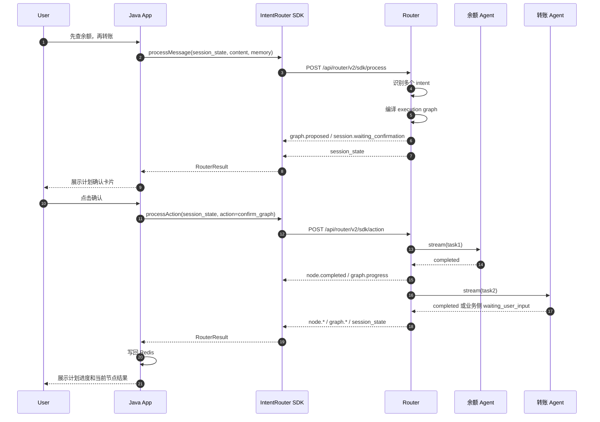
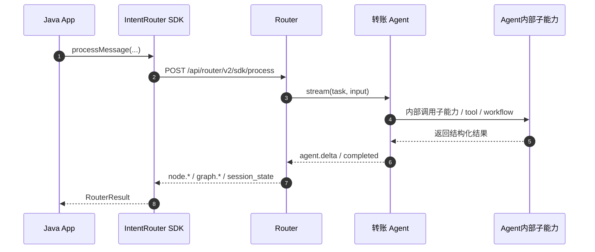

# Intent Router Java SDK 调用时序设计

> 配套主文档：[`intent-router-java-sdk集成方案.md`](./intent-router-java-sdk集成方案.md)

## 1. 目标

这份文档只回答两类问题：

- Java SDK 接入后，请求在 Java、Router、业务 Agent 之间到底怎么流转。
- 后续如果要引入“子智能体”，应该由谁调用，调用关系在时序上如何体现。

## 2. 参与方与职责

| 参与方 | 责任 | 不负责 |
|---|---|---|
| Java 业务宿主 | 持久化 `session_state`、装载 long-term memory、调用 SDK、转发事件给前端 | 不直接调用业务 Agent |
| Java SDK | 管理 Python router 进程、把 Java 请求转成 HTTP/SSE、聚合 `RouterResult` | 不做意图识别和业务编排 |
| Router | 识别、建图、槽位治理、graph 调度、状态机、统一 SSE 事件、调用意图级 Agent | 不实现具体业务逻辑 |
| 业务 Agent | 本意图业务校验、映射查询、业务确认、执行逻辑、执行期补充信息返回 | 不感知全局 graph runtime |
| Agent 内部子能力 | 当前业务 Agent 的实现细节，例如 tool、workflow、域内子 Agent | 不直接参与 Router session/graph |

## 3. 子智能体由谁调用

默认原则：

1. 需要进入 Router 状态机的能力，由 **Router 调用**。
2. 只是某个叶子 intent 内部实现细节的能力，由 **业务 Agent 自己调用**。

### 3.1 应该由 Router 调用的子智能体

满足任一条件，就应提升为 Router 可见的“叶子 intent / 下游 Agent”：

- 需要独立的 graph 节点
- 需要独立的 `waiting_user_input`
- 需要独立的 `waiting_confirmation`
- 需要统一取消、统一超时、统一审计
- 需要在前端作为独立步骤展示
- 需要和其他 intent 建立顺序/并行/条件关系

### 3.2 应该由业务 Agent 内部调用的子智能体

满足以下特征，更适合放在业务 Agent 内部：

- 只是该 intent 的内部实现细节
- 不需要独立 session
- 不需要独立 graph 节点
- 不需要独立前端卡片
- 失败/重试/降级都由该业务 Agent 自己兜住即可

例子：

- 转账 Agent 内部调用收款账户映射查询
- 转账 Agent 内部调用账户合法性校验 / 风控检查 workflow
- 理财 Agent 内部调用推荐排序模型

### 3.3 总控智能体怎么放

如果未来接入 `OneAgent` 之类的总控智能体，只能二选一：

- **方案 A：Router 继续做总控**  
  `OneAgent` 退化成某一个叶子业务 Agent，由 Router 调。

- **方案 B：OneAgent 替代 Router 规划层**  
  由 `OneAgent` 承担跨意图规划和全局编排，Router 退到更薄的一层，甚至被替换。

不建议：

- Java -> Router
- Router -> 总控 Agent
- 总控 Agent -> 再调其他业务 Agent

这会形成“双总控”，导致规划、状态机、确认、取消和事件口径重叠。

## 4. 主链路时序

### 4.1 首轮消息：Java -> Router -> 叶子业务 Agent

适用场景：用户首次输入。Router 先完成意图识别、结构化提槽、可下发性判断；只有满足基础执行条件后，才下发业务 Agent 做执行期业务校验。



### 4.2 续轮补充：Java 继续只调 Router，不直连 Agent

适用场景：上一轮已经进入 `waiting_user_input`，但这次等待可能来自 Router 侧基础槽位不足，也可能来自 Agent 侧业务补充。



这里的关键点是：

- Java 依旧只调 Router
- Router 决定是否恢复当前任务
- Router 先做结构化理解和基础提槽
- 只有在当前 intent 已满足下发条件时，Router 才再次调对应 Agent
- Agent 返回的 `waiting_user_input` 应理解为“业务侧还需补充/确认”，不是重复做第一层提槽

## 5. 多意图规划时序

### 5.1 先规划，再确认，再顺序执行

适用场景：例如“先查余额，再转账”。



结论：

- 多意图顺序和切换由 Router 管
- 不是某个总控 Agent 在业务侧再拆任务
- 每个叶子业务 Agent 只看自己的节点输入

## 6. 业务 Agent 内部再调子能力的时序

### 6.1 推荐形态：Router 看见业务 Agent，看不见其内部子能力

适用场景：子能力只是该 intent 的实现细节。



这种形态最适合：

- 当前 intent 内部要做多步推理
- 要调多个工具或域内子 Agent
- 但不希望 Router 感知内部拆解细节

> [!IMPORTANT]
> 这里的“Agent 内部子能力”不是在重复做 Router 的意图识别或第一层提槽，
> 而是做该 intent 自己的业务校验、映射查询、风控判断、执行前置检查等实现细节。

## 7. 什么时候要把“内部子能力”提升成 Router 可见节点

如果业务 Agent 内部某个子能力出现下面任一诉求，就不该再藏在 Agent 内部：

- 需要前端独立展示“步骤 2/步骤 3”
- 需要用户单独确认
- 需要用户中途取消这个子步骤
- 需要和别的 intent 做依赖编排
- 需要跨轮恢复到这个子步骤

这时推荐改成：

- Router graph 里新增一个叶子节点
- 给它注册独立 intent / agent_url
- 由 Router 直接调它

## 8. Demo 原型建议

对当前 Java SDK demo，建议采用下面这条固定链路：

```text
Java App
  -> IntentRouter SDK
  -> Router
  -> 叶子业务 Agent
  -> Agent 内部子能力（可选，仅内部实现）
```

不建议首期就做：

```text
Java App
  -> Router
  -> 总控智能体
  -> 多个业务子智能体
```

原因：

- Router 和总控智能体会重叠做规划
- session_state 的唯一真值来源会变模糊
- waiting / confirm / cancel 的事件归属会打架
- Java 侧很难知道最终该以谁的状态为准

## 9. 最终判断规则

可以把判断规则压缩成 3 句：

1. **跨 intent 的规划和调度，一律归 Router。**
2. **单 intent 内部的实现编排，归业务 Agent。**
3. **需要进入 Router session/graph 的子能力，提升成 Router 可见叶子节点。**
