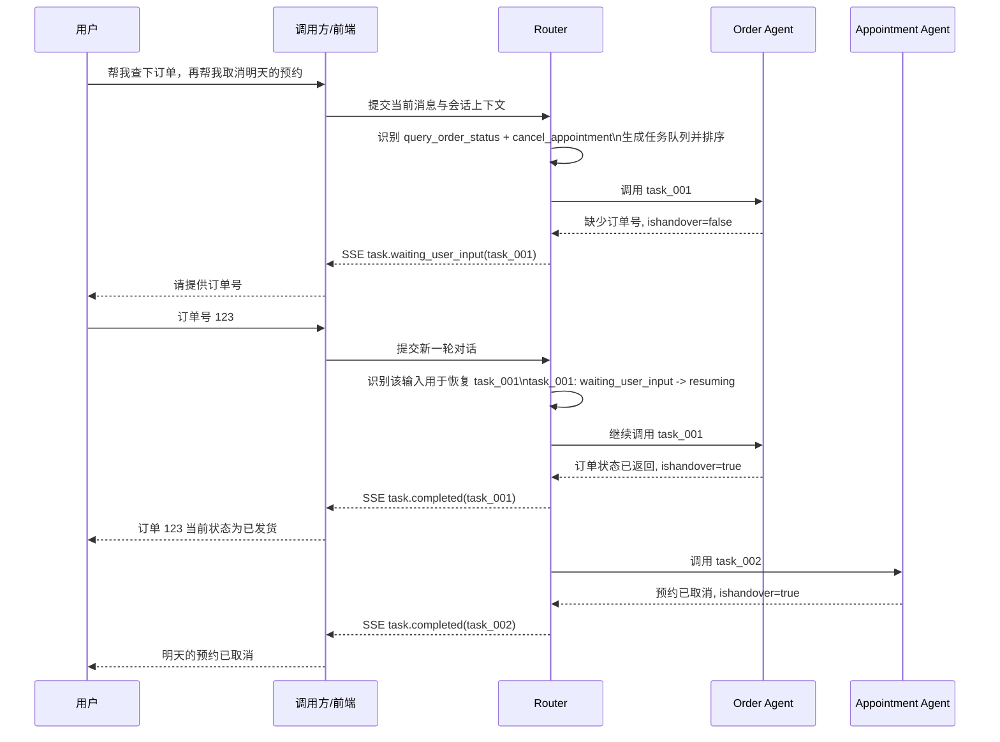
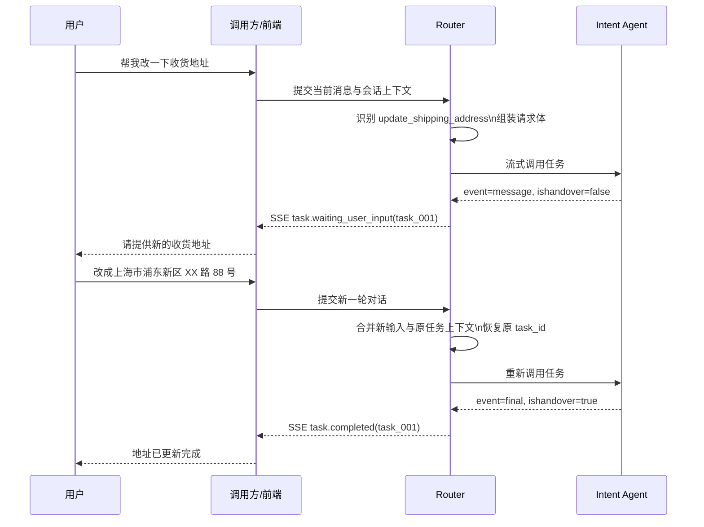
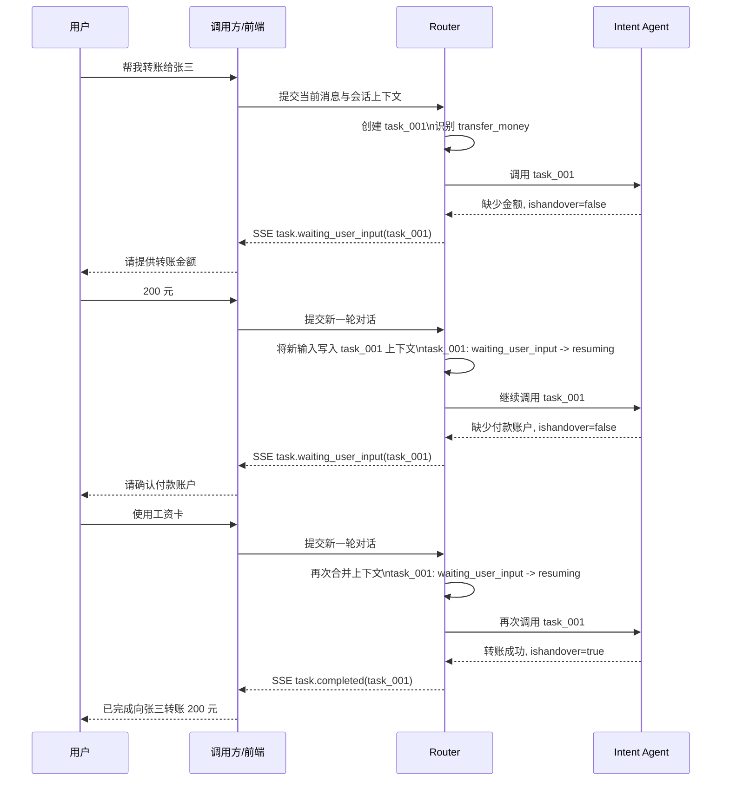

# 意图路由服务需求文档

## 1. 文档目标
本文档用于定义意图路由服务的业务目标、核心能力、用户故事、用户旅程与功能需求，作为后续产品设计、接口设计与工程实现的基础。

该服务的核心职责是：识别用户对话中的一个或多个意图，将意图转化为可执行任务，并把任务路由到对应的意图 Agent URL 服务上执行，同时以流式方式管理任务状态与用户补充信息的续办流程。

## 2. 背景与目标
在多 Agent 对话系统中，用户一句话可能同时包含多个诉求，例如“帮我查下订单状态，再顺便改一下收货地址”。如果没有统一的意图路由层，系统会出现以下问题：

- 无法稳定识别多意图
- 无法基于统一清单治理可用意图
- 无法把任务分发到不同 Agent 并按统一策略执行
- 无法在 Agent 需要补充信息时进行状态挂起与恢复

因此，本服务需要提供一个统一的意图注册、识别、编排与分发中枢。

### 2.1 服务边界与部署目标
为满足控制面与运行面解耦，V1 目标部署拓扑如下：

- `admin-api` 与 `router-api` 分开部署，独立发布。
- `admin-api` 默认单副本，承担意图治理与配置发布。
- `router-api` 支持多副本横向扩展，承担识别与分发流量。
- Router 只负责识别、排队、状态机和分发，不承载业务意图执行逻辑。
- 未匹配业务意图时，Router 必须分发到独立 fallback agent，而不是在 Router 内部兜底执行。

### 2.2 统一入口规范
统一入口路径必须固定为：

- `/admin`：管理前端
- `/chat`：对话前端
- `/api/admin/*`：管理后端 API
- `/api/router/*`：路由后端 API

## 3. 核心概念
### 3.1 意图
意图是一个可注册、可治理、可路由的业务能力单元。每个意图至少包含：

- `intent_code`：意图唯一标识
- `name`：意图名称
- `description`：意图说明，用于识别提示词
- `examples`：典型表达示例
- `agent_url`：对应 Agent 服务地址
- `status`：启用、停用、灰度等状态
- `dispatch_priority`：串行执行时的调度优先级
- `request_schema`：目标 Agent 所需请求体结构定义
- `field_mapping`：路由服务组装请求体时的字段映射规则
- `resume_policy`：补充信息后如何恢复任务，建议默认 `resume_same_task`

其中 `request_schema + field_mapping` 是意图注册的关键部分。路由服务在任务分发前，需要按该定义准备请求体，并在发送前完成结构校验。

示例：

```json
{
  "intent_code": "transfer_money",
  "name": "转账",
  "description": "处理用户转账、收款人确认、转账结果查询等请求",
  "examples": ["给张三转 200 元", "帮我转账到招商银行账户"],
  "agent_url": "https://agent.example.com/transfer/stream",
  "status": "active",
  "dispatch_priority": 10,
  "request_schema": {
    "type": "object",
    "required": ["sessionId", "taskId", "intentCode", "input", "context"],
    "properties": {
      "sessionId": { "type": "string" },
      "taskId": { "type": "string" },
      "intentCode": { "type": "string" },
      "input": { "type": "string" },
      "context": { "type": "object" },
      "slots": { "type": "object" }
    }
  },
  "field_mapping": {
    "sessionId": "$session.id",
    "taskId": "$task.id",
    "intentCode": "$intent.code",
    "input": "$message.current",
    "context.recentMessages": "$context.recent_15_messages",
    "context.longTermMemory": "$memory.long_term",
    "slots.amount": "$entities.amount",
    "slots.payee": "$entities.payee"
  },
  "resume_policy": "resume_same_task"
}
```

### 3.2 意图清单
系统内所有已注册且可用的意图集合。意图识别必须基于该清单完成，不允许模型凭空生成未注册意图。

### 3.3 任务
一次用户输入经识别后，会产出一个或多个任务。每个任务对应一个意图及其目标 Agent。

### 3.4 候选意图
除主识别结果外，系统需要保留置信度较高但未进入主执行清单的候选意图，用于后续补充判断、追问或兜底。候选意图不是简单保留所有低分结果，只有当其置信度高于候选阈值 `candidate_threshold` 时才保留。

示例：

- `transfer_money` 置信度 `0.90`，满足主意图阈值，进入执行队列
- `pay_bill` 置信度 `0.72`，未进入主执行清单，但若 `candidate_threshold <= 0.72`，则保留为候选意图

### 3.5 `ishandover`
这是意图 Agent 流式协议中的关键字段：

- `ishandover = false`：当前任务尚未完成，需要用户补充信息后继续执行。Router 应将该状态转换为对外的 SSE 事件，推送给调用方或前端
- `ishandover = true`：当前任务已完成或已明确失败，任务可结束

## 4. 角色与使用方
### 4.1 平台运营方
负责注册、配置、启停意图及其 Agent URL。

### 4.2 业务调用方
向意图路由服务提交用户对话上下文，并消费任务状态和流式结果。

### 4.3 终端用户
通过自然语言表达需求，可能一次提出一个或多个诉求，并在必要时补充缺失信息。

## 5. 用户故事
### 5.1 意图治理
- 作为平台运营方，我希望注册新的意图及其说明和 Agent 地址，以便系统能够识别并调用该能力。
- 作为平台运营方，我希望停用或灰度某个意图，以便在服务异常或版本切换时可控下线。

### 5.2 多意图识别
- 作为业务调用方，我希望系统能基于最近对话、长期记忆和意图说明识别多个意图，而不是只返回一个标签。
- 作为业务调用方，我希望系统给出每个意图的置信度和候选意图，便于后续追问或兜底判断。

### 5.3 任务执行顺序
- 作为终端用户，我希望系统默认逐个处理多个诉求，避免多个任务同时向我追问造成交互混乱。
- 作为业务调用方，我希望不同意图自动路由到不同 Agent URL，并以统一队列顺序执行、跟踪状态。
- 作为架构设计方，我希望后续仍可升级到“受控并行”，即只允许一个任务与用户交互，其余纯后台任务可并行执行。

### 5.4 挂起与恢复
- 作为终端用户，当某个任务缺少参数时，我希望系统明确告诉我需要补充什么，而不是整体失败。
- 作为业务调用方，我希望任务在等待用户补充信息时进入挂起状态，并在新对话到来后继续执行，而不是重新创建一套无关任务。

## 6. 用户旅程
### 6.1 旅程 A：单轮输入，多意图串行执行并跨轮恢复



说明：V1 默认串行执行。任务排序优先按 `dispatch_priority`，同优先级下再按置信度从高到低。当队首任务返回 `ishandover = false` 时，Router 应立刻通过 SSE 向调用方或前端推送 `waiting_user_input` 事件，并暂停后续 `queued` 任务。用户通过下一轮对话补充信息后，Router 恢复原任务，完成后再继续处理队列中的下一个任务。

### 6.2 旅程 B：任务需补充信息后继续执行



说明：当 `ishandover = false` 时，Router 应通过 SSE 把待补充信息推送给调用方或前端。系统不新建无关任务，而是恢复原任务继续执行，保证上下文连续。

### 6.3 旅程 C：单任务多轮补充后完成



说明：同一个 `task_id` 可以经历多轮补充信息，不限制为一次补充后必须结束。每次 `ishandover = false` 都应触发一次对外 SSE 推送；每次用户补充的新内容都应写回该任务上下文，再恢复原任务继续执行，直到 Agent 返回 `ishandover = true`。

## 7. 功能需求
### 7.1 意图注册与管理
系统应支持意图的创建、更新、查询、启停和删除，至少包含以下能力：

- 注册意图元数据、Agent URL、请求结构与字段映射
- 校验 `intent_code` 唯一性
- 管理意图版本、状态、描述信息和调度优先级
- 支持按租户、业务线或环境隔离意图清单（如后续需要）
- 在任务分发前，按 `request_schema` 校验最终请求体是否合法

### 7.2 意图识别
系统应基于以下输入完成识别：

- 当前用户输入
- 最近 15 条对话上下文
- 长期记忆
- 可用意图清单及每个意图的说明、示例

识别输出应至少包括：

- 主意图列表，可包含多个意图
- 每个意图的置信度
- 每个意图的识别依据或简短原因
- 候选意图列表

约束如下：

- 不得输出未注册意图
- 需要支持多意图识别，而非互斥单选
- 需要支持主意图阈值 `primary_threshold` 与候选阈值 `candidate_threshold` 配置
- 候选意图仅在 `confidence >= candidate_threshold` 时保留
- 主意图默认满足 `confidence >= primary_threshold`

### 7.3 任务生成与分发
对每个主意图生成独立任务，并记录：

- `task_id`
- `session_id`
- `intent_code`
- `agent_url`
- `status`
- `confidence`
- `input_context`
- `created_at` / `updated_at`

任务分发要求：

- 按意图维度分发到对应 Agent URL
- V1 默认串行执行，而非并发执行
- 任务创建后先进入队列，按 `dispatch_priority` 和 `confidence` 排序
- 每个任务状态独立维护
- 同一轮对话的多个任务可统一聚合展示
- 当当前任务进入 `waiting_user_input` 时，后续任务保持 `queued`
- Router 应对外持续推送 SSE 事件，反映当前任务与队列状态

后续扩展策略：

- 可增加 `controlled_parallel` 模式
- 该模式下只允许一个任务进入前端交互态，其他无须追问的任务可并行执行并缓存结果

### 7.4 流式调用与推送协议
路由服务与意图 Agent 之间采用 HTTP 流式调用。每个 Agent 是一个独立 URL 服务。路由服务对业务调用方或前端采用 SSE 推送任务事件，尤其用于 `waiting_user_input`、`completed`、`failed` 等状态通知。

Router -> Agent 的请求体应按照该意图注册时定义的 `request_schema` 组装，并通过 `field_mapping` 完成字段填充。建议至少包含：

- 会话标识
- 任务标识
- 当前用户输入
- 拼装后的上下文
- 与该任务相关的历史执行信息
- 必要的长期记忆

示例请求体：

```json
{
  "sessionId": "sess_001",
  "taskId": "task_001",
  "intentCode": "transfer_money",
  "input": "给张三转 200 元",
  "context": {
    "recentMessages": [
      "用户：帮我看看银行卡余额",
      "助手：当前余额 5000 元"
    ],
    "longTermMemory": [
      "常用收款人：张三"
    ]
  },
  "slots": {
    "amount": "200",
    "payee": "张三"
  }
}
```

Agent -> Router 的流式响应建议为逐条 JSON 事件，至少包含：

```json
{
  "taskId": "task_001",
  "event": "message",
  "content": "请提供新的收货地址",
  "ishandover": false,
  "status": "waiting_user_input"
}
```

任务完成示例：

```json
{
  "taskId": "task_001",
  "event": "final",
  "content": "地址已更新完成",
  "ishandover": true,
  "status": "completed"
}
```

失败示例：

```json
{
  "taskId": "task_001",
  "event": "final",
  "content": "订单不存在，无法更新地址",
  "ishandover": true,
  "status": "failed"
}
```

Router -> 调用方/前端 的 SSE 事件建议至少包含：

```text
event: task.waiting_user_input
data: {"taskId":"task_001","intentCode":"query_order_status","status":"waiting_user_input","message":"请提供订单号","ishandover":false}
```

```text
event: task.completed
data: {"taskId":"task_001","intentCode":"query_order_status","status":"completed","message":"订单 123 当前状态为已发货","ishandover":true}
```

SSE 推送规则：

- 当 Agent 返回 `ishandover = false` 时，Router 必须立即向调用方或前端推送 `task.waiting_user_input`
- 用户补充信息后，调用方将新对话再次提交给 Router，由 Router 识别并恢复对应任务
- 当任务完成或失败时，Router 推送 `task.completed` 或 `task.failed`
- 若存在多个排队任务，SSE 中应能体现当前激活任务与其余 `queued` 任务状态

### 7.5 任务状态机
建议的最小状态机如下：

- `created`：任务已创建
- `queued`：任务已入队，等待轮到执行
- `dispatching`：任务分发中
- `running`：Agent 执行中
- `waiting_user_input`：Agent 请求用户补充信息
- `resuming`：收到补充输入后恢复执行
- `completed`：任务成功完成
- `failed`：任务失败
- `cancelled`：任务被取消

状态规则：

- 新创建任务在排序后进入 `queued`
- 只有队首任务可以从 `queued` 进入 `dispatching`
- 当流式事件中 `ishandover = false` 时，任务必须进入 `waiting_user_input`
- 当流式事件中 `ishandover = true` 且状态为成功时，任务进入 `completed`
- 当流式事件中 `ishandover = true` 且状态为失败时，任务进入 `failed`
- 处于 `waiting_user_input` 的任务，在用户补充内容后进入 `resuming`，随后再次进入 `running`
- 同一个任务允许多次重复 `running -> waiting_user_input -> resuming -> running`，直到完成或失败
- 若当前任务阻塞在 `waiting_user_input`，其余任务不得越过该任务直接执行

### 7.6 上下文管理
意图识别与任务恢复都依赖上下文拼装。系统至少需要支持：

- 最近 15 条对话窗口
- 长期记忆注入
- 按任务保存与该意图强相关的执行上下文
- 恢复任务时把新增用户输入与原任务上下文合并

记忆分层规则如下：

- `session_id` 绑定短期记忆，包括最近 15 条对话、任务队列、候选意图、待恢复任务
- 短期记忆默认有效期 30 分钟
- 30 分钟无活动后，短期记忆应归档并提升到 `cust_id` 绑定的长期记忆
- `cust_id` 绑定长期记忆，用于跨会话复用的稳定事实与历史确认信息

### 7.7 候选意图机制
系统需要保留候选意图而不是直接丢弃，使用场景包括：

- 主意图失败时的兜底切换
- 对低确定性场景发起澄清提问
- 补充信息后重新排序候选意图

候选意图规则如下：

- 候选意图必须满足 `confidence >= candidate_threshold`
- 候选意图默认不自动执行，除非后续规则明确允许
- 若主意图失败或用户补充信息改变语义，可重新评估候选意图是否转为主意图

### 7.8 部署与资源约束
部署层必须满足以下要求：

- `admin-api`、`router-api`、各 `intent-agent` 使用独立 Deployment。
- `admin-api` 默认 `replicas=1`，`router-api` 可按流量扩容。
- 每个 Deployment 必须设置 `resources.requests.cpu` 与 `resources.requests.memory`。
- `resources.requests` 作为调度和容量规划基线，不允许省略。

## 8. 非功能需求
### 8.1 性能
- V1 至少支持稳定的串行任务执行
- 架构上预留升级到受控并行的能力
- `router-api` 需支持多副本扩容，避免识别与分发成为瓶颈
- 意图识别耗时应尽量低，避免成为整体瓶颈

### 8.2 可靠性
- 需要具备超时、重试、熔断和降级机制
- Agent 流式中断时需要可观测与可恢复

### 8.3 可观测性
- 记录识别结果、任务流转、Agent 调用耗时、失败原因
- 支持按会话、任务、意图维度追踪日志

### 8.4 安全性
- 对 Agent URL 调用进行鉴权
- 对上下文和长期记忆中的敏感信息进行脱敏与访问控制

## 9. 非目标
当前阶段不包含以下内容：

- 直接定义每个具体意图 Agent 的内部实现
- 直接定义长期记忆系统的存储方案
- 直接定义前端交互样式

## 10. 待确认问题
以下问题建议在下一轮设计中明确：

- 候选意图的数量上限，以及从候选转为主意图的规则
- 多个任务的结果如何对外聚合输出
- 任务恢复时，是恢复原任务还是新建子任务并关联父任务
- Router 与 Agent 之间的流式实现采用 SSE 还是分块 HTTP
- 长期记忆的读取策略与注入时机
- 哪些意图未来可标记为非交互型，从而进入 `controlled_parallel` 模式

## 11. 下一步建议
基于本文档，下一阶段建议补充三份文档：

1. 系统架构设计文档
2. Router 与 Agent 的接口协议文档
3. 状态机与任务编排的数据模型文档
