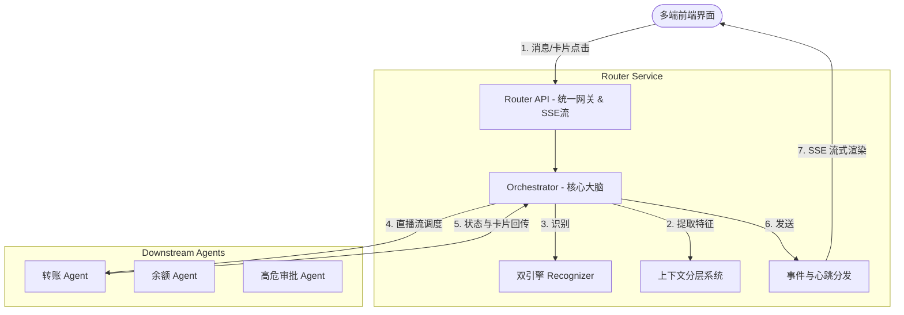
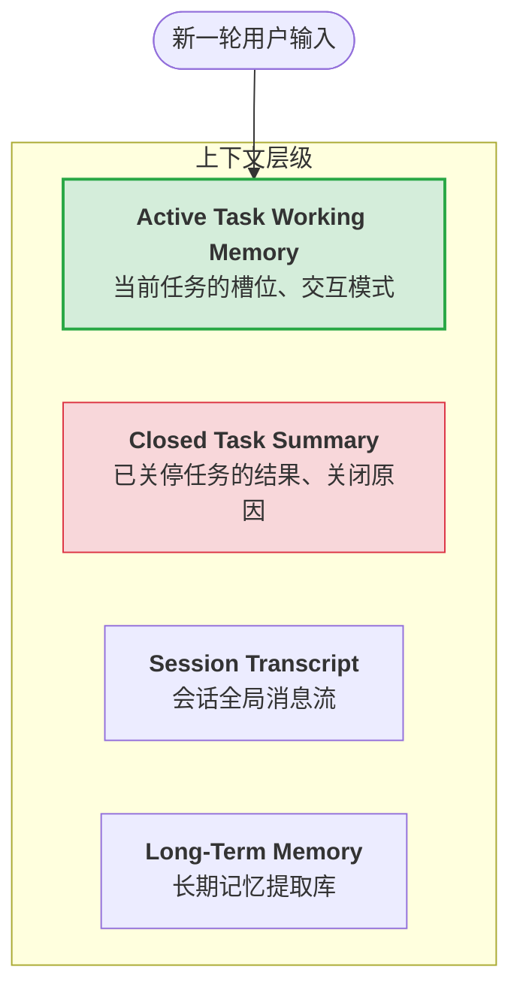
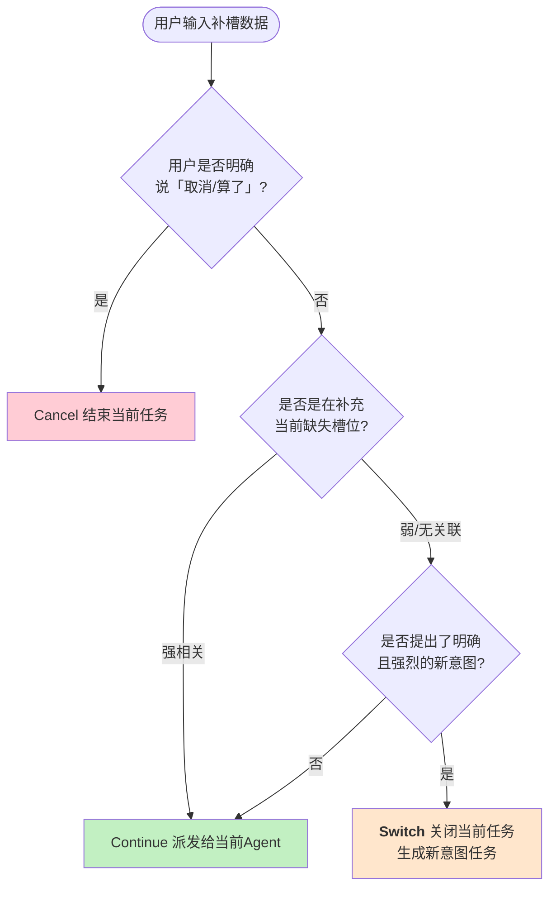
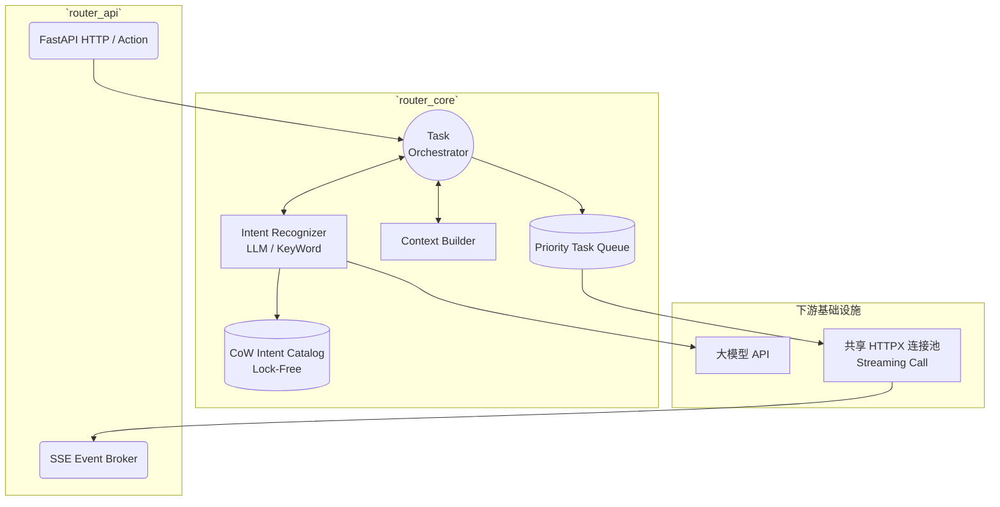
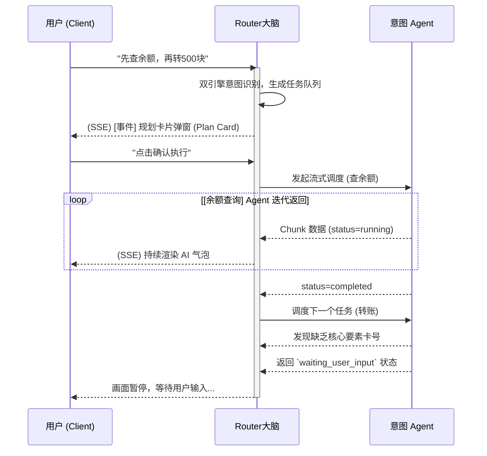

# 意图路由服务 (Intent Router) 介绍与架构设计

> 本文档是一份为功能汇报/技术分享准备的 PPT 结构框架，结合了 `router_api` 和 `router_core` 的代码落地现状，以及《意图设计》文档中的最新规划。每张幻灯片（Slide）的内容都已提炼为核心要点，您可以直接提取填入演示文稿中。

---

## Slide 1: 封面
* **主标题**：智能意图路由服务 (Intent Router) 架构与功能演进
* **副标题**：构建高可靠、可伸缩的 AI 意图分发与多轮任务编排中枢
* **演讲者**：Corelli
* **部门/团队**：[您的团队名称]

---

## Slide 2: 核心挑战与定位
* **面临的挑战**：
  * 大模型直接闭环全量业务不可控，缺乏原子业务的确定性。
  * 用户意图多样发散（单次发问包含多意图、中途改变主意图）。
  * 状态管理复杂：多轮对话中上下文极易污染（例如：查完余额的卡号被带入转账任务）。
* **Intent Router 的系统定位**：
  * **分离“路由”与“执行”**：作为大脑中枢，专职负责意图判定、任务编排、上下文生命周期管理。
  * **不碰底层业务语义**：业务要素（如转账给谁）交由下游具体的 Intent Agent 处理。
  * **统一展现层**：作为统一的流式出口（SSE），对前端屏蔽后端多个 Agent 的调用复杂性。

---

## Slide 3: 整体功能全景图与系统图
* **1. 动态意图路由**：支持从持久化存储（Intent Catalog）准实时热更新意图定义，即插即用。
* **2. 混合意图识别**：提供 LLM 语义识别兜底至简单关键字。
* **3. 串行与流式编排**：内置任务队列，实时推送动作。

---

## Slide 4: 核心逻辑一：多轮边界与上下文分层设计
* **痛点**：传统的“大上下文窗口”会导致旧任务残渣污染新任务。
* **解决方案：上下文严格分层 (Context Stratification)**

* **核心动作**：任务的生命周期强标记（如 `closure_reason: completed | switched_intent`）。

---

## Slide 5: 核心逻辑二：Waiting 态下意图切换的决策树 (Decision Tree)
* 当用户处于等待补充信息 (Waiting) 态时，新的一句话到底表示什么？

* 核心：**默认优先继续，明确证据才切流。**

---

## Slide 6: 核心逻辑三：双态卡片体系 (Router vs Agent Cards)
* 针对复杂与高危操作，避免纯文本黑盒，引入双态结构化卡片与独立 Action 接口。
* **Planner Card (Router 规划确认卡片)**：
  * **场景**：一次识别出多个意图（如“先查余额再打给张三500”）。
  * **行为**：Router 截停执行流，发送规划清单。用户确认后开始按队列调度，随时同步子任务进度。
* **Confirm Card (Agent 业务确认卡片)**：
  * **场景**：涉及转账等高危动作，或“同意图内目标对象突变”。
  * **行为**：Agent 中断识别返回卡片，前端展示结构化表单等待用户按键授权（而非普通文本回复），Router 做 Action 路由透传。

---

## Slide 7: 系统架构设计剖析
*(内部技术架构分解)*

---

## Slide 8: 核心执行流时序图

---

## Slide 9: 生产级可靠性保障 (Production Resilience)
* **无状态路由扩容设计**：
  * 配合 K8s Ingress 开启 Sticky Session (Cookie Affinity) 实现单会话 Pod 极速亲和绑定。
  * 规避跨 Pod 消息投递黑洞，随时可水平扩容。
* **资源保护机制**：
  * Agent 级联超时与熔断（Timeout API & Circuit Breaker）。
  * `EventBroker` 心跳续约（Heartbeat）+ Idle 超时关停机制防内存泄漏。
* **并发控制与安全**：
  * Intent Catalog 的后台自动异步更新。
  * 后台任务隔离报错不传染主线程响应。

---

## Slide 10: 演进路线规划 (Roadmap)
* **Phase 1 (MVP 可用层) [进行中]**：
  * 完善 Waiting 态补槽/切换的判定机制、实现超时与资源安全兜底。
* **Phase 2 (上下文闭环层)**：
  * 深入落地四层上下文边界体系（Work Memory vs Summary），增加闭环原因追踪。
* **Phase 3 (全局规划层)**：
  * 实现完整的 Router 规划卡片 `session.plan.proposed` 及对应的队列暂停控制引擎。
* **Phase 4 (核心业务防线)**：
  * 落地 Agent 二次确认业务卡片，完成完整的 `/actions` 路由中转机制，解决金融级严谨性问题。

---

## Slide 11: 总结 (Summary)
* **Intent Router** = 大脑层执行引擎 + 胶水层状态机。
* 通过极强的边界设计（状态管理、上下文分层、明确的切流规则），将发散不可控的 LLM 多轮聊天，转化为了确定性的 API 工作流调度过程。
* **价值**：极大降低各个意图智能体（Agent）的开发复杂度，专注垂类业务语义理解即可。

---
## Slide 12: Q&A
* 感谢聆听！
* Open Questions / 自由讨论
