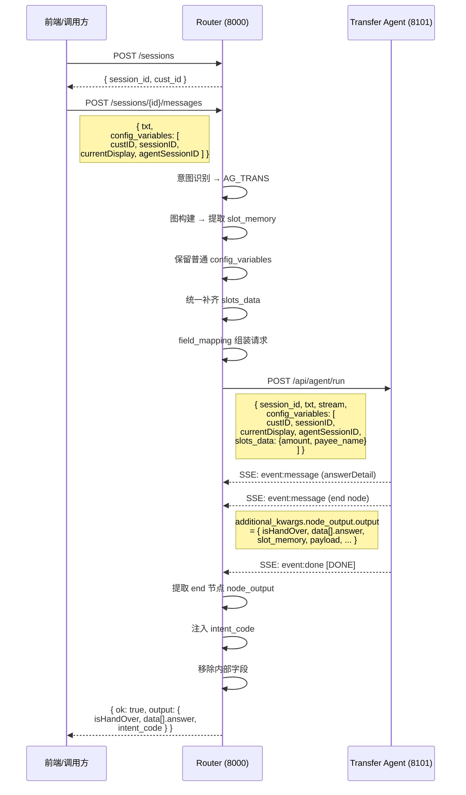

# Intent-Router 通信协议规范 v0.3

> 以 **转账（AG_TRANS）** 场景为例，自定义透传字段：`custID`、`sessionID`、`currentDisplay`、`agentSessionID`
>
> v0.3 对齐结论：
> 1. 外部协议字段格式不调整；
> 2. `config_variables` 中除 `slots_data` 外均视为透传字段；
> 3. `slots_data` 由 Router 负责补齐和收敛；
> 4. 实现顺序先打通**非流 execute**，再补 SSE 主链路。

---

## 1. 请求 Router 的报文格式

### 1.1 创建会话

```
POST /api/router/v2/sessions
Content-Type: application/json
```

```json
{
    "cust_id": "C000123456"
}
```

**响应：**

```json
{
    "session_id": "session_graph_xxxxx",
    "cust_id": "C000123456"
}
```

### 1.2 发送消息（Execute 模式）

```
POST /api/router/v2/sessions/{session_id}/messages
Content-Type: application/json
```

```json
{
    "session_id": "session_graph_xxxxx",
    "txt": "帮我转账500块给张三",
    "config_variables": [
        { "name": "custID",          "value": "C000123456" },
        { "name": "sessionID",       "value": "SES_20250421_001" },
        { "name": "currentDisplay",  "value": "transfer_page" },
        { "name": "agentSessionID", "value": "AGENT_SES_001" }
    ]
}
```

| 字段 | 类型 | 必填 | 说明 |
|------|------|------|------|
| `session_id` | string | ✅ | 会话 ID（创建会话时返回） |
| `txt` | string | ✅ | 用户输入的自然语言 |
| `config_variables` | array | ❌ | **透传字段数组**，格式与子智能体一致 |
| `config_variables[].name` | string | — | 参数名 |
| `config_variables[].value` | string | — | 参数值 |

透传字段说明：

| name | 说明 | 示例 |
|------|------|------|
| `custID` | 业务系统客户标识 | `C000123456` |
| `sessionID` | 业务系统会话标识 | `SES_20250421_001` |
| `currentDisplay` | 当前前端展示页面标识 | `transfer_page` |
| `agentSessionID` | Agent 会话标识 | `AGENT_SES_001` |

> [!NOTE]
> `config_variables` 字段需要代码扩展支持（当前 `MessageRequest` 尚未定义该字段）。
> 在未扩展前，`custID` 和 `sessionID` 通过 `cust_id` 和 Router 内部 `session.id` 自动映射。

### 1.3 Router 对 `config_variables` 的处理规则（v0.3）

Router 接收到上游 `config_variables` 后，按如下规则处理：

| 类型 | Router 行为 | 是否参与 Router 自身业务判断 |
|---|---|---|
| 非 `slots_data` 字段 | 原样接收、原样保留、原样透传给下游 Agent | 否 |
| `slots_data` 字段 | 解析为结构化槽位提示；最终以下游出参阶段的 Router 槽位结果为准 | 否，作为提示信息 |

具体约束：

1. `custID`、`sessionID`、`currentDisplay`、`agentSessionID` 等字段均属于透传字段。
2. 透传字段不参与意图识别、图构建、提槽判断、节点调度等 Router 内部逻辑。
3. 上游如果未传 `slots_data`，Router 需要在发往 Agent 时根据当前 `slot_memory` 自动补一条 `slots_data`。
4. 上游如果已传 `slots_data`，Router 可以将其作为参考提示，但最终发往 Agent 的 `slots_data` 仍由 Router 当前槽位结果统一收敛。
5. 无论上游是否传入，Router 发往下游 Agent 的 `config_variables` 中最终只允许存在一条 `slots_data`。

---

## 2. `intents.json` 中的 `field_mapping` 配置

`field_mapping` 定义了 Router 如何将内部变量 → 映射到子智能体请求报文的字段。

### 2.1 AG_TRANS v0.3 推荐配置

```json
{
    "field_mapping": {
        "session_id":                                "$session.id",
        "txt":                                       "$message.current",
        "stream":                                    "true",

        "config_variables.custID":                   "$config_variables.custID",
        "config_variables.sessionID":                "$config_variables.sessionID",
        "config_variables.currentDisplay":           "$config_variables.currentDisplay",
        "config_variables.agentSessionID":           "$config_variables.agentSessionID",

        "config_variables.slots_data.amount":        "$slot_memory.amount",
        "config_variables.slots_data.payer_card_no": "$slot_memory.payer_card_no",
        "config_variables.slots_data.payer_card_remark": "$slot_memory.payer_card_remark",
        "config_variables.slots_data.payee_name":    "$slot_memory.payee_name",
        "config_variables.slots_data.payee_card_no": "$slot_memory.payee_card_no",
        "config_variables.slots_data.payee_card_remark": "$slot_memory.payee_card_remark",
        "config_variables.slots_data.payee_card_bank": "$slot_memory.payee_card_bank",
        "config_variables.slots_data.payee_phone":   "$slot_memory.payee_phone"
    }
}
```

### 2.2 映射规则说明

```
target_path  →  source_expression
(发给Agent的位置)    (从Router取值的来源)
```

#### Target 路径规则

| Target 前缀 | 生成效果 | 示例 |
|---|---|---|
| `config_variables.slots_data.xxx` | 合并为 `slots_data` JSON 字符串 | `{"name":"slots_data","value":"{\"amount\":\"500\"}"}` |
| `config_variables.xxx` | 加入 `config_variables` 数组 | `{"name":"custID","value":"C000123456"}` |
| 普通路径（如 `session_id`） | 写入 payload 顶层 | `"session_id": "session_graph_xxx"` |

#### Source 表达式可用变量

| 表达式 | 值来源 | 示例 |
|---|---|---|
| `$session.id` | Router 会话 ID | `session_graph_xxx` |
| `$session.cust_id` | 客户 ID | `C000123456` |
| `$message.current` | 当前用户输入 | `帮我转账500块给张三` |
| `$slot_memory.xxx` | 图节点提取的槽位 | `$slot_memory.amount` → `500` |
| `$task.id` | 任务 ID | `task_xxx` |
| `$intent.code` | 意图代码 | `AG_TRANS` |
| `$intent.name` | 意图名称 | `转账` |
| `$context.recent_messages` | 最近消息列表 | `[{role, content}, ...]` |
| `$context.long_term_memory` | 长期记忆 | `[...]` |
| `$config_variables.xxx` | 上游透传参数 | `$config_variables.custID` → `C000123456` |
| 不带 `$` 的字符串 | 字面量 | `"true"`, `""` |

### 2.3 扩展 config_variables 透传的配置（需代码扩展后）

扩展后 `field_mapping` 可通过 `$config_variables.xxx` 引用前端透传的 `config_variables` 字段：

```json
{
    "field_mapping": {
        "session_id":                            "$session.id",
        "txt":                                   "$message.current",
        "stream":                                "true",

        "config_variables.custID":               "$config_variables.custID",
        "config_variables.sessionID":            "$config_variables.sessionID",
        "config_variables.currentDisplay":       "$config_variables.currentDisplay",
        "config_variables.agentSessionID":       "$config_variables.agentSessionID",

        "config_variables.slots_data.amount":    "$slot_memory.amount",
        "config_variables.slots_data.payee_name":"$slot_memory.payee_name"
    }
}
```

> [!TIP]
> `$config_variables.xxx` 从请求 Router 的 `config_variables` 数组中按 `name` 查找对应的 `value`，原样透传到子智能体的 `config_variables` 中。
> `slots_data` 不属于普通透传变量，最终由 Router 在下游出参阶段统一生成。

---

## 3. Router → 子智能体的请求报文格式

Router 根据 `field_mapping` 组装后，发送到子智能体（如 `http://localhost:8101/api/agent/run`）：

```
POST /api/agent/run
Content-Type: application/json
Accept: text/event-stream
```

```json
{
    "session_id": "session_graph_xxxxx",
    "txt": "帮我转账500块给张三",
    "stream": "true",
    "config_variables": [
        {
            "name": "custID",
            "value": "C000123456"
        },
        {
            "name": "sessionID",
            "value": "SES_20250421_001"
        },
        {
            "name": "currentDisplay",
            "value": "transfer_page"
        },
        {
            "name": "agentSessionID",
            "value": "AGENT_SES_001"
        },
        {
            "name": "slots_data",
            "value": "{\"amount\": \"500\", \"payee_name\": \"张三\"}"
        }
    ]
}
```

| 字段 | 类型 | 说明 |
|------|------|------|
| `session_id` | string | Router 会话 ID |
| `txt` | string | 用户原始输入 |
| `stream` | string | 是否流式 (`"true"`) |
| `config_variables` | array | 键值对数组，传递上下文参数 |
| `config_variables[].name` | string | 参数名 |
| `config_variables[].value` | string | 参数值（`slots_data` 为 JSON 字符串） |

> [!IMPORTANT]
> `slots_data` 是特殊处理：所有 `config_variables.slots_data.*` 的映射会被合并为一个 JSON 字符串，最终只产生一条 `{"name": "slots_data", "value": "{...}"}` 记录。
>
> v0.3 组包规则：
> 1. 先保留上游传入的普通 `config_variables`；
> 2. 再由 Router 根据当前 `slot_memory` 统一生成或覆盖 `slots_data`；
> 3. 最终发往 Agent 时，非 `slots_data` 字段保持透传，`slots_data` 只保留一条。

---

## 4. 子智能体 → Router 的返回报文格式（SSE）

子智能体以 **Server-Sent Events (SSE)** 流式协议返回，格式为 `additional_kwargs.node_output.output` 嵌套结构：

### 4.1 SSE 事件流

```
event:message
data:{"content": "", "additional_kwargs": {"node_id": "answerDetail", "node_title": "返回去掉answerDetail", "node_output": {"output": "<inner_json>"}}, "response_metadata": {}, "type": "ai", ...}

event:message
data:{"content": "", "additional_kwargs": {"node_id": "end", "node_title": "结束", "node_output": {"output": "<inner_json>"}}, "response_metadata": {}, "type": "ai", ...}

event:done
data:[DONE]
```

### 4.2 SSE data 外层结构

```json
{
    "content": "",
    "additional_kwargs": {
        "node_id": "end",
        "node_title": "结束",
        "node_output": {
            "output": "<inner_json_string>"
        }
    },
    "response_metadata": {},
    "type": "ai",
    "name": null,
    "id": null,
    "example": false,
    "tool_calls": [],
    "invalid_tool_calls": [],
    "usage_metadata": null
}
```

### 4.3 `node_output.output` 内层 JSON 结构（字符串，需二次解析）

```json
{
    "isHandOver": true,
    "handOverReason": "已提供收款人和金额交易对象",
    "data": [
        {
            "isSubAgent": "True",
            "typIntent": "mbpTransfer",
            "answer": "||500|张三|"
        }
    ],
    "slot_memory": {
        "amount": "500",
        "payee_name": "张三"
    },
    "payload": {
        "agent": "transfer_money",
        "amount": "500",
        "ccy": null,
        "payer_card_no": null,
        "payer_card_remark": null,
        "payee_name": "张三",
        "payee_card_no": null,
        "payee_card_remark": null,
        "payee_card_bank": null,
        "payee_phone": null,
        "business_status": "success"
    },
    "status": "completed",
    "event": "final"
}
```

### 4.4 `answer` 字段格式

```
||金额|收款人姓名|
```

示例：`||500|张三|` → 金额=500，收款人=张三

> [!NOTE]
> Router 只关注 **end 节点**的 `node_output`，`answerDetail` 节点的输出会被忽略。

---

## 5. Router → 前端的最终返回报文格式

Router 提取子智能体 end 节点的 `node_output.output` 内容，清理掉内部字段，注入 `intent_code`，返回精简结果：

```json
{
    "ok": true,
    "output": {
        "isHandOver": true,
        "handOverReason": "已提供收款人和金额交易对象",
        "data": [
            {
                "isSubAgent": "True",
                "typIntent": "mbpTransfer",
                "answer": "||500|张三|"
            }
        ],
        "intent_code": "AG_TRANS"
    }
}
```

| 字段 | 类型 | 说明 |
|------|------|------|
| `ok` | boolean | 请求是否成功 |
| `output` | object | 子智能体 end 节点的核心输出 |
| `output.isHandOver` | boolean | 是否完成交接 |
| `output.handOverReason` | string | 交接原因 |
| `output.data` | array | 业务数据 |
| `output.data[].isSubAgent` | string | 是否子智能体 |
| `output.data[].typIntent` | string | 业务意图类型 |
| `output.data[].answer` | string | 竖线分割的业务结果 |
| `output.intent_code` | string | Router 识别到的意图代码 |

> [!IMPORTANT]
> 以下子智能体返回的内部字段在 Router 最终响应中**已被移除**，不会暴露给前端：
> - `slot_memory` — 提槽记忆
> - `payload` — 完整业务载荷
> - `status` — 执行状态
> - `event` — 事件类型

### 5.1 Router 中间态返回（v0.3 实现补充）

当 Router 仍停留在**意图识别 / 槽位提取阶段**，尚未真正调用下游 Agent 时，非流接口同样返回 `ok + output`，但 `output` 为 Router 中间态：

```json
{
    "ok": true,
    "output": {
        "intent_code": "AG_TRANS",
        "status": "waiting_user_input",
        "message": "请提供金额",
        "slot_memory": {
            "payee_name": "小明"
        }
    }
}
```

适用场景：

1. 已识别到唯一意图，但必填槽位仍缺失；
2. Router 需要先向用户追问，而不是立即调度下游 Agent；
3. 当前 `slot_memory` 需要回传给上游，便于继续多轮补槽。

> 该中间态是 Router 层返回，不代表下游 Agent 已执行。

> [!NOTE]
> v0.3 当前实现顺序为：先打通非流 execute 请求的最终 `ok + output` 响应，再补 SSE 回传主链路。

### 5.2 Router 语义模型不可用时的返回

当 Router 在**意图识别阶段**发现 LLM 侧不可用、连接失败或返回非法结果时，不能把该问题误报成“业务未识别”。  
对于当前 assistant 非流协议，保持 HTTP 成功返回，但 `ok=false`，并在 `output` 中明确给出失败原因：

```json
{
    "ok": false,
    "output": {
        "status": "failed",
        "message": "意图识别服务暂不可用，请稍后重试。",
        "errorCode": "ROUTER_LLM_UNAVAILABLE",
        "stage": "recognizer",
        "details": {
            "error_type": "ConnectError"
        }
    }
}
```

约束：

1. 不得返回“暂未识别到明确事项”这类业务 no-match 文案；
2. `ok` 必须反映本次 Router 业务执行是否成功；
3. `details` 用于保留模型侧错误线索，便于联调和排障。

---

## 完整数据流图



## 7. Assistant-Service 最小验证链路（v0.3）

为便于在 Router 之前增加一层助手服务，当前仓库补充了一个最小 `assistant-service` 验证实现：

- 入口：`POST /api/assistant/run`
- 模式：**仅非流转发**
- 行为：将 `{ session_id, txt, config_variables }` 直接转发到 Router 的
  `POST /api/router/v2/sessions/{session_id}/messages`
- 返回：原样透传 Router 的 JSON 响应

当前定位：

1. 用于验证“助手服务 -> Router”非流主链；
2. 不增加业务判断；
3. 不改写 `config_variables`；
4. 后续如需补充 SSE 回传链路，再在该服务基础上扩展。
