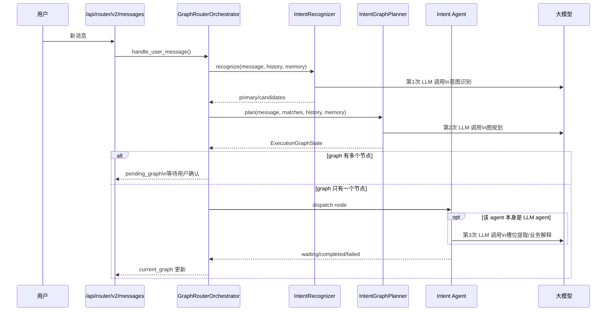
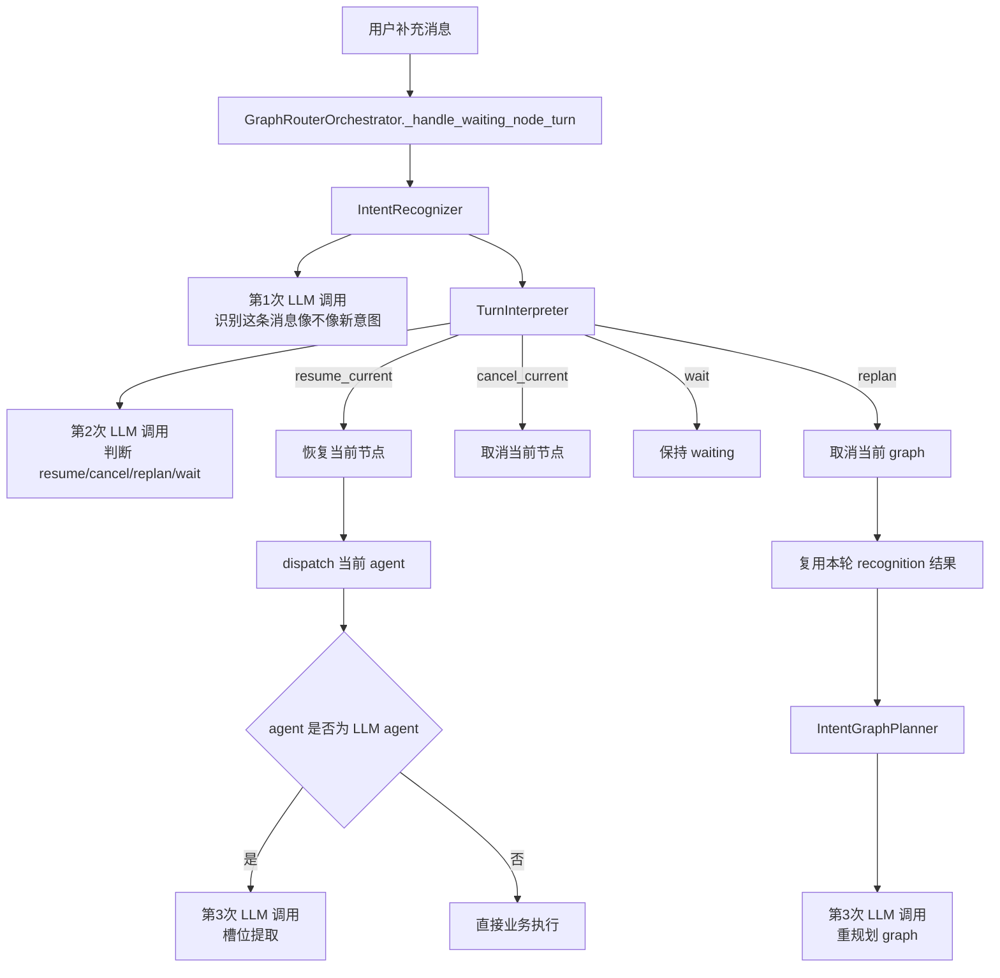
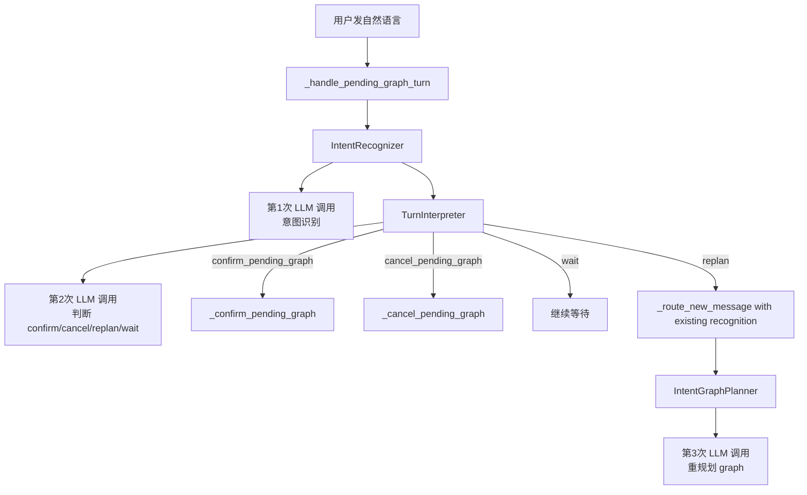

# V2 当前 LLM 调用流程图

本文描述的是当前 `/api/router/v2` 运行时的真实调用链，不是目标态设计图。

关注点只有两个：

- 一条用户输入进来后，当前 V2 会调用几次大模型
- 不同状态下，这几次大模型分别承担什么职责

## 1. 总览

当前 V2 把三个问题拆成了三层：

1. `IntentRecognizer`
   负责识别当前消息命中了哪些 intent
2. `IntentGraphPlanner`
   负责把识别结果组织成 graph
3. `TurnInterpreter`
   负责在 waiting / pending_graph 状态下判断当前新消息是补充、取消、确认还是重规划

业务 agent 自己如果是 LLM agent，还会再额外调用一次大模型做槽位提取。

## 2. 首轮新消息

适用场景：

- 当前没有 `pending_graph`
- 当前没有 `waiting_node`
- 用户发来一条新的自然语言消息



结论：

- 首轮新消息通常至少会有 `2` 次 LLM 调用
- 如果命中的节点 agent 也是 LLM agent，通常会变成 `3` 次

## 3. Waiting Node 状态

适用场景：

- 当前 `current_graph` 里有一个节点处于 `waiting_user_input`
- 用户继续发来补充消息



这里最关键的一点是：

- waiting node 下的补充消息，当前实现不是直接送给 agent
- 它会先经过一次 `recognizer`
- 再经过一次 `turn interpreter`
- 只有决定 `resume_current` 之后，才真正把消息送给当前 agent

所以 waiting node 的自然语言补充，当前通常是：

- `2` 次核心 LLM 调用
- 如果当前 agent 自己也用 LLM，再额外 `+1`

## 4. Pending Graph 状态

适用场景：

- 当前已经有 `pending_graph`
- 用户还没确认执行

这里有两条完全不同的入口。

### 4.1 用户点按钮 `confirm_graph` / `cancel_graph`

```mermaid
flowchart TD
    A[用户点击按钮] --> B[/api/router/v2/actions]
    B --> C[GraphRouterOrchestrator.handle_action]
    C -->|confirm_graph| D[_confirm_pending_graph]
    D --> E[_drain_graph]
    E --> F[dispatch node agent]
    F --> G{agent 是否为 LLM agent}
    G -->|是| H[agent 自己调用 LLM]
    G -->|否| I[直接业务执行]

    C -->|cancel_graph| J[_cancel_pending_graph]
```

这条按钮路径本身不会再走 `recognizer`，也不会走 `turn interpreter`。

结论：

- 按钮确认/取消图，本身 `0` 次核心 LLM 调用
- 后续只有 node agent 可能再调 LLM

### 4.2 用户在 `pending_graph` 时发自然语言



注意这里的 `replan` 路径：

- 会复用刚才那次 `recognition`
- 不会再重复做第二次 intent recognition
- 但会再调用一次 graph planner

## 5. 当前调用次数一览

| 场景 | 核心 LLM 调用 | 可能的 agent LLM | 合计常见次数 |
| --- | --- | --- | --- |
| 首轮新消息 | recognizer + graph planner | 可能有 | 2 或 3 |
| waiting node 补充消息 | recognizer + turn interpreter | 可能有 | 2 或 3 |
| pending graph 按钮确认 | 无 | 可能有 | 0 或 1 |
| pending graph 自然语言确认/取消 | recognizer + turn interpreter | 通常无 | 2 |
| pending graph 自然语言 replan | recognizer + turn interpreter + graph planner | 后续可能有 | 3 或 4 |

## 6. 当前设计的直接含义

当前 V2 的大模型不是“一次做完所有事”，而是拆成了多层：

- 先识别
- 再规划
- 再解释 waiting/pending_graph 状态下的新消息
- 最后交给具体业务 agent

这种拆法的好处是职责清晰，但代价也很直接：

- 调用次数偏多
- 延迟会叠加
- 某些 waiting 场景下，补充消息会先被上层判定，再进入 agent

## 7. 当前最值得继续优化的点

如果后续要降调用次数，最直接的两个收敛方向是：

1. 把“意图识别 + 图规划”合成一次 LLM 调用
2. 把 waiting / pending_graph 下的“意图识别 + turn interpreter”合成一次 LLM 调用

这样可以把当前多段式链路收敛成：

- 首轮新消息：`1 次 graph LLM + 1 次 agent LLM`
- waiting node：`1 次 turn-decision LLM + 1 次 agent LLM`

这会更接近你想要的动态 graph runtime。
