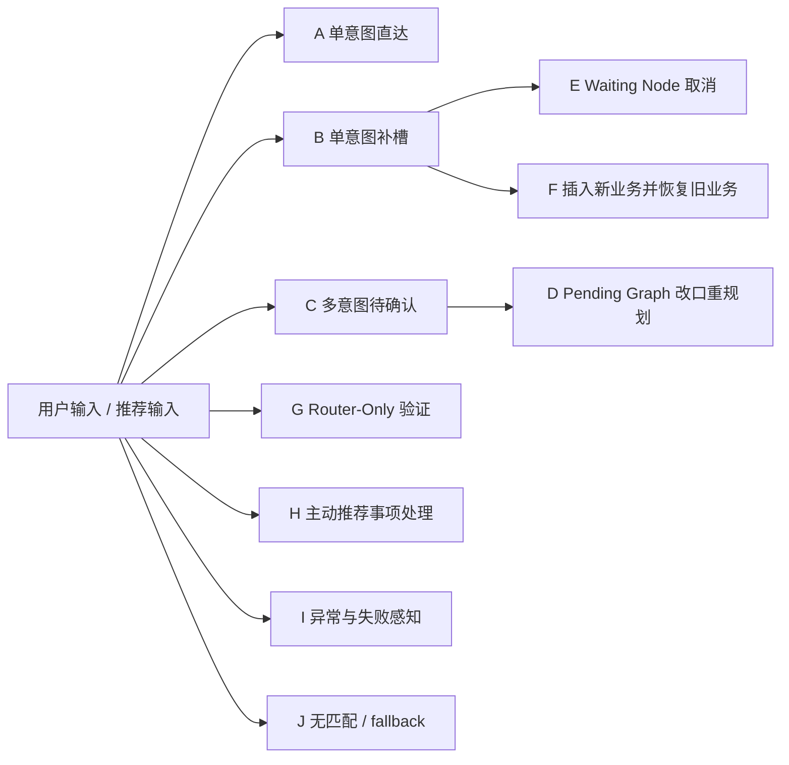
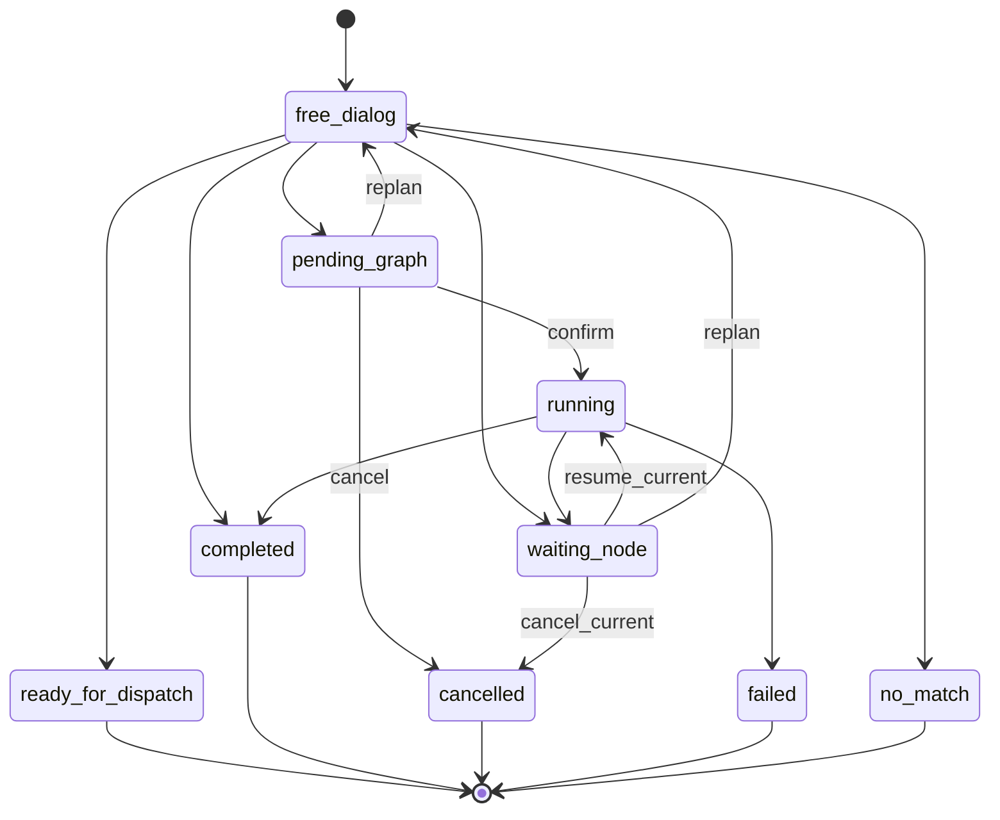
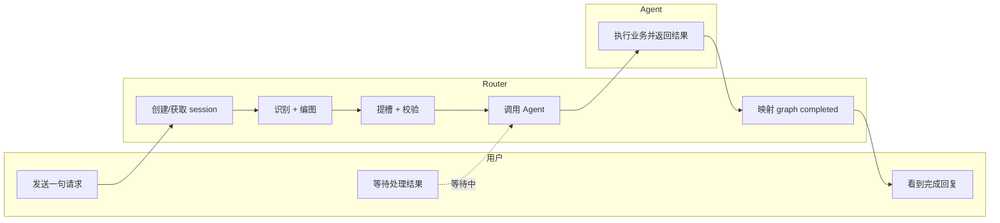
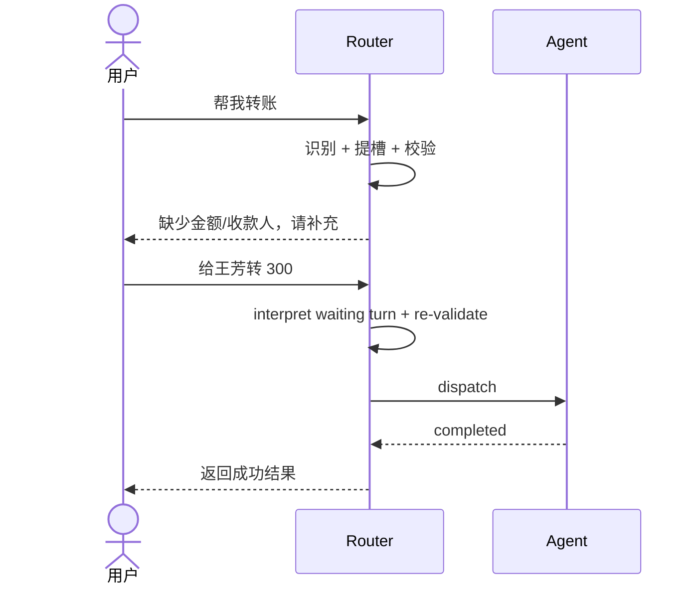
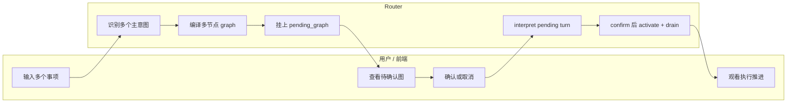
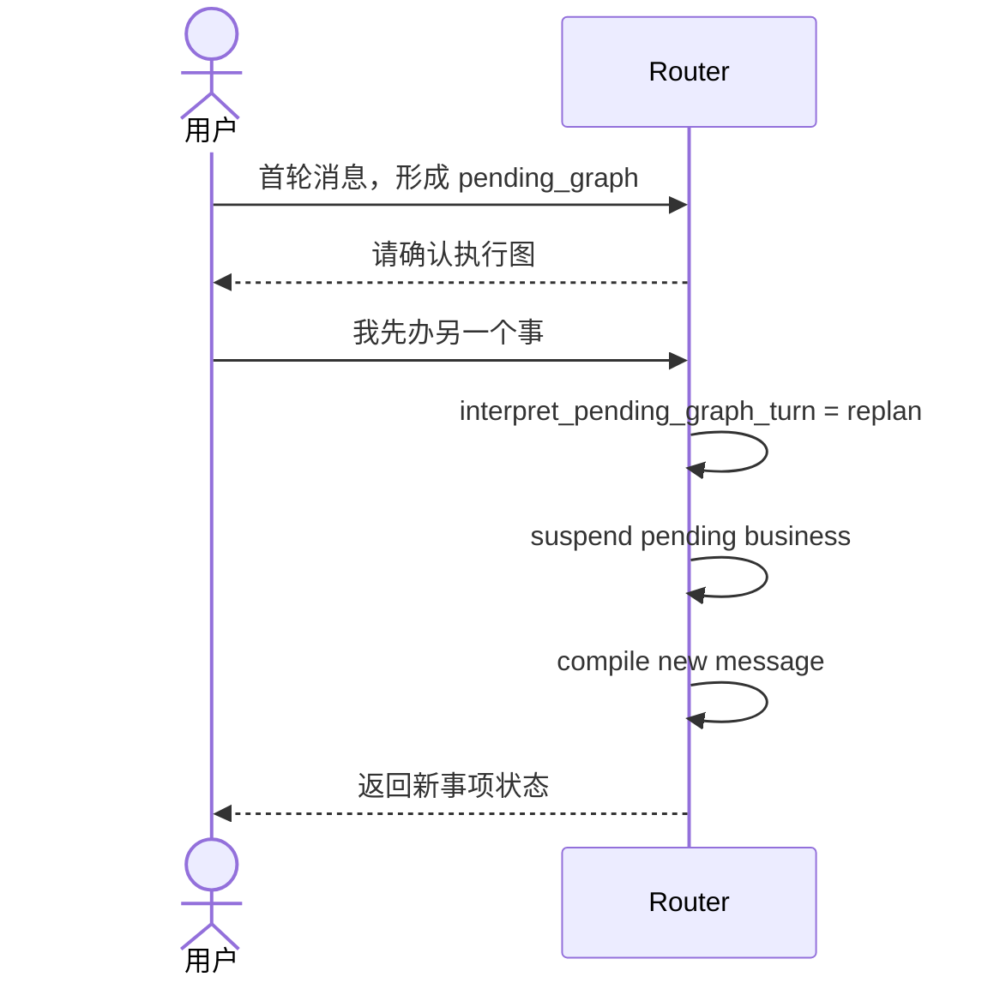
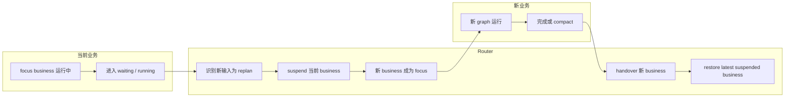
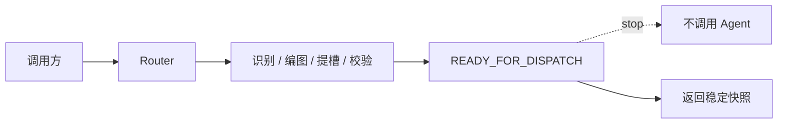
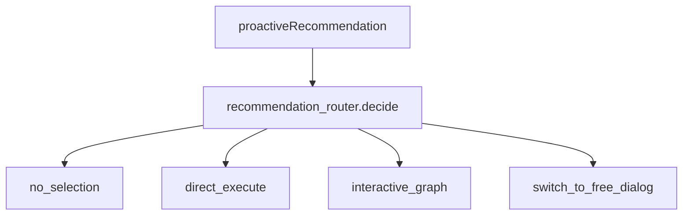
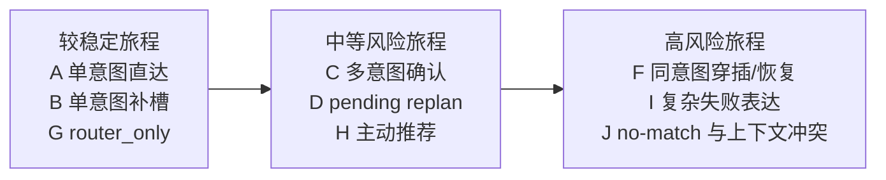

# Router Service 用户旅程文档

状态：对齐草案  
更新时间：2026-04-18  
适用分支：`test/v3-concurrency-test`

## 1. 文档目标

本文档从“端到端体验”的角度描述 Router Service 参与的关键旅程，帮助团队对齐：

1. 用户在不同场景下的感知是什么。
2. Router 在每一步的职责是什么。
3. 当前实现已经做到哪一步，哪些地方还有风险或缺口。

## 2. 旅程阅读说明

每条旅程都分成 4 个部分：

1. 场景目标
2. 触发条件
3. 旅程步骤
4. 当前能力判断与风险点

### 2.1 旅程全景图



### 2.2 旅程状态视图



## 3. 旅程 A：单意图单轮直接完成

### 场景目标

用户一句话表达一个简单事项，系统直接理解并完成，不打断用户。

### 触发条件

1. 单一事项
2. 槽位已足够
3. 不需要 graph 级确认

### 旅程步骤

| 阶段 | 用户动作 | Router 行为 | 用户可见结果 |
| --- | --- | --- | --- |
| 进入 | 用户发送一句请求 | 创建或获取 session，记录用户消息 | 无 |
| 理解 | Router 做意图识别和 graph 编译 | 形成单节点图 | 无 |
| 校验 | Router 做本地槽位提取和校验 | 判定节点可执行 | 无 |
| 执行 | Router 调用 Agent | 等待业务结果 | 可能短暂 loading |
| 完成 | Agent 返回 completed | Router 映射为 graph completed | 用户看到完成回复 |

### 当前能力判断

1. 已实现。
2. 适用于简单单意图直达路径。

### 风险点

1. 若模型识别不稳，可能误入 no-match。
2. 若意图设置了强制确认，旅程会切换到旅程 C。

### 3.1 旅程 A 泳道图



## 4. 旅程 B：单意图多轮补槽

### 场景目标

用户第一次说得不完整，系统明确追问缺失信息；用户补一句后继续完成，不重新开始。

### 触发条件

1. 单意图
2. Router 侧发现缺必填槽位、存在歧义或存在无效槽位

### 旅程步骤

| 阶段 | 用户动作 | Router 行为 | 用户可见结果 |
| --- | --- | --- | --- |
| 首轮输入 | “帮我转账” | 识别出转账节点，做槽位校验 | 无 |
| 阻塞 | 槽位不够 | 节点置为 `waiting_user_input` | 用户看到“请提供金额/收款人...” |
| 补充 | “给王芳转 300” | waiting node turn interpreter 判断为 `resume_current` | 无 |
| 恢复 | Router 重新做当前节点理解校验 | 槽位补齐后可执行 | 无 |
| 完成 | 调用 Agent 并结束 | graph completed | 用户看到成功回复 |

### 当前能力判断

1. 已实现。
2. 当前是 Router Service 最核心、最稳定的能力之一。

### 风险点

1. waiting turn 解释较依赖 LLM。
2. 若用户表达模糊，可能继续停留 waiting 状态。

### 4.1 旅程 B 时序图



## 5. 旅程 C：多意图识别与图确认

### 场景目标

用户一句话说多个事项，系统先展示或隐式建立待确认图，待用户确认后再执行。

### 触发条件

1. 一个输入识别出多个主意图
2. 或 graph build hints 要求确认
3. 或 history prefill 导致需要确认

### 旅程步骤

| 阶段 | 用户动作 | Router 行为 | 用户可见结果 |
| --- | --- | --- | --- |
| 首轮输入 | “先查余额，再转账” | 编译多节点 graph | 无 |
| 形成待确认图 | graph 置为 `waiting_confirmation` | session 挂上 `pending_graph` | 用户看到待确认图/待确认提示 |
| 决策 | 用户确认或取消 | pending graph turn interpreter 判断意图 | 用户点击确认或输入确认 |
| 执行 | confirm 后 graph 激活并开始 drain | 逐节点推进 | 用户看到执行过程 |

### 当前能力判断

1. 已实现。
2. 多意图能力存在，但真实 LLM 环境下受时延和限流影响更明显。

### 风险点

1. pending graph 的用户确认表达仍有解释复杂度。
2. 多意图真实链路成本较高。

### 5.1 旅程 C 泳道图



## 6. 旅程 D：Pending Graph 阶段改口重规划

### 场景目标

用户在看到待确认图后改变主意，不是确认/取消，而是提出新的事项。

### 触发条件

1. session 当前有 `pending_graph`
2. 用户新输入不是简单确认，也不是简单取消

### 旅程步骤

| 阶段 | 用户动作 | Router 行为 | 用户可见结果 |
| --- | --- | --- | --- |
| 待确认 | 系统已经在等图确认 | 挂起 pending business | 用户仍处于当前 session |
| 改口 | 用户输入新事项 | turn interpreter 给出 `replan` | 无 |
| 重规划 | Router 把原 pending business 挂起，新消息进入普通编译链 | 形成新的 graph | 用户看到新事项对应状态 |

### 当前能力判断

1. 已实现基础路径。
2. 这是 business object 模型的重要收益点。

### 风险点

1. 何时算“改口新事项”，当前仍高度依赖 LLM 决策。

### 6.1 旅程 D 时序图



## 7. 旅程 E：Waiting Node 阶段取消当前事项

### 场景目标

用户不想继续当前补槽事项，希望明确取消并退出阻塞状态。

### 触发条件

1. 当前存在 `waiting_node`
2. 用户明确表示取消

### 旅程步骤

| 阶段 | 用户动作 | Router 行为 | 用户可见结果 |
| --- | --- | --- | --- |
| waiting | 系统正在追问 | 监听下一轮消息 | 用户看到追问文案 |
| 取消 | 用户说“算了”“不用了” | waiting turn interpreter 输出 `cancel_current` | 无 |
| 取消执行 | Router 取消当前 node，必要时协同 Agent cancel | graph 继续刷新 | 用户看到已取消或后续节点推进 |

### 当前能力判断

1. 已实现。
2. `cancel_node` 也支持显式动作接口。

### 风险点

1. 如果用户表达不够明确，可能被解释成补当前槽位。

## 8. 旅程 F：插入新业务并尝试恢复旧业务

### 场景目标

用户在当前事项还未完成时，插入一个新事项；新事项完成后，希望系统继续原来的事项。

### 触发条件

1. 当前 focus business 未完成
2. 用户新输入被解释为 `replan`

### 旅程步骤

| 阶段 | 用户动作 | Router 行为 | 用户可见结果 |
| --- | --- | --- | --- |
| 当前业务进行中 | 系统在等补槽或执行 | focus business 存在 | 用户正在和当前事项交互 |
| 插入新业务 | 用户说“先帮我做另一个事” | Router suspend 当前 business | 原业务被暂停 |
| 新业务处理 | 新 business 成为 focus | 新 graph 正常运行 | 用户看到新事项交互 |
| 新业务 handover | 当前 business compact 成 digest | Router 尝试 restore latest suspended business | 旧事项有机会恢复 |

### 当前能力判断

1. 运行时结构已支持。
2. “异意图插入”具备基础路径。
3. “同意图穿插/恢复”仍是当前真实缺口。

### 风险点

1. 同意图场景的目标变化、覆盖策略、恢复语义仍不稳定。
2. 真实业务链路下，恢复点是否准确仍需进一步收紧。

### 8.1 旅程 F 恢复泳道图



## 9. 旅程 G：Router-Only 集成验证

### 场景目标

前端、测试或压测调用方希望只验证 Router 的理解结果，不触发真实业务执行。

### 触发条件

1. `executionMode=router_only`

### 旅程步骤

| 阶段 | 调用方动作 | Router 行为 | 调用方感知 |
| --- | --- | --- | --- |
| 提交消息 | 带上 `router_only` | 仍做识别、编图、补槽、graph state 推进 | 无 |
| 准备执行 | 节点槽位具备 dispatch 条件 | 节点置为 `READY_FOR_DISPATCH` | snapshot 中可见 |
| 返回 | 不调用 Agent | graph 置为 `READY_FOR_DISPATCH` | 调用方拿到稳定快照 |

### 当前能力判断

1. 已实现。
2. 是真实运行时路径，不是旁路分析接口。

### 风险点

1. 业务方不能把 `router_only` 误认为“业务已完成”。
2. 它代表的是“已具备执行条件”，不是“已真正执行”。

### 9.1 旅程 G 边界图



## 10. 旅程 H：主动推荐事项处理

### 场景目标

系统先向用户推送一组推荐事项，用户可以不选、直接选定执行，或把它们变成交互式执行图。

### 触发条件

1. 调用方传入 `proactiveRecommendation`

### 旅程步骤

| 阶段 | 用户动作 | Router 行为 | 用户可见结果 |
| --- | --- | --- | --- |
| 展示推荐 | 前端展示推荐事项 | Router 记录 proactive context | 无 |
| 用户选择 | 用户选择一个或多个事项，或修改输入 | recommendation router 决策 route mode | 无 |
| 分流 | direct execute / interactive graph / no selection / free dialog | Router 进入对应链路 | 用户看到执行或退出 |

### 当前能力判断

1. 已实现。
2. 是当前 Router 相比传统“只接纯文本”架构更先进的一块能力。

### 风险点

1. 推荐默认值与历史值、当前输入之间可能冲突。
2. recommendation route decision 当前仍较依赖 LLM。

### 10.1 旅程 H 分流图



## 11. 旅程 I：异常与失败感知

### 场景目标

当模型繁忙、图状态异常或下游失败时，用户和调用方都能得到一致反馈。

### 触发条件

1. LLM 429 / 临时不可用
2. graph drain 超限
3. agent HTTP 失败

### 旅程步骤

| 阶段 | 系统异常 | Router 行为 | 调用方/用户感知 |
| --- | --- | --- | --- |
| LLM 繁忙 | retryable error | 返回“当前意图识别服务繁忙，请稍后重试” | 用户看到可理解提示 |
| graph 异常 | drain 超限 | graph 标记为 failed | 用户和调用方都能看到失败状态 |
| agent 失败 | HTTP 失败/超时 | 节点失败并刷新 graph | 前端可看到 node.failed / graph.failed |

### 当前能力判断

1. 已实现统一错误包装和多层事件。

### 风险点

1. 仍需继续提升 diagnostics 的可解释性和产品化表达。

### 11.1 旅程 I 异常处理图

```mermaid
flowchart TD
    err["异常"] --> llm["LLM 429 / 不可用"]
    err --> graph["drain 超限"]
    err --> agent["Agent HTTP 失败"]

    llm --> r1["返回 retryable 提示"]
    graph --> r2["graph.failed + session.idle"]
    agent --> r3["node.failed / graph.failed"]
```

## 12. 旅程 J：无匹配与 fallback

### 场景目标

用户表达了一个系统当前不支持或无法稳定识别的事项时，Router 不乱猜，而是给出明确的无匹配反馈。

### 触发条件

1. active intents 中没有稳定命中项
2. fallback intent 存在，或 Router 需要返回 no-match 提示

### 旅程步骤

| 阶段 | 用户动作 | Router 行为 | 用户可见结果 |
| --- | --- | --- | --- |
| 输入 | 用户发送一个不在当前目录中的事项 | Router 进入自由输入识别链 | 无 |
| 识别失败 | recognition 没有稳定 primary intent | Router 保留 diagnostics，并尝试 fallback / no-match | 无 |
| 返回 | Router 不构造错误业务 graph | 发布 no-match hint 或 fallback 状态 | 用户看到“暂不支持/请换种说法/请补充更多信息” |

### 当前能力判断

1. 已实现基础 no-match / fallback 路径。
2. 当前遵循 fail-closed，而不是本地硬编码猜测。

### 风险点

1. fallback 文案和产品化表达还可以继续收紧。
2. recommendation context、历史上下文与 no-match 的冲突处理仍需继续打磨。

### 12.1 旅程 J 无匹配流程图

```mermaid
flowchart LR
    input["用户输入"] --> rec["recognition"]
    rec --> hit{"稳定命中?"}
    hit -->|yes| graph["进入 graph 编译"]
    hit -->|no| fallback["fallback / no-match"]
    fallback --> reply["返回明确提示，不乱猜"]
```

## 13. 用户旅程总结

从旅程视角看，Router 当前最重要的价值点是：

1. 把“用户说了一句话”变成“系统当前处于什么状态”。
2. 把“系统当前处于什么状态”稳定地映射成：
   - pending graph
   - waiting node
   - ready_for_dispatch
   - completed / failed / cancelled
3. 让用户在多轮、多事项、待确认、待补槽场景下仍能感知到连续性。

当前最值得优先补齐的旅程缺口是：

1. 同意图穿插/恢复
2. waiting decision 的可解释规则化
3. recommendation / history / current input 冲突时的更稳定决策

### 13.1 旅程风险热区图


