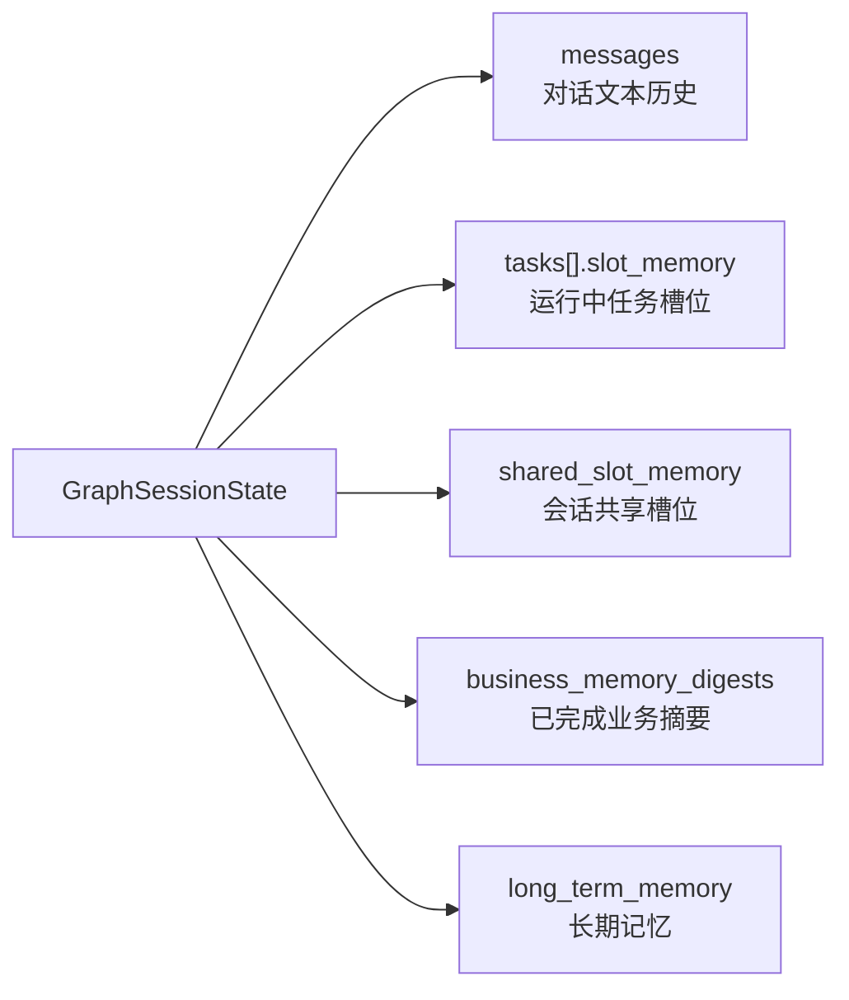
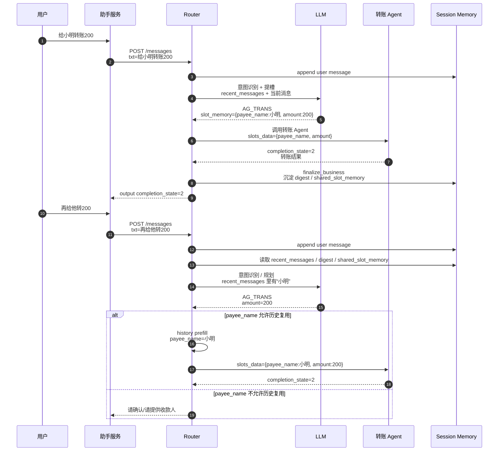
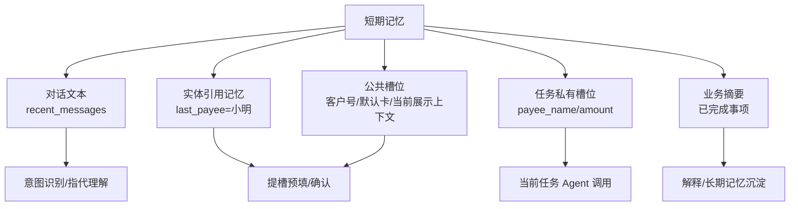
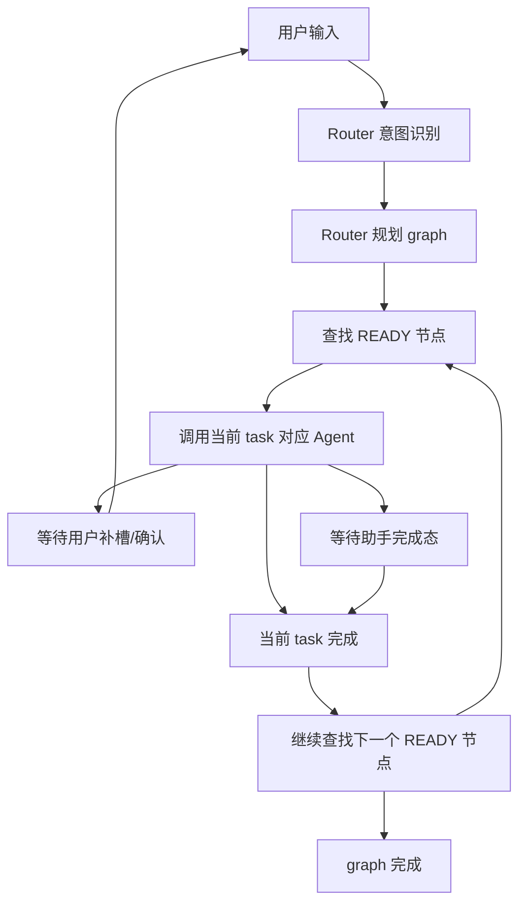
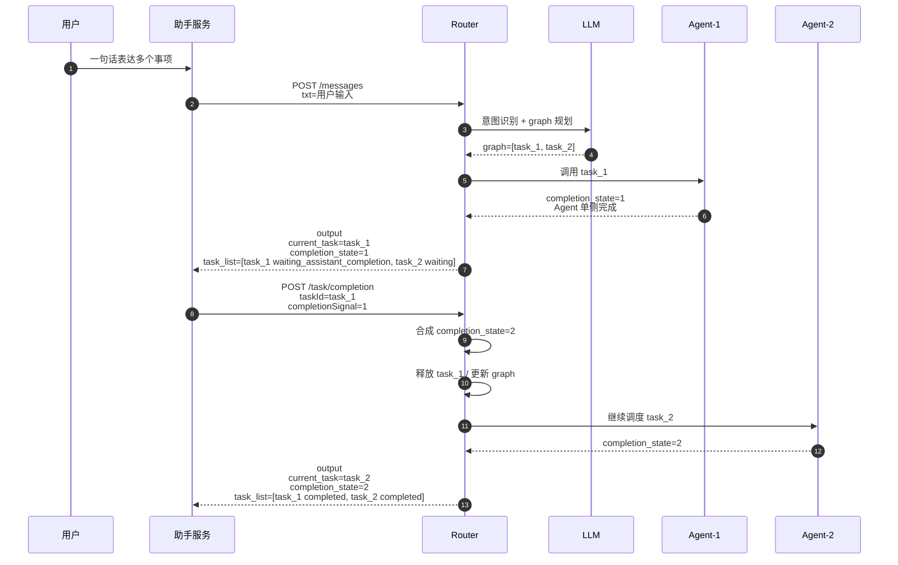
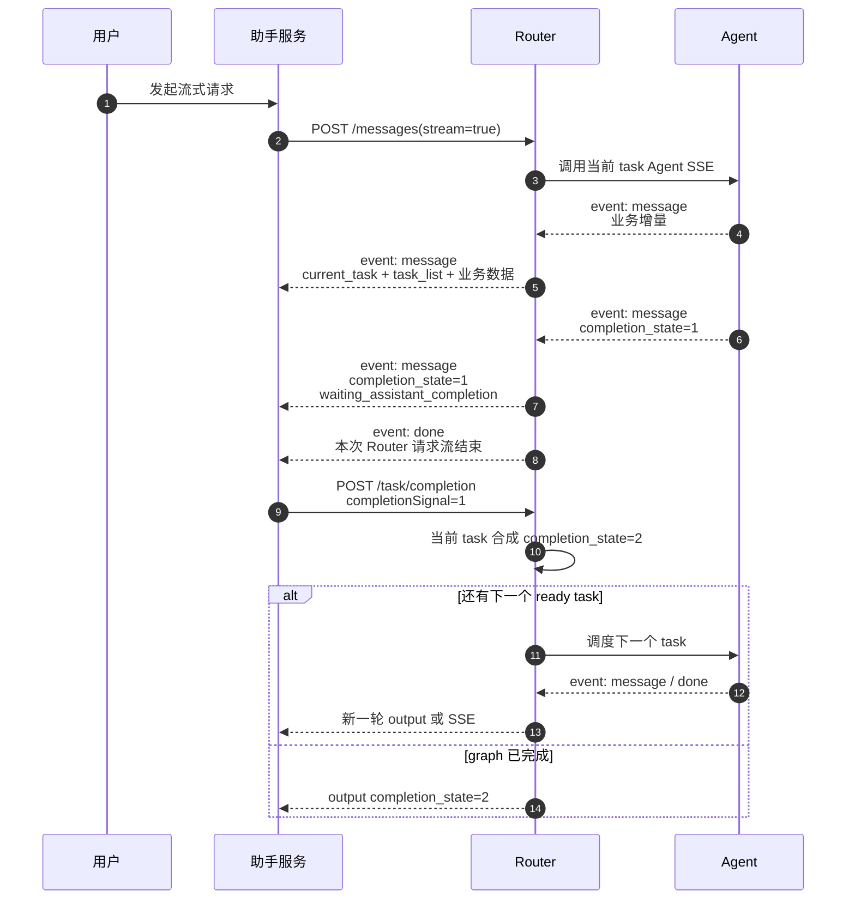
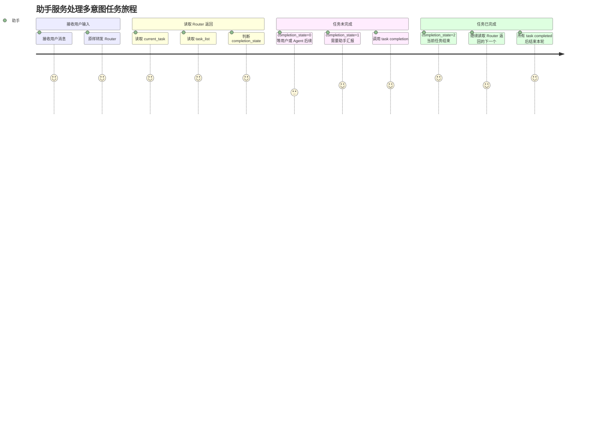
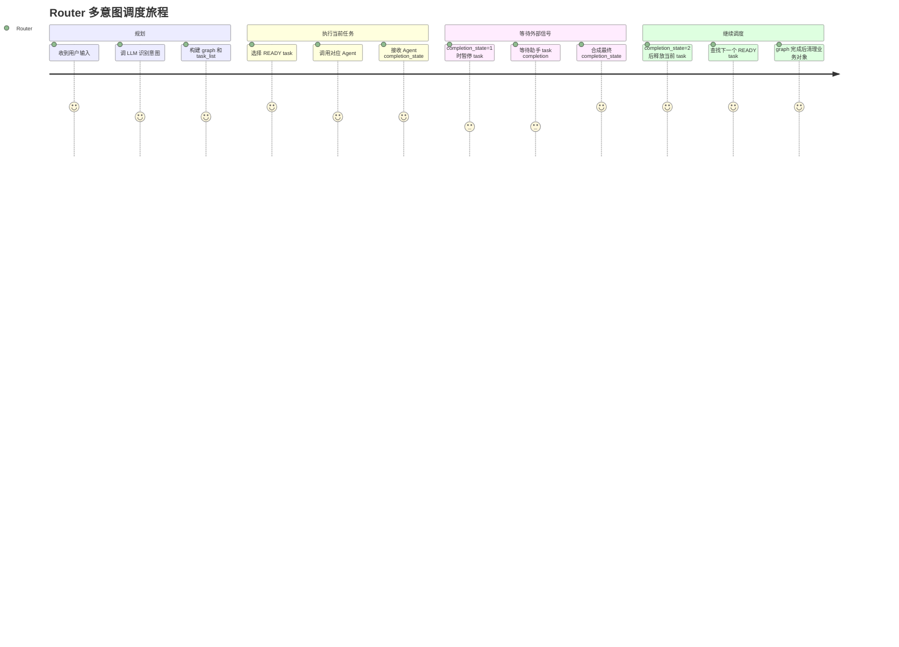
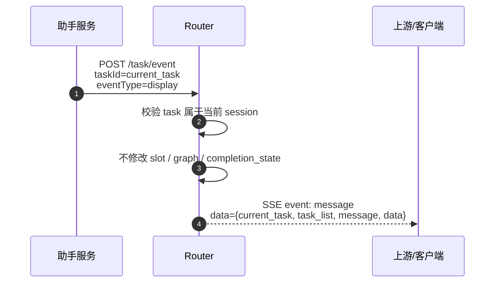

# Router Service 短期记忆与多意图调度时序旅程 v0.3

> 本文只描述当前 Router 运行时形态及下一步设计切入口，用于和业务侧讨论记忆复用、多意图调度、助手完成态汇报和展示事件的边界。

## 1. 记忆链路

### 1.1 关键结论

1. `session.messages` 是对话文本历史，进入 LLM 时会被整理成 `recent_messages_json`。
2. `node.slot_memory` 是当前任务槽位，不应默认跨任务共享。
3. `shared_slot_memory` 应只保留公共槽位或允许跨任务复用的槽位。
4. `business_memory_digests` 是已完成任务摘要，可用于短期上下文和长期记忆沉淀，但不能直接等同于公共槽位。
5. “给小明转账200”完成后，用户再说“再给他转200”，这里的“小明”严格说不是公共槽位，而是短期指代记忆或业务摘要中的实体引用。
6. 当前代码有历史槽位预填能力，但是否能把“小明”回填到新转账任务，受 `slot_schema.allow_from_history` 控制。
7. 当前转账的 `payee_name.allow_from_history=false`，所以“再给他转200”不能作为正式能力承诺，只能依赖 LLM 从最近对话里推断，稳定性不够。

### 1.2 当前记忆数据形态



### 1.3 当前给 LLM 的上下文形式

识别和规划阶段主要看到：

```json
{
  "message": "再给他转200",
  "recent_messages_json": [
    "user: 给小明转账200",
    "assistant: 已提交转账",
    "user: 再给他转200"
  ],
  "long_term_memory_json": [
    "AG_TRANS: amount=200, payee_name=小明"
  ],
  "intents_json": []
}
```

提槽阶段主要看到：

```json
{
  "message": "再给他转200",
  "source_fragment": "再给他转200",
  "intent_json": {},
  "existing_slot_memory_json": {
    "amount": "200"
  }
}
```

如果历史槽位允许复用，Router 会在提槽前把历史候选注入 `existing_slot_memory_json`。如果不允许复用，LLM 即使从 `recent_messages_json` 看到了“小明”，也不应该无约束写入当前任务槽位。

### 1.4 示例：当前形态下的“再给他转200”



### 1.5 当前缺口

当前实现的“记忆复用”具备基础链路，但边界需要收紧：

| 问题 | 当前形态 | 建议设计 |
|---|---|---|
| 任务完成后槽位沉淀 | `finalize_business` 会把任务槽位合并进 `shared_slot_memory` | 只晋升 `bind_scope=shared_prefill` 或公共字段 |
| “他/她/这个人”指代 | 主要依赖最近对话和历史槽位复用 | 增加短期实体引用记忆，不混入公共槽位 |
| 历史槽位能否回填 | 由 `allow_from_history` 控制 | 对敏感/交易类槽位默认要求确认或显式配置 |
| 长期记忆格式 | 文本 fact，例如 `AG_TRANS: payee_name=小明` | 后续 sidecar 可存结构化 memory item |

### 1.6 建议的记忆分层



建议规则：

1. 公共槽位进 `shared_slot_memory`。
2. 已完成任务进入 `business_memory_digests`。
3. 可被“他/她/上次那个”引用的对象，进入短期实体引用记忆。
4. 当前任务调用 Agent 时，最终仍收敛成 `slots_data`。
5. 是否自动复用，必须由 slot schema 或业务策略控制，不能写死规则。

## 2. 多意图调度与助手完成态

### 2.1 关键结论

1. Router 是唯一识别、规划和调度者。
2. 助手服务不需要提前知道用户这句话拆成几个意图。
3. Router 每次返回都应带 `current_task` 和 `task_list`，助手通过这两个字段理解当前状态。
4. Agent 完成信号和助手完成信号都只作用于 `current_task`。
5. `completion_state=2` 后，Router 才能认为当前任务真正结束。
6. 当前设计上，`/api/v1/task/completion` 应该不仅是状态更新接口，也应该是继续调度 graph 的触发点。
7. 如果某个任务需要助手提供展示内容，应预留展示事件入口，但展示事件不能修改 Router 状态机。

### 2.2 当前调度模型



### 2.3 当前非流式主链路时序



> 注意：上图是应对齐的目标运行语义。当前代码已经具备 completion 信号合成和任务完成更新，但 completion 回调后自动继续 drain 后续 ready task 需要作为实现点确认和补齐。

### 2.4 SSE 主链路时序



### 2.5 助手视角旅程



### 2.6 Router 视角旅程



### 2.7 预留切入口：助手展示事件

如果业务希望助手在某个任务执行过程中提供 display、卡片或打字机文本，建议单独预留展示事件入口。



该入口只允许写入展示事件：

| 字段 | 是否允许助手影响 | 说明 |
|---|---:|---|
| `message` | 是 | 展示文案 |
| `data` | 是 | 展示卡片、display payload |
| `completion_state` | 否 | 只能通过 `/task/completion` 更新 |
| `slot_memory` | 否 | 由 Router 提槽或 Agent 回传 |
| `task_list` | 否 | 由 Router 状态机生成 |
| graph 状态 | 否 | 由 Router 调度器生成 |

### 2.8 建议讨论点

1. “再给他转200”是否允许自动复用上一收款人，还是必须二次确认。
2. 哪些槽位属于公共槽位，哪些只属于任务私有槽位。
3. 是否需要新增短期实体引用记忆，专门处理“他/她/那个/上一笔”。
4. `/task/completion` 是否必须触发 Router 继续调度后续 task。
5. 助手 display 事件是否需要单独接口，还是只作为 Router SSE 输出的一种事件类型。
6. `event: done` 表示当前 HTTP/SSE 请求结束，还是整个 graph/session 全部完成。
