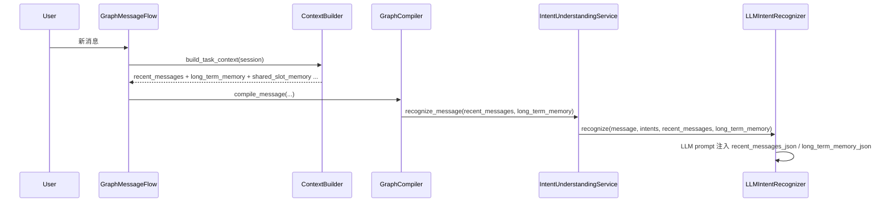
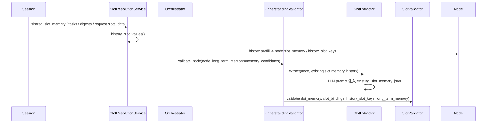
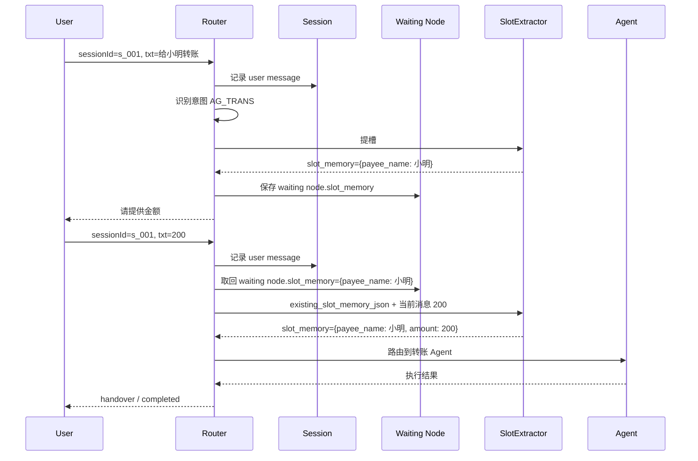

# Router-Service 短期记忆现状与传递证明 v0.3

> 状态：实现对照稿
> 日期：2026-04-22
> 目的：说明当前 Router 是否已经具备短期记忆，并证明这些记忆已经参与意图识别或提槽

## 1. 结论

结论先说清楚：

1. **当前 Router 已经有短期记忆，不是空白状态。**
2. 短期记忆当前至少包括：
   - session 对话消息 `messages`
   - session 级共享槽位 `shared_slot_memory`
   - live task 的 `slot_memory`
   - 已完成业务对象压缩后的 `business_memory_digests`
   - 当前请求透传进来的 `slots_data`
3. **意图识别阶段已经接入短期记忆**，主要通过 `recent_messages` 进入识别/规划链路。
4. **提槽阶段已经接入短期记忆**，主要通过 `node.slot_memory`、`history_slot_values`、`shared_slot_memory`、task slot memory、digest slot memory 进入提槽/校验链路。
5. 当前实现不是把所有短期记忆原样平铺给所有模型，而是按链路做了收敛：
   - 识别/规划看 `recent_messages` + `long_term_memory`
   - 提槽看 `existing_slot_memory` + history candidates + history-grounded validation

所以，当前状态不是“没有短期记忆”，而是“**已有短期记忆能力，但入口和载体分两条链路**”。

## 2. 当前短期记忆长什么样

### 2.1 Session 里已经保存的短期态

当前 session 运行时对象 `GraphSessionState` 已经保存这些内容：

1. `messages`
2. `tasks`
3. `shared_slot_memory`
4. `business_memory_digests`
5. 当前请求上下文里的 `config_variables` / `slots_data`

这意味着：

1. 用户最近说过什么，已经记住；
2. 已有任务已经抽到的槽位，已经记住；
3. 已结束任务沉淀出的公共槽位，已经记住；
4. 当前请求显式透传的槽位提示，也已经记住。

## 3. 意图识别链路里的短期记忆

### 3.1 调用关系



### 3.2 已有事实

当前识别/规划链路已经做了这些事：

1. `ContextBuilder` 会从 `session.messages` 构造 `recent_messages`；
2. `GraphCompiler.compile_message()` 会把 `recent_messages` 和 `long_term_memory` 继续传下去；
3. `IntentUnderstandingService.recognize_message()` 会把它们继续传给 recognizer；
4. `LLMIntentRecognizer.recognize()` 会把：
   - `recent_messages_json`
   - `long_term_memory_json`
   一起放进意图识别 prompt；
5. 图规划器 `LLMGraphPlanner.plan()` 也会把这两项带进规划 prompt。

### 3.3 这意味着什么

这意味着当前的意图识别和图规划，并不是只看“当前一句话”，而是已经能看到：

1. 最近多轮对话上下文；
2. 已回忆出的记忆事实。

换句话说，**短期对话记忆已经参与了意图识别。**

## 4. 提槽链路里的短期记忆

### 4.1 调用关系



### 4.2 已有事实

当前提槽链路已经做了这些事：

1. `SlotResolutionService.history_slot_values()` 会收集：
   - `session.upstream_slots_data()`
   - `session.shared_slot_memory`
   - `session.tasks[*].slot_memory`
   - `session.business_memory_digests[*].slot_memory`
   - 解析后的长期记忆键值
2. `apply_history_prefill_policy()` 会把这些历史值回灌到 node 的 `slot_memory`；
3. `Orchestrator._validate_node_understanding()` 会把这些历史值再拼成 `slot_key=value` 形式，加入 `memory_candidates`；
4. `UnderstandingValidator.validate_node()` 会把这些候选记忆继续传给：
   - `SlotExtractor.extract(...)`
   - `SlotValidator.validate(...)`
5. `SlotExtractor._extract_with_llm()` 会把当前已持有的 `existing_slot_memory_json` 放进提槽 prompt；
6. `SlotValidator.validate()` 会结合 `history_slot_keys` 和 `long_term_memory` 做 `allow_from_history` 与 grounding 校验。

### 4.3 这意味着什么

这意味着当前提槽不是“每轮重头开始”，而是已经能复用：

1. 当前 session 里沉淀的公共槽位；
2. 当前 live task 里已有槽位；
3. 已结束业务压缩出的 digest 槽位；
4. 当前请求显式透传的 `slots_data`。

换句话说，**短期槽位记忆已经参与了提槽。**

## 5. 当前还没做到的边界

这部分也要说清楚，避免误判。

### 5.1 识别链路

当前识别链路里，直接进 prompt 的主要是：

1. `recent_messages`
2. `long_term_memory`

而不是直接把 `shared_slot_memory` 原样作为独立 prompt 变量喂给识别器。

这说明：

1. 识别链路已经接入短期记忆；
2. 但接入载体主要是对话上下文，不是 session 级槽位缓存直喂。

### 5.2 提槽链路

当前提槽链路里，也不是把 `recent_messages` 整包直接喂给 `SlotExtractor`。

而是先经过：

1. history prefill
2. `history_slot_values`
3. `existing_slot_memory`
4. `history_slot_keys`

再进入 extractor / validator。

这说明：

1. 提槽已经接入短期记忆；
2. 但接入方式是“结构化回灌后的槽位态”，不是“原始 transcript 全量直传”。

## 6. 这次补充的验证用例

这次已经补了直接能跑的测试，用来证明上述链路不是口头描述：

1. `backend/tests/test_graph_compiler.py`
   - `test_graph_compiler_recognize_only_passes_recent_messages_and_memory_from_context`
   - 证明识别链路能拿到 `recent_messages` 和 `long_term_memory`
2. `backend/tests/test_slot_extractor.py`
   - `test_slot_extractor_passes_existing_slot_memory_into_llm_prompt`
   - 证明提槽 LLM 会拿到 `existing_slot_memory_json`
3. `backend/tests/test_graph_orchestrator.py`
   - `test_graph_orchestrator_validate_node_understanding_passes_history_memory_candidates`
   - 证明 session 级历史槽位会被拼成 candidates，继续传入理解/提槽链路

## 7. 验证结果

本次本地已执行：

```text
pytest backend/tests/test_graph_compiler.py backend/tests/test_slot_extractor.py backend/tests/test_graph_orchestrator.py backend/tests/test_router_api_errors.py -q
29 passed

pytest backend/tests/test_router_api_v2.py backend/tests/test_understanding_validator.py backend/tests/test_graph_session_store.py -q
55 passed
```

## 8. 结论

最终结论：

1. 当前 Router 已经有短期记忆；
2. 当前 Router 已经在意图识别链路传了短期记忆；
3. 当前 Router 已经在提槽链路传了短期记忆；
4. 但这两条链路使用的“短期记忆载体”不完全相同：
   - 识别更偏向 `recent_messages`
   - 提槽更偏向 `existing_slot_memory` / history candidates / shared slot reuse
5. 如果后续要进一步强化效果，下一步最值得讨论的是：
   - 是否把 `shared_slot_memory` 摘要显式加入识别 prompt
   - 是否把结构化短期记忆统一抽成专门的 memory context，而不再分散在多处组装

## 9. 串联示例：`给小明转账` -> `200`

下面用一个真实业务形态，把“短期记忆到底怎么串起来”直接讲透。

### 9.1 示例前提

假设会话里使用同一个 `sessionId`，用户连续输入两轮：

1. 第一轮：`给小明转账`
2. 第二轮：`200`

这类场景的业务期望是：

1. 第一轮识别出转账意图 `AG_TRANS`
2. 第一轮先提取出 `payee_name=小明`
3. 因为缺少 `amount`，Router 进入追问
4. 第二轮用户只说 `200`
5. Router 复用上一轮已经拿到的 `payee_name=小明`
6. 第二轮只补 `amount=200`
7. 槽位齐全后再继续路由到 Agent

### 9.2 调用链路



### 9.3 第一轮发生了什么

用户输入：

```json
{
  "sessionId": "s_001",
  "txt": "给小明转账"
}
```

Router 当前会做这些事：

1. 把这轮消息写入 `session.messages`
2. 识别当前意图为 `AG_TRANS`
3. 为转账创建 graph/node
4. 在提槽链路里抽到 `payee_name=小明`
5. 由于 `amount` 仍缺失，把节点置为 `WAITING_USER_INPUT`
6. 将 `payee_name=小明` 保存在当前 waiting node 的 `slot_memory`

此时短期记忆已经存在两层：

1. 对话级：`session.messages`
2. 任务级：`current_graph.nodes[*].slot_memory`

第一轮典型输出形态会接近：

```json
{
  "ok": true,
  "output": {
    "intent_code": "AG_TRANS",
    "status": "waiting_user_input",
    "completion_state": 0,
    "message": "请提供金额",
    "slot_memory": {
      "payee_name": "小明"
    }
  }
}
```

### 9.4 第二轮为什么只说 `200` 也能接上

第二轮用户只输入：

```json
{
  "sessionId": "s_001",
  "txt": "200"
}
```

此时 Router 不是“重新从零开始理解整句话”，而是会优先发现：

1. 当前 session 下已经有一个 waiting node
2. 该 node 已经带着 `slot_memory={payee_name: 小明}`

然后 Router 会走 waiting node 恢复链路：

1. 取回当前 node 的已有槽位
2. 把已有槽位作为 `existing_slot_memory_json` 传给提槽 LLM
3. 当前轮只从 `200` 里补出 `amount=200`
4. 合并后形成完整槽位：

```json
{
  "payee_name": "小明",
  "amount": "200"
}
```

这就是当前最直接的短期记忆闭环：

1. 第一轮沉淀到 `node.slot_memory`
2. 第二轮继续带进提槽 prompt
3. 不需要用户重复再说一遍“给小明”

### 9.5 这一轮里哪些记忆真的参与了

这个两轮例子里，真正起作用的短期记忆载体主要是：

1. `session.messages`
   - 参与识别/规划上下文
2. `waiting node.slot_memory`
   - 参与第二轮提槽
3. `existing_slot_memory_json`
   - 作为提槽 prompt 变量喂给 LLM

如果任务结束并被业务沉淀后，公共槽位还会进一步进入：

1. `session.shared_slot_memory`
2. `business_memory_digests`

但在这个“第一轮追问、第二轮补槽”的即时场景里，最核心的是：

**waiting node 的 `slot_memory` 已经在承担短期记忆。**

### 9.6 对助手联调的直接意义

对助手侧来说，这个例子意味着：

1. 必须持续使用同一个 `sessionId`
2. 第二轮只需要把用户当前输入继续发给 Router
3. 不需要助手自己去拼“上一轮收款人是谁”
4. Router 会基于 session 内的短期记忆把链路接起来

因此，助手接 Router 的最小职责是：

1. 保证 `sessionId` 稳定
2. 把用户原话原样透传
3. 按协议消费 Router 返回的 `output`
