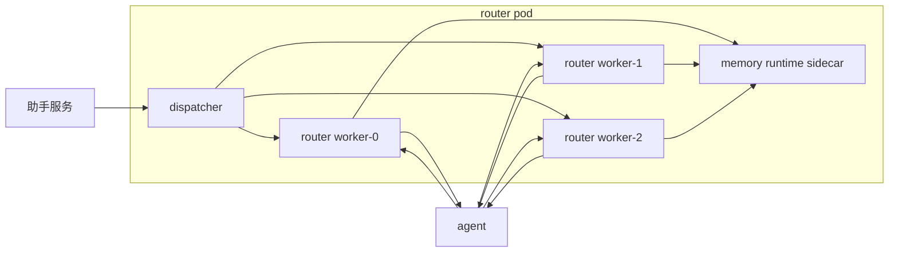
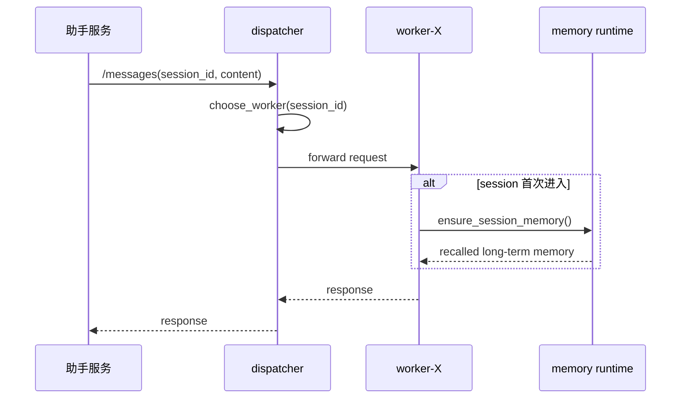
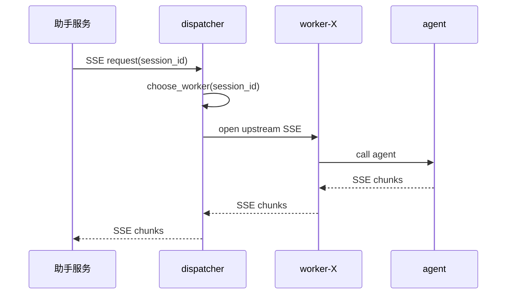

# router-service memory runtime 多 worker 绑定设计 v0.2

状态：设计稿  
更新时间：2026-04-19  
适用分支：`feature/router-memory-runtime-v0.2`

## 1. 目标

当前只讨论一个场景：

1. 单 pod
2. 多 worker
3. session 活跃期真值仍在 router 进程内
4. memory runtime 仍然只负责 session 开头 warmup 和 session 结束 dump

这个设计要解决的核心问题只有一个：

`同一个 session_id，如何在一个 pod 内稳定命中同一个 worker。`

## 2. 约束

先把边界说清楚：

1. 不考虑 pod 级 sticky，外部已经解决。
2. 不引入 Redis 做 `session_id -> pod` 绑定。
3. 不把活跃 session 真值外置。
4. 不允许直接用裸 `uvicorn/gunicorn --workers N` 就结束，因为那样无法保证同一个 `session_id` 命中同一个 worker。

## 3. 结论

推荐方案只有一条：

1. pod 内增加一个 `dispatcher`
2. `dispatcher` 按 `session_id` 把请求固定转发给某个 worker
3. 每个 worker 持有自己的 session shard
4. 一个 pod 只保留一个 `memory runtime sidecar`

不推荐方案：

1. 多 worker 共享监听 socket，靠内核 accept 随机分发
2. 多 worker 共享一份进程外 session 状态，直接把当前分支改成分布式 session store
3. 一个 worker 一个 memory runtime

## 4. 总体结构

职责：

1. `dispatcher`
   - 只做 session 到 worker 的路由
   - 不持有业务 session 真值
   - 负责 SSE 透传
2. `worker`
   - 各自维护自己的 `GraphSessionStore`
   - 各自持有自己的 session 热态
   - 各自独立管理 graph/task/business 生命周期
3. `memory runtime sidecar`
   - 所有 worker 共用一个
   - 只做 warmup/dump

## 5. 调用关系

### 5.1 普通请求

### 5.2 SSE 请求

这里的关键点：

1. 普通请求和 SSE 必须共用同一套 `choose_worker(session_id)` 规则。
2. 一旦 SSE 建链成功，本次连接期间不能切 worker。
3. action 请求也必须走同一规则，否则确认/取消会找不到 live session。

## 6. `choose_worker(session_id)` 设计

### 6.1 推荐算法

在单 pod、worker 数量固定的前提下，推荐两种都可以：

1. 简单取模：`hash(session_id) % worker_count`
2. Rendezvous Hash

我的建议：

1. 如果 worker 数量在运行期不变，用简单取模就够了。
2. 如果希望将来支持 worker 数量变化后尽量少重映射，用 Rendezvous Hash。

当前更推荐 `Rendezvous Hash`，因为表达更清楚，也更容易向后扩。

### 6.2 输入来源

`dispatcher` 不能去 body 里现拆 session_id 作为唯一依赖，最好要求上游明确传：

1. HTTP Header：`X-Session-ID`
2. Body 中仍保留原字段用于业务

也就是说：

1. 业务字段里有 `session_id`
2. 路由头里也有 `X-Session-ID`
3. `dispatcher` 只看头
4. worker 再校验 header/body 是否一致

这样有三个好处：

1. 路由层不需要理解业务 body
2. SSE/普通 POST/action 都能统一处理
3. 后续如果换 Envoy/Nginx 做 dispatcher，也可以直接复用 header hash

### 6.3 worker 表达

worker 建议固定编号：

1. `worker-0`
2. `worker-1`
3. `worker-2`
4. ...

每个 worker 监听自己独立的本地地址，建议：

1. `127.0.0.1:19001`
2. `127.0.0.1:19002`
3. `127.0.0.1:19003`

或者 Unix Domain Socket，也可以。

## 7. dispatcher 形态选择

这里有两个可选实现。

### 7.1 方案 A：Envoy / Nginx 作为 dispatcher

推荐级别：高

做法：

1. pod 内跑一个本地 L7 proxy
2. 按 `X-Session-ID` consistent hash 到本地 worker upstream
3. proxy 负责 HTTP 和 SSE 转发

优点：

1. 生产成熟
2. SSE 代理能力成熟
3. 不需要把路由逻辑塞进 router 应用代码
4. 配置和观测更标准

缺点：

1. 需要额外一层配置和运维
2. worker 本地端口管理要清楚

### 7.2 方案 B：Python 自研 dispatcher

推荐级别：中

做法：

1. pod 内主进程只做转发
2. 自己实现 `choose_worker(session_id)`
3. 通过本地 HTTP 或 UDS 把请求代理给 worker

优点：

1. 所有逻辑都在自己代码里
2. 调试直观

缺点：

1. SSE 透传、超时、断连处理都要自己兜
2. 更容易把网关能力和业务代码耦合

### 7.3 推荐结论

如果追求生产落地，我更推荐：

1. `Envoy/Nginx dispatcher`
2. `router workers`
3. `一个 memory runtime sidecar`

因为这套职责边界最清楚。

## 8. 为什么一个 memory runtime 就够了

在这个方案里，worker 不需要各自拥有 memory runtime。

原因：

1. 活跃 session 真值在 worker 自己内存里。
2. memory runtime 不参与热点读写。
3. 每个 worker 只有在：
   - session 首次进入
   - session 结束/过期
   才会访问 memory runtime。

所以一个 pod 一个 memory runtime 就足够。

## 9. 故障语义

### 9.1 当前方案能做到什么

这个方案能做到：

1. 同一个 `session_id` 稳定命中同一个 worker
2. 多 worker 真正分担并发
3. SSE 不乱串 worker

### 9.2 当前方案做不到什么

如果某个 worker 进程突然 crash：

1. 这个 worker 上的活跃 session 热态会丢
2. 当前正在等待补槽/确认/执行中的 graph 会中断
3. 新请求虽然还能被 dispatcher 转到同编号 worker，但旧热态已经不在了

也就是说，这个方案满足：

1. 路由正确性
2. 并发扩展性

但不满足：

1. 无损 session 级故障切换

### 9.3 如果以后要更强恢复

那就再加一层增强，不放在当前第一阶段做：

1. `SessionCheckpointStore`
2. `SessionOwnerLease`

而且 checkpoint 只在粗粒度状态点写：

1. session 创建
2. attach business
3. 进入 `waiting_user_input`
4. 进入 `waiting_confirmation`
5. `finalize_business`
6. session 关闭

不要按 token 写，也不要按每次内部变更写。

## 10. 实施建议

### 10.1 第一阶段

直接落：

1. 一个 dispatcher
2. `N` 个 router worker
3. 一个 memory runtime sidecar
4. 上游统一传 `X-Session-ID`

### 10.2 第二阶段

验证这几件事：

1. 普通请求命中同一 worker
2. SSE 命中同一 worker
3. action 命中同一 worker
4. 60/120 并发下 worker 分布是否均衡
5. session 过期 dump 是否仍然正确

### 10.3 当前不建议

当前不建议直接做：

1. 多 worker + 外置 session store
2. 多 worker + 每个 worker 一个 memory runtime
3. 裸 `uvicorn --workers`

## 11. 一句话结论

单 pod 多 worker 的正确做法，不是让多个 worker 抢同一个监听口，而是在 pod 内加一层 dispatcher，按 `session_id` 把普通请求、action 和 SSE 一起固定到同一个 worker；worker 持有 session 热态，一个 pod 共享一个 memory runtime sidecar。
