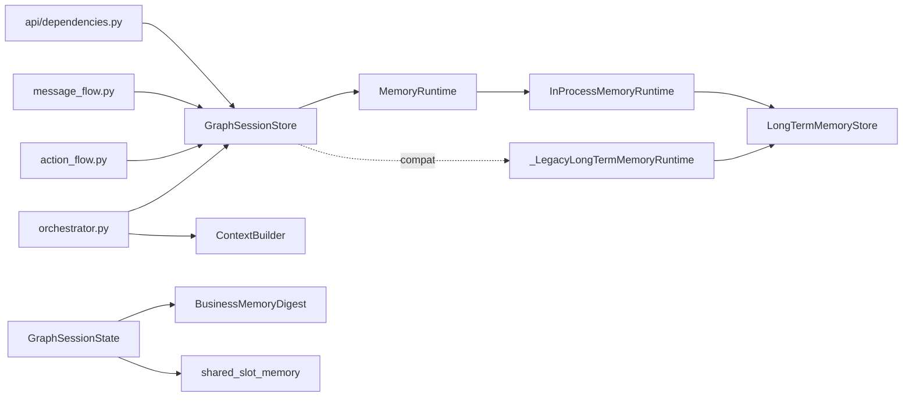
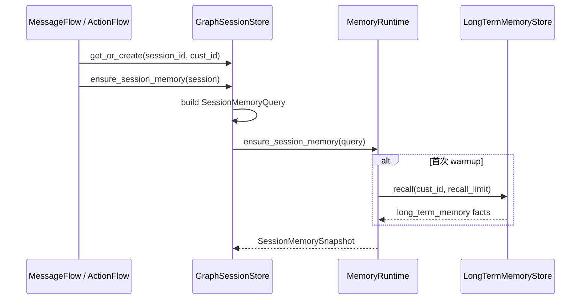
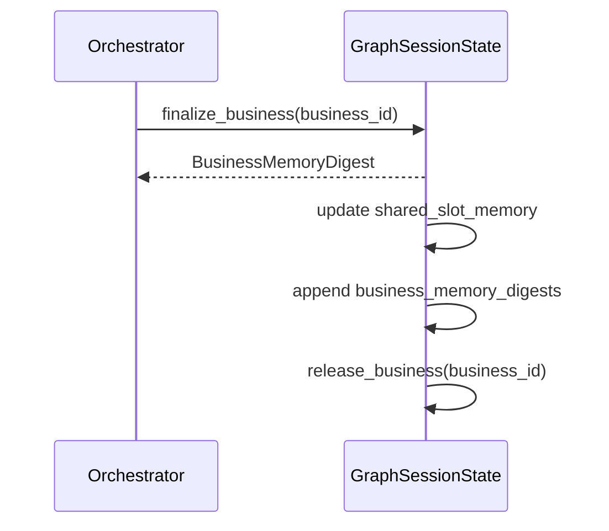

# router-service memory runtime 技术实现设计 v0.2

状态：设计 + 当前实现状态  
更新时间：2026-04-19  
适用分支：`feature/router-memory-runtime-v0.2`

## 1. 背景

memory runtime 这轮的目标，不是一次性把 Router 记忆体系外置成 sidecar，而是先把“长期记忆直接散落调用”的状态收口成统一运行时边界，解决以下几个实现问题：

1. Router 各链路直接碰 `LongTermMemoryStore`，缺少统一抽象。
2. session 冷启动、handover、expire 三条记忆路径没有统一工作集模型。
3. sidecar 未来会演进成独立进程，但当前分支必须先有本地 adapter，才能稳定推进。
4. session 运行时真值、短期工作集缓存、长期记忆提升三层边界需要先在代码里站稳。

当前代码已经完成基础设施主链路落地，但仍然保留兼容兜底，且 sidecar 远程化尚未开始。

## 2. 当前实现结论

### 2.1 已落地能力

| 能力 | 当前状态 | 说明 |
| --- | --- | --- |
| `SessionMemorySnapshot` 短期工作集模型 | 已落地 | 已进入 `memory_store.py`，字段包含 `long_term_memory/shared_slot_memory/business_memory_digests/updated_at` |
| memory runtime DTO 边界 | 已落地 | 已补 `SessionMemoryQuery / SessionMemoryRememberRequest / SessionMemoryDumpRequest`，`session_store -> runtime` 已走 DTO |
| `MemoryRuntime` 抽象 | 已落地 | 已定义 `ensure/get/remember/expire` 四个核心方法 |
| `InProcessMemoryRuntime` 本地 adapter | 已落地 | 当前默认实现，session 级 snapshot 缓存在进程内，长期记忆仍复用 `LongTermMemoryStore` |
| session 冷启动 warmup | 已落地 | `message_flow`、`action_flow` 在 `get_or_create()` 后调用 `ensure_session_memory()` |
| handover 后只回写 session 热态 | 已落地 | `GraphSessionState.finalize_business()` 会把公共槽位和 `BusinessMemoryDigest` 留在 session，并释放任务对象；不再在 session 存活期中途写 memory runtime |
| session context 改走 session-scoped snapshot | 已落地 | `_build_session_context()` 优先读 `get_session_memory()`，不是每次直读长期记忆 |
| session 过期时 promote + 清理 snapshot | 已落地 | `GraphSessionStore.get_or_create()` 和 `purge_expired()` 都会调 `memory_runtime.expire_session()` |
| 运行时默认 wiring | 已落地 | `api/dependencies.py` 默认构建 `InProcessMemoryRuntime`，并把它注入 `GraphSessionStore` |

### 2.2 仍未落地能力

| 能力 | 当前状态 | 说明 |
| --- | --- | --- |
| 真正的 HTTP / gRPC / unix socket sidecar | 未落地 | 目前没有远程 transport、连接池、重试、健康检查、超时治理 |
| 外置 session store | 未落地 | session 生命周期、锁、TTL 仍然在 `GraphSessionStore` 进程内维护 |
| 把 `shared_slot_memory/business_memory_digests` 真值迁出 session | 未落地 | 当前仍以 `GraphSessionState` 为业务真值，memory runtime 只做镜像工作集 |
| sidecar 多副本一致性 | 未落地 | 当前实现仍然是单进程内缓存，无跨副本共享 |
| `router_api_v2` 级别聚焦回归 | 已落地 | 已补充 memory/runtime 与 session 生命周期相关聚焦回归，当前相关测试合计 `94 passed` |

## 3. 设计原则

### 3.1 session 运行时真值不迁移

当前业务运行真值仍然在 `GraphSessionState`：

- `messages`
- `shared_slot_memory`
- `business_memory_digests`
- `tasks`
- `business_objects / current_graph / pending_graph`

memory runtime 当前主路径只负责：

- 冷启动时召回长期记忆形成短期工作集
- 把召回结果预热到 session 热缓存
- session 过期时把 session 内容整体 dump/promote 到长期记忆

### 3.2 先稳定接口，再替换 transport

当前代码已经把 memory 边界收口到 `MemoryRuntime`，因此后续 sidecar 演进优先替换 runtime 实现，不改 Router 主业务链路调用点。

### 3.3 兼容期允许多层 fallback

由于分支仍在并行开发，当前实现保留了多层兼容兜底：

- session store 兜底 runtime
- flow / orchestrator 的 `getattr(...)` 兼容调用
- context 构建的长期记忆直读 fallback

这部分是过渡层，不是最终形态。

## 4. 当前组件与文件映射

| 组件 | 当前文件 | 说明 |
| --- | --- | --- |
| `SessionMemorySnapshot` / `SessionMemoryQuery` / `SessionMemoryRememberRequest` / `SessionMemoryDumpRequest` / `MemoryRuntime` / `LongTermMemoryStore` / `InProcessMemoryRuntime` | `backend/services/router-service/src/router_service/core/support/memory_store.py` | memory runtime 主体实现与 DTO 边界 |
| `GraphSessionStore` / `_LegacyLongTermMemoryRuntime` | `backend/services/router-service/src/router_service/core/graph/session_store.py` | session 生命周期与 runtime 接入边界 |
| session 冷启动 warmup | `backend/services/router-service/src/router_service/core/graph/message_flow.py` | 消息入口调用 `ensure_session_memory()` |
| action 入口 warmup | `backend/services/router-service/src/router_service/core/graph/action_flow.py` | action 入口调用 `ensure_session_memory()` |
| handover 收口 / context 读取 | `backend/services/router-service/src/router_service/core/graph/orchestrator.py` | handover 后只保留 session 热态；snapshot 读取和 fallback 汇总都在这里 |
| task context 拼装 | `backend/services/router-service/src/router_service/core/support/context_builder.py` | 接收 `long_term_memory`，不直接决定其来源 |
| `BusinessMemoryDigest` / `GraphSessionState.finalize_business()` / `confirm_pending_business()` / `release_business()` | `backend/services/router-service/src/router_service/core/shared/graph_domain.py` | handover 摘要、pending->focus 转移、终止 business 释放都收在 session 内部 |
| runtime 构建与注入 | `backend/services/router-service/src/router_service/api/dependencies.py` | 默认装配 `InProcessMemoryRuntime`，保留反射式兼容构造 |

## 5. 当前结构



结构含义：

1. 当前默认路径是 `GraphSessionStore -> InProcessMemoryRuntime -> LongTermMemoryStore`。
2. `GraphSessionState` 仍然保存业务真值；`SessionMemorySnapshot` 是 session-scoped memory working set。
3. `_LegacyLongTermMemoryRuntime` 仍保留，作为“只有长期记忆实现时”的兼容 adapter。
4. `GraphSessionState` 已开始吸收 session/business/graph 生命周期操作，外层 flow/orchestrator 不再直接写核心 session 字段。

## 6. 核心数据模型与当前语义

### 6.1 `SessionMemorySnapshot`

当前字段已经落地为：

- `session_id`
- `cust_id`
- `long_term_memory: list[str]`
- `shared_slot_memory: dict[str, Any]`
- `business_memory_digests: list[BusinessMemoryDigest]`
- `updated_at`

当前语义：

1. `ensure_session_memory()` 首次访问时从长期记忆召回，生成 snapshot。
2. `get_session_memory()` 当前实现等价于“按需 warmup 后返回 session 热态快照”。
3. `remember_business()` 仍保留为兼容/未来 checkpoint 接口，但当前主链路不再调用。
4. `expire_session()` 才负责长期记忆 promote，并移除 session snapshot。

### 6.2 `MemoryRuntime`

当前接口已经稳定为：

```python
class MemoryRuntime(Protocol):
    def ensure_session_memory(self, request: SessionMemoryQuery | None = None, *, ...) -> SessionMemorySnapshot: ...
    def get_session_memory(self, request: SessionMemoryQuery | None = None, *, ...) -> SessionMemorySnapshot: ...
    def remember_business(
        self,
        request: SessionMemoryRememberRequest | None = None,
        *,
        ...,
    ) -> SessionMemorySnapshot: ...
    def expire_session(
        self,
        dump_or_session: SessionMemoryDumpRequest | SessionMemoryView,
        *,
        reason: str = "expired",
    ) -> None: ...
```

这里的关键点是：

1. Router 侧默认主链路当前只依赖 warmup/dump，`remember_business()` 不再是默认业务路径。
2. `GraphSessionStore -> MemoryRuntime` 这一层已经优先走 DTO，而不是散落的原始参数。
3. 兼容期仍保留 legacy kwargs / session view 调用方式，避免 flow/orchestrator 的兼容分支瞬时失效。
4. sidecar 后续要接入时，优先对齐这组方法和 DTO，而不是让业务代码直接知道 transport 细节。

### 6.3 memory DTO

当前已经落地 3 类关键 DTO：

1. `SessionMemoryQuery`
   - 用于 warmup / get
   - 字段：`session_id / cust_id / recall_limit`
2. `SessionMemoryRememberRequest`
   - 兼容/未来 checkpoint 用途
   - 字段：`session_id / cust_id / digest / shared_slot_memory`
3. `SessionMemoryDumpRequest`
   - 用于 session 过期或重建前 dump/promote
   - 字段：`session_id / cust_id / messages / tasks / shared_slot_memory / business_memory_digests / reason`

当前语义是：

1. `session_store` 负责把 live session 裁成 DTO。
2. `memory_runtime` 只处理 DTO 或兼容输入，不直接依赖 Router 的完整状态机对象。
3. `LongTermMemoryStore.promote_dump()` 已能直接消费 dump DTO。

### 6.4 session 生命周期内收

当前 `GraphSessionState` 已经开始显式承接 session/business/graph 的关键生命周期操作：

1. `confirm_pending_business()`
   - 把 pending business 提升为 focus business
   - 同步 `workflow` 与 graph alias
2. `release_business()`
   - 释放已 handover / cancelled / terminal 的 business
   - 移除绑定 task
   - 清理 `workflow` 与 graph alias
3. `set_active_node()` / `clear_active_node()`
   - 统一维护 session 级 active node shortcut
4. `set_router_only_mode()`
   - 统一维护 turn 级 router-only 模式

这一步的目的不是把全部生命周期一次性抽完，而是先让外层 flow/orchestrator 不再直接改 session 内部状态。

### 6.5 `LongTermMemoryStore`

当前仍然是记忆提升的真实落点，负责：

1. `recall(cust_id, limit)` 召回最近长期记忆事实。
2. `promote_session(session)` 把 session 内容写入长期记忆。
3. 按 `ROUTER_LONG_TERM_MEMORY_FACT_LIMIT` 执行每个客户维度的容量裁剪。

当前 promote 规则已经明确：

1. 最近 5 条消息写成 `role: content`
2. `task.slot_memory`
3. `shared_slot_memory`
4. `business_memory_digests[*].slot_memory`

因此本轮“session 过期 dump”已经不是概念设计，而是具体落地逻辑。

### 6.6 `BusinessMemoryDigest`

本轮没有额外引入新摘要模型，当前仍然复用 `BusinessMemoryDigest`。

`GraphSessionState.finalize_business()` 当前会做三件事：

1. 汇总当前 business graph 各 node 的 `slot_memory`
2. 更新 `session.shared_slot_memory`
3. 生成 `BusinessMemoryDigest` 并追加到 `session.business_memory_digests`
4. 释放对应 live business/task runtime

这个 digest 当前不会在 session 存活期中途再镜像写入 memory runtime，而是等 session 过期时跟 session dump 一起归档。

## 7. 当前调用链

### 7.1 Session 冷启动

接入点已经落地在：

- `GraphMessageFlow.handle_user_message()`
- `GraphActionFlow.handle_action()`

实际调用链：

1. `session_store.get_or_create(session_id, cust_id)`
2. `session_store.ensure_session_memory(session)`
3. `session_store` 先构造 `SessionMemoryQuery`
4. runtime 首次 warmup 时从 `LongTermMemoryStore.recall(...)` 拉最近记忆
5. 后续识别、提槽、graph 执行复用当前 session snapshot



### 7.2 Session Context 构建

当前 context 构建已经改成优先走 session-scoped snapshot：

1. `GraphRouterOrchestrator._build_session_context(session, task)`
2. `_get_session_memory_snapshot(session)`
3. `session_store.get_session_memory(session)`
4. 读取 snapshot 里的 `long_term_memory`
5. `ContextBuilder.build_task_context(...)`

这意味着当前识别/补槽/agent context 已经不再默认每次直读长期记忆。

### 7.3 Business Handover

接入点已经落地在：

- `GraphRouterOrchestrator._finalize_handover_business_with()`

实际调用链：

1. `session.handover_business()`
2. `session.finalize_business(business_id)` 生成 `BusinessMemoryDigest`
3. `session.shared_slot_memory` 与 `session.business_memory_digests` 留在 session 热态
4. `session.release_business(...)` 已由 `finalize_business()` 内部完成
5. 等 session 过期时统一 `build_session_memory_dump(...) -> memory_runtime.expire_session(...)`



### 7.4 Session 过期

接入点已经落地在：

- `GraphSessionStore.get_or_create()` 的 expired / cust mismatch 重建路径
- `GraphSessionStore.purge_expired()`

当前行为：

1. `session_store` 先构造 `SessionMemoryDumpRequest`
2. `memory_runtime.expire_session(dump)`
3. runtime 调用 `LongTermMemoryStore.promote_dump(dump)`
4. 删除 session 对应的短期 snapshot
5. `GraphSessionStore` 删除 live session 与 lock

### 7.5 Session 内部业务释放

当前已落地的 session 生命周期收口包括：

1. pending graph 确认时，通过 `GraphSessionState.confirm_pending_business()` 做 pending -> focus 转移
2. pending graph 取消时，释放对应 pending business
3. current graph 取消时，释放对应 active business
4. business handover/finalize 后，释放对应 business runtime，只保留 digest 和共享槽位

因此 graph 虽然仍然属于 session 容器，但 terminal business 已经不会无上限滞留在 `business_objects` 里。

## 8. 当前 fallback / 兼容方案

### 8.1 运行时构建 fallback

`api/dependencies.py` 当前不是硬编码只认一种 runtime 构造方式，而是：

1. 先构造 `LongTermMemoryStore`
2. 如果存在 `InProcessMemoryRuntime`，用反射检查构造参数并实例化
3. 如果 runtime 不存在，则退回只使用 `LongTermMemoryStore`
4. 如果 runtime 本身暴露 `long_term_memory`，再把它回填给 `GraphSessionStore`

这是典型兼容期代码，目的是让不同落地节奏的分支还能装起来。

### 8.2 `GraphSessionStore` fallback

当没有显式注入 `memory_runtime` 时，`GraphSessionStore` 当前会自动退回 `_LegacyLongTermMemoryRuntime`。

这个兼容 runtime 的行为是：

1. 仍然提供 `ensure/get/remember/expire`
2. snapshot 结构较轻量
3. `expire` 也已经能接 dump DTO
4. 长期记忆仍然由 `LongTermMemoryStore` 负责

因此即使 T1/T2 尚未完全下沉到所有分支，session store 也不会直接失效。

### 8.3 Flow / Orchestrator fallback

`message_flow.py`、`action_flow.py`、`orchestrator.py` 当前都保留了 `getattr(...)` 级别的柔性调用：

1. 优先调用 `session_store.ensure_session_memory()` / `get_session_memory()`
2. 如果 session store 未暴露这些方法，再尝试 `session_store.memory_runtime.*`
3. 如果仍拿不到 snapshot，`_build_session_context()` 最后回退到 `session_store.long_term_memory.recall(...)`

这套 fallback 说明当前分支正在做边界收口，但尚未完全去掉旧入口。

## 9. sidecar 后续演进边界

当前代码已经把可以稳定外置的边界收口到了 `MemoryRuntime`，但只限 memory working set 本身。

### 9.1 可以直接演进成 sidecar 的边界

后续可以替换成远程 sidecar 的主对象只有：

- `ensure_session_memory`
- `get_session_memory`
- `expire_session`
- `SessionMemorySnapshot` 读模型

也就是说，sidecar 首先应该接管的是：

1. session 级短期工作集缓存
2. 长期记忆召回
3. 新 session 的热缓存预热
4. session 过期 promote/dump

### 9.2 当前不应迁入 sidecar 的职责

以下职责仍然应留在 Router 进程内：

- `GraphSessionState` 生命周期
- `session_lock`
- graph / business / task 状态机
- `finalize_business()` 的业务摘要裁剪规则
- `shared_slot_memory` 的业务真值维护

原因很直接：这些是 Router runtime 自己的执行状态，不是纯 memory substrate。

### 9.3 sidecar 化前还需要继续收口的点

1. `ensure/get/remember` 虽然已支持 DTO，但仍保留 legacy kwargs 兼容调用。
2. `LongTermMemoryStore` 仍然和 `InProcessMemoryRuntime` 有继承/共享底层 map 关系，远程化时要改成显式 backend client。
3. 当前 fallback 过多，sidecar 真接入前要把主入口统一到 `GraphSessionStore -> MemoryRuntime` 一条路径。

## 10. 风险与当前限制

### 10.1 session 运行期真值已收回本地热态

当前 session 存活期间，`shared_slot_memory`、`business_memory_digests`、tasks、business_objects 都只以 `GraphSessionState` 为真值。

这样做的收益是：

1. 去掉了 handover 中途的 memory 双写和额外 IO
2. 活跃 session 的读取路径更短，减少 hot path 抖动
3. 记忆边界变成“入口 warmup + 结束 dump”，职责更稳定

当前新增的风险是：

1. 若 pod 在 session dump 前异常退出，会丢失这一段未归档的热态
2. 若未来要做更强恢复能力，需要再加 checkpoint，而不是把每个任务都写回 memory

### 10.2 当前仍是进程内实现

`InProcessMemoryRuntime` 和 `LongTermMemoryStore` 目前都在 Router 进程内，没有跨副本一致性。

因此：

1. 仍然需要 sticky session 语义
2. 多副本下活跃 session 热态不共享
3. 如果单 pod 内启多个 OS worker，必须额外设计 `session_id -> worker` 绑定，否则进程内 session store 会漂移
4. 当前不具备 sidecar 那种独立伸缩能力

### 10.3 snapshot 生命周期仍绑定 session TTL

目前 snapshot 的删除时机仍然主要依赖：

- session 过期
- session `cust_id` mismatch 重建

尚未引入独立的 snapshot 淘汰策略。

## 11. Todo 状态

### T1 Memory Runtime 抽象

- [x] 增加 `SessionMemorySnapshot`
- [x] 增加 `MemoryRuntime`
- [x] 增加 `InProcessMemoryRuntime`
- [x] 保持 `LongTermMemoryStore` 持续作为长期记忆 backend

### T2 Session Store 解耦

- [x] `GraphSessionStore` 改持有 `memory_runtime`
- [x] 增加 `ensure_session_memory()`
- [x] 增加 `get_session_memory()`
- [x] 保留 `remember_business_handover()` 兼容入口，但主链路已改为本地热态返回
- [x] 过期路径改走 `memory_runtime.expire_session()`
- [x] 保留 `_LegacyLongTermMemoryRuntime` 兼容兜底

### T3 Orchestrator / Flow 接入

- [x] `message_flow` 首次进入 warmup session memory
- [x] `action_flow` 首次进入 warmup session memory
- [x] handover 后只更新 session 热态，不再中途写 memory runtime
- [x] `build_session_context()` 改用 session-scoped memory snapshot
- [x] snapshot 缺失时保留长期记忆直读 fallback

### T3.5 DTO 收口

- [x] 增加 `SessionMemoryQuery`
- [x] 增加 `SessionMemoryRememberRequest`
- [x] 增加 `SessionMemoryDumpRequest`
- [x] `GraphSessionStore -> MemoryRuntime` 改走 DTO
- [x] `LongTermMemoryStore` 增加 `promote_dump()`

### T3.6 Session 生命周期收口

- [x] `confirm_pending_business()` 收口 pending -> focus 转移
- [x] `release_business()` 收口 terminal business 释放
- [x] `set_active_node()/clear_active_node()` 收口 active node shortcut
- [x] `set_router_only_mode()` 收口 turn 级 router-only 模式
- [x] 主代码面已消除外层对 `session.current_graph/pending_graph/active_node_id/router_only_mode` 的直接写入

### T4 测试

- [x] 新增 `backend/tests/test_memory_runtime.py`
- [x] 更新 `backend/tests/test_graph_session_store.py`
- [x] 更新 `backend/tests/test_graph_orchestrator.py`
- [x] 更新 `backend/tests/test_memory_store.py`
- [x] `router_api_v2` 聚焦回归
- [x] DTO 路径与 session 生命周期相关回归通过，当前相关测试合计 `94 passed`

### T5 Sidecar 演进

- [ ] 增加远程 `MemoryRuntime` 实现（HTTP / gRPC / unix socket 三选一或分阶段）
- [ ] 为 remote runtime 增加超时、重试、健康检查、观测指标
- [x] 把 `expire_session()` 主路径收口成独立 DTO
- [ ] 明确单 pod 单 `memory runtime` sidecar 形态，并补多 worker 的 `session_id` 绑定方案
- [ ] 继续删除 legacy kwargs / session view 兼容入口
- [ ] 逐步删除 `getattr(...)` 兼容调用与 `_LegacyLongTermMemoryRuntime`
- [ ] 评估是否把 snapshot 淘汰策略从 session TTL 中拆出

## 12. 结论

当前 memory runtime 已经从“开发前设计稿”进入“基础设施主链路可运行”阶段：

1. 抽象已落地。
2. 冷启动 warmup 与 session 结束 dump 两条主链已落地，handover 已收回 session 热态。
3. 默认本地 adapter 已落地。
4. sidecar 边界已基本清楚。

但它还不是最终形态。当前版本本质上仍然是：

- `GraphSessionState` 作为业务真值
- `InProcessMemoryRuntime` 作为 session-scoped memory working set
- `LongTermMemoryStore` 作为长期记忆 backend

下一步如果要继续推进 sidecar，应该优先替换 `MemoryRuntime` 实现，而不是再次把业务逻辑散落回 orchestrator、session store 或 context builder。
