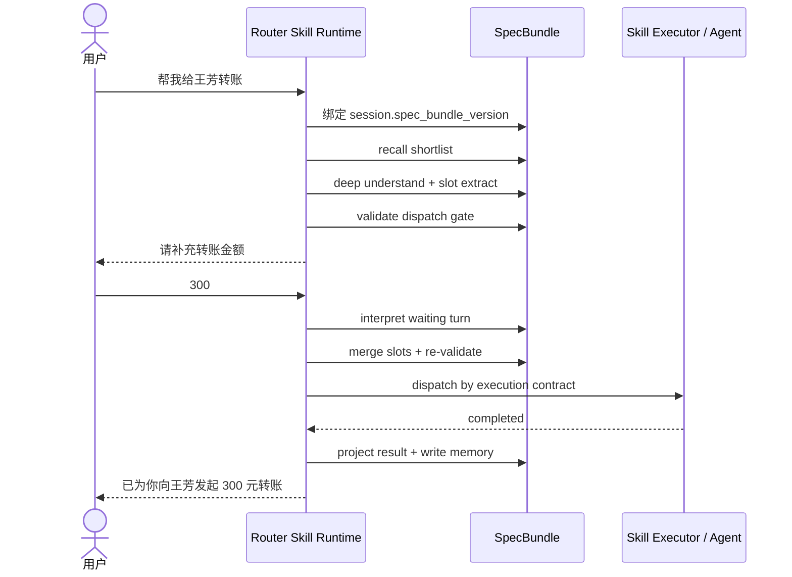

# Router Service Skill 驱动架构演进方案

## 1. 文档目标

本文用于回答一个具体演进问题：

> 如果当前 `router-service` 从“intent 驱动”进一步演进为“skill 驱动”，
> 由 skill 负责驱动 agent 调用、意图识别、提槽，并把 skill 升格为一等 spec，
> 那么框架实现是否可行、推荐采用什么架构、用户旅程如何变化、应该如何渐进落地。

本文结论不是推翻当前 Router，而是给出一条兼容现状的演进路径。

## 2. 结论摘要

### 2.1 总体判断

该方向 **可行**，并且与当前仓库的真实架构 **连续性很强**。

原因如下：

1. 当前 Router 本身已经承担：
   - 消息接入
   - 意图识别
   - graph 编译
   - Router 侧提槽与校验
   - waiting / pending 续轮决策
   - Agent 调用与事件投影
2. 当前 `IntentDefinition` 已经具备较强的 spec 特征，包含：
   - `agent_url`
   - `request_schema`
   - `field_mapping`
   - `field_catalog`
   - `slot_schema`
   - `graph_build_hints`
   - `resume_policy`
3. 当前运行时已经拆成 `Recognition / Slots / Graph Runtime / Agent Integration` 几层，
   因此演进重点不在于重写引擎，而在于：
   - 将 intent 元数据升格为 skill spec
   - 将理解链路从 prompt 聚合转向 spec 驱动
   - 将执行链路从 `agent_url` 扩展成 skill executor 抽象

### 2.2 推荐结论

不推荐采用“完全去中心化 skill 各自全权处理”的形态。

推荐采用：

> **中心编排的 Skill Runtime + 一等 SkillSpec + 可扩展 SkillExecutor**

即：

1. Router 继续做总控。
2. Skill 成为识别、提槽、续轮和执行契约的声明式载体。
3. Agent 继续做单业务能力执行器。
4. Graph Runtime 继续由 Router 掌控，不下放给 skill。

一句话：

> 不是让 skill 替代 Router，而是让 Router 升级为 Skill Runtime。

## 3. 为什么当前架构适合演进成 Skill Runtime

### 3.1 当前 Router 的核心边界本来就是对的

当前仓库已经明确：

1. Router 负责 recognition + dispatch + orchestration。
2. Router 不负责具体业务逻辑执行。
3. Agent 是独立执行单元。

这说明 Router 天生适合作为 skill runtime 宿主，而不是业务 skill 本身。

### 3.2 当前 intent 模型已经接近 skill spec

当前 `IntentDefinition` 不只是一个“标签”。

它已经同时承载：

1. 识别信息
   - `name`
   - `description`
   - `examples`
   - `keywords`
   - `domain_code`
2. 提槽信息
   - `field_catalog`
   - `slot_schema`
3. 图构建信息
   - `graph_build_hints`
4. 执行信息
   - `agent_url`
   - `request_schema`
   - `field_mapping`
5. 续轮信息
   - `resume_policy`

因此从建模角度看，当前 intent 本质上已经是一个“轻量版 skill spec”。

### 3.3 当前运行时已有天然扩展点

现有装配中心已把理解与执行拆成独立组件：

1. `recognizer`
2. `graph_builder`
3. `planner`
4. `turn_interpreter`
5. `understanding_validator`
6. `agent_client`

这意味着 skill 化并不要求一次性大重构，而是可以逐层替换：

1. 先换 spec 形态
2. 再换理解内核
3. 再换执行抽象

## 4. skill 驱动的目标状态

### 4.1 核心目标

skill 驱动后的 Router 应该满足以下特征：

1. 识别不是只匹配 intent code，而是匹配 skill capability。
2. 提槽不是靠大一统 prompt 硬推，而是由 skill spec 约束。
3. 续轮解释不是纯全局策略，而是 skill policy + 通用 turn policy 联合决策。
4. 执行不局限于 HTTP agent；未来可扩展到：
   - agent endpoint
   - local workflow
   - tool chain
   - composite skill
5. skill 必须可版本化、可灰度、可评测、可回放。

### 4.2 目标边界

skill 驱动之后，边界建议如下：

#### Router 继续负责

1. Session 生命周期
2. Graph 生命周期
3. Memory 生命周期
4. Waiting / Pending 状态机
5. SSE / 事件协议
6. 调度策略与安全护栏

#### SkillSpec 负责声明

1. 我是什么能力
2. 我需要哪些槽位
3. 我允许什么续轮语义
4. 我如何被执行
5. 我需要哪些确认和保护条件

#### Agent / Executor 负责完成

1. 真正业务执行
2. 领域内输出
3. 结果回传

## 5. 推荐架构

### 5.1 总体架构图

```text
Client / Frontend
    ->
Router API
    ->
Skill Runtime Orchestrator
    |-- Session Store
    |-- Memory Store
    |-- Skill Registry
    |-- Skill Understanding Kernel
    |-- Skill Graph Builder
    |-- Skill Turn Interpreter
    |-- Skill Executor Factory
    ->
Agent / Workflow / Tool Backends
```

### 5.2 六个核心子系统

#### A. Skill Registry

职责：

1. 加载 skill spec
2. 管理激活状态
3. 管理版本
4. 提供 recall shortlist
5. 提供运行时只读 skill 视图

可直接由现有 catalog 演进而来。

#### B. Skill Understanding Kernel

职责：

1. 根据 skill spec 做匹配
2. 根据 slot schema 做提槽
3. 根据 validation policy 做校验
4. 在 waiting / pending 阶段解释当前用户回合

这个内核应当是通用的，不建议每个 skill 各自实现一套基础理解逻辑。

#### C. Skill Graph Builder

职责：

1. 把本轮理解结果编译成 `skill graph`
2. 每个节点都绑定 `skill_code@version`
3. 维护节点依赖、条件边、确认策略

它与现有 graph builder / planner 高度连续。

#### D. Skill Executor

职责：

1. 将 node runtime state 适配成执行请求
2. 根据 skill spec 选择执行器类型
3. 标准化结果、错误、取消和回调

这里不应再把“调用 HTTP agent”视为唯一实现，而应该视为一种 executor adapter。

#### E. Guardrails & Policy Engine

职责：

1. 确认策略
2. 风险槽位确认
3. 历史槽位复用许可
4. 可执行门判定
5. 重规划边界

建议把这层从 prompt 规则里逐步抽出，变成半结构化或结构化 policy。

#### F. Eval & Observability

职责：

1. skill 级回归样例
2. graph 回放
3. 识别准确率、提槽准确率、等待恢复率
4. per-skill latency / failure rate / confusion matrix

skill 化以后，没有评测体系就无法治理。

## 6. SkillSpec 设计建议

### 6.1 最小可用结构

推荐的 `SkillSpec` 最小字段：

```json
{
  "skill_code": "transfer_money",
  "version": "1.0.0",
  "name": "转账",
  "description": "向指定收款对象执行转账",
  "status": "active",
  "kind": "agent_http",
  "domain": {
    "domain_code": "payments",
    "domain_name": "支付"
  },
  "match_policy": {
    "examples": [],
    "keywords": [],
    "primary_threshold": 0.75,
    "candidate_threshold": 0.5
  },
  "field_catalog_refs": [],
  "slot_schema": [],
  "turn_policy": {
    "resume_policy": "resume_same_task",
    "allow_replan": true,
    "allow_cancel": true
  },
  "graph_policy": {
    "needs_confirmation_when_history_prefill": true,
    "allow_multi_node": true
  },
  "execution_contract": {
    "executor_type": "agent_http",
    "endpoint": "http://...",
    "request_schema": {},
    "field_mapping": {}
  },
  "guardrails": {
    "requires_explicit_confirmation_for_sensitive_slots": true
  }
}
```

### 6.2 推荐分层

建议 skill spec 不是单平面大对象，而是五层结构：

1. `identity`
2. `understanding`
3. `slots`
4. `execution`
5. `governance`

这样做的好处：

1. 便于版本 diff
2. 便于局部复用
3. 便于 admin UI 分段编辑
4. 便于测试资产绑定

### 6.3 与当前 intent 字段的映射

建议映射关系如下：

| 当前字段 | 目标字段 |
| --- | --- |
| `intent_code` | `skill_code` |
| `name` | `name` |
| `description` | `description` |
| `domain_code/domain_name` | `domain.*` |
| `examples/keywords` | `match_policy.*` |
| `field_catalog` | `field_catalog_refs` 或内嵌定义 |
| `slot_schema` | `slot_schema` |
| `graph_build_hints` | `graph_policy` |
| `resume_policy` | `turn_policy.resume_policy` |
| `agent_url` | `execution_contract.endpoint` |
| `request_schema` | `execution_contract.request_schema` |
| `field_mapping` | `execution_contract.field_mapping` |

## 7. 理解链路如何改造成 Skill 驱动

### 7.1 推荐采用两阶段理解

不建议每轮对所有 skill 全量 fanout。

推荐两阶段：

#### 第 1 阶段：Recall / Shortlist

目标：

1. 基于 domain、keywords、examples、历史上下文、前端推荐等信号，先召回有限 skill 集
2. 把大范围候选缩小到一个可控 shortlist

#### 第 2 阶段：Deep Understanding

目标：

1. 在 shortlist 范围内做精细识别
2. 输出 primary / candidate skills
3. 做槽位提取与绑定
4. 必要时直接输出 graph node 初稿

这样能避免：

1. skill 数量增加后识别成本线性爆炸
2. 每个 skill 都去抢答导致结果不稳定

### 7.2 skill 驱动提槽

提槽建议仍保留在 Router 内核，不要完全下沉给 Agent。

理由：

1. Router 要维护“可执行门”
2. waiting 状态必须由 Router 掌控
3. 多 skill graph 中，Router 才知道跨节点依赖
4. 前端交互也依赖 Router 统一输出缺失槽位说明

skill 负责的是：

1. 声明需要什么槽位
2. 声明槽位语义和约束
3. 声明哪些槽位敏感
4. 声明哪些槽位可被历史补全

### 7.3 skill 驱动续轮

当前 turn interpreter 已具备：

1. `resume_current`
2. `cancel_current`
3. `replan`
4. `confirm_pending_graph`
5. `cancel_pending_graph`
6. `wait`

skill 化后，不必改掉这些基础语义，而应增加两层约束：

1. **全局 turn policy**
   - Router 的统一规则
2. **skill local policy**
   - 某个 skill 对续轮语义的限制

例如：

1. 某个 skill 可允许 `resume_current`，但禁止 `history_prefill` 自动恢复
2. 某个 skill 可允许取消当前节点，但不允许用户一句话直接越过强确认

## 8. 执行链路如何改造成 Skill 驱动

### 8.1 从 AgentClient 到 SkillExecutor

当前 `StreamingAgentClient` 建议升级为：

1. `SkillExecutor` 协议
2. 多个 executor adapter

例如：

1. `HttpAgentSkillExecutor`
2. `LocalWorkflowSkillExecutor`
3. `ToolChainSkillExecutor`
4. `CompositeSkillExecutor`

这样 skill spec 可以声明：

1. 我由哪个 executor 执行
2. 我的入参映射是什么
3. 我的超时和取消策略是什么

### 8.2 为什么不建议让 skill 直接持有 session / graph

如果让 skill 直接操控 session、pending graph、waiting node，会出现几个问题：

1. 状态写路径失控
2. 续轮恢复不可治理
3. graph 回放与审计变难
4. 多 skill 并发时缺乏统一仲裁

因此推荐：

1. skill 只读上下文
2. skill 返回标准化决策或执行结果
3. Router 统一落状态

## 9. 全局 Spec 驱动的运行时心智

### 9.1 什么叫“整个服务是 spec 驱动”

如果把 Router Service 演进为真正的 skill runtime，那么 **spec 驱动** 不应只停留在 skill 层。

更准确地说，运行时应当消费一个统一的 `SpecBundle`，而不是只消费若干孤立的 `SkillSpec`。

也就是说：

1. SkillSpec 只是其中一个子 spec。
2. Session、Recall、Turn Policy、Graph、Execution、Presentation、Memory 都应有各自的 spec。
3. Runtime 内核尽量不写业务 if/else，而是只做：
   - 读取当前 `SpecBundle`
   - 推进 session / graph / node 状态机
   - 执行标准化副作用

一句话：

> skill 驱动是能力层升级，全局 spec 驱动才是服务级架构升级。

### 9.2 推荐的全局 `SpecBundle`

建议至少包含以下组成：

1. `IngressSpec`
   - 入口协议
   - API 版本绑定
   - 请求预处理规则
2. `SessionSpec`
   - session 生命周期
   - session 与 spec version 的绑定规则
   - transcript / context 装配范围
3. `FieldSpec`
   - 全局字段语义
   - 字段别名
   - 敏感字段等级
4. `RecallSpec`
   - shortlist 召回策略
   - domain / recommendation / history 参与规则
5. `SkillSpec`
   - 能力定义
   - 槽位定义
   - graph policy
   - execution contract
6. `TurnPolicySpec`
   - `resume_current`
   - `replan`
   - `cancel_current`
   - `wait`
   - `confirm_pending_graph`
7. `GraphSpec`
   - 编图规则
   - graph confirmation 规则
   - node dependency 规则
8. `GuardrailSpec`
   - 强确认
   - 敏感槽位确认
   - 历史槽位复用条件
9. `ExecutionSpec`
   - executor 类型
   - 调用参数映射
   - 超时 / 取消 / 重试
10. `PresentationSpec`
    - 缺槽追问模板
    - waiting / completed 文案投影
    - SSE 事件文案策略
11. `MemorySpec`
    - 短期 / 长期记忆写回策略
    - 可继承槽位规则
    - 敏感信息落库策略

### 9.3 全局 spec 驱动的一个关键原则

每次 session 首次接入时，Runtime 都应为该 session 绑定明确的 `spec_bundle_version`。

这样做的原因：

1. 同一会话内的首轮、续轮、恢复和回放都使用同一版规则。
2. skill 升级不会污染进行中的 waiting / pending graph。
3. 问题排查时，可以精确知道某次错误是由哪版 spec 造成。
4. 回归评测可以复用线上真实旅程。

因此建议：

1. `session.spec_bundle_version` 必须持久化。
2. `graph.node` 必须记录 `skill_code@version`。
3. `executor dispatch` 也应记录实际命中的 execution contract version。

### 9.4 标准旅程：用户说“帮我给王芳转账”，下一轮补“300”

下面用一条最典型的多轮补槽旅程，说明“整个服务是 spec 驱动”到底意味着什么。

#### 场景前提

用户第一轮输入：

> 帮我给王芳转账

用户第二轮输入：

> 300

目标：

1. 首轮识别 `transfer_money`
2. 首轮抽取到收款人 `王芳`
3. 首轮发现缺失金额，进入 `waiting_user_input`
4. 第二轮识别为 `resume_current`
5. 补齐金额后继续执行

#### 旅程总表

| 阶段 | 用户动作 | Runtime 行为 | 决策依据 spec | 结果 |
| --- | --- | --- | --- | --- |
| 1 | 发送“帮我给王芳转账” | 创建/获取 session，并绑定 `spec_bundle_version` | `IngressSpec` + `SessionSpec` | 会话进入统一规则域 |
| 2 | 无 | 先做 shortlist recall | `RecallSpec` + `FieldSpec` + `SkillSpec.match_policy` | 候选 skill 收敛 |
| 3 | 无 | 在 shortlist 中做深判，选出 `transfer_money` | `SkillSpec` | 形成主 skill |
| 4 | 无 | 提取槽位：`receiver_name=王芳`，`amount=missing` | `FieldSpec` + `SkillSpec.slot_schema` | 形成 node slot memory |
| 5 | 无 | 校验可执行门，发现缺失必填金额 | `GuardrailSpec` + `SkillSpec.slot_schema` | node 进入 `waiting_user_input` |
| 6 | 看到追问 | 输出“请补充转账金额” | `PresentationSpec` | 用户知道缺什么 |
| 7 | 发送“300” | 优先解释为 waiting node 的续轮输入 | `TurnPolicySpec` + `SessionSpec` | 不新开事项，继续当前节点 |
| 8 | 无 | 判定为 `resume_current`，并将金额并入现有 node | `TurnPolicySpec` + `MemorySpec` | node 槽位补齐 |
| 9 | 无 | 再次校验是否需要确认 | `GuardrailSpec` + `SkillSpec.graph_policy` | 决定直接执行或转确认 |
| 10 | 无 | 读取 execution contract，调用对应 executor / agent | `ExecutionSpec` + `SkillSpec.execution_contract` | 任务下发 |
| 11 | 等待结果 | 投影 dispatching / completed 事件 | `PresentationSpec` | 前端看到状态推进 |
| 12 | 看到完成回复 | 写回短期/长期记忆 | `MemorySpec` | 后续轮次可复用上下文 |

#### 分阶段展开说明

##### 第一阶段：接入与规则绑定

用户第一句话进入系统时，Runtime 做的第一件事不是“立刻识别 skill”，而是：

1. 获取或创建 session
2. 为该 session 绑定 `spec_bundle_version`

这一步非常关键，因为后续所有动作——识别、提槽、追问、恢复、执行、记忆写回——都必须在同一版规则下完成。

否则会出现：

1. 第一轮按 A 版 skill 规则进入 waiting
2. 第二轮按 B 版 turn policy 恢复
3. 第三轮按 C 版 execution contract 调用 agent

最终既不可审计，也无法回放。

##### 第二阶段：召回候选 skill

Runtime 不应让所有 skill 全量参与深判。

更推荐先按全局 `RecallSpec` 做 shortlist：

1. 根据“转账”这类词汇命中支付域
2. 根据 `FieldSpec` 识别“王芳”更像对象类槽位，而不是新事项
3. 根据历史上下文、前端推荐、最近活跃 domain 再做加权

于是候选可能被收敛为：

1. `transfer_money`
2. `credit_card_repayment`
3. `account_balance`

这一步的目标不是得到最终答案，而是把全量空间压缩成一个稳定的可解释候选集。

##### 第三阶段：深判与主 skill 确定

随后 Runtime 在 shortlist 范围内做深判。

这里不是简单输出一个标签，而是要产出结构化理解结果：

1. `primary_skill = transfer_money`
2. `candidate_skills = [...]`
3. `confidence = ...`
4. `reason = ...`

决定依据主要来自：

1. `SkillSpec.description`
2. `SkillSpec.examples`
3. `SkillSpec.match_policy`
4. 当前消息与上下文

##### 第四阶段：按 slot schema 提槽

主 skill 确定后，Runtime 根据 `transfer_money` 的 `slot_schema` 做提槽。

第一轮可以提取出：

1. `receiver_name = 王芳`
2. `amount = missing`

这里最重要的点是：

> “金额是必填”这件事，不应写死在业务代码里，而应由 `SkillSpec.slot_schema` 声明。

换句话说，Router 只是执行一个统一的“按 spec 提槽和校验”的流程。

##### 第五阶段：可执行门校验并进入 waiting

接着 Runtime 根据：

1. `slot_schema.required`
2. `GuardrailSpec`
3. `GraphSpec`

判断该节点当前是否可执行。

此时因为缺失金额，所以不会直接下发 Agent，而会：

1. 创建单节点 graph
2. 将 node 标记为 `waiting_user_input`
3. 记录缺失槽位列表
4. 准备缺槽追问

##### 第六阶段：追问投影

用户看到的追问文案，不应只是底层错误文本。

更推荐由 `PresentationSpec` 负责把状态投影成前端可见结果，例如：

> 请补充转账金额

这样做的意义是：

1. 缺槽提示可统一治理
2. 不同渠道可有不同呈现
3. Runtime 状态与用户文案解耦

##### 第七阶段：第二轮输入优先解释为续轮

用户第二句话是：

> 300

这时 Runtime 不能把这句话当作一个新的独立事项立刻重编图。

更合理的处理顺序应是：

1. 先检查 session 是否有 waiting node
2. 若有，则优先走 `TurnPolicySpec`
3. 判断这是：
   - `resume_current`
   - `replan`
   - `cancel_current`
   - `wait`

在这个案例里，应判定为 `resume_current`。

##### 第八阶段：槽位合并与恢复

一旦判定为 `resume_current`，Runtime 应把第二轮信息合并回当前 waiting node：

1. 原有：`receiver_name = 王芳`
2. 新增：`amount = 300`

最终节点槽位变为：

1. `receiver_name = 王芳`
2. `amount = 300`

这里推荐由以下 spec 联合决定合并规则：

1. `TurnPolicySpec`
2. `MemorySpec`
3. `FieldSpec`

例如：

1. 金额能否覆盖旧值
2. 名称冲突时是否需要二次确认
3. 数值是否允许由纯数字短句补齐

##### 第九阶段：再次校验是否可直接执行

恢复后，Runtime 还要再过一遍可执行门。

如果命中了以下任何规则，则仍可能进入确认态：

1. 敏感金额阈值超限
2. 命中了风险收款对象
3. 复用了历史账户但未获确认
4. skill graph policy 要求先确认

如果没有命中这些规则，则可以直接执行。

##### 第十阶段：执行器选择与请求下发

到这一步，Runtime 不应写死“直接调某个 URL”。

它应根据 `ExecutionSpec` 和 skill 的 `execution_contract` 来决定：

1. 使用哪种 executor
2. 请求参数如何映射
3. 超时、取消、重试如何处理

例如：

1. `executor_type = agent_http`
2. `endpoint = transfer-money-agent`
3. `field_mapping = ...`

然后再由对应 executor 完成标准化调用。

##### 第十一阶段：事件投影与完成回复

执行过程中，Runtime 继续维护统一状态：

1. `dispatching`
2. `running`
3. `completed`
4. `failed`

这些内部状态最终由 `PresentationSpec` 投影成：

1. SSE 事件
2. 前端可见 loading / completed 提示
3. 对用户最终回复

例如：

> 已为你向王芳发起 300 元转账

##### 第十二阶段：记忆写回

旅程结束后，Runtime 根据 `MemorySpec` 判断哪些事实可以写回：

1. 收款对象是否写入短期记忆
2. 金额是否允许写入长期记忆
3. 敏感账号是否只写结构化引用而不保留原文

这一步决定了未来用户再说“再给她转 500”时，系统是否能稳定续接上下文。

#### 这条旅程说明了什么

这条旅程最核心的价值在于说明：

1. spec 驱动不是只有 skill 匹配阶段使用 spec。
2. 从 ingress 到 session，到 recall、提槽、waiting、恢复、执行、记忆写回，全部都有对应 spec owner。
3. Runtime 内核只负责统一推进状态，不直接承担业务语义硬编码。

因此用户看到的是：

1. 说一句
2. 被追问一句
3. 补一句
4. 完成

而系统内部实际完成的是：

1. 绑定 spec 版本
2. 召回
3. 深判
4. 提槽
5. waiting
6. 续轮恢复
7. 再校验
8. 执行
9. 投影
10. 记忆写回

### 9.5 该旅程对应的三泳道时序图



## 10. 用户旅程如何变化

### 9.1 旅程 A：单 skill 单轮完成

#### 当前旅程

1. 用户一句话
2. Router 识别 intent
3. Router 提槽校验
4. 调用 Agent
5. 返回完成

#### skill 化后的旅程

1. 用户一句话
2. Router 做 skill recall shortlist
3. Router 在 shortlist 范围内做 skill understanding
4. Router 根据 skill spec 提槽与校验
5. SkillExecutor 调用下游执行器
6. Router 映射完成态

本质变化不大，只是“识别对象”从 intent 变为 skill。

### 9.2 旅程 B：单 skill 多轮补槽

#### 推荐链路

1. 首轮识别到 skill
2. skill spec 指明缺失必填槽位
3. Router 将 node 置为 `waiting_user_input`
4. 用户补一句
5. turn interpreter 结合 skill policy 判断：
   - `resume_current`
   - `replan`
   - `cancel_current`
   - `wait`
6. 若恢复，则重新校验并继续执行

变化重点不在交互形态，而在于：

1. 缺槽问题与追问模板可被 spec 治理
2. 恢复条件与历史补全权限可被 spec 治理

### 9.3 旅程 C：多 skill 图确认

#### 推荐链路

1. 用户输入多个事项
2. Router 输出多个 primary skills
3. Graph Builder 构造多节点 skill graph
4. 若 graph policy 要求确认，则进入 `pending_graph`
5. 用户确认后，逐节点执行

这条旅程与当前多意图 graph 旅程高度连续。

### 9.4 旅程 D：skill 内置 agent 调用编排

当某 skill 本身不是直接执行业务，而是“组合型 skill”时：

1. Router 先识别 composite skill
2. composite skill executor 内部执行局部子编排
3. Router 只接收标准化完成结果

这里要特别注意边界：

1. skill 内部可编排局部执行步骤
2. Router 仍然掌握全局 graph
3. 不允许 skill 在全局 session 上自由写状态

## 11. 推荐的实现分层

### 10.1 控制面

建议 Admin 侧从 `intent registry` 演进为 `skill registry`：

1. skill 基础信息
2. skill 版本
3. 激活/灰度
4. 绑定 prompt assets
5. 绑定测试样例
6. 绑定 field catalogs

### 10.2 运行面

建议 Router 侧新增以下抽象：

1. `SkillSpec`
2. `SkillRegistry`
3. `SkillMatcher`
4. `SkillSlotPolicy`
5. `SkillTurnPolicy`
6. `SkillExecutor`
7. `SkillRuntimeContext`

### 10.3 资产面

建议把 skill 资产拆出，而不是继续集中堆在一个超长 prompt 文件中。

每个 skill 推荐至少具备：

1. `spec.json` 或数据库等价结构
2. `prompt assets`
3. `eval cases`
4. `fixtures`
5. `golden outputs`

这部分可以吸收 `workflow-skill` 的优点：

1. 知识资产分层
2. 模板与脚本兜底
3. 复杂案例沉淀

但不建议直接照搬外部 workflow skill 的产品形态。

## 12. 渐进式落地方案

### Phase 0：兼容层

目标：

> 先不改 API 语义，只在内部引入“intent 即 skill v0”的兼容视图。

动作：

1. 新增 `SkillSpec` 领域模型
2. 新增 `IntentDefinition -> SkillSpec` 映射器
3. Graph 节点内部开始支持记录 `skill_code`
4. 现有 intent catalog 继续作为 skill registry 的底层来源

收益：

1. 风险低
2. 不影响现有接口
3. 可先完成建模升级

### Phase 1：理解链路 skill 化

动作：

1. 引入 `SkillMatcher`
2. 引入 recall shortlist
3. 将大 prompt 拆成：
   - 全局 router prompt
   - skill assets
4. 让 slot extraction 读取 skill spec 约束

收益：

1. 识别成本更可控
2. skill 增长后仍可治理

### Phase 2：执行链路 skill 化

动作：

1. 定义 `SkillExecutor` 协议
2. 将 `agent_url` 演进为 `execution_contract`
3. 首先保留 `agent_http` 一种 executor
4. 后续再扩展其他 executor

收益：

1. 兼容当前 Agent 架构
2. 为后续 workflow / tool 扩展留口子

### Phase 3：控制面 skill 化

动作：

1. Admin 支持 skill version
2. Admin 支持 skill eval assets
3. Admin 支持灰度和回滚

收益：

1. 真正把 skill 变成可治理对象

### Phase 4：高级 skill

动作：

1. 支持 composite skill
2. 支持 per-skill policy packs
3. 支持更强的结构化长期记忆接入

收益：

1. 支持更复杂的跨域能力
2. 仍保持 Router 总控边界

## 13. 风险与关键约束

### 12.1 最大风险不是实现，而是治理失控

skill 化以后，最容易出问题的不是“能不能跑”，而是：

1. skill 数量增加后 recall 混乱
2. 各 skill 自定义槽位语义导致 ontology 漂移
3. skill 版本不固定导致续轮不可重放
4. skill 抢状态写路径导致 graph 不可审计

### 12.2 必须坚持的约束

1. `field_catalog` 仍要保留为统一语义底座。
2. `slot_schema` 仍要是 Router 级可治理对象。
3. graph 状态机必须仍由 Router 掌控。
4. skill 节点必须绑定具体版本。
5. 历史槽位复用必须受 policy 控制。

### 12.3 不建议做的事情

1. 不建议把所有理解逻辑都塞进 skill 内部 prompt。
2. 不建议让 skill 直接修改 session / graph。
3. 不建议一开始就做每个 skill 独立插件运行时。
4. 不建议没有评测集就大规模开放 skill 自定义。

## 14. 与当前代码的直接映射建议

### 13.1 可直接复用的现有对象

1. `IntentUnderstandingService`
2. `TurnInterpreter`
3. `UnderstandingValidator`
4. `GraphRouterOrchestrator`
5. `StreamingAgentClient`
6. `RepositoryIntentCatalog`

### 13.2 推荐新增对象

1. `SkillSpec`
2. `SkillRegistry`
3. `SkillRuntimeView`
4. `SkillMatcher`
5. `SkillExecutor`
6. `SkillExecutionContract`
7. `SkillPolicyEngine`

### 13.3 推荐重命名或包裹的对象

1. `IntentDefinition` -> 兼容包裹为 `LegacyIntentSkillSpec`
2. `agent_client` -> `skill_executor`
3. `intent_catalog` -> `skill_registry`

## 15. 最终建议

### 14.1 战略建议

推荐把 skill 化定义为：

> Router Service 从 “intent router” 演进为 “skill runtime orchestrator”。

而不是：

> Router 退化成一个只转发请求的壳。

### 14.2 实施建议

最值得优先做的三件事：

1. 先定义 `SkillSpec v0.1`
2. 再建立 `intent -> skill` 兼容层
3. 再把理解资产从单 prompt 聚合演进为 spec + assets 驱动

### 14.3 产品建议

对外部使用者来说，skill 的心智应当是：

1. 一个可治理能力单元
2. 一个可版本化理解与执行契约
3. 一个能参与 graph 的运行时对象

而不是仅仅一个 prompt 片段或 agent 地址。

## 16. 开放问题

以下问题建议在正式立项前进一步确认：

1. skill 是否允许多执行后端同时声明，还是必须单一 `executor_type`？
2. skill version 的发布单位是 spec 级、prompt 级，还是包含 eval 资产的 bundle 级？
3. Admin 端是否要允许运营人员直接编辑 skill prompt assets？
4. composite skill 是否从第一期就纳入，还是放到第三阶段以后？
5. 结构化长期记忆是否要同步进入 `SkillSpec v0.1`，还是先保持外置？

## 17. 一句话结论

当前 Router 改造成 skill 驱动是可行的，而且最优路径并不是“削弱 Router”，而是：

> **保留 Router 的编排权，把 intent 升格为 skill spec，把 agent 升格为 skill executor 后端。**
