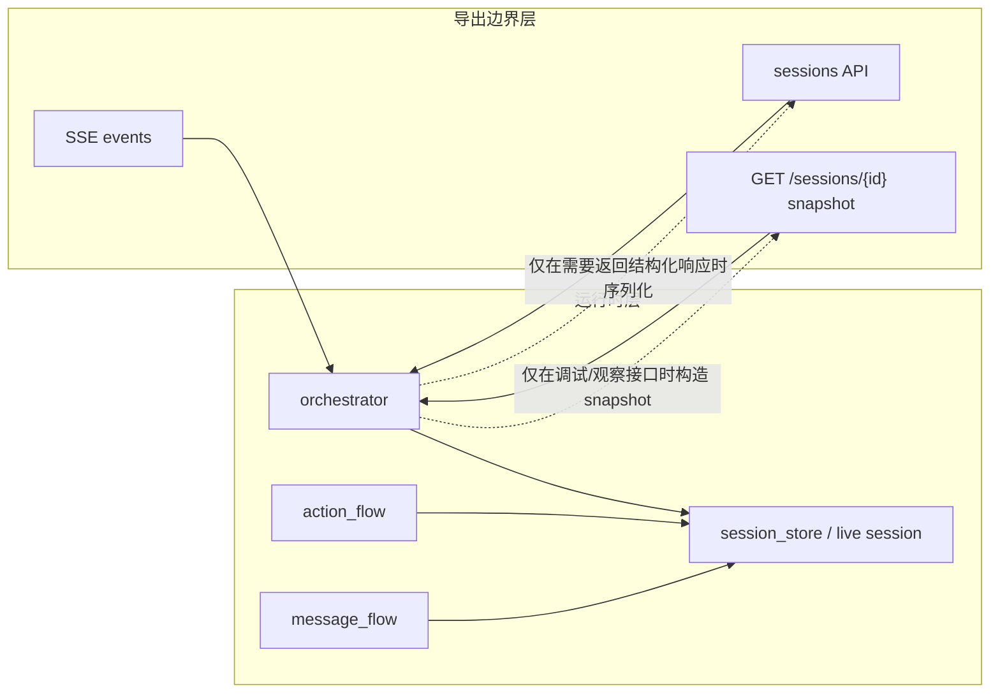
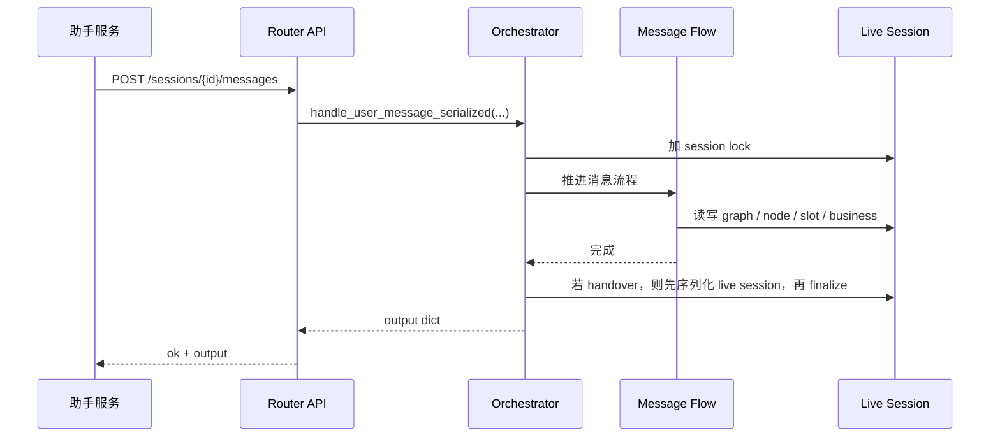
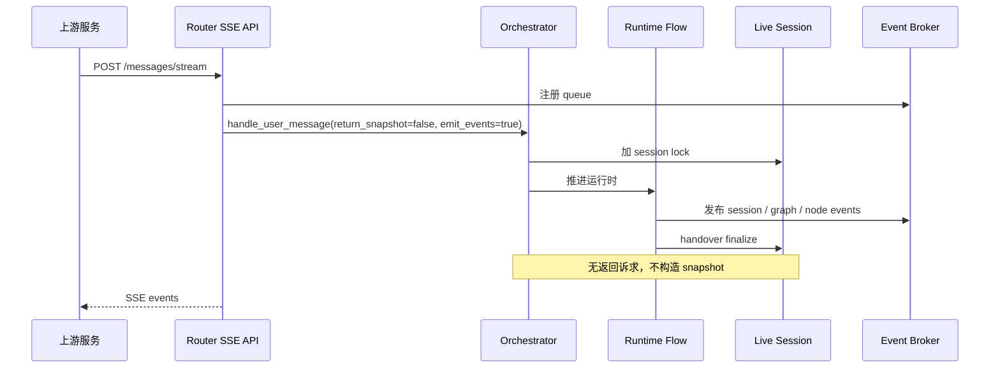
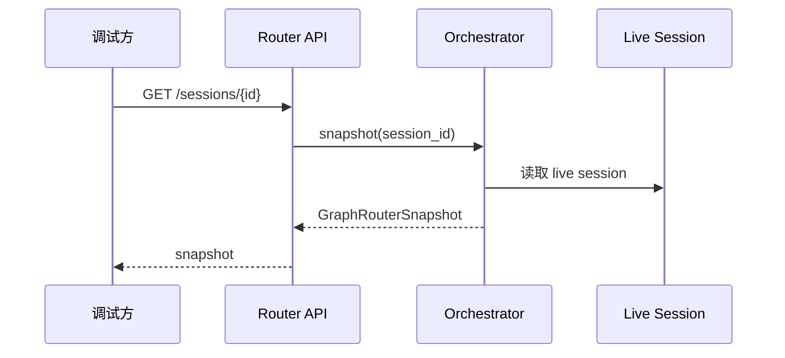

# Router Service Snapshot 边界收口设计 v0.3

## 1. 背景

当前 Router 已经引入两套对外输出方式：

1. 生产主协议：`ok + output`
2. 调试/观察协议：`snapshot`
3. 流式协议：SSE events

之前虽然主协议已经开始走“锁内直接序列化 live session”，但运行时内部仍残留 `snapshot` 思维，主要表现为：

1. `message_flow` / `action_flow` 依赖 `snapshot_session` 回调。
2. `orchestrator.handle_user_message(... return_snapshot=False)` 在某些 handover 场景下仍会构造完整 snapshot。
3. SSE / 无返回场景并没有真正摆脱 snapshot 的构造成本。

这会带来两个问题：

1. 运行时职责与只读导出职责混杂。
2. 在无返回诉求的链路里，仍支付不必要的深拷贝和序列化成本。

## 2. 设计目标

本次收口目标很明确：

1. `snapshot` 不再参与 Router 运行时主逻辑决策。
2. `snapshot` 只保留在“接口导出 / 调试观察”边界。
3. 非流和流式主链路都以 live session 为唯一运行时真相。
4. `handover` 清理时，只有“确实要返回数据”的接口才构造响应对象。
5. 不改变现有外部协议兼容性。

## 3. 分层原则

原则上：

1. Runtime 只维护 live session / graph / business object。
2. Boundary 才负责把 live state 变成对外报文。
3. `snapshot` 是 read model，不是 runtime model。

## 4. 本次改造内容

### 4.1 `message_flow` / `action_flow`

移除对 `snapshot_session` 的依赖：

1. `GraphMessageFlow` 不再持有 `snapshot_session` 回调。
2. `GraphActionFlow` 不再持有 `snapshot_session` 回调。
3. 两者的方法签名中也不再承载 `return_snapshot` 语义。

这意味着：

1. 流程层只做“状态推进”。
2. 不再关心“如何导出当前 session”。

### 4.2 `orchestrator`

新增两个 handover 收口分支：

1. `需要响应`：先序列化，再 finalize business。
2. `不需要响应`：直接 finalize business，不构造 snapshot。

核心规则如下：

| 场景 | 是否需要返回体 | 行为 |
|---|---:|---|
| `handle_user_message_serialized` | 是 | 锁内直接序列化 live session |
| `handle_action_serialized` | 是 | 锁内直接序列化 live session |
| `handle_user_message(return_snapshot=True)` | 是 | 允许构造 snapshot 兼容旧调用 |
| `handle_action(return_snapshot=True)` | 是 | 允许构造 snapshot 兼容旧调用 |
| `handle_user_message(return_snapshot=False)` | 否 | 直接 finalize，不构造 snapshot |
| `handle_action(return_snapshot=False)` | 否 | 直接 finalize，不构造 snapshot |

## 5. 关键时序

### 5.1 非流生产主链路

这里没有 snapshot 深拷贝。

### 5.2 SSE 主链路

SSE 依赖的是事件流，不依赖 snapshot 补包。

### 5.3 调试/观察链路

这里保留 snapshot，目的是状态观察，不进入主执行路径。

## 6. handover 语义

`handover` 的本质是：

1. 当前 business 已经到达可交接态。
2. 需要把业务对象压缩为 digest，并把公共槽位沉淀到 session 级别共享记忆。
3. 之后释放当前 business graph，降低 session 内存占用。

因此，`handover` 阶段真正要保护的是“最终响应视图”，不是 `snapshot` 这个对象本身。

换句话说：

1. 如果接口需要返回，就保留一次“最终响应序列化”。
2. 如果接口不需要返回，就直接 finalize。

## 7. 兼容性

本次不破坏以下能力：

1. `GET /sessions/{id}` 仍可获取完整 snapshot。
2. 老的 `return_snapshot=True` 调用方式仍可工作。
3. 新的助手协议 `ok + output` 不受影响。
4. SSE 不受影响。

## 8. 测试点

本次重点回归了以下场景：

1. `message_flow` 单测通过。
2. `action_flow` 单测通过。
3. `orchestrator` 单测通过。
4. 新增“`return_snapshot=False` 下 handover 不构造 snapshot”回归用例。
5. API 层 assistant / snapshot / messages / actions 相关测试通过。

## 9. 后续建议

下一步可以继续收紧两件事：

1. 把 `GraphRouterSnapshot` 明确标注为“只读导出模型”，避免后续再被当作 runtime 数据结构使用。
2. 评估是否将普通 `/messages`、`/actions` 的 `snapshot` 响应也逐步迁移到“锁内 live serialization”统一出口，进一步减少双模型心智负担。
