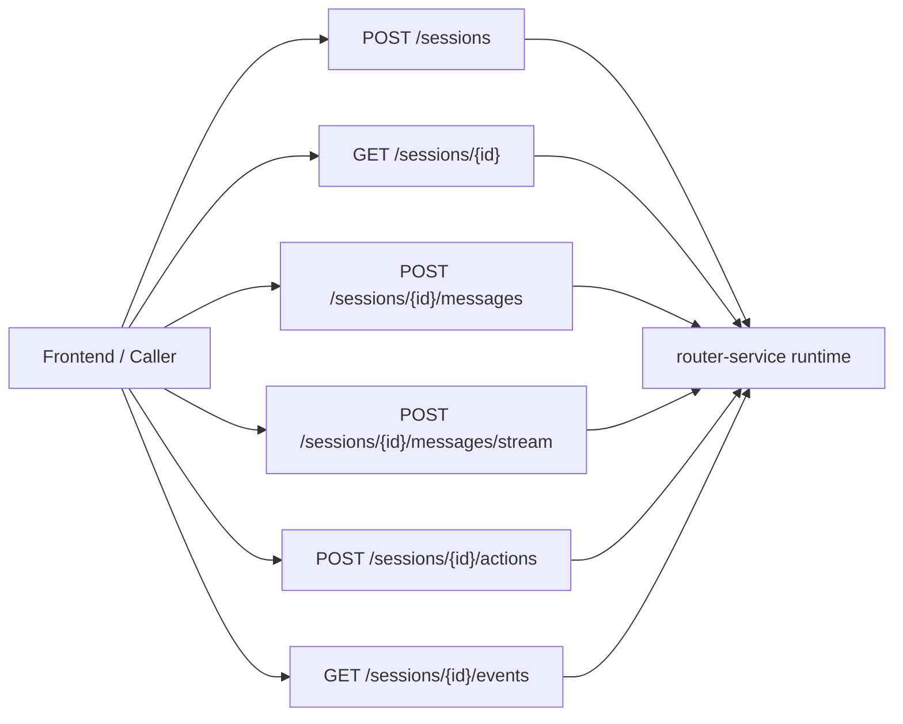
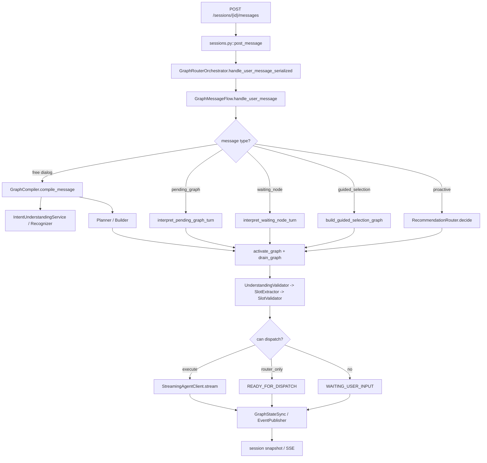
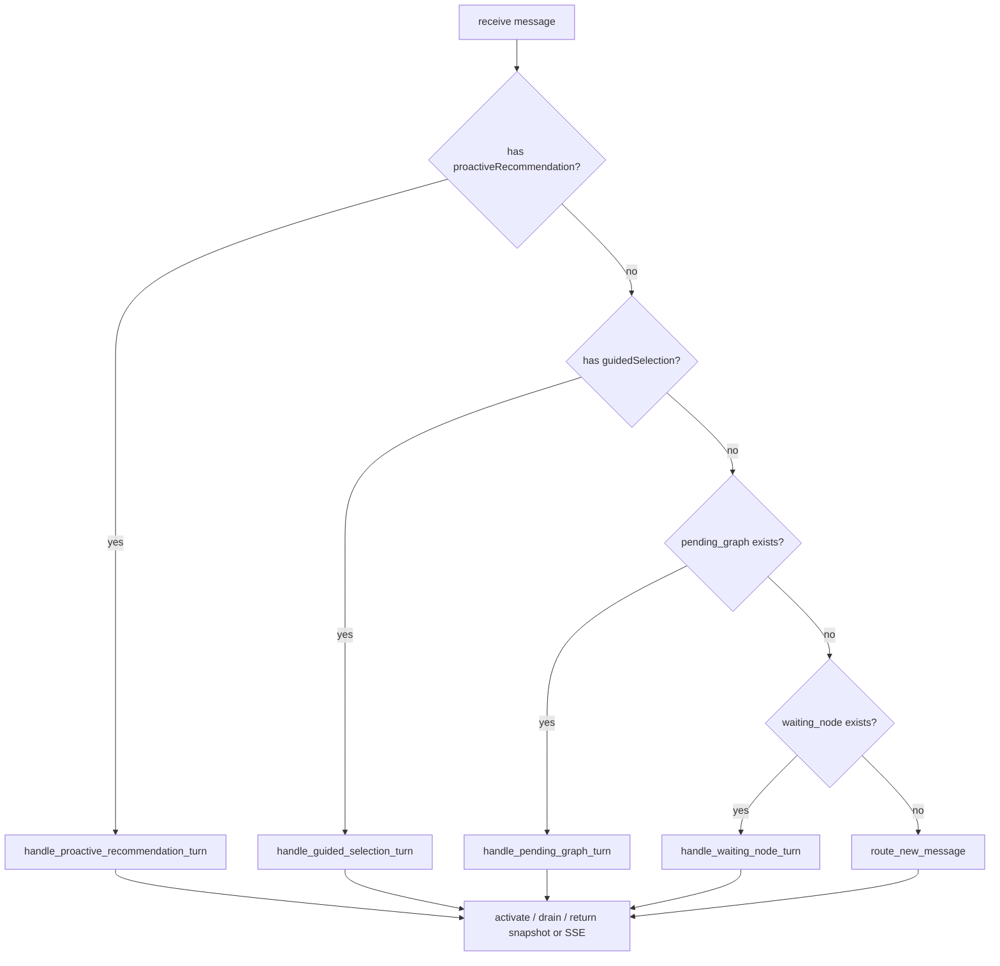
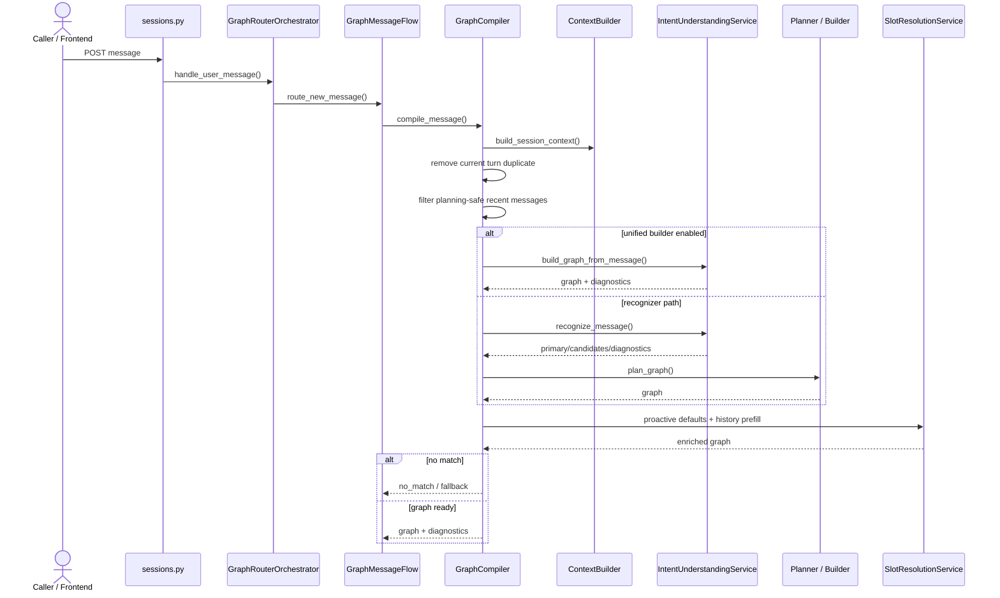
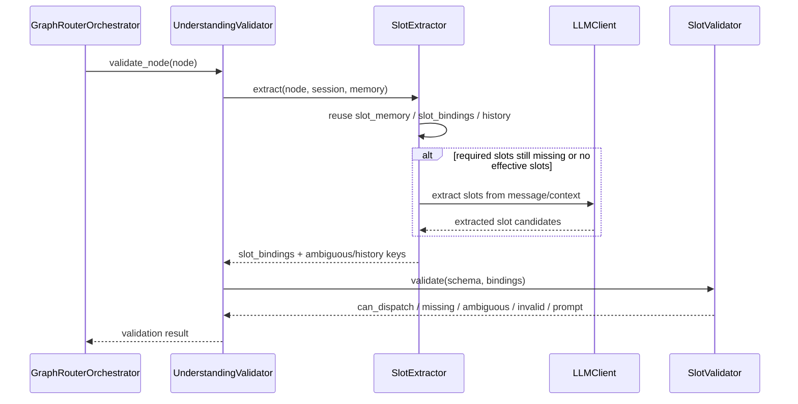
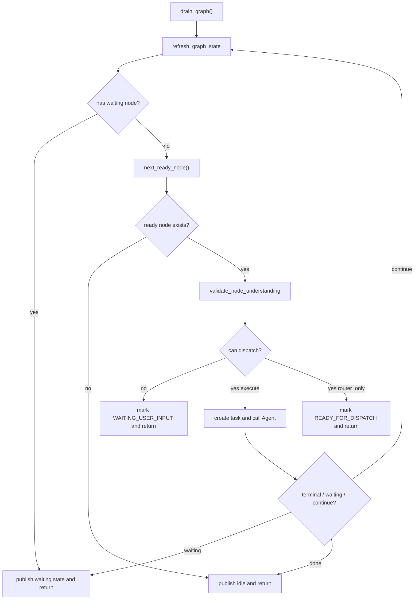
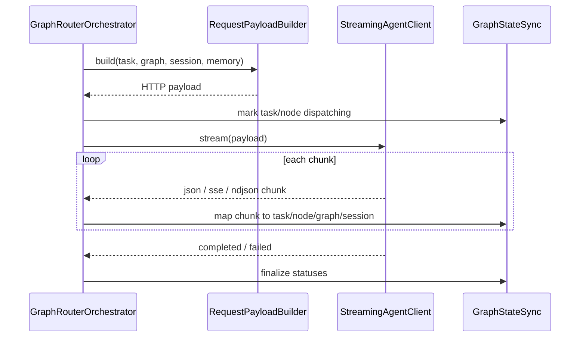
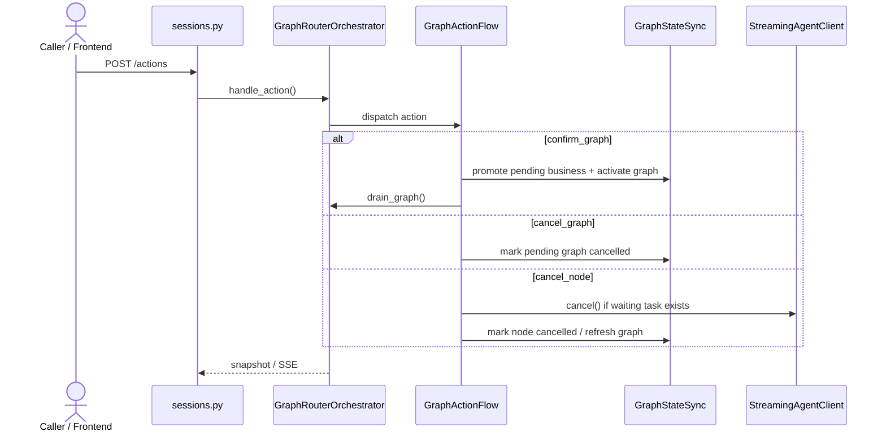
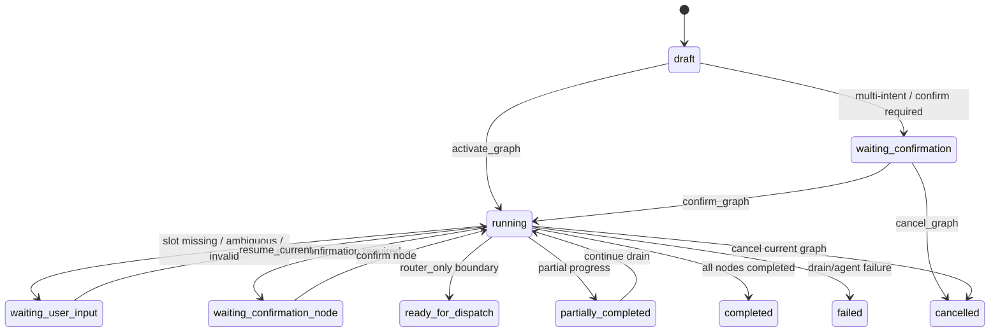
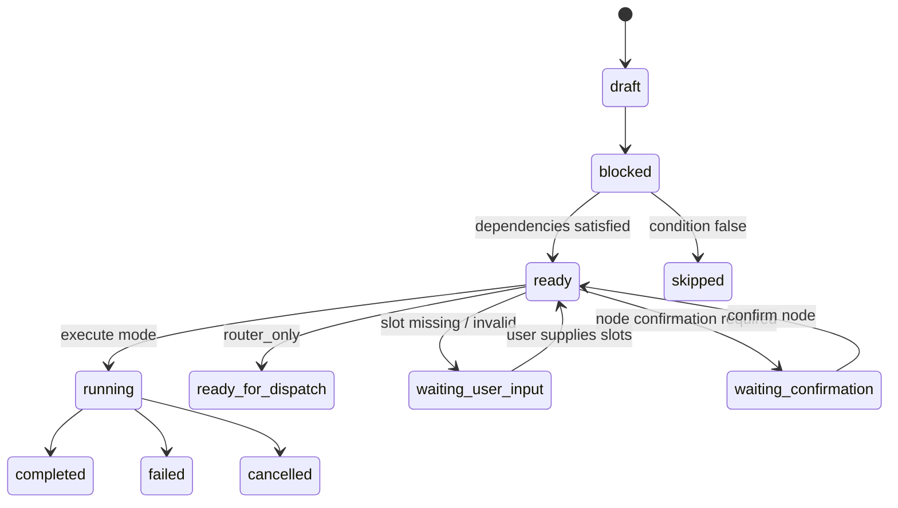

# Router Service 功能说明文档

状态：对齐草案  
更新时间：2026-04-18  
适用分支：`test/v3-concurrency-test`

## 1. 文档目的

本文档用于以“功能视角”说明 `router-service` 当前对外能力、内部处理链路和关键分支行为。它重点回答：

1. Router 对外提供了哪些功能。
2. 一条消息从 API 到识别、编图、补槽、调度的调用链是什么。
3. 当前 waiting node、pending graph、router_only、recommendation 相关能力是如何落地的。
4. 哪些能力是已实现的，哪些是待优化的。

## 2. 功能总览

Router 当前可归纳为 9 组功能：

1. Session 管理
2. 消息处理
3. 动作处理
4. SSE 事件推送
5. 意图识别
6. 图编排与图确认
7. Router 侧槽位提取与校验
8. Agent 调度
9. recommendation / guided selection / router_only 特殊模式

## 3. 对外接口

### 3.1 Session 接口

1. `POST /api/router/sessions`
2. `POST /api/router/v2/sessions`

能力：

1. 创建 session
2. 允许调用方显式传入 `cust_id`
3. 允许调用方显式传入 `session_id`

### 3.2 快照接口

1. `GET /api/router/sessions/{session_id}`
2. `GET /api/router/v2/sessions/{session_id}`

能力：

1. 返回当前 session 快照
2. 暴露：
   - `messages`
   - `candidate_intents`
   - `last_diagnostics`
   - `shared_slot_memory`
   - `current_graph`
   - `pending_graph`
   - `active_node_id`

### 3.3 消息接口

1. `POST /api/router/sessions/{session_id}/messages`
2. `POST /api/router/v2/sessions/{session_id}/messages`
3. `POST /api/router/sessions/{session_id}/messages/stream`
4. `POST /api/router/v2/sessions/{session_id}/messages/stream`

能力：

1. 提交自然语言消息
2. 提交 `guidedSelection`
3. 提交 `recommendationContext`
4. 提交 `proactiveRecommendation`
5. 选择 `executionMode=execute|router_only`
6. 选择同步返回快照或流式返回 SSE 事件

### 3.4 动作接口

1. `POST /api/router/sessions/{session_id}/actions`
2. `POST /api/router/v2/sessions/{session_id}/actions`
3. `POST /api/router/sessions/{session_id}/actions/stream`
4. `POST /api/router/v2/sessions/{session_id}/actions/stream`

支持动作：

1. `confirm_graph`
2. `cancel_graph`
3. `cancel_node`

### 3.5 事件订阅接口

1. `GET /api/router/sessions/{session_id}/events`
2. `GET /api/router/v2/sessions/{session_id}/events`

能力：

1. 独立订阅 session 级事件流
2. 初始会发送 heartbeat

### 3.6 对外功能接口图



## 4. 关键配置开关

### 4.1 识别与建图

1. `ROUTER_V2_UNDERSTANDING_MODE=flat|hierarchical`
2. `ROUTER_V2_GRAPH_BUILD_MODE=legacy|unified`
3. `ROUTER_V2_PLANNING_POLICY=always|never|multi_intent_only|auto`

### 4.2 运行时

1. `ROUTER_INTENT_REFRESH_INTERVAL_SECONDS`
2. `ROUTER_SESSION_CLEANUP_ENABLED`
3. `ROUTER_SESSION_CLEANUP_INTERVAL_SECONDS`
4. `ROUTER_DRAIN_MAX_ITERATIONS`
5. `ROUTER_DRAIN_ITERATION_MULTIPLIER`
6. `ROUTER_DRAIN_ITERATION_FLOOR`

### 4.3 LLM 与 Agent

1. `ROUTER_LLM_API_BASE_URL`
2. `ROUTER_LLM_MODEL`
3. `ROUTER_LLM_RECOGNIZER_MODEL`
4. `ROUTER_LLM_STRUCTURED_OUTPUT_METHOD`
5. `ROUTER_AGENT_HTTP_TIMEOUT_SECONDS`
6. `ROUTER_AGENT_BARRIER_ENABLED`

## 5. 运行时装配链路

Router 启动时，核心装配链路如下：

```text
FastAPI app
  -> get_settings()
  -> build_router_runtime()
      -> GraphSessionStore(LongTermMemoryStore)
      -> EventBroker
      -> LangChainLLMClient
      -> RepositoryIntentCatalog
      -> IntentRecognizer
      -> SlotExtractor + SlotValidator + UnderstandingValidator
      -> Planner / TurnInterpreter / RecommendationRouter
      -> GraphRouterOrchestrator
  -> lifespan:
      -> refresh intent catalog
      -> start catalog refresh loop
      -> start session cleanup loop
```

装配原则：

1. `api/app.py` 只负责 app 生命周期和错误包装。
2. `api/dependencies.py` 负责把具体实现装配成一套运行时对象。
3. 真正的请求处理从 `GraphRouterOrchestrator` 开始。

### 5.1 装配矩阵的当前事实

1. `understanding_mode=flat` 时，主识别链是直接 LLM recognizer。
2. `understanding_mode=hierarchical` 时，主识别链会切成 domain router + leaf router。
3. unified graph builder 不是独立总开关，只有在 `LLM 可用 + graph_build_mode=unified + planning_policy=always + 非 hierarchical` 时才真正装配。
4. `structured_output_method` 虽然已经进入配置，但当前 LLM 请求载荷仍未真正下发严格 schema。

## 6. 消息处理主调用链

### 6.1 非流式消息主链

```text
POST /sessions/{id}/messages
  -> sessions.py::post_message
  -> GraphRouterOrchestrator.handle_user_message_serialized()
  -> GraphMessageFlow.handle_user_message()
  -> 根据当前状态进入不同分支
  -> 完成后序列化 session
```

### 6.2 流式消息主链

```text
POST /sessions/{id}/messages/stream
  -> sessions.py::post_message_stream
  -> EventBroker.register(session_id)
  -> asyncio.create_task(orchestrator.handle_user_message(..., emit_events=True))
  -> broker queue 持续消费事件
  -> SSE 输出
```

两者核心区别：

1. 非流式：`emit_events=False`，直接返回最终快照。
2. 流式：`emit_events=True`，中间 recognition / graph builder / graph / node 事件都会进入 broker。

### 6.3 串行保护与入口预处理

在真正进入 message flow 之前，当前链路还有几步关键前处理：

1. 所有 message/action 入口都会先获取 session 级锁，保证同一个 session 串行推进。
2. 若当前没有 `current_graph` / `pending_graph`，Router 会先尝试恢复最近挂起的 business。
3. 当前轮用户消息会先写入 transcript，再进入后续理解链路。
4. `router_only_mode` 会先落到 session/business 运行态，再影响后续 drain 策略。
5. 若输入是 guided selection，Router 会先写入合成展示文案，保证 transcript 与后续诊断一致。

### 6.4 消息主链调用关系图



## 7. 消息处理详细分支

### 7.1 总入口判断

`GraphMessageFlow.handle_user_message()` 会按以下顺序判断本轮消息属于哪种情况：

1. `proactive_recommendation`
2. `guided_selection`
3. `pending_graph`
4. `waiting_node`
5. 普通自由输入

这意味着当前消息不会一上来就重新做全局识别，而是先看 session 当前是否已经处于某个“应优先解释”的状态。

### 7.2 proactive recommendation 分支

```text
handle_proactive_recommendation_turn()
  -> recommendation_router.decide()
  -> 根据 route_mode 进入：
     - no_selection
     - switch_to_free_dialog
     - direct_execute
     - interactive_graph
```

功能点：

1. 可把上游推荐事项直接转成 guided selection。
2. 也可以保留为一个待确认的 interactive graph。
3. 当用户切入 proactive recommendation 流程时，当前业务可被挂起。

### 7.3 guided selection 分支

```text
handle_guided_selection_turn()
  -> route_guided_selection()
  -> graph_compiler.build_guided_selection_graph()
  -> session.attach_business()
  -> activate_graph()
  -> drain_graph()
```

功能点：

1. 跳过识别，直接使用已选择意图。
2. 适用于前端已确定事项的场景。

### 7.4 pending graph 分支

```text
handle_pending_graph_turn()
  -> understanding_service.interpret_pending_graph_turn()
  -> turn_interpreter.interpret_pending_graph()
  -> action:
     - confirm_pending_graph
     - cancel_pending_graph
     - replan
     - keep_waiting
```

功能点：

1. 用户确认执行图。
2. 用户取消执行图。
3. 用户提出新事项，挂起当前 pending business 并重规划。

### 7.5 waiting node 分支

```text
handle_waiting_node_turn()
  -> understanding_service.interpret_waiting_node_turn()
  -> turn_interpreter.interpret_waiting_node()
  -> action:
     - resume_current
     - cancel_current
     - replan
     - keep_waiting
```

功能点：

1. 默认解释为补当前节点。
2. 可以取消当前节点。
3. 可以挂起当前 business 并进入新业务。

### 7.6 普通自由输入分支

```text
route_new_message()
  -> graph_compiler.compile_message()
  -> recognition / graph builder / planner
  -> history prefill / proactive defaults
  -> attach_business()
  -> activate_graph()
  -> drain_graph()
```

### 7.7 分支决策图



## 8. 自由输入编译链路

`GraphCompiler.compile_message()` 的主流程如下：

```text
1. build_session_context()
2. 去掉当前轮重复消息
3. 过滤用于 planning 的 recent messages
4. augment recommendation context
5. 走 unified builder 或 recognizer
6. 过滤 active intents
7. 无命中则 fallback/no-match
8. 走 planner 或 fallback planner
9. repair condition edges
10. 注入 proactive defaults
11. 注入 history prefill
12. 返回 graph + diagnostics
```

补充说明：

1. 因为当前轮用户消息已经先写入 transcript，所以 compiler 会先把这条消息从 planning context 中排掉，避免重复输入模型。
2. recommendation / proactive 流程会构造“规划安全”的 recent messages，而不是把全部 transcript 原样塞给 planner。

### 8.1 unified builder 何时生效

只有同时满足以下条件时才会启用：

1. `graph_builder` 已被装配
2. `planning_policy == always`
3. `graph_build_mode == unified`
4. `understanding_mode != hierarchical`

### 8.2 何时走重型 planner

`_should_use_heavy_planner()` 当前规则：

1. `always`：总是走
2. `never`：永不走
3. 多 primary intents：走
4. `multi_intent_only`：单意图不走
5. `auto`：单意图时，若命中复杂 graph 信号正则则走

### 8.3 当前一个重要实现事实

Router 当前已经把“是否建图”和“是否调用重型规划”拆开：

1. Graph 仍然总会创建。
2. 简单单意图可以通过 fallback planner 走轻量图编译。
3. 只有复杂消息才进入高成本规划。

### 8.4 自由输入编译时序图



## 9. 识别功能说明

### 9.1 识别输入

Recognizer 当前接收：

1. `message`
2. `recent_messages`
3. `long_term_memory`
4. active intents JSON

### 9.2 识别输出

`RecognitionResult` 包含：

1. `primary`
2. `candidates`
3. `diagnostics`

### 9.3 当前识别能力边界

1. 默认是 LLM recognizer。
2. 支持 hierarchical 组合：
   - domain router
   - leaf router
   - baseline fallback
3. 当前 fail-closed。
4. 当前没有启用真实本地 heuristic fallback。

### 9.4 当前一个重要限制

虽然设置里有 `structured_output_method`，但当前 `LangChainLLMClient` 请求体仍主要发送：

1. `model`
2. `messages`
3. `stream`
4. `temperature`

也就是说，Router 目前仍更接近“让模型返回 JSON 文本，再解析 JSON”，而不是严格 schema 约束。

## 10. Router 侧槽位提取功能说明

### 10.1 功能定位

Router 当前并不是只做意图识别再把原始文本交给 Agent。它在节点分发前会先做一轮本地槽位理解。

### 10.2 调用链

```text
_create_task_for_node() / _prepare_node_router_only()
  -> _validate_node_understanding()
  -> UnderstandingValidator.validate_node()
      -> SlotExtractor.extract()
      -> SlotValidator.validate()
```

### 10.3 SlotExtractor 负责什么

1. 复用 node 已有 `slot_memory`
2. 复用已有 `slot_bindings`
3. 根据 `allow_from_history` 判断历史值能否保留
4. 在缺必填槽位或完全无槽位时调用 LLM 提槽
5. 保留 `slot_bindings`、`history_slot_keys`、`ambiguous_slot_keys`

### 10.4 SlotValidator 负责什么

1. 校验槽位是否在 schema 中存在
2. 校验 grounding 是否成立
3. 校验历史来源是否允许
4. 计算：
   - `missing_required_slots`
   - `ambiguous_slot_keys`
   - `invalid_slot_keys`
5. 生成用户追问文案
6. 决定 `can_dispatch`

### 10.5 SlotResolutionService 负责什么

1. history prefill
2. proactive slot defaults
3. `shared_slot_memory` / task / business digest / long-term memory 的合并
4. 重建 slot bindings

### 10.6 当前产品语义

1. Router 负责“可执行门”之前的槽位准备。
2. Agent 仍负责防守性校验和业务执行。
3. 如果 Router 判定槽位还不够，节点不会进入下游 Agent。

### 10.7 Router 提槽校验时序图



## 11. Graph 执行功能说明

### 11.1 activate_graph

作用：

1. 清掉 graph actions
2. 根据依赖边刷新 node 状态
3. 推导 graph 状态

### 11.2 drain_graph

`_drain_graph()` 是当前核心执行循环：

```text
while True:
  refresh_graph_state()
  if waiting_node:
     publish waiting state and return
  next_node = next_ready_node()
  if none:
     publish idle and return
  run_node()
  if terminal:
     continue
  if waiting:
     publish waiting and return
```

### 11.3 drain_graph 的保护

为了避免异常状态导致死循环，当前已经加入：

1. `max_drain_iterations`
2. `drain_iteration_multiplier`
3. `drain_iteration_floor`

超限后会：

1. graph 置为 `FAILED`
2. session 写入 assistant message
3. 发布 `graph.failed`
4. 发布 `session.idle`

### 11.4 router_only 的执行链

`router_only` 不是跳过 Graph，而是走 `_drain_graph_router_only()`：

1. 仍然刷新 graph state
2. 仍然找到 ready node
3. 仍然执行 Router 侧 understanding validation
4. 若可执行，则节点置为 `READY_FOR_DISPATCH`
5. graph 置为 `READY_FOR_DISPATCH`
6. 不调用 Agent，直接返回

### 11.5 handover 与 compact

一次 message/action 处理收尾时，当前链路还会检查是否存在可 handover 的 business：

1. 若业务已经达到可移交边界，先序列化本轮响应。
2. 再把 live graph/task 压缩进 `shared_slot_memory` 和 `business_memory_digests`。
3. 最后从 session live runtime 中移除对应 graph/task，仅保留 digest 和 workflow 关系。

### 11.6 drain 执行决策图



## 12. Agent 调度功能说明

### 12.1 task 创建

在节点可执行时，Router 会创建 `Task`，并写入：

1. intent 元数据
2. request schema
3. field mapping
4. slot memory
5. graph context
6. recent messages / long-term memory

### 12.2 field mapping 解析

`RequestPayloadBuilder` 支持以下来源：

1. `$session`
2. `$task`
3. `$intent`
4. `$message.current`
5. `$context.recent_messages`
6. `$memory.long_term`
7. `$slots` / `$entities`

### 12.3 下游协议

`StreamingAgentClient` 当前支持：

1. HTTP JSON
2. HTTP SSE
3. HTTP NDJSON
4. `cancel` 接口

### 12.4 状态映射

Agent chunk 会被映射为：

1. task status
2. node status
3. assistant message
4. node runtime event
5. graph/session state refresh

### 12.5 Agent 调度时序图



## 13. 动作处理功能说明

动作入口由 `GraphActionFlow` 统一处理。

支持：

1. `confirm_graph`
2. `cancel_graph`
3. `cancel_node`

### 13.1 confirm_graph

作用：

1. 把 `pending_business` 提升为 `focus_business`
2. 激活 graph
3. 发布 `graph.confirmed`
4. 开始 drain

### 13.2 cancel_graph

作用：

1. 取消 pending graph
2. graph 置为 `CANCELLED`
3. 发布 graph cancel 事件

### 13.3 cancel_node

作用：

1. 取消当前 waiting node
2. 如存在 waiting task，则尝试调用 Agent cancel
3. 刷新 graph 进度

### 13.4 动作处理时序图



## 14. Business Object 功能说明

当前 session 不再只维护一个 current graph，而是维护：

1. `business_objects`
2. `workflow.focus_business_id`
3. `workflow.pending_business_id`
4. `workflow.suspended_business_ids`
5. `business_memory_digests`
6. `shared_slot_memory`

由此带来的功能：

1. pending business 与 focus business 分离。
2. 当前业务可挂起。
3. handover 后业务可沉淀为 digest 并从运行态移除。
4. session 可尝试恢复最近挂起业务。

这部分是当前 Router 进入“高性能业务对象运行时”方向的关键基础。

## 15. 事件与状态

### 15.1 graph status

1. `draft`
2. `waiting_confirmation`
3. `running`
4. `waiting_user_input`
5. `waiting_confirmation_node`
6. `ready_for_dispatch`
7. `partially_completed`
8. `completed`
9. `failed`
10. `cancelled`

### 15.2 node status

1. `draft`
2. `blocked`
3. `ready`
4. `running`
5. `waiting_user_input`
6. `waiting_confirmation`
7. `ready_for_dispatch`
8. `completed`
9. `failed`
10. `cancelled`
11. `skipped`

### 15.3 重要事件

1. `recognition.started/completed`
2. `graph.created`
3. `graph.proposed`
4. `graph.confirmed`
5. `graph.ready_for_dispatch`
6. `node.created`
7. `node.dispatching`
8. `node.running`
9. `node.waiting_user_input`
10. `node.completed`
11. `session.idle`
12. `session.waiting_user_input`

### 15.4 graph 状态流转图



### 15.5 node 状态流转图



## 16. 当前已实现与待优化

### 16.1 已实现

1. Session / Graph / Node / Business Object 主体运行时。
2. pending graph 与 waiting node 双入口续轮解释。
3. Router 侧槽位提取与校验。
4. graph drain 保护。
5. `router_only` 正式路径。
6. recommendation / guided selection / proactive recommendation。

### 16.2 待优化

1. `structured_output_method` 未形成真正严格 schema 调用链。
2. `auto` 规划策略仍使用硬编码复杂信号正则。
3. waiting node 的续轮策略仍较依赖 LLM。
4. 同意图穿插/恢复在真实业务上尚未稳定。
5. 长期记忆仍偏字符串化。
6. blocked turn 的解释链路当前会弱化 recent / long-term context，普通首轮识别与续轮解释还不完全对称。
7. 运行时虽然已经引入 business object，但主操作面仍大量依赖 `current_graph` / `pending_graph` 兼容视图。
8. 当前执行模型仍是单 session 串行推进，不应理解为已支持真并行节点执行。

## 17. 结论

Router 当前的功能并不是“识别一下 intent 然后转发”，而是一条完整的运行时链路：

```text
消息入口
  -> 状态分支判断
  -> 识别
  -> 编图
  -> 历史/推荐预填
  -> Router 侧提槽与校验
  -> graph 执行推进
  -> Agent 调度或 router_only 边界返回
  -> 事件与快照输出
```

后续所有设计优化，都必须在不破坏这条主链路一致性的前提下进行。
