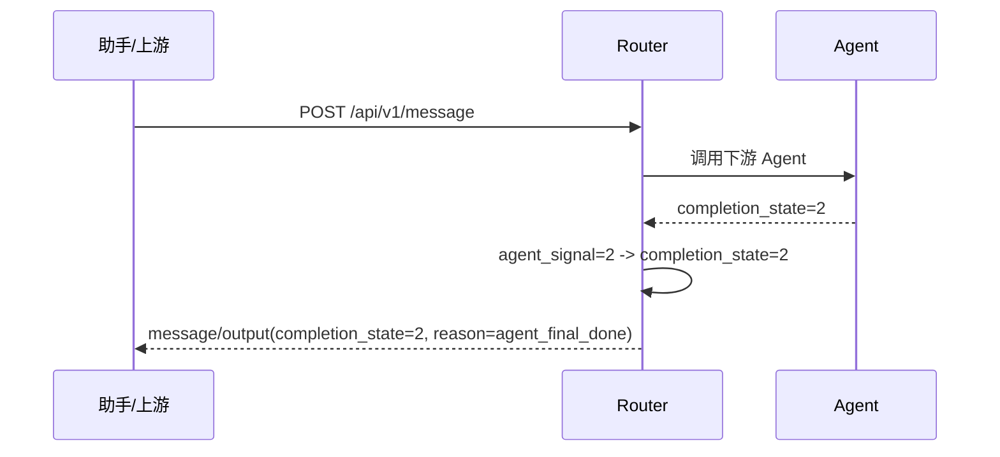
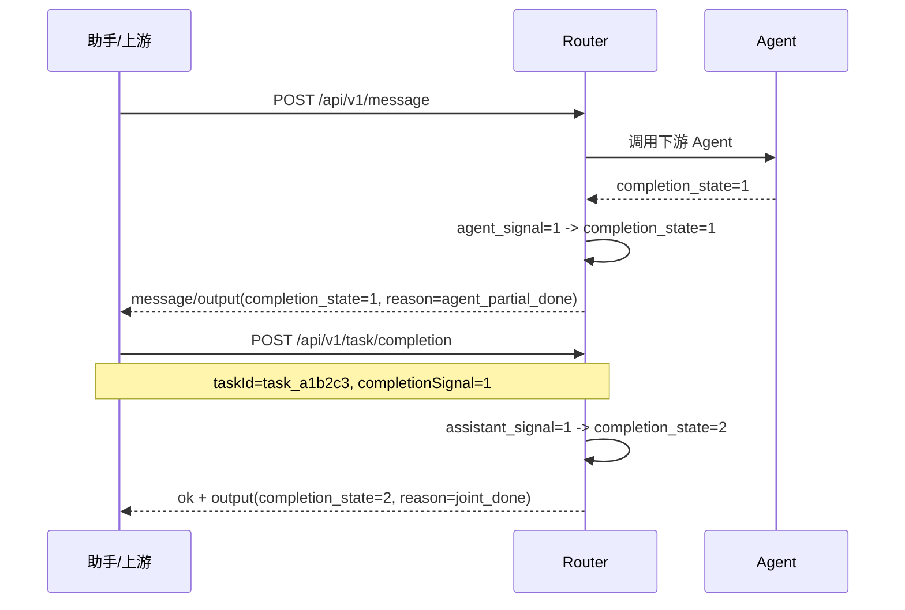
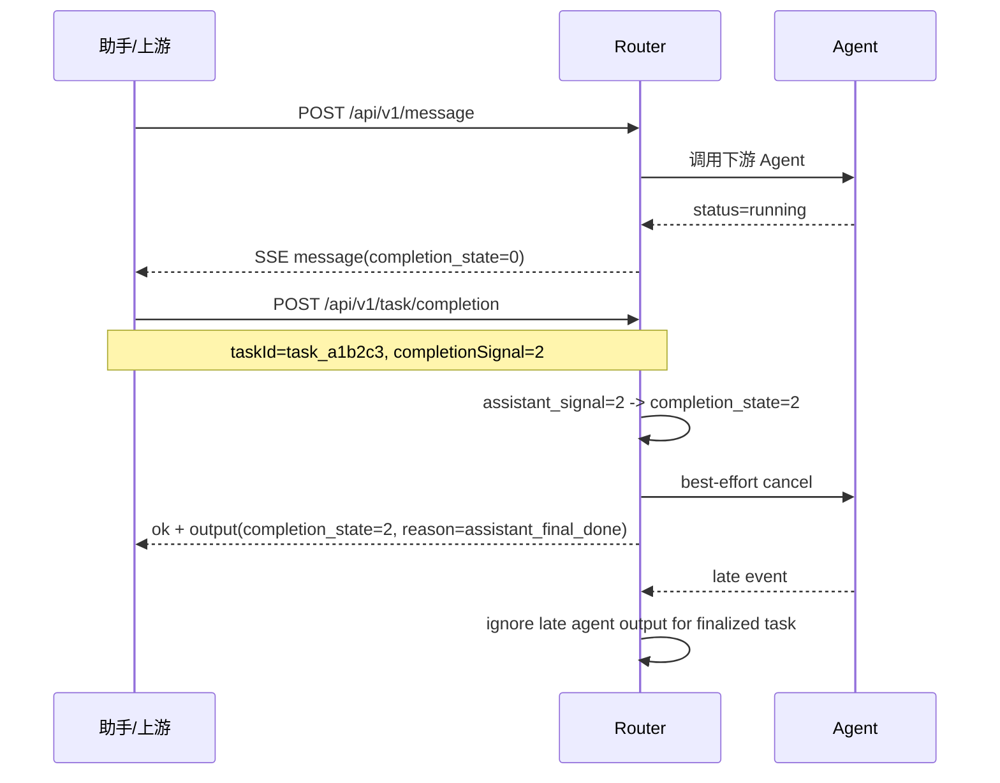

# Router-Service 助手完成态回调接口设计 v0.3

> 状态：待评审
> 日期：2026-04-22
> 适用范围：助手服务 -> Router 的任务完成态回调
> 关联文档：
> - `docs/v3/router-service-通信协议规范.md`
> - `docs/v3/router-service-流式协议补充草案.md`

## 1. 背景

当前 Router 面向上游已经统一到 `/api/v1/message`：

1. 非流返回 `ok + output`；
2. SSE 每个 `event: message` 的 `data` 与非流 `output` 同构；
3. 上游当前消费的任务态主字段包括：
   - `current_task`
   - `task_list`
   - `completion_state`
   - `completion_reason`
   - `node_id`
   - `intent_code`
   - `status`
   - `isHandOver`
   - `handOverReason`
   - `message`
   - `data`
   - `slot_memory`

但是现在有一个明确缺口：

**Router 目前还没有一条正式的“助手补完成信号”接口。**

现状里，`completion_state` 主要还是基于：

1. Agent 下游返回字段；
2. Router 自身节点状态；
3. `isHandOver` 的兜底推导。

这对于下面三类结束场景不够完整：

1. Agent 单侧即可拍板完成；
2. Assistant 单侧即可拍板完成；
3. Agent 先给半完成，Assistant 再补半完成，Router 合并后认定真完成。

因此，需要在现有 v0.3 协议上，补一条**任务级完成态回调接口**。

## 2. 设计目标

本补充设计只解决一件事：

**让 Router 可以在现有 `/api/v1/message` 主链路之外，接收来自助手的任务完成态更新，并统一收敛成最终 `completion_state`。**

目标如下：

1. 不改现有 `/api/v1/message` 主入口语义；
2. 不要求 Agent 先改协议；
3. `isHandOver` 与“任务完成”彻底拆开；
4. 支持 `0 / 1 / 2` 三态收敛；
5. 支持单侧直接完成，也支持双侧各出一半；
6. 对重复回调具备幂等性；
7. 一旦认定 `completion_state=2`，不可回退；
8. 若 Assistant 单侧直接结束任务，Router 能收口并在必要时取消下游 Agent。

## 3. 非目标

这份文档暂不处理以下内容：

1. 不改助手到 Router 的主消息入口 `/api/v1/message`；
2. 不重构多意图整体规划协议；
3. 不引入新的 SSE 事件类型；
4. 不把 `task_list` 改成复杂嵌套结构；
5. 不讨论 K8s / 多 worker / sidecar 记忆实现。

## 4. 核心语义拆分

### 4.1 `isHandOver` 不等于完成

`isHandOver` 只表示：

**当前一侧是否希望把控制权交给上游或其他角色。**

它不能直接代表：

1. 任务已结束；
2. 任务可归档；
3. Session 内该任务可释放；
4. Assistant 已确认业务闭环。

### 4.2 `completion_signal` 是单侧输入

`completion_signal` 是某一方提交给 Router 的单侧完成信号，取值为：

| 值 | 含义 |
|---|---|
| `0` | 不结束 |
| `1` | 单侧结束，但仍等待另一侧 |
| `2` | 单侧即可直接判定最终结束 |

说明：

1. `completion_signal` 是输入；
2. 输入来自 Agent 或 Assistant 任一侧；
3. 单侧输入不直接等于最终对上游输出。

### 4.3 `completion_state` 是 Router 的统一输出

`completion_state` 是 Router 对 `current_task` 的统一收敛结果，取值为：

| 值 | 含义 |
|---|---|
| `0` | 任务未结束 |
| `1` | 已有一侧结束，等待另一侧 |
| `2` | Router 已认定该任务最终结束 |

### 4.4 计算规则

Router 内部不直接做“算术累加”，而是维护**双侧状态**：

- `agent_signal`
- `assistant_signal`

再由 Router 统一计算 `completion_state`：

| `agent_signal` | `assistant_signal` | `completion_state` | 说明 |
|---|---:|---:|---|
| `0` | `0` | `0` | 都未结束 |
| `1` | `0` | `1` | Agent 单侧结束 |
| `0` | `1` | `1` | Assistant 单侧结束 |
| `1` | `1` | `2` | 双侧各完成一半 |
| `2` | `0/1/2` | `2` | Agent 单侧可直接拍板 |
| `0/1` | `2` | `2` | Assistant 单侧可直接拍板 |

关键约束：

1. `completion_state=2` 后不可回退；
2. 重复回调不能把 `1+1+1` 这种重试误算成更高状态；
3. `node_id=end` 不等于 `completion_state=2`；
4. `isHandOver=true` 不等于 `completion_state=2`。

## 5. 推荐接口设计

## 5.1 结论

建议新增一条独立接口，而不是复用 `/api/v1/message`：

```text
POST /api/v1/task/completion
Content-Type: application/json
```

理由很直接：

1. `/api/v1/message` 的语义是“用户新输入”；
2. 助手补完成态的语义是“更新已有任务状态”；
3. 两者混在一个入口，会把主链路和状态回调链路搅在一起；
4. 独立接口更利于幂等、审计、排障和权限隔离。
5. 固定路径更符合业务侧接口治理、网关配置和 SDK 固化要求。

## 5.2 任务定位规则

本接口不使用动态路径参数，任务定位信息统一放进请求体。

约束：

1. 对外回调时，`taskId` 必须与上游收到的 `current_task` 对齐；
2. `current_task` 必须使用稳定任务标识，不允许使用展示文案；
3. 当前实现里，`current_task` 优先返回 `task_id`，这条约束应保持不变；
4. 后续若有展示名，应新增字段，不能复用 `current_task`。

## 5.3 请求体

```json
{
  "sessionId": "ses_001",
  "taskId": "task_a1b2c3",
  "completionSignal": 1
}
```

字段说明：

| 字段 | 类型 | 必填 | 说明 |
|---|---|---|---|
| `sessionId` | string | 是 | 所属会话标识，用于快速定位 session 并校验 task 归属 |
| `taskId` | string | 是 | 要更新的任务标识，必须与上游收到的 `current_task` 一致 |
| `completionSignal` | int | 是 | 助手单侧完成信号，只允许 `1` 或 `2` |

约束说明：

1. 助手侧不需要发送 `0`，因为“没完成”不需要专门回调；
2. `taskId` 与 `sessionId` 必须同时校验，不能只靠其中一个定位任务；
3. `completionSignal=1` 表示“助手单侧完成，但 Router 不应立即终结任务，除非另一侧也已达成条件”；
4. `completionSignal=2` 表示“助手单侧即可直接终结任务”；
5. 该接口只表达“完成态推进”，不承载来源、文案、取消原因等附加语义；
6. Router 对外返回的 `completion_reason` 由 Router 自己推导，不依赖助手入参。

## 5.4 响应体

响应继续沿用现有统一格式，不单开新 envelope：

```json
{
  "ok": true,
  "output": {
    "current_task": "task_a1b2c3",
    "task_list": [
      { "name": "task_a1b2c3", "status": "completed" },
      { "name": "task_d4e5f6", "status": "waiting" }
    ],
    "completion_state": 2,
    "completion_reason": "joint_done",
    "node_id": "end",
    "intent_code": "AG_TRANS",
    "status": "completed",
    "isHandOver": true,
    "handOverReason": "completed",
    "message": "",
    "data": [],
    "slot_memory": {
      "payee_name": "小明",
      "amount": "200"
    }
  }
}
```

响应原则：

1. 回调接口返回 Router 当前认定的**规范结果**；
2. 不是简单回显助手入参；
3. 这样助手收到响应后，可以直接按统一协议继续处理，不需要另加一套解析逻辑。

## 5.5 错误语义

建议首批错误码如下：

| HTTP | 错误码 | 场景 |
|---|---|---|
| `400` | `INVALID_COMPLETION_SIGNAL` | `completionSignal` 不在允许值域 |
| `400` | `MISSING_TASK_ID` | 请求体缺少 `taskId` |
| `404` | `SESSION_NOT_FOUND` | `sessionId` 不存在 |
| `404` | `TASK_NOT_FOUND` | `taskId` 在 session 下不存在 |
| `409` | `TASK_SESSION_MISMATCH` | `taskId` 不属于该 `sessionId` |

补充约束：

1. 对于重复回调，Router 应按当前任务最新状态返回最新规范态，不做重复推进；
2. 对于**已终态任务再次回调**，建议返回 `200` + 当前最新规范态，不做降级。

## 6. Router 内部实现建议

## 6.1 运行时最小状态

建议给 `GraphNodeState` 关联一组完成态元数据，作为 Router 运行期对象的一部分：

```text
completion_meta
  - agent_signal: 0 | 1 | 2
  - assistant_signal: 0 | 1 | 2
  - completion_state: 0 | 1 | 2
  - completion_reason: string
  - finalized_by: agent | assistant | joint | router | null
  - finalized_at: datetime | null
```

说明：

1. 双侧 signal 是原始输入态；
2. `completion_state` 和 `completion_reason` 是计算结果；
3. 幂等通过“状态单调推进”保证，不依赖事件去重字段；
4. 这是运行期元数据，不要求立刻变成对外协议字段全集。

## 6.2 与现有 Agent 输出的衔接

当前 Agent 已可输出：

- `isHandOver`
- `handOverReason`
- `status`
- `completion_state`
- `completion_reason`

建议收敛方式：

1. Agent 若显式给出 `completion_state=1/2`，Router 将其解释为 `agent_signal`；
2. Assistant 回调只更新 `assistant_signal`；
3. Router 重新计算最终 `completion_state` 与 `completion_reason`；
4. 对外输出统一仍走 `_assistant_output_template(...)` 这套结构。

推荐的 `completion_reason` 推导规则：

| 场景 | `completion_reason` |
|---|---|
| `agent_signal=2` | `agent_final_done` |
| `assistant_signal=2` | `assistant_final_done` |
| `agent_signal=1` 且 `assistant_signal=0` | `agent_partial_done` |
| `agent_signal=0` 且 `assistant_signal=1` | `assistant_partial_done` |
| `agent_signal=1` 且 `assistant_signal=1` | `joint_done` |

## 6.3 终态收口规则

```mermaid
flowchart TD
    A[收到 Agent 或 Assistant 的完成信号] --> B[按 max(现值, 新值) 更新对应侧 signal]
    B --> E{是否已有任一侧 signal=2}
    E -- 是 --> F[completion_state=2]
    E -- 否 --> G{agent_signal=1 且 assistant_signal=1?}
    G -- 是 --> F
    G -- 否 --> H{是否已有单侧 signal=1?}
    H -- 是 --> I[completion_state=1]
    H -- 否 --> J[completion_state=0]
    F --> K[标记任务终态 不可回退]
    I --> L[等待另一侧]
    J --> M[继续运行]
```

## 6.4 如果 Assistant 单侧直接结束

当 Assistant 回调 `completionSignal=2` 时：

1. Router 立即将该任务收敛为 `completion_state=2`；
2. 若该任务对应 Agent 仍在 `dispatching/running/ready_for_dispatch`，Router 应执行 best-effort 取消；
3. 取消失败不影响对上游返回最终完成态；
4. 该任务后续再来的 Agent 输出应被忽略，或只做日志记录，不得把终态冲掉。

## 7. 时序设计

## 7.1 场景一：Agent 单侧可直接完成



## 7.2 场景二：Agent 给 1，Assistant 再补 1



## 7.3 场景三：Assistant 单侧直接完成



## 8. 与现有 v0.3 协议的关系

这条回调接口是对现有协议的补充，不替代现有协议：

| 能力 | 是否保留 | 说明 |
|---|---|---|
| `/api/v1/message` 非流 | 保留 | 主链路 |
| `/api/v1/message` SSE | 保留 | 主链路 |
| `current_task` / `task_list` | 保留 | 回调时作为任务定位依据 |
| `completion_state` / `completion_reason` | 保留 | 继续作为规范输出 |
| `isHandOver` / `handOverReason` | 保留 | 但不再承担“结束态唯一依据”职责 |

补充说明：

1. 本接口当前只表达“任务完成态推进”；
2. 若后续业务需要“助手显式取消任务”的独立语义，建议单独设计固定取消接口；
3. 不建议再把取消语义塞回这个完成态接口的自由字段里。

## 9. 推荐落地顺序

1. 先新增回调接口和请求模型；
2. 给运行期 node/task 增加 completion meta；
3. 统一 Agent 侧和 Assistant 侧的 signal 写入入口；
4. 改造 `_assistant_completion_fields(...)`，从“纯推导”切到“优先读 completion meta”；
5. 补单元测试和端到端用例：
   - agent=2
   - assistant=2
   - agent=1 + assistant=1
   - 重复 assistant 回调
   - finalized 后 late agent output

## 10. 本文档结论

结论很明确：

1. 需要加接口；
2. 接口应独立于 `/api/v1/message`；
3. 接口粒度应是**任务级**，不是 session 级；
4. 计算方式应是“双侧 signal -> Router 收敛”，不是裸整数累加；
5. `isHandOver` 继续保留，但不再等同于任务完成；
6. `completion_state=2` 一旦成立，即为不可回退终态；
7. 若 Assistant 单侧直接给 `2`，Router 应收口任务，并对下游执行 best-effort cancel。
