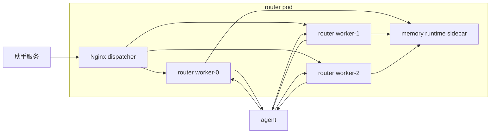
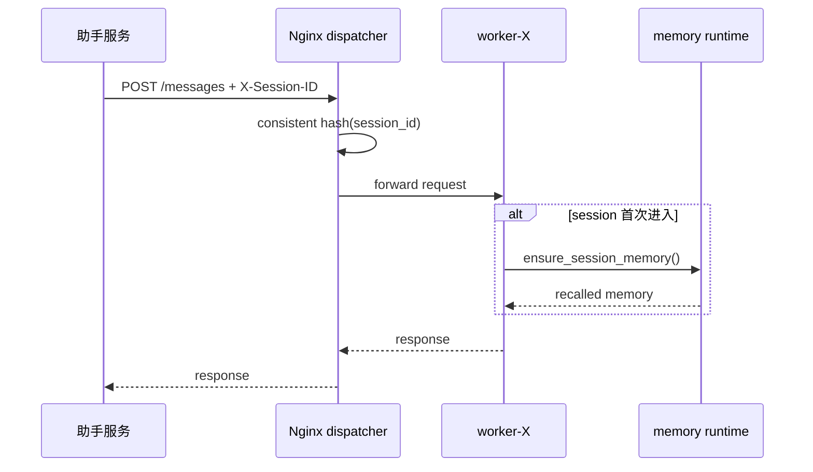
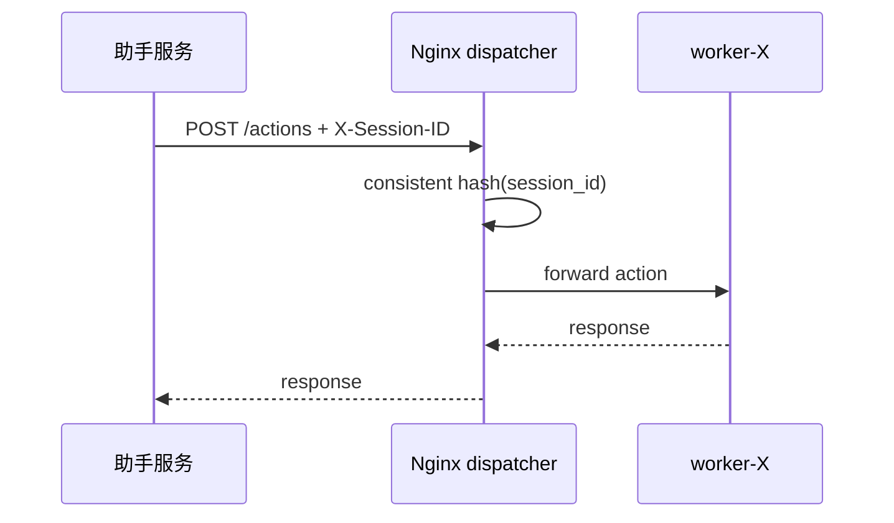
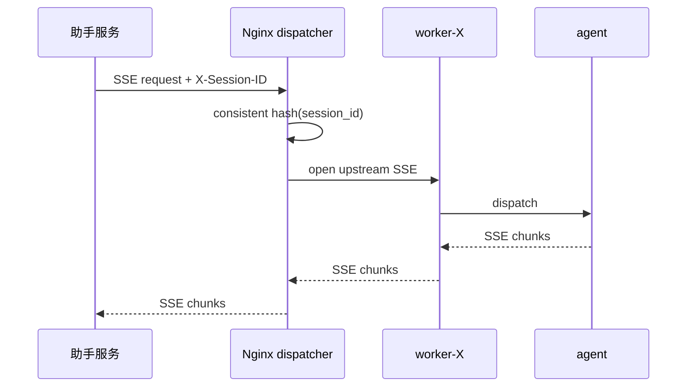

# router-service 单 pod 多 worker 实现方案 v0.2

状态：设计稿  
更新时间：2026-04-19  
适用分支：`feature/router-memory-runtime-v0.2`

## 1. 背景

当前 Router 的运行时设计已经明确：

1. 活跃 session 真值保留在 Router 进程内
2. `memory runtime` 只负责 session 开头 warmup 和 session 结束 dump
3. pod 级 `session` 绑定由外部解决

现在要解决的是 pod 内部扩展问题：

`在单 pod 内启多个 worker 时，如何保证同一个 session_id 始终命中同一个 worker，同时不破坏当前 session/memory 设计。`

## 2. 目标

本方案只解决以下 5 件事：

1. 单 pod 内多 worker 的 session 绑定
2. 普通请求、action、SSE 三条链路统一命中同一 worker
3. 一个 pod 只保留一个 `memory runtime sidecar`
4. 不引入外置 session store
5. 在不降低现有业务语义的前提下提升 Router 并发承载

## 3. 非目标

本方案暂不解决：

1. pod 级路由绑定
2. 跨 pod session 迁移
3. 无损 session 级故障切换
4. 分布式 session store
5. agent 协议层重构

## 4. 结论

推荐方案：

1. pod 内增加一个 `dispatcher`
2. `dispatcher` 按 `session_id` 把请求固定转发到某个 worker
3. 每个 worker 独立持有自己的 `GraphSessionStore`
4. 所有 worker 共用一个 `memory runtime sidecar`

不推荐方案：

1. 直接裸开 `uvicorn/gunicorn --workers N`
2. 让多个 worker 抢同一个监听口
3. 一个 worker 一个 memory runtime
4. 现在就把 session 真值外置

## 5. 推荐形态

v0.2 推荐明确选型为：

1. `Nginx` 作为 pod 内 `dispatcher`
2. `N` 个 Router worker 进程
3. `1` 个 `memory runtime sidecar`

原因：

1. `Nginx` 做 header hash 和 SSE 透传足够成熟
2. 不需要把转发逻辑塞进 Router 业务代码
3. 生产上更容易观测和维护

## 6. 启动与 worker 数量规则

### 6.1 基本原则

worker 数量不自动决定，采用“显式配置，默认 1”的规则。

原因：

1. `worker` 数量会直接影响 pod 内 `session_id -> worker` 的映射。
2. 一旦 worker 数量变化，同一个 `session_id` 命中的 worker 也可能变化。
3. 这不是适合运行时自动伸缩的参数，而是部署参数。

因此 v0.2 明确约定：

1. `worker` 数量由启动参数决定
2. 默认值是 `1`
3. 改 worker 数量视为一次重新部署
4. 不支持运行时热修改

### 6.2 推荐配置项

建议至少有以下配置：

```text
ROUTER_WORKER_COUNT=1
ROUTER_WORKER_BIND_HOST=127.0.0.1
ROUTER_WORKER_BASE_PORT=19001
ROUTER_DISPATCHER_PORT=18080
```

字段含义：

1. `ROUTER_WORKER_COUNT`
   - Router worker 数量
   - 默认 `1`
2. `ROUTER_WORKER_BIND_HOST`
   - worker 本地监听地址
   - 默认 `127.0.0.1`
3. `ROUTER_WORKER_BASE_PORT`
   - worker 起始端口
   - 默认 `19001`
   - 第 `i` 个 worker 监听 `BASE_PORT + i`
4. `ROUTER_DISPATCHER_PORT`
   - pod 内 dispatcher 对外监听端口
   - 默认 `18080`

### 6.3 启动模式

#### 模式 A：单 worker

当：

```text
ROUTER_WORKER_COUNT=1
```

启动规则：

1. 只启动一个 Router worker
2. 不强制要求启 Nginx dispatcher
3. Pod Service 可以直接打到这个 worker

适用场景：

1. 本地开发
2. 功能联调
3. 尚未启用多 worker 的生产初始形态

#### 模式 B：多 worker

当：

```text
ROUTER_WORKER_COUNT>1
```

启动规则：

1. 启动一个 Nginx dispatcher
2. 启动 `N` 个 Router worker
3. dispatcher 按 `X-Session-ID` consistent hash 转发
4. worker 只监听 pod 内部本地地址，不直接暴露给上游

例如当：

```text
ROUTER_WORKER_COUNT=3
ROUTER_WORKER_BASE_PORT=19001
```

则：

1. `worker-0 -> 127.0.0.1:19001`
2. `worker-1 -> 127.0.0.1:19002`
3. `worker-2 -> 127.0.0.1:19003`
4. Nginx 对外监听 `ROUTER_DISPATCHER_PORT`

### 6.4 启动编排建议

建议做成一个统一 entrypoint，而不是让部署层自己拼命令。

entrypoint 负责：

1. 读取 `ROUTER_WORKER_COUNT`
2. 渲染 Nginx upstream 配置
3. 启动 `N` 个 Router worker
4. 在 `worker_count > 1` 时启动 dispatcher
5. 管理子进程退出和优雅关闭

推荐行为：

1. 当 `worker_count = 1`，entrypoint 直接起单 worker
2. 当 `worker_count > 1`，entrypoint 先渲染配置，再起 Nginx 和多个 worker
3. 任一关键子进程异常退出时，pod 直接失败并由 k8s 重建

### 6.5 怎么决定给几个 worker

当前不建议程序自己按 CPU 核数自动猜测 worker 数量。

原因：

1. Router 不是纯 CPU 型服务
2. 意图识别、提槽、agent 调用都带明显 IO 特征
3. 每增加一个 worker，都会增加进程副本、内存占用和调度成本
4. worker 数量增加不一定线性提升吞吐

因此建议按“显式配置 + 压测验证”决定：

1. 默认 `1`
2. 首个多 worker 试点建议 `2`
3. 第二档建议 `4`
4. 在 v0.2 阶段，不建议一开始就上 `>4`

更具体地说：

1. 开发环境：`1`
2. 联调/测试环境：`1` 或 `2`
3. 生产首轮试点：`2`
4. 压测验证后再决定是否升到 `4`

### 6.6 为什么默认值必须是 1

默认值设为 `1` 的原因：

1. 单 worker 语义最简单
2. 不需要 dispatcher
3. 不会引入额外的 pod 内转发复杂度
4. 是最稳的回退模式

也就是说，v0.2 的“默认行为”应该始终是：

```text
不开多 worker，就按单 worker 运行
```

### 6.7 worker 数量变更规则

worker 数量变化，本质上是 pod 内部拓扑变化。

因此明确约定：

1. 不支持热修改 `ROUTER_WORKER_COUNT`
2. 改动 `ROUTER_WORKER_COUNT` 必须触发重新部署
3. 滚动发布时，新旧 pod 可以并存，但单个 pod 内 worker 数量在其生命周期内必须固定

这里要特别注意：

1. 从 `1 -> 2`
2. 从 `2 -> 4`
3. 从 `4 -> 2`

这三种变化都会改变 pod 内 `session_id -> worker` 的映射。

所以它不能被视作“普通参数更新”，而必须视作“拓扑重建”。

### 6.8 推荐启动约束

为了降低实现复杂度，建议 v0.2 先约束为：

1. 只支持 `1 / 2 / 4` 三档
2. `1` 为默认
3. `>1` 时必须启用 dispatcher
4. `worker_count > 1` 且没有 `X-Session-ID` 时，直接拒绝请求

这样做的好处是：

1. 部署矩阵更清楚
2. 压测对比更清楚
3. 问题定位更清楚

### 6.9 推荐启动示例

#### 示例 1：单 worker

```text
ROUTER_WORKER_COUNT=1
ROUTER_WORKER_BIND_HOST=127.0.0.1
ROUTER_WORKER_BASE_PORT=19001
```

行为：

1. 启动一个 Router worker
2. 不启 dispatcher

#### 示例 2：两个 worker

```text
ROUTER_WORKER_COUNT=2
ROUTER_WORKER_BIND_HOST=127.0.0.1
ROUTER_WORKER_BASE_PORT=19001
ROUTER_DISPATCHER_PORT=18080
```

行为：

1. 启动 Nginx dispatcher
2. 启动两个 worker
3. Nginx 按 `X-Session-ID` 把请求固定转到两个 worker 之一

#### 示例 3：四个 worker

```text
ROUTER_WORKER_COUNT=4
ROUTER_WORKER_BIND_HOST=127.0.0.1
ROUTER_WORKER_BASE_PORT=19001
ROUTER_DISPATCHER_PORT=18080
```

行为：

1. 启动 Nginx dispatcher
2. 启动四个 worker
3. 需要在压测已经证明 `2` 不足时才进入这一档

### 6.10 Pod 资源与容器资源关系

在当前方案里，一个 pod 内至少有三个角色：

1. `router worker` 进程所在容器
2. `Nginx dispatcher` 容器
3. `memory runtime` 容器

这里要明确区分两层资源语义：

1. 容器级资源
   - 每个容器都可以单独配置 `requests/limits`
   - `router`、`nginx`、`memory runtime` 各自独立生效
2. pod 级调度资源
   - k8s 调度时，看的是整个 pod 内所有容器 `request` 的总和
   - 不是只看某一个容器

也就是说：

1. `memory runtime` 是单独容器，就应该单独配置资源
2. 但它不是“独立于 pod 之外”的资源
3. 最终它仍然占用整个 pod 的总资源预算

### 6.11 为什么 worker 数量主要看 router 容器 CPU

虽然 scheduler 看的是 pod 总资源，但 `worker` 数量主要受 `router` 主容器约束。

原因：

1. 真正承载意图识别、提槽、graph 状态机、session 热态的是 `router`
2. `Nginx dispatcher` CPU 占用相对轻
3. `memory runtime` 只负责 warmup/dump，不在业务热路径上

因此 sizing 的主判断应当是：

1. 先看 `router` 容器分到多少 CPU
2. 再看 `memory runtime` 和 `nginx` 需要预留多少
3. 最后决定 `ROUTER_WORKER_COUNT`

而不是简单按：

```text
pod 总 CPU = worker 数量
```

### 6.12 CPU / worker sizing 规则

v0.2 建议采用保守规则：

1. `ROUTER_WORKER_COUNT` 仍然是显式配置
2. 默认 `1`
3. 不按 CPU 核数自动推导 worker 数
4. 但 worker 数上限必须受 `router` 容器 CPU 约束

推荐起步规则：

1. `router` 容器约 `1 vCPU`
   - 先用 `1 worker`
2. `router` 容器约 `2 vCPU`
   - 先试 `2 worker`
3. `router` 容器约 `4 vCPU`
   - 先从 `2 worker` 开始压测
   - 只有压测证明 `2` 不足，再升到 `4 worker`
4. v0.2 阶段
   - 不建议一开始就超过 `4 worker`

原因：

1. Router 不是纯 CPU 型服务
2. 有明显的 LLM / agent IO 特征
3. 多 worker 会增加进程副本和上下文切换
4. worker 数量增加不一定线性提升吞吐

### 6.13 还要同时看内存，不只看 CPU

多 worker 不是只多占 CPU，也会放大内存占用。

因为每增加一个 worker，通常都会多一份：

1. Python 进程本身
2. catalog / 配置加载
3. 连接池或客户端对象
4. session store / 热态对象
5. 运行时缓存

因此最终 sizing 不是只看一个参数，而是同时看：

1. `router cpu`
2. `router memory`
3. `memory runtime cpu/memory`
4. `nginx cpu/memory`
5. `worker count`

### 6.14 推荐的 deployment 资源思路

建议把三个容器分开配置资源：

1. `router`
   - 主要 CPU 消耗者
   - worker 数量主要绑定它
2. `memory runtime`
   - 单独 request/limit
   - 避免和 router 抢资源时失控
3. `nginx dispatcher`
   - 单独 request/limit
   - 资源一般较小，但不能完全不给

示意：

```yaml
containers:
  - name: router
    resources:
      requests:
        cpu: "2"
        memory: "2Gi"
      limits:
        cpu: "2"
        memory: "2Gi"

  - name: memory-runtime
    resources:
      requests:
        cpu: "500m"
        memory: "512Mi"
      limits:
        cpu: "1"
        memory: "1Gi"

  - name: nginx-dispatcher
    resources:
      requests:
        cpu: "200m"
        memory: "128Mi"
      limits:
        cpu: "500m"
        memory: "256Mi"
```

这个例子表达的意思是：

1. `router` 容器按 `2 vCPU` 规划，可以作为 `2 worker` 的起步试点
2. `memory runtime` 单独预留资源，不和 router 混算
3. `nginx` 单独预留少量资源
4. pod 调度时，看的则是三者总和

### 6.15 v0.2 推荐规则总结

在单 pod 多 worker 方案里，关于资源和 worker 数量，建议直接定成：

1. `ROUTER_WORKER_COUNT` 显式配置
2. 默认值 `1`
3. worker 数量主要参考 `router` 容器 CPU，而不是 pod 总 CPU
4. `memory runtime` 是单独容器，单独配置资源，但仍占 pod 总预算
5. 首轮多 worker 试点从 `2 worker` 开始
6. 只有压测证明 `2` 不足，再升到 `4 worker`

## 7. 总体结构



## 8. 组件职责

### 8.1 Nginx dispatcher

职责：

1. 接收来自助手服务的 HTTP/SSE 请求
2. 按 `X-Session-ID` 进行 consistent hash
3. 把同一个 `session_id` 固定转发到同一个 worker
4. 透传 SSE，不参与业务语义

不负责：

1. 不持有 session 真值
2. 不读写 memory
3. 不理解意图识别、提槽、graph

### 8.2 Router worker

职责：

1. 维护本 worker 内的 `GraphSessionStore`
2. 承载 session 热态、task、business、graph 生命周期
3. 在 session 首次进入时调用 `memory runtime` warmup
4. 在 session 结束时调用 `memory runtime` dump

### 8.3 Memory runtime sidecar

职责：

1. 提供 session warmup
2. 提供 session dump/promote
3. 提供长期记忆召回和归档边界

不负责：

1. 不做 pod 内 worker 路由
2. 不做活跃 session 真值存储
3. 不参与业务热路径

## 9. 路由约定

### 9.1 路由键

pod 内 worker 绑定统一使用请求头：

```text
X-Session-ID: <session_id>
```

同时业务 body 里仍保留 `session_id` 字段，worker 负责校验：

1. header 存在
2. body 存在
3. 两者一致

若不一致，worker 直接返回 `4xx`，不允许静默兜底。

### 9.2 为什么只看 header

因为这样：

1. `dispatcher` 不需要理解业务 body
2. POST / action / SSE 都能统一做路由
3. 后续切换代理实现时，不需要改业务协议

## 10. Worker 选择算法

### 10.1 推荐算法

v0.2 推荐直接使用 Nginx upstream 的 consistent hash：

```text
hash $http_x_session_id consistent;
```

这样可以保证：

1. 同一个 `session_id` 稳定命中同一个 worker
2. 未来若 worker 列表变化，重映射尽量小

### 10.2 Worker 表达

worker 固定编号，例如：

1. `worker-0 -> 127.0.0.1:19001`
2. `worker-1 -> 127.0.0.1:19002`
3. `worker-2 -> 127.0.0.1:19003`

## 11. 调用链

### 11.1 普通消息请求



### 11.2 Action 请求



### 11.3 SSE 请求



约束：

1. SSE 建链后，本次连接期间不能切 worker
2. 普通请求、action、SSE 必须共用同一套路由规则
3. 否则会出现补槽、确认、取消、流式回传落到不同 worker 的问题

## 12. Memory runtime 接入关系

在多 worker 方案里，`memory runtime` 仍然保持“首尾模式”：

1. worker 首次看到某个 session 时，调用 `ensure_session_memory()`
2. session 活跃期间，只读写本 worker 内存中的 session 热态
3. session 结束或过期时，调用 `expire_session()`

也就是说：

1. `dispatcher` 不碰 memory
2. `Nginx` 不碰 memory
3. `memory runtime` 不参与 worker 选择

## 13. 故障语义

### 13.1 本方案能保证的事情

1. 同一个 `session_id` 稳定命中同一个 worker
2. worker 之间可以真实分担并发
3. SSE 与普通请求不会乱串 worker

### 13.2 本方案不能保证的事情

如果某个 worker 进程突然 crash：

1. 这个 worker 上的活跃 session 热态会丢
2. 正在等待补槽/确认/执行中的业务会中断
3. 新请求虽然还会命中同一逻辑 worker 槽位，但旧内存状态已经不存在

所以 v0.2 的高可用语义是：

1. 保证路由正确
2. 保证扩展性
3. 不保证无损 session 恢复

## 14. 为什么当前不做更重的方案

当前不建议直接上：

1. 外置 session store
2. checkpoint store
3. lease owner
4. 分布式恢复

原因：

1. 当前首要问题是 pod 内多 worker 的 session 路由
2. 一口气把 session 真值外置，会把本轮 memory/runtime 设计打散
3. 先把 worker 路由做对，再评估是否真的需要 session 级故障恢复

## 15. 实施步骤

### Phase 1：基础路由落地

1. 增加 `X-Session-ID` 约定
2. 增加 Nginx dispatcher 配置
3. 启动多个 Router worker
4. 配置 Nginx consistent hash upstream
5. 打通普通请求链路

### Phase 2：SSE 对齐

1. 打通 SSE 代理
2. 验证 agent outbound 是否稳定回流到同一 worker
3. 验证中途断链、超时、取消的行为

### Phase 3：验证与压测

1. 验证多轮补槽命中同一 worker
2. 验证 action 命中同一 worker
3. 验证 session 结束 dump 仍正确
4. 跑 fake LLM 阶梯压测，观察 60/120 并发下分布与长尾

## 16. 开发任务清单

- [ ] 增加 `X-Session-ID` 路由约定
- [ ] worker 增加 header/body session 一致性校验
- [ ] 增加 pod 内 Nginx dispatcher 配置
- [ ] 增加多 worker 启动方式
- [ ] 打通普通 HTTP 代理
- [ ] 打通 SSE 代理
- [ ] 增加 worker id 日志字段
- [ ] 增加 session_id -> worker 命中验证日志
- [ ] 增加多 worker 集成测试
- [ ] 增加 fake LLM 并发压测验证

## 17. 验收标准

实施完成后，至少要满足：

1. 同一个 `session_id` 的多轮消息稳定命中同一个 worker
2. 同一个 `session_id` 的 action 稳定命中同一个 worker
3. 同一个 `session_id` 的 SSE 稳定命中同一个 worker
4. 转账等多轮补槽场景业务结果不退化
5. session 过期后 dump 正常
6. 单 pod 多 worker 相比单 worker，在 fake LLM 场景下吞吐有可观提升

## 18. 风险

主要风险有 3 个：

1. SSE 代理配置不当，导致流式链路中断或缓冲
2. `X-Session-ID` 传递不完整，导致 worker 漂移
3. worker crash 时，活跃 session 丢失被误认为路由问题

## 19. 一句话结论

单 pod 多 worker 的正确落地方式，是在 pod 内增加一个 `dispatcher`，按 `X-Session-ID` 把普通请求、action 和 SSE 一起固定到同一个 worker；每个 worker 持有自己的 session 热态，整个 pod 共用一个 `memory runtime sidecar`。
