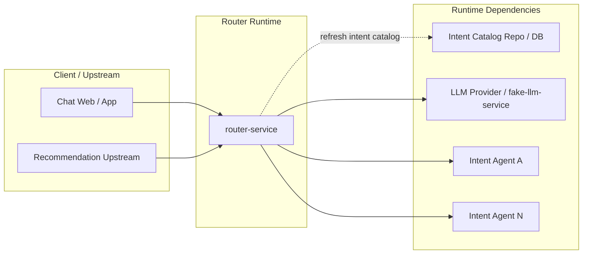
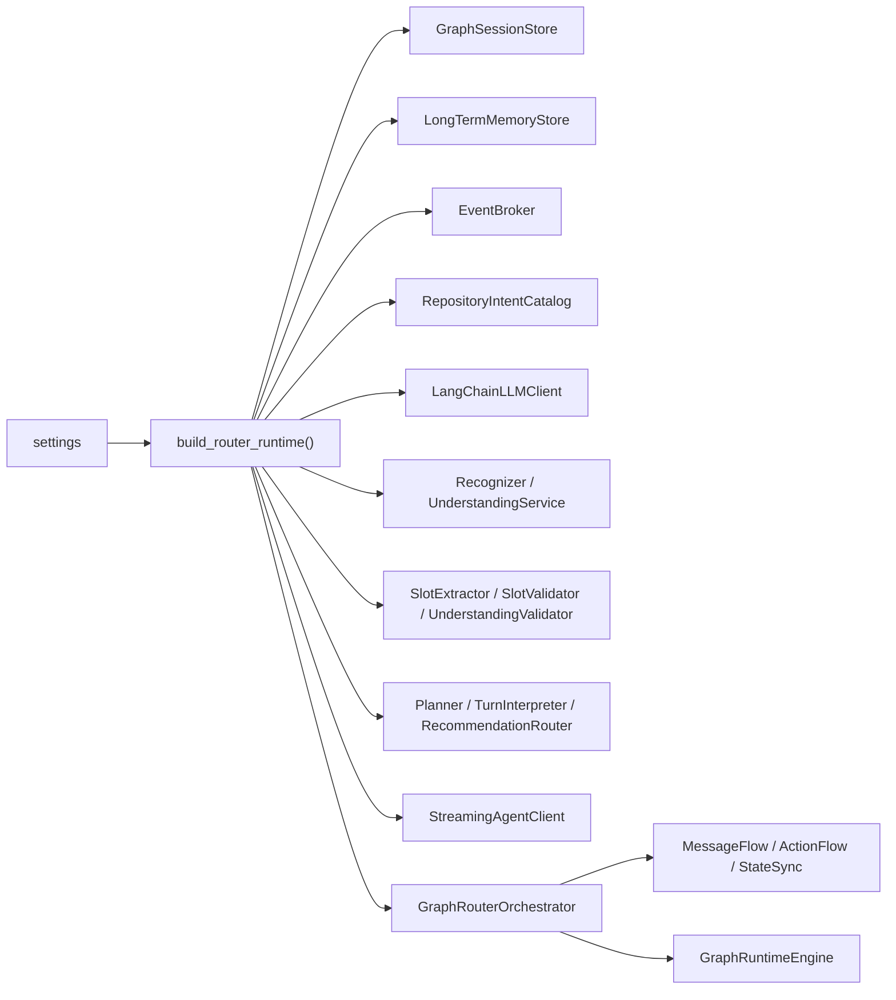
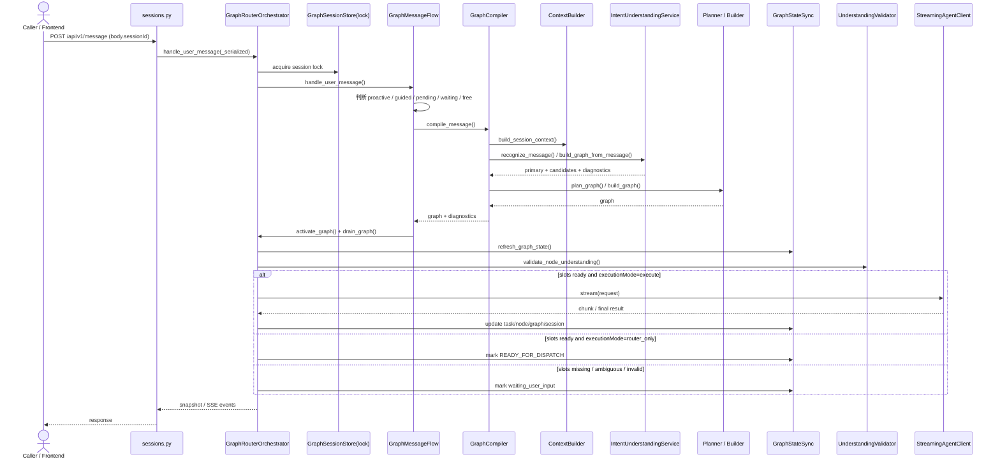
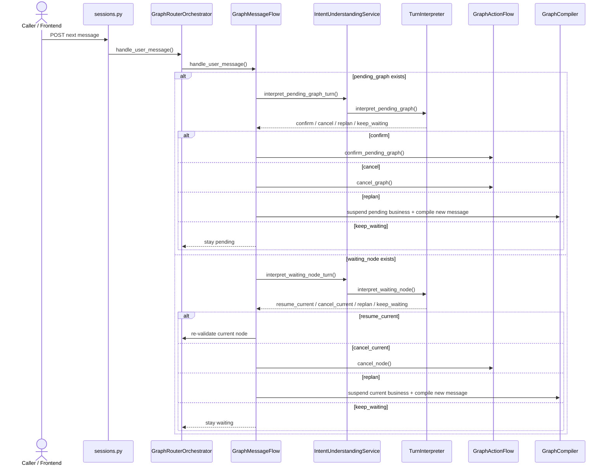
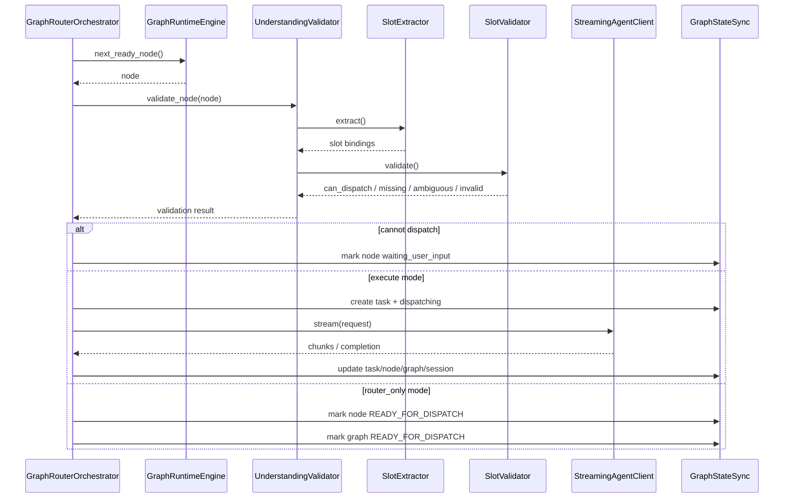

# Router Service 架构设计文档

状态：对齐草案  
更新时间：2026-04-18  
适用分支：`test/v3-concurrency-test`

## 1. 文档目标

本文档从架构视角说明 `router-service` 当前的逻辑分层、部署边界、核心运行时对象、数据流和设计债务，为后续架构评审与演进提供统一基线。

## 2. 架构原则

当前 Router 的架构设计隐含了以下原则：

1. 动态目录优先于静态代码。
2. Router 负责跨意图理解与编排，Agent 负责单意图业务执行。
3. Graph 是运行时一等公民，不是前端展示模型。
4. Session 不是单图模型，而是业务对象容器。
5. 事件输出和快照输出必须来自同一份运行态。
6. 简单场景要避免无差别重型规划。

## 3. 部署拓扑

### 3.1 目标服务拓扑

当前目标拓扑为：

```text
Chat Web  -> Router API
Router API -> Intent Agents
Router API -> LLM provider / fake LLM
```

### 3.2 部署架构图



### 3.3 服务边界

1. `router-service`
   - 运行时理解、编排、补槽、调度
2. `*-agent`
   - 单意图业务执行
3. `fake-llm-service`
   - 压测/性能环境下的可控 LLM 替身

## 4. 逻辑分层

Router 代码当前可以分成 6 层：

### 4.1 API 层

目录：

1. `api/app.py`
2. `api/dependencies.py`
3. `api/routes/sessions.py`
4. `api/sse/broker.py`

职责：

1. 暴露 HTTP / SSE 接口
2. 组装 runtime
3. 统一错误包装
4. 管理应用生命周期

### 4.2 Catalog 层

目录：

1. `catalog/file_intent_repository.py`
2. `catalog/sql_intent_repository.py`
3. `catalog/in_memory_intent_repository.py`

职责：

1. 读取意图目录
2. 暴露 active intents / fallback / domain views

### 4.3 Shared Model 层

目录：

1. `core/shared/domain.py`
2. `core/shared/graph_domain.py`
3. `models/intent.py`

职责：

1. 定义运行时领域模型
2. 定义意图、图、节点、任务、业务对象、workflow 等结构

### 4.4 Recognition / Slots 层

目录：

1. `core/recognition/*`
2. `core/slots/*`

职责：

1. 意图识别
2. 层级路由
3. turn interpretation
4. Router 侧槽位提取和槽位校验

### 4.5 Graph Runtime 层

目录：

1. `core/graph/compiler.py`
2. `core/graph/planner.py`
3. `core/graph/builder.py`
4. `core/graph/runtime.py`
5. `core/graph/orchestrator.py`
6. `core/graph/message_flow.py`
7. `core/graph/action_flow.py`
8. `core/graph/state_sync.py`
9. `core/graph/presentation.py`

职责：

1. Graph 编译
2. Graph 状态推进
3. Session / Business Object / Waiting / Pending 分支管理
4. 事件投影

### 4.6 Support 层

目录：

1. `core/support/llm_client.py`
2. `core/support/agent_client.py`
3. `core/support/memory_store.py`
4. `core/support/context_builder.py`
5. `core/support/intent_catalog.py`

职责：

1. LLM 通道
2. Agent 通道
3. 长期记忆
4. 上下文构建
5. 目录只读 facade

## 5. 核心运行时对象模型

### 5.1 Session

`GraphSessionState` 当前已经不是简单的“消息 + current_graph”，而是：

```text
session
├── messages
├── tasks
├── candidate_intents
├── shared_slot_memory
├── business_memory_digests
├── business_objects
├── workflow
├── current_graph   (兼容视图)
├── pending_graph   (兼容视图)
└── active_node_id
```

### 5.2 Business Object

`BusinessObjectState` 是 Router 当前架构里最重要的演进点之一。

它表达：

1. 一个业务运行单元绑定一张 graph。
2. 该 graph 可以是 active / pending / suspended / completed。
3. `router_only` 是业务对象属性，而不是全局模式开关。
4. handover 后对象可被 compact 成 digest。

### 5.3 Workflow

`SessionWorkflowState` 当前表达：

1. `focus_business_id`
2. `pending_business_id`
3. `suspended_business_ids`
4. `completed_business_ids`

它的意义在于：

1. Session 的焦点不再只能是一个 graph 字段。
2. 当前业务、待确认业务、挂起业务是分层管理的。

### 5.4 Execution Graph

Graph 是 Router 的主运行时对象，负责表达：

1. 节点集合
2. 边关系
3. graph status
4. graph actions
5. diagnostics

节点状态由 `GraphRuntimeEngine` 推导，不直接由前端决定。

补充说明：

1. `current_graph` 和 `pending_graph` 在当前架构里更像是兼容视图。
2. 真正的一等运行时主体已经转向 `business_objects + workflow`。
3. 当前 message/action/state sync 仍有不少代码直接读写兼容视图，这也是演进中的现实债务。

### 5.5 运行时对象关系图

```mermaid
flowchart TB
    session["GraphSessionState"]
    workflow["SessionWorkflowState"]
    meta["messages / candidate_intents / shared_slot_memory"]
    business["business_objects"]
    digest["business_memory_digests"]
    aliases["current_graph / pending_graph\ncompat aliases"]
    bo["BusinessObjectState"]
    graph["Execution Graph"]
    nodes["Graph Nodes"]
    tasks["Tasks"]
    ltm["LongTermMemoryStore"]

    session --> workflow
    session --> meta
    session --> business
    session --> digest
    session --> aliases
    session --> tasks
    session --> ltm

    workflow --> bo
    business --> bo
    bo --> graph
    graph --> nodes
    tasks --> graph
    aliases -. compatibility view .-> graph
```

## 6. 运行时装配设计

### 6.1 装配中心

`api/dependencies.py::build_router_runtime()` 是装配中心。

它会创建：

1. `GraphSessionStore`
2. `LongTermMemoryStore`
3. `EventBroker`
4. `LangChainLLMClient`
5. `RepositoryIntentCatalog`
6. `IntentRecognizer`
7. `UnderstandingValidator`
8. `Planner`
9. `TurnInterpreter`
10. `RecommendationRouter`
11. `GraphRouterOrchestrator`

### 6.2 当前装配策略

1. LLM 连接可选。
2. Agent barrier 可选。
3. graph builder 是否启用由模式矩阵决定。
4. hierarchical / flat 理解模式在装配阶段决定。

这使得 Router 在架构上更像“一个通过配置裁剪能力的运行时容器”，而不是一套固定的单路径服务。

### 6.3 运行时装配关系图



## 7. 消息处理架构

### 7.1 顶层协调

顶层入口是 `GraphRouterOrchestrator`。

它的职责不是实现所有逻辑，而是把消息流、动作流、状态同步、理解验证和 Agent 调度串起来。

### 7.2 Message Flow

`GraphMessageFlow` 管理所有消息分支：

1. proactive recommendation
2. guided selection
3. pending graph
4. waiting node
5. free dialog

这是一个典型的“状态优先于语义”的设计：

1. 先看 session 当前处于什么运行态。
2. 再决定是否做全局识别。

### 7.3 Action Flow

`GraphActionFlow` 管理所有显式动作：

1. confirm graph
2. cancel graph
3. cancel node

这样消息处理和动作处理在架构上被清晰拆开。

### 7.4 State Sync

`GraphStateSync` 的作用不是“修改业务逻辑”，而是：

1. 刷新运行态推导结果
2. 发布 graph/node/session 事件
3. 把 slot resolution 等跨模块能力收口

这降低了 orchestrator 直接操纵展示层和事件层的复杂度。

### 7.5 首轮消息主时序图



## 8. 理解链路架构

### 8.1 Recognition

当前识别链路分两种：

1. flat 识别：直接基于 active intents 识别
2. hierarchical 识别：domain router -> leaf router -> baseline fallback

### 8.2 Turn Interpretation

waiting / pending 状态下不是直接复用普通 compile，而是走 turn interpreter：

1. `interpret_pending_graph_turn`
2. `interpret_waiting_node_turn`

这是 Router 从“纯首轮识别”走向“续轮决策”的关键架构层。

### 8.3 现状评价

优点：

1. 已经把续轮解释从普通 compile 主链中拆出。
2. 已经具备 `resume_current / cancel_current / replan` 语义。

不足：

1. waiting decision 仍较依赖 LLM。
2. 还没有一个完全独立、可治理的续轮决策策略模块。

### 8.4 阻塞续轮时序图



## 9. 槽位架构

### 9.1 设计定位

当前 Router 架构的一个核心判断是：

> Router 不是只识别意图，它还要在 Agent 之前建立“可执行门”。

因此槽位链路被放在 Router 内部，而不是完全下沉到 Agent。

### 9.2 组件分工

1. `SlotResolutionService`
   - history prefill
   - proactive defaults
   - binding rebuild
2. `SlotExtractor`
   - 读取当前节点已有槽位
   - 必要时调用 LLM 抽取
3. `SlotValidator`
   - grounding
   - history/recommendation source 合法性
   - required / ambiguous / invalid 判断
4. `UnderstandingValidator`
   - 编排 extract + validate

### 9.3 架构价值

这一层把“Router 是否允许节点下发”作为架构边界确定下来，而不是让 Agent 成为第一道补槽关口。

### 9.4 当前债务

1. `structured_output_method` 尚未落成严格 schema。
2. 长期记忆仍偏文本化。
3. `needs_confirmation` 结构已存在，但目前 Router 级确认策略还不够丰富。

## 10. Graph Runtime 架构

### 10.1 Runtime Engine

`GraphRuntimeEngine` 只负责纯状态推导：

1. 依赖边是否满足
2. 节点是 READY / BLOCKED / SKIPPED
3. graph 的聚合状态是什么

它不直接调用 LLM、SessionStore 或 Agent。

### 10.2 Graph Compiler

`GraphCompiler` 是“理解结果 -> graph”的转换层。

它负责：

1. 收集 context
2. 识别
3. 规划
4. 修补条件边
5. 注入 proactive defaults
6. 注入 history prefill

### 10.3 Orchestrator

`GraphRouterOrchestrator` 负责把 compile、validate、run、event 连接成闭环。

### 10.4 设计评价

优点：

1. 状态机、编译器、消息流、动作流已拆分。
2. 相比旧单大文件模式已经清晰很多。

不足：

1. orchestrator 仍然承担了较多 delegate wrapper。
2. graph compiler 仍含部分策略判断和正则信号。
3. 条件治理尚未独立成专项层。
4. 当前 runtime 仍是串行 drain，一个时刻只推进一个 ready node。

### 10.5 节点执行与 Router-Only 边界时序图



## 11. Agent 集成架构

### 11.1 合同模型

Router 与 Agent 的合同主要由以下部分构成：

1. `request_schema`
2. `field_mapping`
3. `slot_memory`
4. `input_context`

### 11.2 协议适配

`StreamingAgentClient` 当前承担：

1. 请求组装
2. 请求发送
3. 响应协议标准化
4. cancel URL 推导
5. 失败路径映射

### 11.3 架构意义

这让 Router 与业务 Agent 之间形成了明确的“协议边界”，避免前端或业务服务直接拼接不同 Agent 的请求。

## 12. 记忆架构

### 12.1 当前记忆层次

1. node `slot_memory`
2. session `shared_slot_memory`
3. `business_memory_digests`
4. `LongTermMemoryStore`

### 12.2 当前原则

1. 当前节点槽位优先
2. 历史复用受 schema 控制
3. 长期记忆用于 recall 和候选补全，不应默认当当前轮真值

### 12.3 当前债务

1. 长期记忆是字符串列表，不是结构化事实表。
2. 冲突治理和 TTL 语义还不够强。

## 13. 观测与错误处理架构

### 13.1 错误处理

当前 API 层统一包装：

1. `RouterApiException`
2. `RequestValidationError`
3. `HTTPException`
4. `AgentBarrierTriggeredError`
5. 未知异常

### 13.2 事件观测

Router 支持：

1. recognition 级事件
2. graph builder 级事件
3. graph/node/session 级事件
4. diagnostics 回传

### 13.3 设计评价

1. 对外语义比早期阶段更稳定。
2. diagnostics 已进入运行时模型，而不只是日志。

## 14. 性能与测试架构

### 14.1 当前性能设计点

1. `router_only` 边界
2. agent barrier
3. fake LLM service
4. ORJSON response
5. 高连接数 LLM client pool
6. session cleanup
7. graph drain guard

### 14.2 当前压测思路

性能环境中，Router 可指向 fake LLM service，并打开 agent barrier，从而把压测聚焦在：

1. Router 自身的理解与编排开销
2. 非真实业务执行路径的吞吐与时延

### 14.3 当前测试现实

1. `router_only`、fake LLM、agent barrier 使 Router 可以拆分压测口径。
2. 但这些结果不能直接外推为真实生产 Agent 全链路 SLA。
3. 真实 LLM 和真实 Agent 路径的稳定性仍需单独验收。

## 15. 架构债务

### 15.1 已识别债务

1. 业务对象模型已经落地，但 `current_graph` / `pending_graph` 兼容别名仍是主操作面。
2. orchestrator 仍保留了 `_drain_graph`、`_run_node`、`_create_task_for_node`、`_handle_agent_chunk` 等执行核心，尚未完全退化为 facade。
3. `GraphMessageFlow` 等 flow 对 orchestrator callback 注入较多，隐式 API 面偏大。
4. `auto` 规划策略里仍有硬编码复杂信号正则。
5. `structured_output_method` 尚未打通为严格 schema。
6. waiting decision 尚未形成专门策略层。
7. blocked turn 的解释链路会刻意弱化 recent / long-term context，续轮解释与普通首轮理解存在非对称。
8. 同意图穿插/恢复能力仍未稳定落地。
9. 条件治理与 graph 编译仍有一定耦合。
10. session store、event broker、long-term memory 默认仍是进程内实现，多副本一致性尚未建立。
11. 配置面当前比真实实现更宽，例如某些 recognizer/backend/structured output 开关仍是“声明大于实现”。

### 15.2 债务优先级

P0：

1. waiting / replan 产品规则与策略层对齐
2. 同意图穿插恢复模型补齐

P1：

1. structured output 收紧
2. 复杂 graph 信号治理
3. 长期记忆结构化
4. 兼容别名向 business object 正式模型收口

P2：

1. 条件治理专项分层
2. 更强的跨业务对象恢复与共享上下文
3. flow 间 callback 协议收口与执行核心进一步下沉

## 16. 演进建议

### 16.1 保持不变的架构前提

1. Router 继续做运行时总控。
2. Agent 继续做单意图业务执行。
3. Admin 继续做目录事实来源。

### 16.2 推荐演进方向

1. 强化 waiting decision 专项层。
2. 把条件治理从 graph compiler 中逐步独立。
3. 让 structured output 真正成为统一底座。
4. 把长期记忆升级为结构化事实候选系统。
5. 在 business object 模型上补齐稳定的 suspend / resume 语义。
6. 逐步消减 `current_graph` / `pending_graph` 兼容写路径。
7. 把 node execution 核心从 orchestrator 中继续下沉为独立执行层。

## 17. 结论

Router 当前的真实架构已经具备以下成熟特征：

1. 分层清晰。
2. Graph 运行时明确。
3. Session 已经进入多业务对象模型。
4. Router 与 Agent 的边界较清楚。

同时它也明确处于一个“从可运行走向可治理”的阶段。后续优化不需要推翻现有结构，而需要在现有结构上把规则、契约和策略层进一步收紧。
