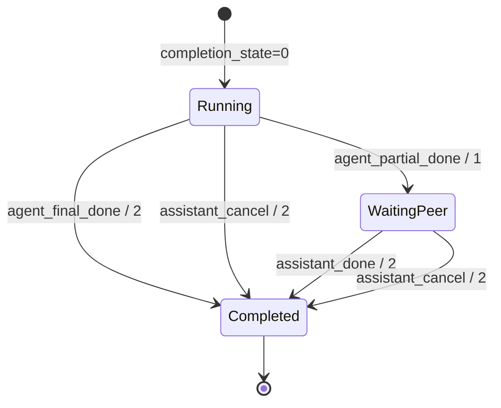
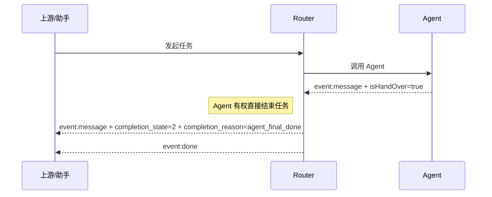
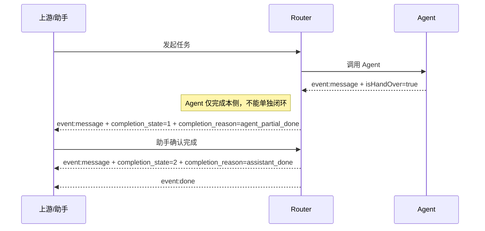
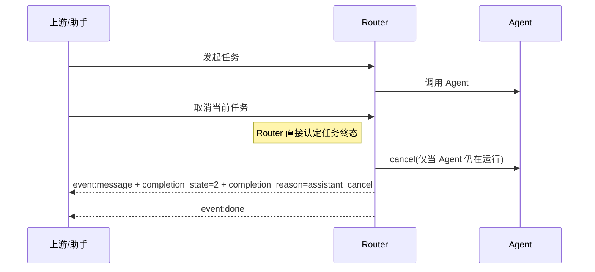
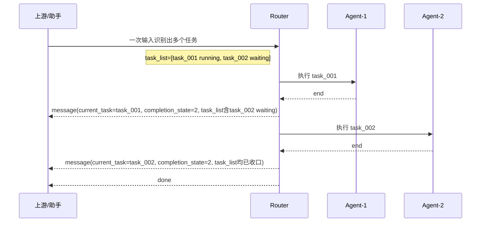

# Router-Service 流式协议补充草案

> 状态：讨论稿
> 日期：2026-04-22
> 适用范围：Router 面向上游/助手服务的 SSE 主链路协议补充
> 关联主文档：`docs/v3/router-service-通信协议规范.md`

## 1. 背景

当前已对齐的生产协议主线，优先保证：

1. 非流 `ok + output` 先稳定；
2. Agent -> Router 的既有字段结构不被打散；
3. 后续补齐 Router -> 上游的 SSE 主链路；
4. 单意图与多意图使用一套流式数据结构；
5. `snapshot` 不作为生产流式协议的必要前提。

本草案只讨论一件事：

**Router 对上游输出 SSE 时，如何在不破坏既有 Agent 业务字段的前提下，补足任务态、多意图态和结束态。**

## 2. 设计目标

本草案的目标有四个：

1. 保留既有 Agent 业务字段；
2. 补充 Router 自己的任务上下文字段；
3. 将单意图和多意图统一到同一套流式格式；
4. 将 `handover` 与 `completion` 两类语义显式拆开。

## 3. 设计原则

### 3.1 平铺扩展，不改 Agent 原字段层级

Router 对上游的 SSE 输出，以昨天已对齐的字段结构为基线：

- `node_id`
- `isHandOver`
- `handOverReason`
- `data`
- `intent_code`

Router 只在同一层平铺补充任务态字段，不新增包装层，不重组 `data` 结构。

### 3.2 `handover` 不等于任务最终结束

- `isHandOver` 表达的是交接语义；
- `completion_state` 表达的是结束语义。

两者允许同时为真，但不能互相替代。

### 3.3 `completion_state` 由 Router 统一计算

`completion_state` 不是 Agent 或助手任一单方原始字段，而是 Router 基于双方信号归一计算后的结果。

### 3.4 `current_task` 是作用对象

流式消息中的结束态、任务态，默认都指向 `current_task`，而不是整个 session，也不是整个 `task_list`。

### 3.5 Router 是任务生命周期最终 owner

无论任务是：

- Agent 直接结束；
- Agent 单侧结束后等待助手确认；
- 助手主动取消；

最终都由 Router 负责：

1. 状态收口；
2. 对上游输出最终任务态；
3. 在必要时通知下游 Agent 取消；
4. 释放任务对象，并决定是否继续后续任务。

## 4. 对上游 SSE 协议草案

### 4.1 事件类型

当前草案先保持最小集合：

1. `event: message`
   业务数据帧、状态变化帧均使用该事件名。
2. `event: done`
   流结束。

本草案先不引入额外事件名，避免在协议讨论阶段继续扩散复杂度。

### 4.2 `event: message` 数据结构

```text
event: message
data: {
  "current_task": "task_001",
  "completion_state": 1,
  "completion_reason": "agent_partial_done",
  "node_id": "end",
  "isHandOver": true,
  "handOverReason": "已提供收款人和金额交易对象",
  "data": [
    {
      "isSubAgent": "True",
      "typIntent": "mbpTransfer",
      "answer": "||500|张三|"
    }
  ],
  "intent_code": "AG_TRANS",
  "task_list": [
    { "name": "task_001", "status": "completed" },
    { "name": "task_002", "status": "waiting" }
  ]
}
```

### 4.3 字段说明

| 字段 | 类型 | 来源 | 含义 |
|------|------|------|------|
| `current_task` | string | Router | 当前这条消息所属任务 |
| `completion_state` | int | Router | 当前任务完成态：`0/1/2` |
| `completion_reason` | string | Router | 当前完成态的原因 |
| `node_id` | string | Agent | Agent 当前输出节点 |
| `isHandOver` | boolean | Agent | 是否交接控制权 |
| `handOverReason` | string | Agent | 交接原因 |
| `data` | array | Agent | Agent 原始业务载荷 |
| `intent_code` | string | Agent/Router | 当前任务对应的意图编码 |
| `task_list` | array | Router | 当前 session 下任务概览 |

说明：

1. `node_id`、`isHandOver`、`handOverReason`、`data`、`intent_code` 保持昨天的协议语义；
2. `current_task`、`completion_state`、`completion_reason`、`task_list` 为 Router 新补充字段；
3. 本草案不要求 Router 改写 Agent 的 `data` 数组内部结构；
4. 本草案先沿用 `current_task: string`、`task_list[].name: string` 的表达方式；
5. 生产落版前，建议再确认 `name` 是否等同于稳定 task id。

### 4.4 `task_list` 草案结构

```json
[
  { "name": "task_001", "status": "running" },
  { "name": "task_002", "status": "waiting" },
  { "name": "task_003", "status": "completed" }
]
```

建议状态集合先收敛为：

- `waiting`
- `running`
- `completed`
- `failed`
- `cancelled`

如果后续需要把 `waiting_user_input` 独立建模，可以在不破坏主结构的前提下再扩展。

## 5. `completion_state` 定义

### 5.1 语义定义

`completion_state` 表示：

**Router 根据 Agent、助手及取消信号计算得到的 `current_task` 完成状态。**

### 5.2 取值定义

| 值 | 含义 | 说明 |
|----|------|------|
| `0` | 未结束 | 当前任务仍在进行中 |
| `1` | 单侧结束 | 某一侧已结束，但仍需等待另一侧 |
| `2` | 最终结束 | Router 已认定当前任务终态成立 |

### 5.3 关键约束

1. `completion_state` 是 Router 的计算结果，不是任一单方原始输入；
2. `completion_state` 的作用对象是 `current_task`；
3. `completion_state=2` 后，当前任务进入终态，不应再回退；
4. `node_id=end` 不等于 `completion_state=2`；
5. `isHandOver=true` 不等于 `completion_state=2`。

## 6. `completion_reason` 草案

为避免只看数字无法定位来源，建议 Router 同时输出 `completion_reason`。

建议首批值域：

- `agent_final_done`
- `agent_partial_done`
- `assistant_done`
- `assistant_cancel`
- `router_timeout`
- `router_error`

说明：

1. `completion_state` 负责表达状态；
2. `completion_reason` 负责表达状态来源与原因；
3. 两者组合后，才能支撑排障、回放和协议消费。

## 7. 结束态计算规则

### 7.1 基本规则

| 场景 | Router 结果 |
|------|-------------|
| Agent 可直接拍板结束 | `completion_state=2`, `completion_reason=agent_final_done` |
| Agent 单侧结束，需等待助手 | `completion_state=1`, `completion_reason=agent_partial_done` |
| 助手补一个完成确认 | `completion_state=2`, `completion_reason=assistant_done` |
| 助手主动取消 | `completion_state=2`, `completion_reason=assistant_cancel` |

### 7.2 对“0/1/2 累加模型”的收敛说明

可以用“累计到 2 即最终结束”的思路帮助理解，但不建议把“加法规则”直接定义成协议本身。

更稳妥的方式是：

1. Agent/助手各自上报自己的结束事件或结束信号；
2. Router 内部完成归一计算；
3. Router 对上游只输出最终的 `completion_state` 和 `completion_reason`。

这样可以避免：

1. 重试消息重复累加；
2. 无法区分“正常结束”和“取消结束”；
3. 排查时无法判断结束来源。

## 8. 状态流转图



说明：

1. `Running` 表示任务执行中；
2. `WaitingPeer` 表示已有单侧结束，等待另一侧补全；
3. `Completed` 表示 Router 已认定当前任务结束；
4. 一旦进入 `Completed`，当前任务不应再被恢复为运行态。

## 9. 关键时序草案

### 9.1 场景一：Agent 可以直接拍板结束



### 9.2 场景二：Agent 先结束，但最终完成要等助手确认



### 9.3 场景三：助手主动取消



### 9.4 场景四：多意图串行执行



## 10. 报文样例

### 10.1 单意图，Agent 直接结束

```text
event: message
data: {
  "current_task": "task_001",
  "completion_state": 2,
  "completion_reason": "agent_final_done",
  "node_id": "end",
  "isHandOver": true,
  "handOverReason": "已提供收款人和金额交易对象",
  "data": [
    {
      "isSubAgent": "True",
      "typIntent": "mbpTransfer",
      "answer": "||500|张三|"
    }
  ],
  "intent_code": "AG_TRANS",
  "task_list": [
    { "name": "task_001", "status": "completed" }
  ]
}
```

### 10.2 单意图，Agent 单侧结束，等待助手确认

```text
event: message
data: {
  "current_task": "task_001",
  "completion_state": 1,
  "completion_reason": "agent_partial_done",
  "node_id": "end",
  "isHandOver": true,
  "handOverReason": "已提供收款人和金额交易对象",
  "data": [
    {
      "isSubAgent": "True",
      "typIntent": "mbpTransfer",
      "answer": "||500|张三|"
    }
  ],
  "intent_code": "AG_TRANS",
  "task_list": [
    { "name": "task_001", "status": "completed" }
  ]
}
```

### 10.3 助手补完成确认

```text
event: message
data: {
  "current_task": "task_001",
  "completion_state": 2,
  "completion_reason": "assistant_done",
  "node_id": "end",
  "isHandOver": true,
  "handOverReason": "已提供收款人和金额交易对象",
  "data": [
    {
      "isSubAgent": "True",
      "typIntent": "mbpTransfer",
      "answer": "||500|张三|"
    }
  ],
  "intent_code": "AG_TRANS",
  "task_list": [
    { "name": "task_001", "status": "completed" }
  ]
}
```

### 10.4 多意图，当前任务结束，后续任务仍等待

```text
event: message
data: {
  "current_task": "task_001",
  "completion_state": 2,
  "completion_reason": "agent_final_done",
  "node_id": "end",
  "isHandOver": true,
  "handOverReason": "已提供收款人和金额交易对象",
  "data": [
    {
      "isSubAgent": "True",
      "typIntent": "mbpTransfer",
      "answer": "||500|张三|"
    }
  ],
  "intent_code": "AG_TRANS",
  "task_list": [
    { "name": "task_001", "status": "completed" },
    { "name": "task_002", "status": "waiting" }
  ]
}
```

## 11. 与当前主协议的关系

本草案与 `docs/v3/router-service-通信协议规范.md` 的关系如下：

1. 主文档继续作为当前已对齐生产协议基线；
2. 本草案只补流式主链路需要新增的 Router 任务态字段；
3. 本草案不否定既有 Agent 原始字段；
4. 本草案不要求恢复 `snapshot` 作为主协议依赖；
5. 本草案可在讨论稳定后并入主协议文档。

## 12. 当前待决问题

以下问题建议在正式落版前继续确认：

1. `current_task` / `task_list[].name` 是否要明确为稳定 `task_id`；
2. `task_list` 是否每帧都返回，还是仅在状态变化帧和最终帧返回；
3. `waiting_user_input` 是否要作为独立任务状态暴露；
4. 助手补完成时，是否保留原 Agent 业务字段原样重放，还是只回任务态更新；
5. `event: done` 的发送时机，是“当前请求流结束”还是“整个 session 所有任务收口”。

## 13. 当前建议

当前建议先按以下顺序推进：

1. 先把字段语义对齐：
   `current_task`、`task_list`、`completion_state`、`completion_reason`
2. 再定结束态四条主路径：
   Agent 直接结束、Agent 单侧结束、助手补结束、助手取消
3. 最后再落实现层细节：
   SSE 回传时机、是否每帧都带 `task_list`、是否需要额外事件名

在这三个问题没定之前，不建议直接写死实现。
