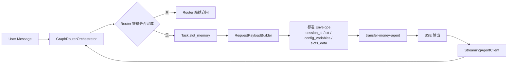
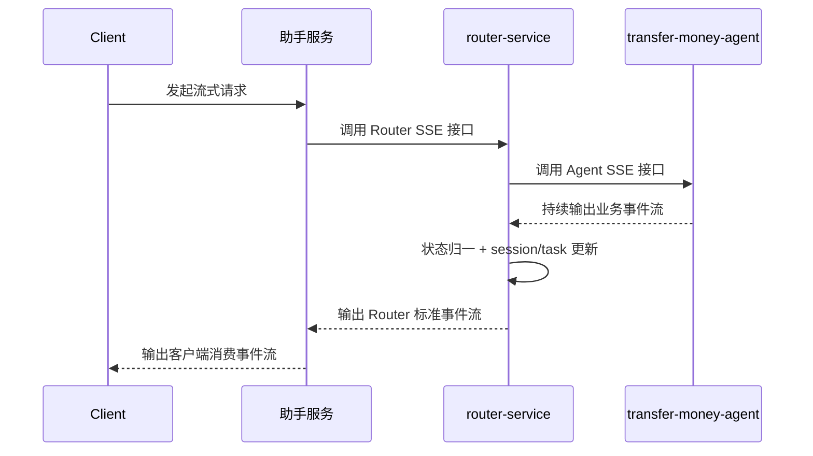
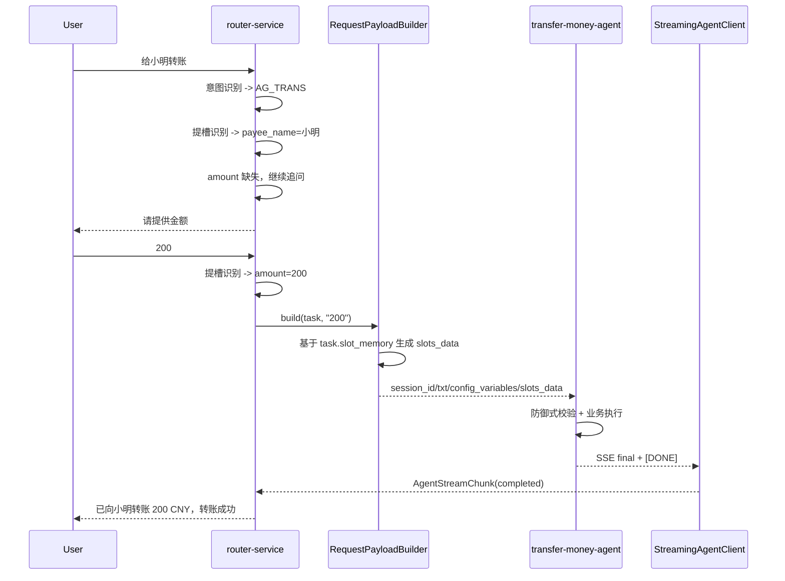
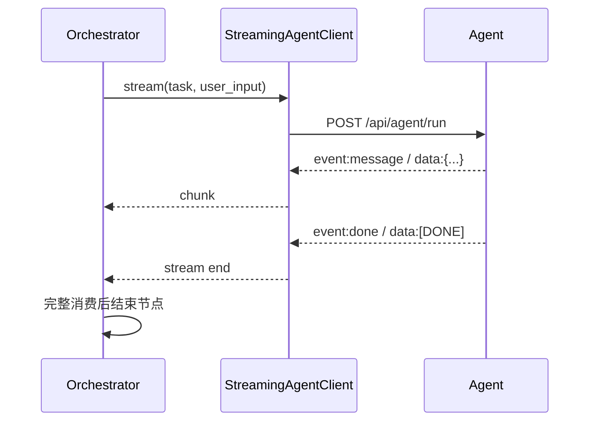
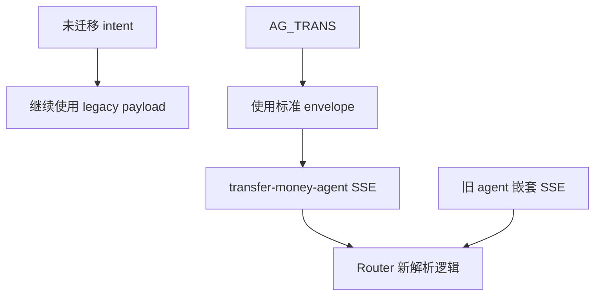

# router-service 转账 agent 与下游契约对齐方案 v0.2

## 1. 背景

`dynamic-intent-graph-runtime-fix` 分支最近一次 merge 中，已经对 Router -> Agent 的调用契约，以及转账 agent 的请求/返回格式做了明确收敛。这部分约束后续会作为生产基线。

但该分支整体较早，未包含本分支已经完成的若干优化，包括：

- router 多轮提槽和逻辑修正
- regex 清理后的识别链路
- session store 浅层性能优化
- 并发压测后的日志和运行时改良

因此本次不能直接整分支合并，也不能机械 cherry-pick。要做的是：

1. 只提炼目标分支里已经明确的下游契约变化。
2. 在当前分支上以结果为导向完成适配。
3. 保留本分支已有的性能优化和逻辑修正。

## 2. 从目标分支提炼出的有效变化

### 2.1 下游请求契约

目标分支把 Router -> Agent 的请求统一到了如下 envelope：

```json
{
  "session_id": "session_xxx",
  "txt": "给小明转账200元",
  "stream": true,
  "config_variables": [
    {"name": "custID", "value": "cust_xxx"},
    {"name": "sessionID", "value": "session_xxx"},
    {"name": "currentDisplay", "value": ""},
    {"name": "agentSessionID", "value": "session_xxx"},
    {"name": "slots_data", "value": "{\"payee_name\":\"小明\",\"amount\":\"200\"}"}
  ]
}
```

关键点：

- 顶层控制字段固定为 `session_id`、`txt`、`stream`
- 业务透传变量统一放进 `config_variables`
- Router 已确认槽位统一放进保留变量 `slots_data`
- `slots_data` 的值是 JSON 字符串，不再拆成 `payer/payee/transfer` 这种业务对象

### 2.2 下游返回契约

目标分支把 agent 返回统一到了 SSE 语义：

```text
event:message
data:{"event":"final","content":"已向小明转账 200 CNY，转账成功","ishandover":true,"status":"completed","slot_memory":{"payee_name":"小明","amount":"200"},"payload":{}}

event:done
data:[DONE]
```

同时 Router 需要兼容老 agent 可能仍返回的嵌套格式：

- `additional_kwargs.node_output.output`
- `isHandOver`
- `data[0].answer`

### 2.3 当前分支与目标分支的真实差距

当前分支中，`AG_TRANS` 仍然是旧契约：

- 请求体使用 `sessionId/taskId/input/conversation/payer/payee/transfer`
- 转账 agent 的 `/api/agent/run` 返回 JSON，而不是 SSE
- Router 在消费 agent stream 时，拿到首个终态 chunk 就 `break`

这三点决定了必须做选择性适配，而不是直接拿目标分支整体覆盖。

## 3. 本轮目标

本轮只完成和转账 agent 生产契约对齐直接相关的内容：

1. 本分支内 `transfer-money-agent` 切换到标准下游 envelope。
2. Router 支持 `config_variables` / `slots_data` 的组包和返回解析。
3. `AG_TRANS` 的 catalog 改成新契约。
4. Router 保留对旧 agent 返回格式的兼容。
5. 保留本分支已有性能和逻辑优化，不回带旧实现。

## 4. 非目标

本轮不做：

- 不整分支合并 `dynamic-intent-graph-runtime-fix`
- 不一次性迁移全部 intent 到新契约
- 不改 Router 对外北向 API 语义
- 不引入新的 regex 或 hardcode 兜底
- 不回退当前分支已有的 session/perf 优化

## 5. 设计原则

### 5.1 只对齐边界，不回带旧实现

这次对齐的对象是：

- 数据结构
- 上下游接口
- SSE 消费语义

不是整套运行时实现。

### 5.2 Router 负责理解，Agent 负责业务

转账场景里仍然保持当前职责边界：

- Router 负责意图识别、路由、提槽、多轮补槽
- transfer-money-agent 负责防御式槽位校验和业务执行/追问

### 5.3 槽位真值只能来自 `task.slot_memory`

`slots_data` 必须由 Router 基于 `task.slot_memory` 生成，不能把调用方透传的同名值当成最终真值源。

### 5.4 对齐契约时不牺牲当前多轮效果

目标分支的 envelope 方案本身没有问题，但其 `AG_TRANS` field mapping 没把 `intent`、`recent_messages`、`long_term_memory` 一起透传。

当前分支的转账提槽效果依赖这些上下文，因此本轮不生搬硬套目标分支的最小映射，而是：

- 采用同样的标准 envelope
- 额外把 `intent`、`recent_messages`、`long_term_memory` 编码进 `config_variables`

这样可以同时满足：

- 下游接口标准化
- 当前分支多轮理解效果不退化

## 6. 目标调用链



## 7. 迁移后的关键时序

### 7.0 Client -> 助手服务 -> Router -> Agent 端到端 SSE 链路

当前真实链路不是 Client 直接调用 Router，而是：

`Client -> 助手服务 -> Router -> Agent`

对应的响应方向是：

`Agent -> Router -> 助手服务 -> Client`

这条链路里，SSE 的正确语义应当是“逐层透传流式响应”，而不是“下游完成后再一次性回包”，也不是“agent 主动回调上游”。

职责边界如下：

- Client：消费助手服务输出的最终流
- 助手服务：既是 Router 的 SSE client，也是 Client 的 SSE server
- Router：既是 Agent 的 SSE client，也是助手服务的 SSE server
- Agent：对 Router 输出业务执行流

关键约束：

1. Agent 的 SSE outbound 是对 Router 这次 HTTP 请求的流式响应，不是独立 callback。
2. Router 不能把 Agent 原始 SSE 裸透传给助手服务，必须先完成：
   - `slot_memory` 合并
   - task/node/session 状态更新
   - 事件语义标准化
3. 助手服务可以在 Router 事件流之上继续做协议裁剪或包装，但不能把整段流缓存到最后才返回。
4. 只要会话状态仍保存在 Router 内存中，助手服务到 Router 这一跳必须保证会话粘性，否则多轮和流式状态都会错位。



### 7.1 转账单轮/多轮时序



### 7.2 SSE 完整消费时序



注意：

- 当前分支这里有“首个终态 chunk 就 break”的行为
- 本轮会改为完整消费 SSE 流，避免未来 agent 发送多事件时被提前截断

## 8. 目标数据结构

### 8.1 Router -> Agent 请求体

本轮 `AG_TRANS` 改造后的建议请求体如下：

```json
{
  "session_id": "$session.id",
  "txt": "$message.current",
  "stream": true,
  "config_variables": [
    {"name": "custID", "value": "$session.cust_id"},
    {"name": "sessionID", "value": "$session.id"},
    {"name": "currentDisplay", "value": ""},
    {"name": "agentSessionID", "value": "$session.id"},
    {"name": "intent", "value": "{\"code\":\"AG_TRANS\",\"name\":\"立即发起一笔转账交易\",...}"},
    {"name": "recent_messages", "value": "[\"user: 给小明转账\"]"},
    {"name": "long_term_memory", "value": "[]"},
    {"name": "slots_data", "value": "{\"payee_name\":\"小明\",\"amount\":\"200\"}"}
  ]
}
```

其中：

- `custID/sessionID/currentDisplay/agentSessionID` 对齐目标分支约束
- `intent/recent_messages/long_term_memory` 是为保持当前分支多轮理解效果额外保留
- `slots_data` 由 Router 基于当前 `task.slot_memory` 覆盖生成

### 8.2 `config_variables` 编码规则

`config_variables.value` 一律传字符串，因此 Router 组包时要做统一序列化：

- `str` -> 原样传
- `dict/list/bool/int/float/null` -> `json.dumps(..., ensure_ascii=False)`

这样可以避免把 Python `list.__repr__()` 直接塞给下游，出现单引号、不可预测解析等问题。

### 8.3 转账 agent 内部读取模型

转账 agent 改为以 `ConfigVariablesRequest` 为主模型，读取方式变为：

- `request.session_id`
- `request.txt`
- `request.get_config_value("intent")`
- `request.get_config_value("recent_messages")`
- `request.get_config_value("long_term_memory")`
- `request.get_slots_data()`

## 9. Router 侧改造方案

### 9.1 `RequestPayloadBuilder`

涉及文件：

- `backend/services/router-service/src/router_service/core/support/agent_client.py`

改造点：

1. 保留当前 legacy 默认 payload，避免影响未迁移 intent。
2. 增加 `config_variables.*` 和 `config_variables.slots_data.*` 的组包能力。
3. 新增统一的 `config variable value` 序列化逻辑。
4. `slots_data` 在 builder 内做最终聚合，避免 catalog 写出重复 JSON。

说明：

- 只有 `AG_TRANS` 等明确迁移到新契约的 intent 才走新 mapping
- 其他 intent 仍走当前 legacy payload，不会被本轮波及

### 9.2 `StreamingAgentClient`

涉及文件：

- `backend/services/router-service/src/router_service/core/support/agent_client.py`

改造点：

1. 支持扁平 SSE JSON。
2. 兼容老格式 `additional_kwargs.node_output.output`。
3. 同时兼容 `ishandover` 与 `isHandOver`。
4. 同时兼容 `content` / `message` / `data[0].answer`。
5. JSON 解析失败和空流要给出明确 failure chunk。

### 9.3 `GraphRouterOrchestrator`

涉及文件：

- `backend/services/router-service/src/router_service/core/graph/orchestrator.py`

改造点：

1. 去掉收到首个终态 chunk 后立即 `break` 的行为。
2. 改为完整消费 agent stream，再结束节点。
3. 保持当前 `task.slot_memory`、`node.output_payload`、graph 状态刷新语义不变。

## 10. 转账 agent 侧改造方案

### 10.1 请求模型

涉及文件：

- `backend/services/agents/transfer-money-agent/src/transfer_money_agent/support.py`
- `backend/services/agents/transfer-money-agent/src/transfer_money_agent/service.py`

改造点：

1. 增加 `ConfigVariablesRequest` 基类。
2. `TransferMoneyAgentRequest` 切到新 envelope。
3. 为降低切换风险，保留一段过渡兼容：
   - 新契约优先
   - 如仍收到旧的 `input/payee/transfer/conversation`，可作为 fallback 解析

这样做的目的不是长期双协议共存，而是避免当前分支里已有测试、调试脚本或临时调用在切换当天全部失效。

### 10.2 业务解析逻辑

转账 agent 内部要改成：

1. 先从 `slots_data` 读取 Router 已确认槽位。
2. 再读取 `intent/recent_messages/long_term_memory` 作为 LLM prompt 上下文。
3. 若无 LLM，仍按当前规则做防御式校验和追问。
4. 不引入 regex 或 `if "xxx" in input` 之类硬编码来替代 LLM 识别。

### 10.3 返回格式

涉及文件：

- `backend/services/agents/transfer-money-agent/src/transfer_money_agent/app.py`
- `backend/services/agents/transfer-money-agent/src/transfer_money_agent/service.py`

改造点：

1. `/api/agent/run` 改为 `StreamingResponse`
2. 输出一条标准业务事件：
   - `event:message`
   - `data:{...AgentExecutionResponse...}`
3. 输出结束事件：
   - `event:done`
   - `data:[DONE]`

## 11. Catalog 改造方案

涉及文件：

- `k8s/intent/router-intent-catalog/intents.json`
- `k8s/intent/router-intent-catalog-configmap.yaml`
- `k8s/intent/router-intent-catalog-configmap-csv.yaml`

### 11.1 `AG_TRANS` 字段映射

`AG_TRANS` 需要从当前旧映射：

- `sessionId`
- `taskId`
- `input`
- `conversation.*`
- `payer.*`
- `payee.*`
- `transfer.*`

切到新映射：

- `session_id`
- `txt`
- `stream`
- `config_variables.custID`
- `config_variables.sessionID`
- `config_variables.currentDisplay`
- `config_variables.agentSessionID`
- `config_variables.intent`
- `config_variables.recent_messages`
- `config_variables.long_term_memory`
- `config_variables.slots_data.amount`
- `config_variables.slots_data.payer_card_no`
- `config_variables.slots_data.payer_card_remark`
- `config_variables.slots_data.payee_name`
- `config_variables.slots_data.payee_card_no`
- `config_variables.slots_data.payee_card_remark`
- `config_variables.slots_data.payee_card_bank`
- `config_variables.slots_data.payee_phone`

### 11.2 `agent_url` 保持当前分支配置

目标分支里出现过 `localhost:8001` 的本地调试地址，但本分支当前的 k8s 拓扑中：

- `intent-appointment-agent` 实际承载 `transfer-money-agent`
- catalog 已经指向 `intent-appointment-agent.intent.svc.cluster.local`

因此本轮不回带那个本地地址修正，避免把开发态地址误带到当前分支。

## 12. 兼容策略



兼容结论：

- Router 出站层面同时支持 legacy payload 和新 envelope
- Router 入站层面同时兼容扁平 SSE 和老嵌套 SSE
- AG_TRANS 切换到新契约
- 其他 intent 暂不强制迁移

## 13. 代码改造清单

预计改动文件：

- `backend/services/router-service/src/router_service/core/support/agent_client.py`
- `backend/services/router-service/src/router_service/core/graph/orchestrator.py`
- `backend/services/agents/transfer-money-agent/src/transfer_money_agent/support.py`
- `backend/services/agents/transfer-money-agent/src/transfer_money_agent/service.py`
- `backend/services/agents/transfer-money-agent/src/transfer_money_agent/app.py`
- `backend/tests/test_llm_integration.py`
- `backend/tests/test_transfer_money_agent.py`
- `k8s/intent/router-intent-catalog/intents.json`
- `k8s/intent/router-intent-catalog-configmap.yaml`
- `k8s/intent/router-intent-catalog-configmap-csv.yaml`

## 14. 测试与验收

### 14.1 单测

至少补齐以下测试：

1. `RequestPayloadBuilder` 能构造 `config_variables + slots_data`
2. `config_variables` 中 `dict/list/bool` 被正确序列化
3. `StreamingAgentClient` 能解析：
   - 扁平 JSON
   - SSE JSON
   - 嵌套 `additional_kwargs.node_output.output`
   - `isHandOver`
   - `data[0].answer`
4. Orchestrator 会完整消费 SSE 流，不在首个终态 chunk 提前退出
5. transfer-money-agent 能解析新 envelope
6. transfer-money-agent 在过渡期仍可接受 legacy 请求
7. transfer-money-agent `/api/agent/run` 返回标准 SSE

### 14.2 业务场景回归

至少覆盖以下用例：

1. 单轮完整转账
   - 输入：`给小明转账200`
   - 期望：`AG_TRANS`，直接成功

2. 两轮补槽
   - 第一轮：`给小明转账`
   - 期望：`AG_TRANS`，`slot_memory={"payee_name":"小明"}`，追问 `请提供金额`
   - 第二轮：`200`
   - 期望：成功，最终 `slot_memory` 同时包含 `payee_name/amount`

3. 首轮仅金额
   - 输入：`转200`
   - 期望：追问 `请提供收款人姓名`

4. 多轮补充可选槽位
   - 第一轮：`给小明转200`
   - 第二轮：`收款卡尾号1234`
   - 期望：执行成功，`slot_memory` 包含 `payee_card_no`

5. 旧格式 agent 返回兼容
   - Router 仍能把老嵌套 SSE 解析成标准 `AgentStreamChunk`

### 14.3 验收口径

本轮完成标准：

1. `AG_TRANS` 已按生产契约对齐
2. 当前多轮转账效果不退化
3. 旧 agent 返回兼容不回归
4. 当前分支性能优化和 session store 优化不被破坏
5. 聚焦测试全部通过

## 15. 实施顺序

建议按下面顺序落地：

1. 先改 `RequestPayloadBuilder` 和 `StreamingAgentClient`
2. 再改 `orchestrator` 的 SSE 完整消费
3. 再改 `transfer-money-agent` 的请求模型和 SSE 返回
4. 最后更新 `AG_TRANS` catalog 与相关测试

这样可以把风险拆开，先稳定传输层，再切业务 agent。

## 16. 结论

本轮不是“把旧分支并回来”，而是“把旧分支里已经确认的生产契约抽出来，在当前分支上重建正确适配”。

最终结果应当是：

- AG_TRANS 的上下游数据结构与生产约束对齐
- Router 传输层具备新旧协议兼容能力
- 当前分支的性能和逻辑优化全部保留
- 后续其他 intent 要迁移到同一套 envelope 时，路径已经打通
