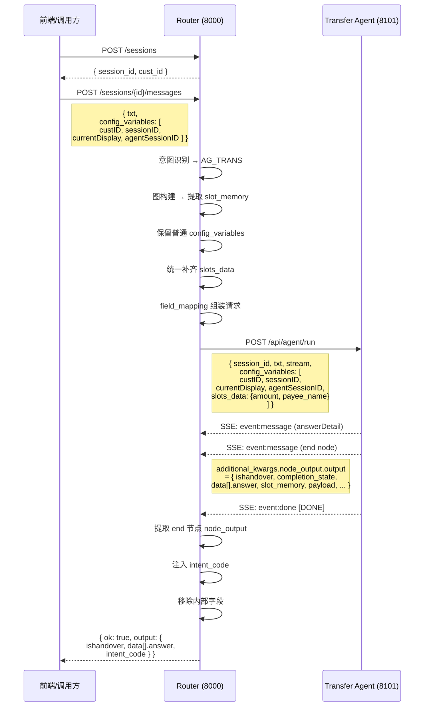

# Intent-Router 通信协议规范 v0.3

> 以 **转账（AG_TRANS）** 场景为例，自定义透传字段：`custID`、`sessionID`、`currentDisplay`、`agentSessionID`
>
> v0.3 对齐结论：
> 1. 外部协议字段格式不调整；
> 2. `config_variables` 中除 `slots_data` 外均视为透传字段；
> 3. `slots_data` 由 Router 负责补齐和收敛；
> 4. 实现顺序先打通**非流 execute**，再补 SSE 主链路；
> 5. 当前生产协议先只开放**单意图**链路，多意图输出协议待后续对齐后再开放。

> [!IMPORTANT]
> 实现现状更新（2026-04-22）：
> 1. Router 当前已按统一输出模板同时支持**非流**与 **SSE**；
> 2. 非流返回体仍为 `ok + output`，SSE 每个 `event: message` 的 `data` 与 `output` 保持同构；
> 3. 当前统一输出最小字段集合为：`current_task`、`task_list`、`completion_state`、`completion_reason`、`node_id`、`intent_code`、`status`、`ishandover`、`handOverReason`、`message`、`data`、`slot_memory`；
> 4. 助手侧多意图路径当前已按任务态输出统一收口，不再返回 `ROUTER_MULTI_INTENT_UNSUPPORTED`；
> 5. 下文中关于“仅开放单意图”“SSE 尚未对齐”的部分，属于 v0.3 早期讨论痕迹，实际联调以本更新说明和 `docs/v3/router-service-流式协议补充草案.md` 为准。

---

## 1. 请求 Router 的报文格式

### 1.1 创建会话

```
POST /api/router/v2/sessions
Content-Type: application/json
```

```json
{
    "cust_id": "C000123456"
}
```

**响应：**

```json
{
    "session_id": "session_graph_xxxxx",
    "cust_id": "C000123456"
}
```

### 1.2 发送消息（Execute 模式）

```
POST /api/router/v2/sessions/{session_id}/messages
Content-Type: application/json
```

```json
{
    "session_id": "session_graph_xxxxx",
    "txt": "帮我转账500块给张三",
    "config_variables": [
        { "name": "custID",          "value": "C000123456" },
        { "name": "sessionID",       "value": "SES_20250421_001" },
        { "name": "currentDisplay",  "value": "transfer_page" },
        { "name": "agentSessionID", "value": "AGENT_SES_001" }
    ]
}
```

| 字段 | 类型 | 必填 | 说明 |
|------|------|------|------|
| `session_id` | string | ✅ | 会话 ID（创建会话时返回） |
| `txt` | string | ✅ | 用户输入的自然语言 |
| `config_variables` | array | ❌ | **透传字段数组**，格式与子智能体一致 |
| `config_variables[].name` | string | — | 参数名 |
| `config_variables[].value` | string | — | 参数值 |

透传字段说明：

| name | 说明 | 示例 |
|------|------|------|
| `custID` | 业务系统客户标识 | `C000123456` |
| `sessionID` | 业务系统会话标识 | `SES_20250421_001` |
| `currentDisplay` | 当前前端展示页面标识 | `transfer_page` |
| `agentSessionID` | Agent 会话标识 | `AGENT_SES_001` |

> [!NOTE]
> `config_variables` 字段需要代码扩展支持（当前 `MessageRequest` 尚未定义该字段）。
> 在未扩展前，`custID` 和 `sessionID` 通过 `cust_id` 和 Router 内部 `session.id` 自动映射。

### 1.3 Router 对 `config_variables` 的处理规则（v0.3）

Router 接收到上游 `config_variables` 后，按如下规则处理：

| 类型 | Router 行为 | 是否参与 Router 自身业务判断 |
|---|---|---|
| 非 `slots_data` 字段 | 原样接收、原样保留、原样透传给下游 Agent | 否 |
| `slots_data` 字段 | 解析为结构化槽位提示；最终以下游出参阶段的 Router 槽位结果为准 | 否，作为提示信息 |

具体约束：

1. `custID`、`sessionID`、`currentDisplay`、`agentSessionID` 等字段均属于透传字段。
2. 透传字段不参与意图识别、图构建、提槽判断、节点调度等 Router 内部逻辑。
3. 上游如果未传 `slots_data`，Router 需要在发往 Agent 时根据当前 `slot_memory` 自动补一条 `slots_data`。
4. 上游如果已传 `slots_data`，Router 可以将其作为参考提示，但最终发往 Agent 的 `slots_data` 仍由 Router 当前槽位结果统一收敛。
5. 无论上游是否传入，Router 发往下游 Agent 的 `config_variables` 中最终只允许存在一条 `slots_data`。

---

## 2. `intents.json` 中的 `field_mapping` 配置

`field_mapping` 定义了 Router 如何将内部变量 → 映射到子智能体请求报文的字段。

### 2.1 AG_TRANS v0.3 推荐配置

```json
{
    "field_mapping": {
        "session_id":                                "$session.id",
        "txt":                                       "$message.current",
        "stream":                                    "true",

        "config_variables.custID":                   "$config_variables.custID",
        "config_variables.sessionID":                "$config_variables.sessionID",
        "config_variables.currentDisplay":           "$config_variables.currentDisplay",
        "config_variables.agentSessionID":           "$config_variables.agentSessionID",

        "config_variables.slots_data.amount":        "$slot_memory.amount",
        "config_variables.slots_data.payer_card_no": "$slot_memory.payer_card_no",
        "config_variables.slots_data.payer_card_remark": "$slot_memory.payer_card_remark",
        "config_variables.slots_data.payee_name":    "$slot_memory.payee_name",
        "config_variables.slots_data.payee_card_no": "$slot_memory.payee_card_no",
        "config_variables.slots_data.payee_card_remark": "$slot_memory.payee_card_remark",
        "config_variables.slots_data.payee_card_bank": "$slot_memory.payee_card_bank",
        "config_variables.slots_data.payee_phone":   "$slot_memory.payee_phone"
    }
}
```

### 2.2 映射规则说明

```
target_path  →  source_expression
(发给Agent的位置)    (从Router取值的来源)
```

#### Target 路径规则

| Target 前缀 | 生成效果 | 示例 |
|---|---|---|
| `config_variables.slots_data.xxx` | 合并为 `slots_data` JSON 字符串 | `{"name":"slots_data","value":"{\"amount\":\"500\"}"}` |
| `config_variables.xxx` | 加入 `config_variables` 数组 | `{"name":"custID","value":"C000123456"}` |
| 普通路径（如 `session_id`） | 写入 payload 顶层 | `"session_id": "session_graph_xxx"` |

#### Source 表达式可用变量

| 表达式 | 值来源 | 示例 |
|---|---|---|
| `$session.id` | Router 会话 ID | `session_graph_xxx` |
| `$session.cust_id` | 客户 ID | `C000123456` |
| `$message.current` | 当前用户输入 | `帮我转账500块给张三` |
| `$slot_memory.xxx` | 图节点提取的槽位 | `$slot_memory.amount` → `500` |
| `$task.id` | 任务 ID | `task_xxx` |
| `$intent.code` | 意图代码 | `AG_TRANS` |
| `$intent.name` | 意图名称 | `转账` |
| `$context.recent_messages` | 最近消息列表 | `[{role, content}, ...]` |
| `$context.long_term_memory` | 长期记忆 | `[...]` |
| `$config_variables.xxx` | 上游透传参数 | `$config_variables.custID` → `C000123456` |
| 不带 `$` 的字符串 | 字面量 | `"true"`, `""` |

### 2.3 扩展 config_variables 透传的配置（需代码扩展后）

扩展后 `field_mapping` 可通过 `$config_variables.xxx` 引用前端透传的 `config_variables` 字段：

```json
{
    "field_mapping": {
        "session_id":                            "$session.id",
        "txt":                                   "$message.current",
        "stream":                                "true",

        "config_variables.custID":               "$config_variables.custID",
        "config_variables.sessionID":            "$config_variables.sessionID",
        "config_variables.currentDisplay":       "$config_variables.currentDisplay",
        "config_variables.agentSessionID":       "$config_variables.agentSessionID",

        "config_variables.slots_data.amount":    "$slot_memory.amount",
        "config_variables.slots_data.payee_name":"$slot_memory.payee_name"
    }
}
```

> [!TIP]
> `$config_variables.xxx` 从请求 Router 的 `config_variables` 数组中按 `name` 查找对应的 `value`，原样透传到子智能体的 `config_variables` 中。
> `slots_data` 不属于普通透传变量，最终由 Router 在下游出参阶段统一生成。

---

## 3. Router → 子智能体的请求报文格式

Router 根据 `field_mapping` 组装后，发送到子智能体（如 `http://localhost:8101/api/agent/run`）：

```
POST /api/agent/run
Content-Type: application/json
Accept: text/event-stream
```

```json
{
    "session_id": "session_graph_xxxxx",
    "txt": "帮我转账500块给张三",
    "stream": "true",
    "config_variables": [
        {
            "name": "custID",
            "value": "C000123456"
        },
        {
            "name": "sessionID",
            "value": "SES_20250421_001"
        },
        {
            "name": "currentDisplay",
            "value": "transfer_page"
        },
        {
            "name": "agentSessionID",
            "value": "AGENT_SES_001"
        },
        {
            "name": "slots_data",
            "value": "{\"amount\": \"500\", \"payee_name\": \"张三\"}"
        }
    ]
}
```

| 字段 | 类型 | 说明 |
|------|------|------|
| `session_id` | string | Router 会话 ID |
| `txt` | string | 用户原始输入 |
| `stream` | string | 是否流式 (`"true"`) |
| `config_variables` | array | 键值对数组，传递上下文参数 |
| `config_variables[].name` | string | 参数名 |
| `config_variables[].value` | string | 参数值（`slots_data` 为 JSON 字符串） |

> [!IMPORTANT]
> `slots_data` 是特殊处理：所有 `config_variables.slots_data.*` 的映射会被合并为一个 JSON 字符串，最终只产生一条 `{"name": "slots_data", "value": "{...}"}` 记录。
>
> v0.3 组包规则：
> 1. 先保留上游传入的普通 `config_variables`；
> 2. 再由 Router 根据当前 `slot_memory` 统一生成或覆盖 `slots_data`；
> 3. 最终发往 Agent 时，非 `slots_data` 字段保持透传，`slots_data` 只保留一条。

---

## 4. 子智能体 → Router 的返回报文格式（SSE）

子智能体以 **Server-Sent Events (SSE)** 流式协议返回，格式为 `additional_kwargs.node_output.output` 嵌套结构：

### 4.1 SSE 事件流

```
event:message
data:{"content": "", "additional_kwargs": {"node_id": "answerDetail", "node_title": "返回去掉answerDetail", "node_output": {"output": "<inner_json>"}}, "response_metadata": {}, "type": "ai", ...}

event:message
data:{"content": "", "additional_kwargs": {"node_id": "end", "node_title": "结束", "node_output": {"output": "<inner_json>"}}, "response_metadata": {}, "type": "ai", ...}

event:done
data:[DONE]
```

### 4.2 SSE data 外层结构

```json
{
    "content": "",
    "additional_kwargs": {
        "node_id": "end",
        "node_title": "结束",
        "node_output": {
            "output": "<inner_json_string>"
        }
    },
    "response_metadata": {},
    "type": "ai",
    "name": null,
    "id": null,
    "example": false,
    "tool_calls": [],
    "invalid_tool_calls": [],
    "usage_metadata": null
}
```

### 4.3 `node_output.output` 内层 JSON 结构（字符串，需二次解析）

```json
{
    "ishandover": true,
    "handOverReason": "等待助手确认完成态",
    "completion_state": 1,
    "completion_reason": "agent_partial_done",
    "data": [
        {
            "isSubAgent": "True",
            "typIntent": "mbpTransfer",
            "answer": "||500|张三|"
        }
    ],
    "slot_memory": {
        "amount": "500",
        "payee_name": "张三"
    },
    "payload": {
        "agent": "transfer_money",
        "amount": "500",
        "ccy": null,
        "payer_card_no": null,
        "payer_card_remark": null,
        "payee_name": "张三",
        "payee_card_no": null,
        "payee_card_remark": null,
        "payee_card_bank": null,
        "payee_phone": null,
        "business_status": "success"
    }
}
```

### 4.4 `answer` 字段格式

```
||金额|收款人姓名|
```

示例：`||500|张三|` → 金额=500，收款人=张三

> [!NOTE]
> Router 只关注 **end 节点**的 `node_output`，`answerDetail` 节点的输出会被忽略。

---

## 5. Router → 前端的最终返回报文格式

Router 提取子智能体 end 节点的 `node_output.output` 内容，清理掉内部字段，注入 `intent_code`，返回精简结果：

```json
{
    "ok": true,
    "output": {
        "ishandover": true,
        "handOverReason": "已提供收款人和金额交易对象",
        "data": [
            {
                "isSubAgent": "True",
                "typIntent": "mbpTransfer",
                "answer": "||500|张三|"
            }
        ],
        "intent_code": "AG_TRANS"
    }
}
```

| 字段 | 类型 | 说明 |
|------|------|------|
| `ok` | boolean | 请求是否成功 |
| `output` | object | 子智能体 end 节点的核心输出 |
| `output.ishandover` | boolean | 是否完成交接 |
| `output.handOverReason` | string | 交接原因 |
| `output.data` | array | 业务数据 |
| `output.data[].isSubAgent` | string | 是否子智能体 |
| `output.data[].typIntent` | string | 业务意图类型 |
| `output.data[].answer` | string | 竖线分割的业务结果 |
| `output.intent_code` | string | Router 识别到的意图代码 |

> [!IMPORTANT]
> 以下子智能体返回的内部字段在 Router 最终响应中**已被移除**，不会暴露给前端：
> - `slot_memory` — 提槽记忆
> - `payload` — 完整业务载荷
> - `event` — 事件类型

> [!IMPORTANT]
> 子智能体标准返回不包含 `status`。`status` 是 Router 对上游输出时归一生成的任务状态。
> 子智能体如果不返回 `completion_state`，Router 按 `completion_state=0` 处理，不会根据 `ishandover=true` 推导任务完成。

### 5.1 生产协议适用范围（v0.3）

当前 Router 面向助手服务的生产协议，以 `POST /api/router/v2/sessions/{session_id}/messages` 的 **`ok + output`** 为准。

约束：

1. 生产链路不再依赖 `snapshot`；
2. 当前阶段仅开放**单意图**执行链路；
3. 一旦 Router 在本轮形成**多节点 graph**，说明已进入多意图编排语义，当前生产协议不继续向上游伪装成单意图结果；
4. 多意图、歧义澄清、图确认等完整对外交互，待后续协议讨论完成后再单独开放。

当前口径矩阵：

| 场景 | 当前生产协议行为 |
|---|---|
| 单意图，缺槽待补 | `ok=true`，返回 Router 中间态 |
| 单意图，已调度 Agent 并得到 end 节点结果 | `ok=true`，返回精简后的业务输出 |
| 多意图 / 多节点 graph | `ok=false`，返回 `ROUTER_MULTI_INTENT_UNSUPPORTED` |
| 调试 / 内部观察 | 仍可走 snapshot 能力，但不属于当前生产协议 |

多意图暂未开放时，assistant 非流协议返回如下：

```json
{
    "ok": false,
    "output": {
        "status": "failed",
        "message": "当前生产协议暂仅支持单意图场景，多意图输出协议待定。",
        "errorCode": "ROUTER_MULTI_INTENT_UNSUPPORTED",
        "route_mode": "multi_intent"
    }
}
```

当前设计决策图：

```mermaid
flowchart TD
    A[助手服务请求 Router<br/>POST /sessions/{session_id}/messages] --> B[意图识别 / 图编排]
    B --> C{当前是否形成多节点 graph}
    C -->|否| D[按单意图链路继续]
    D --> E{槽位是否齐全}
    E -->|否| F[ok=true<br/>output={intent_code,status,slot_memory,message}]
    E -->|是| G[调用 Agent / 提取 end 节点 output]
    G --> H[ok=true<br/>output={ishandover,data,intent_code}]
    C -->|是| I[ok=false<br/>output={status:failed,errorCode:ROUTER_MULTI_INTENT_UNSUPPORTED}]
```

> [!NOTE]
> 当前实现层面，“多意图暂不开放”的判定，先以 **生成多节点 graph** 作为工程约束落地。  
> 更严格的 `single_intent / multi_intent / ambiguous` 语义判定，见后文设计说明。

#### 5.1.1 `snapshot` 退出主返回与 SSE 的关系

`snapshot` 不再作为生产主协议返回体，并不意味着 Router 失去流式能力。

约束如下：

1. 非流生产主链路以 `ok + output` 为准，不再依赖 `snapshot`；
2. SSE 主链路仍然可以继续工作，因为其本质是**事件流**，不是 `snapshot` 补包；
3. 当前 Router 流式接口内部已按 `return_snapshot=false` 运行，不要求先构造 `snapshot` 再发流；
4. 若后续完全移除主协议中的 `snapshot`，不会改变 SSE 事件机制本身；
5. 如需图调试、状态回看、排障，可保留 internal/debug 级别的状态查询能力，但这不属于生产主协议。

边界说明：

1. “去掉主返回里的 `snapshot`” ≠ “去掉 SSE”；
2. “去掉主返回里的 `snapshot`” 也 ≠ “去掉 SSE 事件中的 graph/node/session 状态投影”；
3. 当前阶段，SSE 是否继续携带 graph/node/session payload，应按上游消费需求单独收敛，不与主返回协议绑定。

### 5.2 Router 中间态返回（v0.3 实现补充）

当 Router 仍停留在**意图识别 / 槽位提取阶段**，尚未真正调用下游 Agent 时，非流接口同样返回 `ok + output`，但 `output` 为 Router 中间态：

```json
{
    "ok": true,
    "output": {
        "intent_code": "AG_TRANS",
        "status": "waiting_user_input",
        "message": "请提供金额",
        "slot_memory": {
            "payee_name": "小明"
        }
    }
}
```

适用场景：

1. 已识别到唯一意图，但必填槽位仍缺失；
2. Router 需要先向用户追问，而不是立即调度下游 Agent；
3. 当前 `slot_memory` 需要回传给上游，便于继续多轮补槽。

> 该中间态是 Router 层返回，不代表下游 Agent 已执行。

> [!NOTE]
> v0.3 当前实现顺序为：先打通非流 execute 请求的最终 `ok + output` 响应，再补 SSE 回传主链路。

### 5.3 Router 语义模型不可用时的返回

当 Router 在**意图识别阶段**发现 LLM 侧不可用、连接失败或返回非法结果时，不能把该问题误报成“业务未识别”。  
对于当前 assistant 非流协议，保持 HTTP 成功返回，但 `ok=false`，并在 `output` 中明确给出失败原因：

```json
{
    "ok": false,
    "output": {
        "status": "failed",
        "message": "意图识别服务暂不可用，请稍后重试。",
        "errorCode": "ROUTER_LLM_UNAVAILABLE",
        "stage": "recognizer",
        "details": {
            "error_type": "ConnectError"
        }
    }
}
```

约束：

1. 不得返回“暂未识别到明确事项”这类业务 no-match 文案；
2. `ok` 必须反映本次 Router 业务执行是否成功；
3. `details` 用于保留模型侧错误线索，便于联调和排障。

### 5.4 单意图 / 多意图判定规则（设计约束，待后续实现）

> [!IMPORTANT]
> 本节用于说明 **v0.3 设计对齐结论**，当前代码实现尚未完全收敛到该规则。  
> 当前实现仍主要依据 `primary/candidates` 分桶结果推进后续编排；本节定义的是后续应收敛到的业务语义。

#### 5.4.1 问题定义

对于一条用户输入，多个意图分数之间并不总是彼此独立：

1. 如果本轮输入本质上是**单意图**，那么多个意图分数应该视为**竞争关系**；
2. 如果本轮输入本质上是**多意图**，那么每个子意图才应按各自成立性分别判断；
3. 因此，不能简单把“两个意图都过了各自阈值”直接等价成“这是多意图”。

当前风险点：

1. 单意图场景下，若两个意图都达到各自 `primary_threshold`，可能被误推进为双 `primary`；
2. 这种结果会被 Router 当成多意图执行图处理，而不是歧义或单意图竞争结果；
3. 这会导致用户明明表达的是一个事项，却进入多节点 graph、确认、串行执行等错误路径。

#### 5.4.2 设计结论

后续 Router 应先对本轮输入给出一个显式的语义模式判断：

- `single_intent`
- `multi_intent`
- `ambiguous`

约束如下：

1. `multi_intent` 不是“多个高分意图”的副作用；
2. `multi_intent` 必须是“用户本轮确实表达了多个可分解事项”的显式语义结论；
3. 当无法稳定判断是单意图还是多意图时，应进入 `ambiguous`，而不是直接按多意图编排。

#### 5.4.3 单意图判定原则

若模型判断当前为 `single_intent`，则不应再按“多个意图各自是否过各自阈值”来并行推进，而应采用**竞争式判定**：

1. 先看 top1 是否达到最低可执行阈值；
2. 再比较 top1 与 top2 的相对差距；
3. 若 top1 领先不足，说明当前更接近“歧义”而非“多意图”；
4. 此时可以输出 `1 primary + n candidates`，或直接进入 `ambiguous`；
5. 不应仅因为 top2 也较高，就把本轮输入直接编成多意图 graph。

示例：

- 用户输入：`给小明转账200`
- 模型输出：
  - `AG_TRANS = 0.83`
  - `AG_PAYMENT = 0.81`

该结果在单意图语义下更合理的解释是：

1. 这是一个单事项表达；
2. 模型对相邻意图边界存在干扰；
3. 应走单意图竞争收敛，而不是双意图执行。

#### 5.4.4 多意图判定原则

若模型判断当前为 `multi_intent`，则每个子意图才进入**各自成立性判断**：

1. 每个子意图分别校验是否达到自身可执行阈值；
2. 每个子意图分别决定是否需要补槽、确认或下游 Agent 调度；
3. Router 再基于这些已成立的子意图生成 graph、顺序、依赖和确认策略。

即：

- 单意图场景：先做**竞争比较**
- 多意图场景：再做**各自成立**

#### 5.4.5 `primary` / `candidates` 的语义修正

后续文档与测试口径需要明确：

1. `primary` 表示当前被 Router 视为可进入后续编排的意图集合；
2. `candidates` 表示当前尚不足以直接进入编排的干扰项、备选项或待澄清项；
3. `primary` 数量大于 1，不能自动等价为“真实多意图”；
4. 在单意图场景下，理想结果应尽量收敛为：
   - `1 primary + 0 candidates`
   - 或 `1 primary + n candidates`
   - 而不是 `2 primary`

补充说明：

由于当前 Router 仍按“每个意图自己的阈值”做分桶，因此单意图场景下可能出现：

- 某个 `candidate` 的数值分数高于某个 `primary`

这并不表示其业务优先级更高，只表示：

1. 不同意图使用的是不同阈值；
2. 当前实现尚未把“单意图竞争关系”显式建模为统一决策层。

#### 5.4.6 推荐的后续实现方向

本节仅定义方向，不代表本轮已经开发：

1. 在意图识别结果之外新增一层 `intent_decision`；
2. `intent_decision` 显式输出：
   - `route_mode`
   - `top_intents`
   - `decision_reason`
   - `clarification_question`（若为 `ambiguous`）
3. `compiler` 不再简单地把所有 `primary` 直接推进执行图；
4. 单意图和多意图走不同的后处理规则；
5. 单轮/多轮测试用例需要同步增加：
   - 单意图竞争场景
   - 真多意图拆解场景
   - 单 / 多意图歧义场景

#### 5.4.7 当前评估口径建议

在该设计真正实现之前，评估与回归测试建议按以下标准解释结果：

1. 若业务期望是单意图，而识别结果为 `2 primary + 0 candidates`，应视为识别偏差；
2. 若业务期望是单意图，而结果为 `1 primary + n candidates`，说明主意图可能正确，但仍存在干扰项；
3. 若业务期望是多意图，而结果仅有 `1 primary`，说明多意图拆解能力不足；
4. “是否多意图”应以业务语义和场景期望为准，而不是只看当前返回了几个高分意图。

---

## 6. 单意图主链路数据流图（v0.3 生产范围）

> [!NOTE]
> 下图仅表示当前已开放的**单意图**主链路。多意图进入多节点 graph 后，将按 `ROUTER_MULTI_INTENT_UNSUPPORTED` 返回，不进入该时序。



## 7. Assistant-Service 最小验证链路（v0.3）

为便于在 Router 之前增加一层助手服务，当前仓库补充了一个最小 `assistant-service` 验证实现：

- 入口：`POST /api/assistant/run`
- 模式：**仅非流转发**
- 行为：将 `{ session_id, txt, config_variables }` 直接转发到 Router 的
  `POST /api/router/v2/sessions/{session_id}/messages`
- 返回：原样透传 Router 的 JSON 响应

当前定位：

1. 用于验证“助手服务 -> Router”非流主链；
2. 不增加业务判断；
3. 不改写 `config_variables`；
4. 后续如需补充 SSE 回传链路，再在该服务基础上扩展。

> [!NOTE]
> 当前 `assistant-service` 只验证**非流**转发协议；尚未提供面向上游的 SSE 透传/改写能力。

## 8. 当前实现支持度（以代码为准）

### 8.1 当前结论

**当前服务尚未“完整支持” v0.3 全部协议范围。**

更准确地说：

1. **非流单意图主链路已基本打通**；
2. **SSE 主链路尚未按 v0.3 生产协议完全对齐**；
3. **多意图生产协议当前明确不开放**，属于设计约束，而非缺陷遗漏。

### 8.2 已支持项

以下能力当前已在代码层落地：

1. Router 非流单意图 assistant 协议：
   - 入参：`txt + config_variables`
   - 出参：`ok + output`
2. `config_variables` 普通字段透传；
3. `slots_data` 由 Router 统一补齐/收敛；
4. 单意图缺槽时返回 Router 中间态；
5. 单意图完成后返回精简业务 `output`；
6. 语义模型不可用时返回 `ok=false + ROUTER_LLM_UNAVAILABLE`；
7. 多节点 graph 在生产协议下返回 `ok=false + ROUTER_MULTI_INTENT_UNSUPPORTED`；
8. `assistant-service -> router` 的**非流**透传验证链路已具备。

### 8.3 尚未完整对齐项

以下能力当前仍未达到 v0.3 “完整协议支持”：

1. `assistant-service` 尚无面向上游的 SSE 入口；
2. 旧的 session 级 `/messages/stream` 调试入口已移除；生产 SSE 统一走 `POST /api/v1/message` + `stream=true`；
3. 文档中“子智能体 SSE -> Router -> 上游 SSE 回传”的完整闭环，目前还未在生产协议层打通；
4. 多意图的生产输出协议仍待后续讨论，不属于当前开放范围。

### 8.4 当前可用于联调的范围

如果现在要做联调，建议只按以下范围使用：

1. 单意图；
2. 非流；
3. `assistant-service -> router -> transfer-agent`；
4. `ok + output` 作为唯一生产响应；
5. `snapshot` 仅用于内部调试或状态观察，不作为上游主协议依赖。
