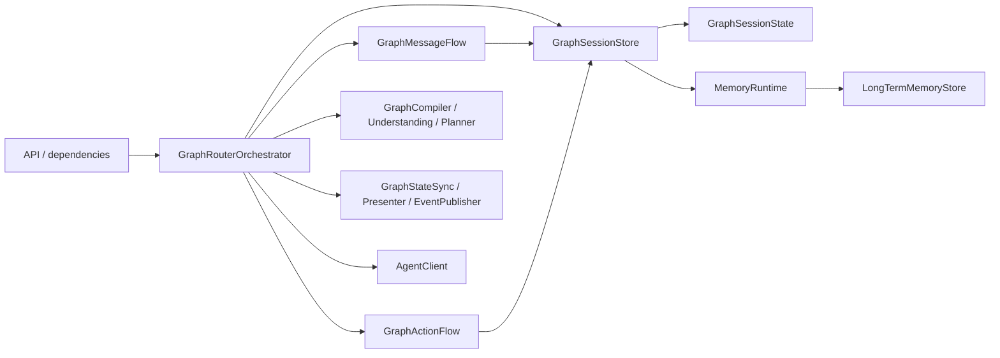
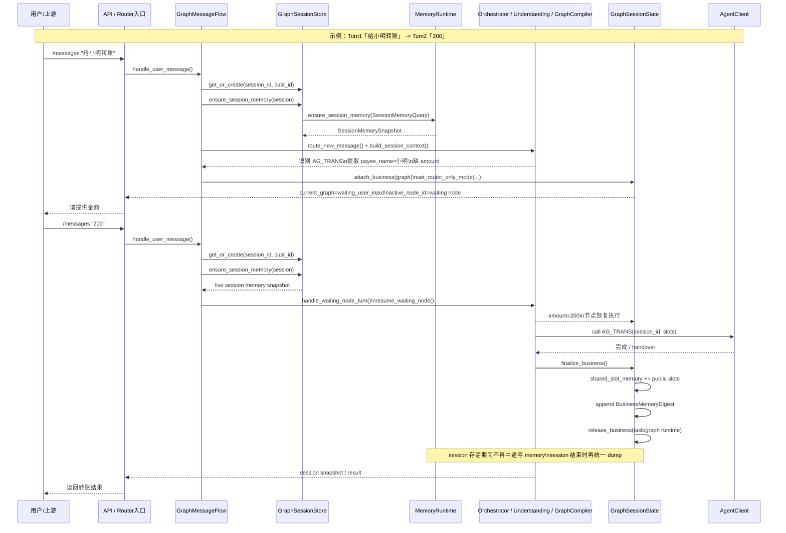
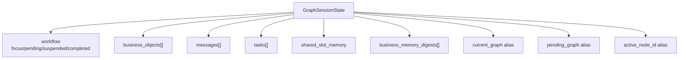
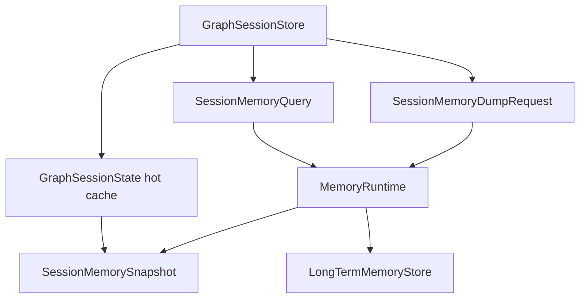

# router-service 阶段性开发报告 v0.2

状态：阶段性收口完成，进入兼容层继续压缩前的稳定阶段  
更新时间：2026-04-19  
分支：`feature/router-memory-runtime-v0.2`

## 1. 本阶段结论

当前 Router 的结构已经从“单体式 session + 零散 memory 调用”演进到“session 生命周期、graph 编排、memory runtime 边界分层明确”的状态。

这轮最关键的结果有 4 个：

1. memory 已经有独立运行时边界，不再是各处直接碰长期记忆。
2. session/business/graph 的关键生命周期操作，已经开始内收到 `GraphSessionState`。
3. terminal business 在 handover 或 cancel 后会被释放，不再长期滞留在 live workset。
4. memory 的主链路已经收敛成“session 入口 warmup + session 结束 dump”，session 存活期间不再中途写 memory。
5. 主链路相关回归当前为 `94 passed`，说明结构收口没有破坏现有业务语义。

## 2. 当前总体结构



这张图对应的意思是：

1. API 层只做 runtime 装配，不承载业务状态机。
2. `GraphRouterOrchestrator` 是顶层编排器，但已经把消息流、动作流、状态同步拆给独立模块。
3. `GraphSessionStore` 只负责 session 生命周期和 memory runtime 接入，不再直接写长期记忆细节。
4. memory 现在有单独边界，但还没有 sidecar 化，仍是本地 in-process 实现。

### 2.1 用一个示例把结构串起来

下面用一个最典型的两轮转账例子，把当前结构串起来：

- Turn 1：用户输入 `给小明转账`
- Turn 2：用户输入 `200`

假设当前业务语义是：

1. 意图识别结果为 `AG_TRANS`
2. 目标槽位至少包括：
   - `payee_name`
   - `amount`
3. 第一轮可以识别到 `payee_name=小明`
4. 第一轮缺少 `amount`，所以 Router 不调 agent，而是进入 `waiting_user_input`
5. 第二轮补齐 `amount=200` 后，再继续 graph/agent/handover 链路

对应到当前代码结构，流程会是：

| Turn | 用户输入 | 关键模块动作 | session 结果 |
| --- | --- | --- | --- |
| T1 | `给小明转账` | `message_flow -> session_store -> memory_runtime -> understanding/graph_compiler` | 创建或恢复 session；识别 `AG_TRANS`；挂上 business；缺 `amount`，进入 `waiting_user_input` |
| T1 返回 | `请提供金额` | Router 直接返回，不调 agent | `current_graph` 存活，`active_node_id` 指向等待补槽节点 |
| T2 | `200` | `message_flow -> waiting_node_turn -> orchestrator resume -> slot resolution` | 补齐 `amount=200`，节点恢复执行 |
| T2 后续 | agent 调用 | `agent_client -> finalize_business` | 释放 live business；把公共槽位和 digest 留在 session 热态；等待 session 结束再 dump |

这个例子能同时覆盖当前结构里的 5 条关键链路：

1. session 冷启动 / 恢复
2. memory warmup
3. 多轮补槽
4. business handover
5. session 热态承接业务结果

### 2.2 示例时序泳道图

下面这张图把“模块”和“调用关系”放到同一张时序泳道图里：



如果当前是 `router_only` 模式，那么上图里 `AgentClient` 那一段不会真正发出下游调用，而是停在 `ready_for_dispatch`，由 Router 直接返回当前 graph 和槽位结果。

## 3. 当前代码分层

### 3.1 顶层编排层

核心文件：

- `backend/services/router-service/src/router_service/core/graph/orchestrator.py`

职责：

1. 装配 message flow / action flow / graph runtime / state sync。
2. 承担端到端 graph drain 循环。
3. 在 handover 后触发 memory remember。
4. 构建 session context，给识别、补槽、agent 使用。

当前状态：

- orchestrator 还是总控入口
- 但已经不再自己直接管理大量 session 内部字段写入
- session 内部状态操作正在逐步下沉到 `GraphSessionState`

### 3.2 消息流层

核心文件：

- `backend/services/router-service/src/router_service/core/graph/message_flow.py`

职责：

1. 处理 `/messages` 类用户输入。
2. 识别当前 turn 处于哪种 session 状态：
   - 空闲
   - pending graph 等确认
   - waiting node 等补槽
   - guided selection
   - proactive recommendation
3. 在新 turn 进入时 warmup session memory。
4. 新建 business 并做 session business limit 控制。

当前状态：

- `router_only_mode` 已收口到 `GraphSessionState.set_router_only_mode()`
- message flow 不再直接写 session 核心兼容字段

### 3.3 动作流层

核心文件：

- `backend/services/router-service/src/router_service/core/graph/action_flow.py`

职责：

1. 处理 confirm/cancel graph。
2. 处理 cancel node。
3. 取消 graph 时处理 agent cancel 和 graph/node 状态更新。
4. action 入口时 warmup session memory。

当前状态：

- `confirm_pending_graph()` 改成走 `GraphSessionState.confirm_pending_business()`
- `cancel_pending_graph()` / `cancel_current_graph()` 会释放对应 business runtime
- action flow 不再直接改 `workflow.focus_business_id / pending_business_id`

### 3.4 Session 生命周期层

核心文件：

- `backend/services/router-service/src/router_service/core/shared/graph_domain.py`
- `backend/services/router-service/src/router_service/core/graph/session_store.py`

职责拆分如下：

`GraphSessionState`

1. 维护 session 真值：
   - `messages`
   - `tasks`
   - `shared_slot_memory`
   - `business_memory_digests`
   - `business_objects`
   - `workflow`
2. 维护 graph 兼容 alias：
   - `current_graph`
   - `pending_graph`
   - `active_node_id`
3. 提供生命周期方法：
   - `attach_business()`
   - `suspend_focus_business()`
   - `suspend_pending_business()`
   - `restore_latest_suspended_business()`
   - `confirm_pending_business()`
   - `release_business()`
   - `finalize_business()`
   - `set_active_node()/clear_active_node()`
   - `set_router_only_mode()`

`GraphSessionStore`

1. 管 session create/get/get_or_create。
2. 管 session lock。
3. 管 TTL 和 purge。
4. 管 memory runtime 入口：
   - `ensure_session_memory()`
   - `get_session_memory()`
   - `remember_business_handover()`（兼容入口，当前主链路只返回 live session memory view）
   - `expire_session()`

## 4. 当前 session 内部结构



说明：

1. 真正的业务工作集已经以 `workflow + business_objects` 为核心。
2. `current_graph/pending_graph/active_node_id` 现在更像对外兼容 shortcut。
3. 外层代码已经不再直接写这些兼容字段，而是通过 `GraphSessionState` 方法更新。

## 5. 当前 memory 结构



当前结构特征：

1. `session_store -> runtime` 的 warmup/dump 主路径已经走 DTO。
2. session 存活期间的热态读写已经收回 `GraphSessionState`。
3. `LongTermMemoryStore` 已支持 `promote_dump()`。
4. `InProcessMemoryRuntime` 仍是默认实现。
5. `_LegacyLongTermMemoryRuntime` 仍在，属于兼容层，不是目标形态。

## 6. 当前主调用链

### 6.1 新消息进入

1. `GraphMessageFlow.handle_user_message()`
2. `session_store.get_or_create()`
3. `session_store.ensure_session_memory()`
4. 根据状态进入：
   - pending graph turn
   - waiting node turn
   - route new message
5. 需要时 attach business
6. 进入 orchestrator drain

### 6.2 business handover

1. business 进入 handover 条件
2. `GraphSessionState.finalize_business()`
3. 生成 `BusinessMemoryDigest`
4. 更新 `shared_slot_memory`
5. 释放 live business runtime
6. 保留在 session 热态，等待 session 结束时统一 dump

### 6.3 session 过期

1. `GraphSessionStore.purge_expired()` 或 `get_or_create()` 发现过期/客户不一致
2. `session_store.expire_session()`
3. 构造 `SessionMemoryDumpRequest`
4. `memory_runtime.expire_session(dump)`
5. `LongTermMemoryStore.promote_dump(dump)`
6. 删除 live session 与短期 snapshot

## 7. 本阶段已完成内容

### 7.1 memory runtime 收口

已完成：

1. `SessionMemorySnapshot`
2. `MemoryRuntime`
3. `InProcessMemoryRuntime`
4. `SessionMemoryQuery`
5. `SessionMemoryRememberRequest`
6. `SessionMemoryDumpRequest`
7. `GraphSessionStore -> MemoryRuntime` DTO 化

### 7.2 session 生命周期收口

已完成：

1. `confirm_pending_business()`
2. `release_business()`
3. `set_active_node()/clear_active_node()`
4. `set_router_only_mode()`
5. 主代码面消除外层对以下字段的直接写入：
   - `session.current_graph`
   - `session.pending_graph`
   - `session.active_node_id`
   - `session.router_only_mode`

### 7.3 terminal business 释放

已完成：

1. pending graph confirm 后，pending -> focus 由 session 内部完成
2. pending graph cancel 后，pending business 会释放
3. current graph cancel 后，active business 会释放
4. finalize/handover 后，对应 business runtime 会释放

## 8. 当前未完成内容

### 8.1 sidecar 未开始

当前还没有：

1. HTTP / gRPC / unix socket sidecar transport
2. sidecar health check
3. sidecar retry / timeout / metrics
4. sidecar 多副本一致性

### 8.2 session 仍然偏重

虽然 terminal business 已经开始释放，但 `GraphSessionState` 仍然持有：

1. 历史消息
2. task 列表
3. business_objects
4. graph alias
5. shared slot / digest

所以它还不是“瘦 session”。

### 8.3 兼容层还在

当前仍存在：

1. `_LegacyLongTermMemoryRuntime`
2. runtime 上的 legacy kwargs 调用兼容
3. orchestrator/message_flow/action_flow 中的少量 `getattr(...)` 兼容式访问
4. `current_graph/pending_graph` 兼容 alias 机制

### 8.4 多 worker 绑定还只是设计态

当前一个 pod 内如果只跑一个 router 进程，那么 session 热态和进程内锁天然一致，没有额外绑定问题。

如果单 pod 内启多个 OS worker，当前这套进程内 `GraphSessionStore` 不能自动保证同一个 `session_id` 始终落到同一 worker，因此还不能直接无脑放大。这里需要二选一：

1. 保持一个 pod 一个 router 进程，通过 Pod 横向扩容，并在入口按 `session_id` 做 sticky hash。
2. 真要一个 pod 多 worker，就必须再补一层 `session_id -> worker` 调度或把 session store 外置。

## 9. 当前风险判断

### 9.1 风险已下降的部分

1. memory 调用边界已经清晰，sidecar 化不会再直接撕开业务代码。
2. terminal business 会释放，session 内 live workset 膨胀风险下降。
3. session 内关键状态变更开始集中到 `GraphSessionState`，状态漂移风险下降。

### 9.2 仍需注意的部分

1. 兼容 alias 和 workflow 双轨仍同时存在。
2. `GraphSessionState` 还是重对象。
3. 现在还没有真正的 sidecar 和多 Pod 一致性验证。
4. 多 worker 绑定还没进入代码实现，当前推荐仍是单进程 pod。
5. sticky session 只是架构前提，还没做 k8s 实测。

## 10. 性能目标与判断口径

这轮设计对性能的预期，需要拆成两层看：

1. Router 自身热路径
   - 目标：减少 session 存活期内不必要的 memory 往返和对象镜像写入
   - 判断口径：fake LLM / agent barrier 场景下，并发能力和 p99 应该优于旧设计
2. 端到端真实 LLM 场景
   - 意图识别 + 提槽本来就是高 IO 串行链路
   - 因此不能把“Router 自身优化”直接等同于“真实端到端吞吐必然翻倍”

当前更稳妥的目标是：

1. 在 fake LLM / barrier 场景下，把原先 60 并发的基线尽量推到 120 并发量级。
2. 在真实模型场景下，重点看 Router 侧额外开销是否下降，而不是承诺外部模型吞吐线性翻倍。

## 11. 测试与验证

本阶段已跑的聚焦回归：

```bash
pytest backend/tests/test_memory_store.py \
  backend/tests/test_memory_runtime.py \
  backend/tests/test_graph_session_store.py \
  backend/tests/test_graph_orchestrator.py \
  backend/tests/test_graph_message_flow.py \
  backend/tests/test_graph_action_flow.py \
  backend/tests/test_graph_session_limits.py \
  backend/tests/test_router_runtime.py \
  backend/tests/test_router_api_v2.py -q
```

结果：

- `94 passed in 1.33s`

说明：

1. memory runtime DTO 化通过
2. session 生命周期收口通过
3. action/message/orchestrator 主链路未退化
4. API/runtime 装配未被破坏

## 12. 建议的下一阶段

当前建议不要直接进入 sidecar 开发，而是按下面顺序推进：

1. 继续压缩兼容层
   - 弱化 `_LegacyLongTermMemoryRuntime`
   - 收掉更多 `getattr(...)` 兼容路径
   - 继续降低 `current_graph/pending_graph` alias 的存在感
2. 先明确多 worker / 多 pod 的 session 绑定方案
   - 一个 pod 一个 router 进程 + 一个 memory runtime
   - 或者单 pod 多 worker 时的 `session_id -> worker` 调度
3. 再定义 sidecar 协议
   - warmup/get/dump 的远程接口
   - dump payload 约束
   - 错误码、超时、重试策略
4. 最后进入 minikube / k8s 验证
   - sticky session
   - router + memory sidecar 拓扑
   - session 过期与 dump 链路

## 13. 一句话总结

当前 router 的结构已经从“功能初步可跑”进入“边界开始稳住”的阶段。

如果现在就上 sidecar/k8s，虽然也能继续推，但会把兼容层和内部状态整理问题一起带进去。更合理的节奏是先把兼容层再压一轮，再进入 minikube 验证。
