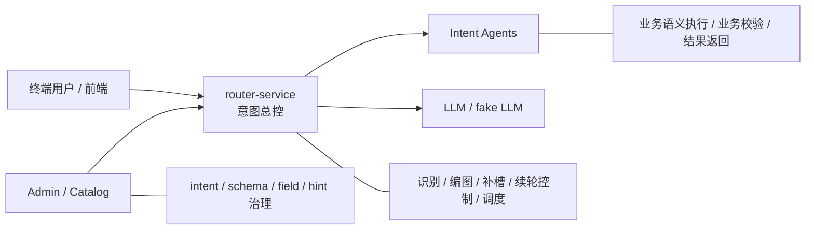
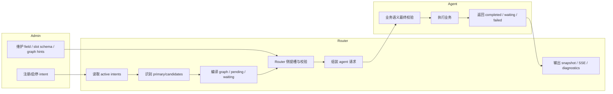
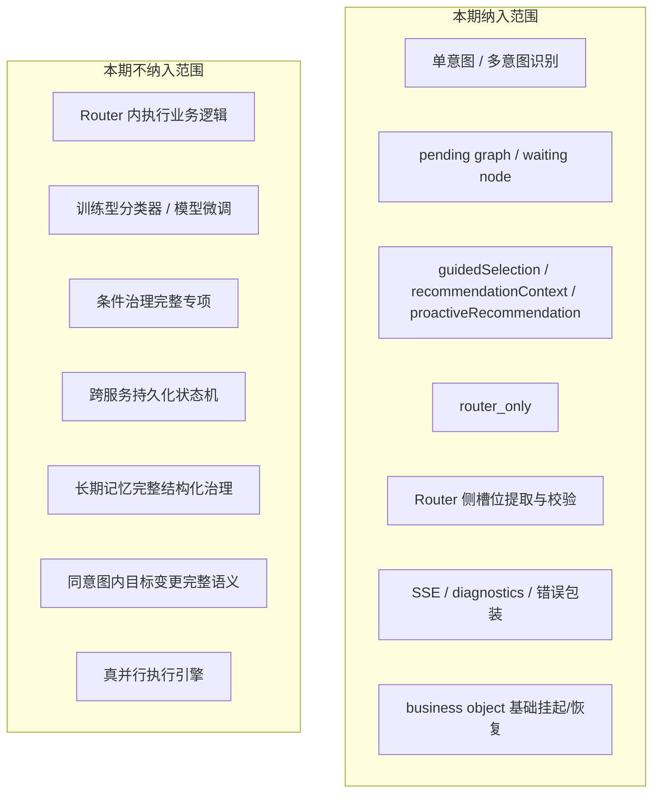
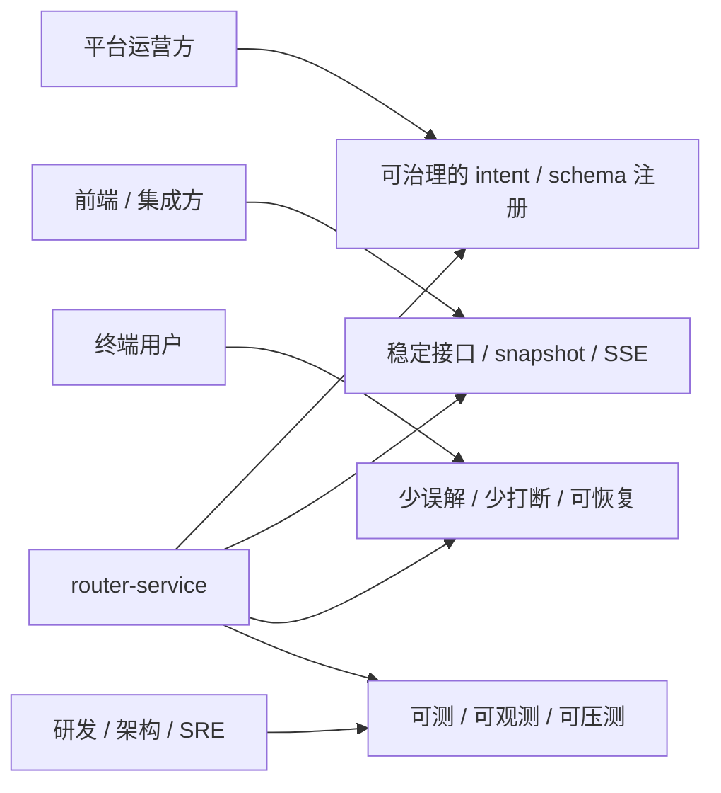
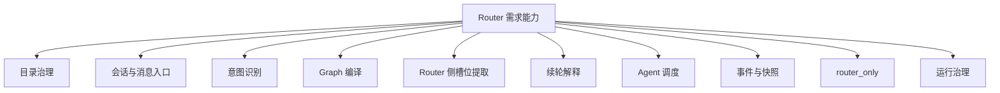
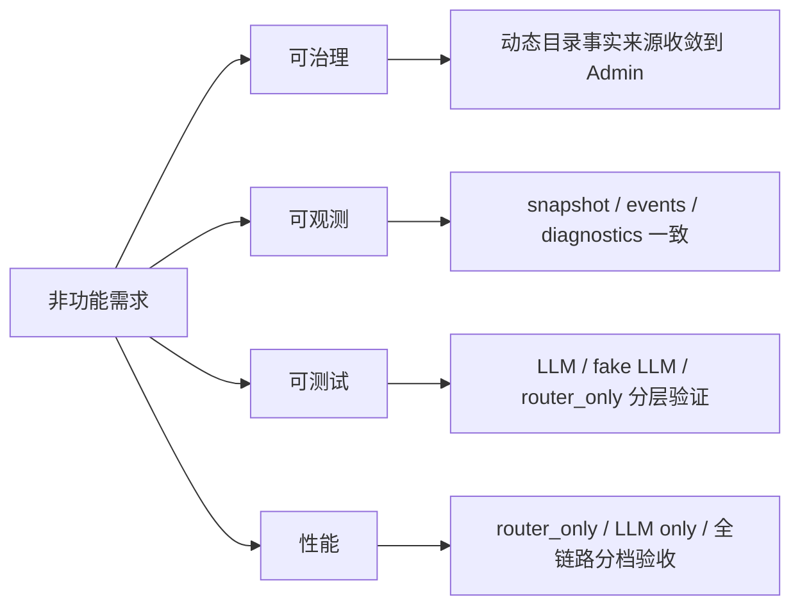
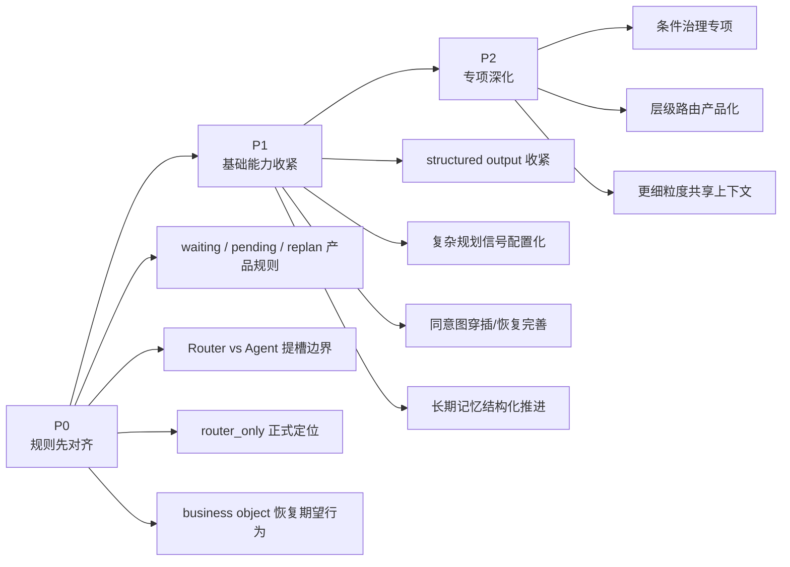

# Router Service 需求说明文档

状态：对齐草案  
更新时间：2026-04-18  
适用分支：`test/v3-concurrency-test`

## 1. 文档目的

本文档用于把 `router-service` 当前作为“意图总控”的真实职责、目标、范围、约束和优化方向收敛成一份可讨论、可对齐、可继续细化的需求材料。

这份文档不试图替代已有历史文档，而是做三件事：

1. 以当前代码为准，明确 Router 已经在做什么。
2. 以产品视角明确 Router 应该负责什么，不应该负责什么。
3. 为后续需求、功能、设计评审建立统一口径。

## 2. 服务定义

`router-service` 是意图系统中的“意图总控”。它位于用户输入和下游业务 Agent 之间，承担以下核心职责：

1. 管理会话和运行时上下文。
2. 基于动态意图库识别一个或多个意图。
3. 在 Router 内完成图编排、部分槽位提取与槽位校验。
4. 决定当前轮是继续当前事项、确认待执行图，还是切换到新的事项。
5. 将可执行节点分发给对应 Agent，并统一维护状态、事件和恢复流程。

一句话定义：

> Router 不是业务执行器，而是负责“理解、编排、补槽、调度、续轮控制”的运行时中枢。

### 2.1 服务定位图

## 3. 背景与问题

在多意图、多轮对话系统中，用户输入并不天然等于“一个意图 + 一次执行”。当前业务场景至少存在以下复杂性：

1. 一句话可能包含多个独立事项。
2. 某些事项需要先补齐槽位才能执行。
3. 某些事项需要 Router 级图确认，而不是直接静默执行。
4. 用户在等待补槽期间可能继续补当前事项，也可能取消当前事项，或者插入新的事项。
5. 下游 Agent 是独立服务，Router 需要用统一协议完成入参组装、状态协调和事件投影。

如果没有统一的意图总控，会出现以下问题：

1. 意图识别和槽位提取逻辑分散在前端、Router、Agent 之间，边界不清。
2. 同一条用户输入在不同链路上会得到不同理解结果。
3. 多意图执行顺序、确认逻辑、补槽恢复逻辑无法统一。
4. 会话状态无法沉淀成可观测、可测试、可优化的运行时模型。

## 4. 产品目标

当前阶段，Router 的产品目标不是“做一个万能对话模型”，而是提供一个稳定、可治理、可演进的运行时控制层。

### 4.1 一级目标

1. 让所有可执行意图都通过统一入口进入系统。
2. 让动态意图目录成为唯一事实来源，避免 Router 依赖静态硬编码业务。
3. 让 Router 在业务 Agent 之前完成跨意图理解、图编排和基础槽位准备。
4. 让多轮补槽、待确认图、任务取消、任务恢复有统一行为。
5. 让前端和调用方能够通过统一快照和 SSE 事件理解系统当前状态。

### 4.2 二级目标

1. 降低单轮简单场景对重型规划的依赖。
2. 支持 `router_only` 边界返回，用于集成调试、压测和运行态观测。
3. 为后续层级意图路由、条件治理、业务对象编排提供演进空间。

## 5. 责任边界

### 5.1 Router 必须负责

1. 会话生命周期管理。
2. 意图目录刷新与运行态读取。
3. 当前消息的意图识别与候选管理。
4. Graph 编译、Graph 确认、Graph 执行推进。
5. Router 侧槽位提取、槽位校验、历史预填和推荐默认值注入。
6. waiting node / pending graph 的续轮解释。
7. Agent 调用协议组装与状态映射。
8. SSE 事件发布、快照序列化、诊断信息回传。

### 5.2 Router 不应该负责

1. 具体业务语义执行。
2. 业务结果真实性判断。
3. 领域级强业务规则解释，例如“转账目标是否合理”“缴费账户是否合法”。
4. 替代 Agent 执行业务确认卡片。
5. 维护某个意图的静态 Python 逻辑模型作为事实来源。
6. 通用聊天记忆系统或跨租户长期知识库。

### 5.3 Agent 负责什么

1. 接收 Router 下发的标准化请求。
2. 对本意图的业务语义做最终防守性校验。
3. 在需要时返回业务级 `waiting_user_input` / `waiting_confirmation`。
4. 执行业务并返回结果或失败状态。

### 5.4 Admin 负责什么

1. 管理 intent、field、slot schema、graph build hints 等注册元数据。
2. 管理意图启停和目录事实来源。
3. 不直接承担运行时消息理解和会话编排。

### 5.5 责任边界泳道图

## 6. 需求范围

### 6.1 本期纳入范围

1. 单轮单意图识别与执行。
2. 单轮多意图识别、编图和确认。
3. waiting node 下的多轮补槽与恢复。
4. pending graph 下的确认、取消、重规划。
5. `guidedSelection`、`recommendationContext`、`proactiveRecommendation` 三类结构化输入。
6. `router_only` 运行模式。
7. Router 级 diagnostics、错误包装、SSE 事件。
8. 业务对象级挂起/恢复的基础运行时模型。

### 6.2 本期不纳入范围

1. Router 内执行业务逻辑。
2. 模型微调和训练型分类器。
3. 条件治理的完整专项方案。
4. 跨服务持久化状态机。
5. 完整的长期记忆结构化治理。
6. 完整的同意图内目标变更语义识别。
7. 真正的并行执行引擎。

### 6.3 范围边界图

## 7. 角色与使用方

### 7.1 平台运营方

关心：

1. 意图注册是否规范。
2. 字段语义和槽位定义是否可治理。
3. 新意图能否不改 Router 代码直接接入。

### 7.2 前端 / 集成调用方

关心：

1. 如何创建 session、提交消息、消费 SSE。
2. 如何区分当前是 pending graph、waiting node、ready_for_dispatch 还是 completed。
3. 如何处理 Router 与 Agent 共同产出的交互状态。

### 7.3 终端用户

关心：

1. 系统是否理解当前要办的事情。
2. 系统在缺信息时是否明确追问。
3. 多个事项时是否先确认再执行。
4. 被打断的事项是否能恢复。

### 7.4 研发 / 架构 / SRE

关心：

1. 运行时边界是否清晰。
2. 是否容易测试、压测、定位问题。
3. 服务是否可扩展、可治理、可演进。

### 7.5 角色诉求图

## 8. 核心概念

### 8.1 Intent

动态注册的业务能力单元，至少包含：

1. `intent_code`
2. `description`
3. `agent_url`
4. `request_schema`
5. `field_mapping`
6. `field_catalog`
7. `slot_schema`
8. `graph_build_hints`

### 8.2 Session

用户会话容器，承载：

1. 消息历史
2. 候选意图
3. 共享槽位缓存
4. 业务对象集合
5. workflow 焦点

### 8.3 Business Object

会话内部的业务运行单元，一个业务对象背后有一张 graph。它解决的是“一个 session 内不只存在一个当前图”的问题。

### 8.4 Execution Graph

由 Router 编译出的运行时执行图，包含：

1. graph 级状态
2. 节点集合
3. 依赖边
4. graph action
5. diagnostics

### 8.5 Waiting Node

当前图中等待用户补槽或确认的节点。下一轮用户输入默认先解释为该节点的续轮输入。

### 8.6 Pending Graph

待用户确认的图。常见于：

1. 多意图场景
2. 有历史预填需要确认的场景
3. graph build hints 要求确认的场景

### 8.7 Router-Only

一种到“具备执行条件”即返回的运行模式。它仍然走 Router 的真实识别、编图、补槽和校验链路，只是不调用下游 Agent。

## 9. 需求清单

### 9.0 需求能力分解图

### 9.1 意图目录治理需求

1. Router 必须只识别已激活的动态意图目录。
2. Router 必须支持 file / database 两类意图目录来源。
3. Router 必须支持定时刷新目录，不要求每次请求都实时查库。
4. Fallback intent 需要从目录中配置，不应硬编码在 Router 内。

### 9.2 会话与消息入口需求

1. Router 必须提供 session 创建、消息提交、动作提交、事件订阅能力。
2. Router 必须同时支持非流式和 SSE 流式消息接口。
3. Router 必须在 session 级保持 TTL，并具备过期清理能力。

### 9.3 意图识别需求

1. Router 必须基于当前消息、意图目录、受控上下文完成识别。
2. 输出必须区分 primary intents 和 candidate intents。
3. 必须支持 flat 和 hierarchical 两种理解模式。
4. 当 LLM 不可用时，必须 fail-closed，而不是任意猜测本地规则结果。

### 9.4 Graph 编译需求

1. Router 必须把识别结果编译为执行图，而不是直接把意图列表丢给 Agent。
2. 必须支持 `always` / `never` / `multi_intent_only` / `auto` 四种规划策略。
3. 简单单意图场景允许走确定性轻量编译，而不是强制重型规划。
4. 多意图或复杂单意图场景必须支持 graph 确认。

### 9.5 Router 侧槽位提取需求

1. Router 必须在节点分发前做本地槽位提取，而不是完全依赖 Agent 首次追问。
2. 槽位提取必须保留来源和证据信息。
3. 历史槽位复用必须受 `allow_from_history` 控制。
4. 推荐默认值注入必须受 `allow_from_recommendation` 控制。
5. 槽位未就绪时，Router 必须让节点进入 `waiting_user_input`，而不是盲目调用 Agent。

### 9.6 续轮解释需求

1. 当存在 pending graph 时，下一轮必须先进入 pending graph 解释链路。
2. 当存在 waiting node 时，下一轮必须先进入 waiting node 解释链路。
3. waiting 状态下的决策必须至少支持：
   - 继续当前节点
   - 取消当前节点
   - 挂起当前业务并重规划

### 9.7 Agent 调度需求

1. Router 必须根据 `field_mapping` 与 `request_schema` 组装下游请求。
2. Router 必须支持 HTTP stream / JSON / SSE / NDJSON 的下游 Agent 协议。
3. Router 必须统一把 Agent 返回映射成任务状态和节点状态。
4. Router 必须提供 agent cancellation 能力。

### 9.8 事件与快照需求

1. Router 必须对外输出稳定的 session snapshot。
2. Router 必须提供 graph、node、session 三层事件。
3. diagnostics 需要可回传，不应只留在日志中。
4. 错误响应需要统一包装。

### 9.9 Router-Only 需求

1. `router_only` 不能是另一套旁路分析接口。
2. 它必须复用真实运行时对象和真实理解链路。
3. 它必须在 `READY_FOR_DISPATCH` 边界停下，并对外返回完整快照。

### 9.10 运行治理需求

1. Router 必须具备 session 清理机制。
2. Graph drain 必须有最大迭代保护，避免异常图导致无限循环。
3. 系统必须对外暴露 health、内部 diagnostics、结构化错误码。

## 10. 非功能需求

### 10.1 可治理

1. 目录事实来源必须在 Admin，不应漂移到 Router 静态代码。
2. Router 对意图新增、示例修正、槽位变更应尽量做到“配置生效”。

### 10.2 可观测

1. 消息处理要能分阶段定位。
2. SSE 事件与 session snapshot 必须保持语义一致。
3. 错误码、diagnostics、日志三者要能串起来。

### 10.3 可测试

1. 支持真实 LLM、fake LLM、router_only 三类测试路径。
2. 支持对 recognition、slot、graph、agent protocol 分层测试。

### 10.4 性能

1. 简单单意图场景应尽量避免重型规划开销。
2. `router_only` 应成为性能基线测量路径。
3. 需要可控的 fake LLM / agent barrier 组合以支撑压测。
4. 性能口径需要至少拆分为 `router_only`、`LLM only`、`LLM + Agent` 三档。

### 10.5 非功能需求图

## 11. 成功标准

### 11.1 功能成功标准

1. 单意图单轮和多轮补槽可稳定闭环。
2. 多意图场景可稳定产生 pending graph 并执行确认。
3. waiting node 状态下可以继续、取消或重规划。
4. `router_only` 能稳定停在 ready_for_dispatch 边界。

### 11.2 工程成功标准

1. 对外状态语义一致，不出现“快照和事件互相打架”。
2. 新意图接入主要依赖 Admin 注册，不依赖 Router 代码分叉。
3. 关键调用链可由单元测试和集成测试覆盖。

## 12. 当前真实缺口

以下内容是对齐时必须正视的现实，而不是理想目标：

1. 同意图穿插/恢复仍然不稳。
   - 当前已经有 business object、suspend / restore 运行时结构。
   - 但在真实 `transfer_money` 回归场景下，“妈妈转账 -> 先给弟弟转 -> 再回妈妈”仍未稳定跑通。

2. waiting node 的续轮解释仍然高度依赖 LLM。
   - 当前没有一个真正独立、可解释的 waiting decision 策略层。
   - 续轮是否补当前节点、是否切换业务，仍主要通过 turn interpreter 决策。

3. 规划策略仍含硬编码复杂信号正则。
   - 当前 `auto` 模式下是否进入重型 planner，仍依赖编译器内部正则信号。
   - 这与“业务逻辑尽量不硬编码正则”的治理方向不完全一致。

4. LLM structured output 配置虽然存在，但当前 Router 请求仍主要依赖 JSON 文本解析。
   - 目前 `structured_output_method` 已进入 settings 和 client。
   - 但请求体尚未真正按 `response_format` / tool schema 严格下发。

5. 长期记忆仍然偏字符串化。
   - 当前记忆召回是可用的，但不够结构化。
   - 这限制了 history prefill 的精细度和冲突治理能力。

6. 当前运行时仍是单 session 串行执行，不应表述为“支持并行执行”。
   - graph 虽然存在 `parallel` 边类型语义。
   - 但当前 drain 过程每次只会推进一个 ready node。

7. 多副本一致性和跨副本恢复当前并不成立。
   - session store、event broker、long-term memory 目前默认仍是进程内实现。
   - 在没有外部状态存储之前，不应把当前能力表述为可水平扩展的强一致编排中枢。

## 13. 对齐后的优化优先级

### P0

1. 明确 waiting node / pending graph / replan 的产品规则。
2. 明确 Router 与 Agent 在槽位提取上的责任边界。
3. 明确 `router_only` 的正式定位和使用边界。
4. 明确 business object 恢复模型的期望行为。

### P1

1. 收紧 structured output 路径。
2. 把复杂规划信号从业务逻辑正则迁到配置或独立基础设施层。
3. 完善同意图穿插/恢复和多业务对象恢复策略。
4. 继续结构化长期记忆和历史候选过滤。

### P2

1. 条件治理专项设计。
2. 层级意图路由进一步产品化。
3. 更细粒度的业务摘要和共享上下文策略。

### 13.1 优先级路线图

## 14. 结论

Router Service 当前已经不是“简单的意图识别转发器”，而是一个具备以下特征的运行时中枢：

1. 动态目录驱动。
2. Graph 驱动。
3. Router 侧补槽和校验。
4. 事件驱动。
5. 多业务对象演进中的会话运行时。

后续所有需求、功能和架构评审，都应围绕这个真实定位展开，而不是再把它当成单纯的“分类 + 转发”层。
