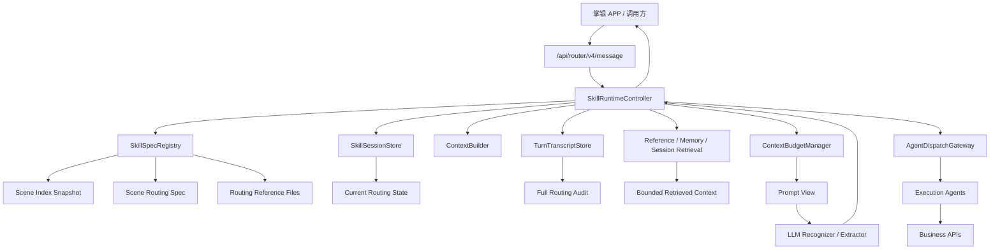
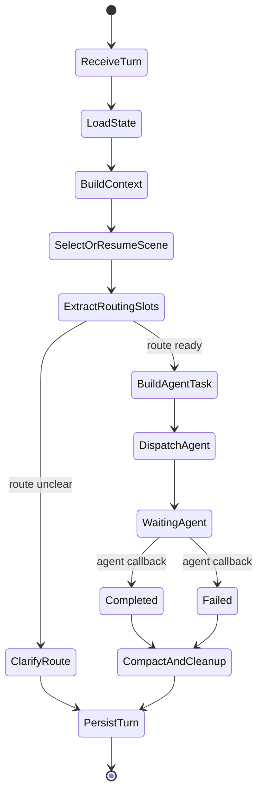

# Spec 驱动智能体上下文生命周期专项调研 v0.1

本文调研 OpenClaw 与 Hermes Agent 在 **状态持久化、渐进加载、压缩/裁剪、按需检索** 上的设计，并给出掌银 v4 Skill Runtime 的对齐方案。

结论先行：

- 长 spec 场景不能靠“每轮把所有文档和历史重新塞给模型”解决。
- 正确做法是把运行时事实拆成四类：**结构化状态、短期 transcript、可重载 spec/reference、长期记忆/检索索引**。
- LLM 每轮看到的是 runtime 组装出的“当前必要视图”，不是系统的全部事实。
- 对金融业务，Router 的状态机只应覆盖**识别、澄清、投影 routing slot hints、派发、追踪**；业务确认、风控、幂等和业务 API 调用应下沉到场景执行 Agent。

## 0. Router 与场景执行 Agent 的边界修订

本文后续所有设计都应遵守这个边界：

| 维度 | Router | 场景执行 Agent |
|---|---|---|
| 核心职责 | 识别意图、选择场景、读取场景提供的路由 spec、做路由澄清、投影 recognizer 返回的 routing slot hints、派发任务、追踪完成态 | 业务提槽补全、业务校验、风控、确认、幂等、业务 API 调用、异常处理、业务结果生成 |
| Spec 类型 | 路由 spec：触发条件、目标 Agent、路由槽位、派发契约、可读 reference | 执行 spec：业务步骤、确认、风控、接口协议、异常处理 |
| 槽位 | 不做本地启发式提槽；只按场景 slot spec 投影 recognizer 返回的候选值 | 拥有最终业务校验权，可补槽、改槽、拒绝槽位 |
| API | LLM/embedding、spec registry、session/transcript、Agent registry、Agent dispatch | 业务 API，例如转账、风控、申购、还款、缴费 |
| 多轮状态 | 路由状态、候选场景、agent_task_id、派发状态、路由槽位 hints | 业务状态、业务步骤游标、确认态、风控结果、幂等键 |

因此，Router 里不应出现“转账确认态”或直接 `risk_check/transfer` 调用。Router 可以把 recognizer 返回且场景 spec 允许的 `recipient=张三`、`amount=5000` 候选槽位传给 `transfer-agent`，但确认与最终执行由 `transfer-agent` 负责。

## 1. 调研范围

本次只关注两类问题：

1. 多轮会话如何不从头开始。
2. spec/skill/reference 很长时，如何控制上下文体积。

对标对象：

- OpenClaw：markdown workspace + skills + session transcript + compaction/pruning。
- Hermes Agent：prompt assembly + bounded memory + progressive skills + SQLite session search + compression/caching。

本次不讨论模型效果、UI、插件市场、通用浏览器自动化等外围能力。

## 2. 核心术语

| 术语 | 本文含义 |
|---|---|
| Context | 当前一次模型调用实际收到的内容。包括 system prompt、短期消息、工具结果、摘要、附件等。 |
| State | 代码持有的结构化运行状态，例如当前 Skill、步骤游标、slots、pending confirmation。 |
| Transcript | 会话原始流水，记录用户消息、助手消息、工具调用、工具结果、摘要事件。 |
| Memory | 跨会话、长期可复用的事实或偏好。 |
| Spec | `agent.md`、`skills/*.md`、`references/*.md` 等规范文档。 |
| Compaction | 把旧对话压缩成摘要，保留最近上下文。 |
| Pruning | 不改 transcript，只在当前 prompt 中裁剪旧工具结果或大块内容。 |
| Retrieval | 从 spec、reference、memory、transcript 中按需查片段。 |

## 3. OpenClaw 调研

### 3.1 Context 定义

OpenClaw 把 context 定义为“每次 run 发给模型的一切”。它明确把以下内容计入 context window：

- OpenClaw 构建的 system prompt。
- 当前 session 的用户/助手消息历史。
- tool calls、tool results、附件、转录内容。
- compaction summaries 和 pruning artifacts。
- provider wrapper 或隐藏 header。

这点对我们很关键：**Agent 详细事件、业务结果详情、reference 原文、历史 tool output 都不能无脑进入 Router prompt**。它们一旦进入，就和用户消息一样消耗 token。

参考：OpenClaw Context  
https://docs.openclaw.ai/concepts/context

### 3.2 System Prompt 组装

OpenClaw 每次 agent run 都由 runtime 组装 system prompt。它不是把所有东西全塞进去，而是固定分层：

- Tooling / Execution Bias / Safety。
- Skills 简表。
- Workspace、Runtime、Sandbox、Time。
- Workspace bootstrap files。
- Documentation 指针。

它对 workspace bootstrap 文件做硬上限：

- per-file 上限：`agents.defaults.bootstrapMaxChars`。
- total 上限：`agents.defaults.bootstrapTotalMaxChars`。
- 超限时可在 prompt 中注入 truncation warning。

可注入文件包括 `AGENTS.md`、`SOUL.md`、`TOOLS.md`、`IDENTITY.md`、`USER.md`、`HEARTBEAT.md`、`BOOTSTRAP.md`、`MEMORY.md`。但 memory daily files 不作为普通 bootstrap，每轮默认不进 context，而是通过 memory 工具按需访问。

借鉴点：

- `agent.md` 应该短小稳定，适合每轮进入 prompt。
- `skills/*.md` 不应全文每轮进入 prompt。
- `references/*.md` 应按需加载，且加载后最好摘要/片段化。
- prompt builder 要输出 token/char 预算报告，方便定位谁占了上下文。

参考：OpenClaw System Prompt  
https://docs.openclaw.ai/concepts/system-prompt

### 3.3 Skills：只注入索引，不默认注入全文

OpenClaw 的 Skill 是包含 `SKILL.md` 的目录，`SKILL.md` 有 YAML frontmatter 和 instructions。OpenClaw 在 prompt 中只注入 compact skills list，包含 name、description、location，让模型在需要时用 read 加载 `SKILL.md`。

它还区分：

- Skill 位置与优先级：workspace、project agent、personal agent、managed/local、bundled、extra dirs。
- Skill 可见性：通过 agent allowlist 决定这个 agent 能看到/用哪些 Skill。
- Prompt 中 Skill 列表的 token 成本：按可见 Skill 数量和字段长度线性增长。
- Session snapshot：会话开始时快照一份 eligible skills，后续可通过 watcher 或配置变更刷新。

借鉴点：

- 我们 v4 应该有 `SkillIndex`，每轮只放 `id/name/description/capabilities/risk_level/hash`。
- Skill 全文通过 `skill_read(skill_id)` 加载，且只在首次选择或版本变化时加载。
- 金融场景应支持 per-channel/per-customer/per-scenario Skill allowlist。
- Skill version/hash 应进入 session state，防止多轮中途 Skill 改了导致步骤语义变化。

参考：OpenClaw Skills  
https://docs.openclaw.ai/tools/skills

### 3.4 Session 持久化

OpenClaw 将 session 拆成两层：

- `sessions.json`：小型可变状态，`sessionKey -> SessionEntry`，记录当前 sessionId、last activity、toggles、token counters、compaction count 等。
- `<sessionId>.jsonl` transcript：append-only，存真实消息、工具调用、工具结果、compaction summaries，用于重建后续模型上下文。

它用 `sessionKey` 做路由隔离，例如 direct chat、group、channel、cron、webhook。`sessionId` 指向当前 transcript。`/new`、daily reset、idle expiry 等会创建新 sessionId。

借鉴点：

- 我们不能只用 `session_id -> dict` 的进程内状态。
- 需要持久化 `SkillSessionState`，并把 transcript 作为审计与重建来源。
- 对掌银，应以调用方传入的 `session_id` 为入口，但内部还要有 `run_id` 或 `turn_id` 记录每次请求。
- 结构化 state 和 transcript 要分开：state 快速读取，transcript 可审计、可回放。

参考：OpenClaw Session Management Deep Dive  
https://docs.openclaw.ai/reference/session-management-compaction

### 3.5 Compaction 与 Pruning

OpenClaw 的 compaction：

- 旧对话 turn 被摘要成 compact entry。
- 摘要保存到 transcript。
- 最近消息保留原文。
- 完整历史仍在磁盘，compaction 只改变下轮模型看到什么。
- 切分时保持 assistant tool call 与 toolResult 成对，不拆开。
- 默认 auto-compaction，接近 context limit 或遇到 context overflow 时触发。
- compaction 前可以做 memory flush，把重要信息保存到 memory 文件。

OpenClaw 的 pruning：

- 只裁剪旧 tool results。
- 不改 transcript。
- 是 compaction 的轻量补充。

借鉴点：

- 金融业务的 `api_call` 完整响应必须落 transcript/audit，但 prompt 只放关键字段摘要。
- compaction 不能压掉 Router 当前关键状态：active_scene、target_agent、agent_task_id、routing_slots、dispatch_status。交易侧 risk result、confirmation nonce、idempotency key 应由执行 Agent 自己持有和审计。
- tool call 与 result 要作为一个不可拆事件组处理。
- 我们需要区分“摘要进入模型”和“原始数据留审计”。

参考：OpenClaw Compaction  
https://docs.openclaw.ai/concepts/compaction

## 4. Hermes Agent 调研

### 4.1 Prompt Assembly：稳定前缀与临时上下文分离

Hermes 将 prompt assembly 明确拆成两类：

- cached system prompt state。
- API-call-time-only additions。

System prompt 大致包含：

- agent identity，例如 `SOUL.md`。
- tool-aware behavior guidance。
- optional system message。
- frozen MEMORY snapshot。
- frozen USER profile snapshot。
- skills index。
- context files，例如 `AGENTS.md`、`.cursorrules`。
- timestamp/session/platform hint。

临时层不进入稳定 system prompt，例如 ephemeral system prompt、gateway session overlay、later-turn recall。

借鉴点：

- 我们也应把 prompt 分成稳定层和动态层。
- 稳定层：短 `agent.md`、工具规则、场景 index。
- 动态层：当前路由 state、场景 slot spec、page_context、短期摘要、最近消息、retrieved references。
- 不要每轮修改稳定前缀，否则 prompt cache 与可解释性都会变差。

参考：Hermes Prompt Assembly  
https://hermes-agent.nousresearch.com/docs/developer-guide/prompt-assembly

### 4.2 Memory：有界、冻结、可搜索

Hermes 的长期记忆分两类文件：

- `MEMORY.md`：agent notes，环境事实、约定、学到的内容，约 2,200 chars。
- `USER.md`：用户画像、偏好，约 1,375 chars。

它们在 session start 注入为 frozen snapshot。session 内 memory tool 写入会立即落盘，但不会改变当前已构建的 system prompt，直到新 session 或强制 rebuild。

此外 Hermes 有 `session_search`：

- SQLite `state.db` 存 session/message。
- FTS5 做全文检索。
- 命中后按 session 聚合。
- 截取匹配附近上下文。
- 用快速模型做 focused summary，再返回给当前会话。

借鉴点：

- 用户画像 `user_profile` 不应由我们自行拉取，但可以在 session 内冻结一份 request snapshot。
- 长期记忆和当前交易状态不能混用。长期记忆放偏好/常用收款人/常见产品关注点；当前交易 state 放结构化 session。
- 历史会话召回应走 `session_search` 类工具，不进入每轮默认 prompt。

参考：Hermes Persistent Memory、Sessions  
https://hermes-agent.nousresearch.com/docs/user-guide/features/memory/  
https://hermes-agent.nousresearch.com/docs/user-guide/sessions/

### 4.3 Skills：Progressive Disclosure

Hermes 明确采用 Skill progressive disclosure：

- Level 0：`skills_list()`，只返回 name、description、category 等 metadata。
- Level 1：`skill_view(name)`，加载完整 Skill 内容和 metadata。
- Level 2：`skill_view(name, path)`，加载 Skill 内 reference/supporting file。

Skill 是按需知识文档，用于过程性记忆。复杂流程可被保存成 Skill。Skill 支持外部目录、主目录、只读共享目录等。

借鉴点：

- 我们当前 v4 loader 已有雏形，但需要把 Level 0/1/2 固化成接口和预算策略。
- 对业务 Skill，`Machine Spec` 负责结构化执行，markdown 正文负责业务说明。
- references 必须分文件，不应堆在 Skill 主文档里。
- Skill 需要 health check：metadata 完整性、capability 是否存在、slot schema 是否合法、reference 是否可读。

参考：Hermes Skills System  
https://hermes-agent.nousresearch.com/docs/user-guide/features/skills/

### 4.4 Context Compression 与 Caching

Hermes 有双层压缩：

- Gateway Session Hygiene：约 85% context threshold，处理消息进入 agent 前的兜底压缩。
- Agent ContextCompressor：默认约 50% context threshold，agent loop 内主压缩机制。

压缩算法核心：

1. 先裁剪旧 tool/Agent event 详情，这是便宜操作，不需要 LLM。
2. 保护头部和尾部消息。
3. 中间消息用辅助模型生成结构化摘要。
4. 重新组装：head + summary + tail。
5. 后续重复压缩时，拿上一次 summary 增量更新，而不是从零开始。

Hermes 还强调 prompt caching：

- 稳定 system prompt 是缓存断点。
- 压缩会影响中间历史缓存，但 system prompt cache 可保留。
- 避免中途修改 system prompt。

借鉴点：

- 我们应先做“无模型 pruning + 结构化 state 保留”，再接 LLM summary。
- 压缩摘要必须有固定字段，不能自由散文。
- 金融场景不应把交易关键值只放在摘要里，摘要只是模型理解辅助。
- context pressure 要可观测：每轮返回/日志记录 prompt 估算、spec 引用、Agent event 裁剪情况。

参考：Hermes Context Compression and Caching  
https://hermes-agent.nousresearch.com/docs/developer-guide/context-compression-and-caching/

### 4.5 Session Storage

Hermes 使用 SQLite `~/.hermes/state.db` 持久化：

- sessions：metadata、token、billing 等。
- messages：完整消息历史。
- messages_fts：FTS5 全文索引。
- schema_version：迁移版本。

设计点包括 WAL 并发、parent_session_id lineage、source tagging。

借鉴点：

- 我们当前已有 router-service 的 session store 基础，可以优先复用或扩展，而不是另起完全独立存储。
- 若 MVP 需要快落地，可先用 SQLite；生产多副本建议 Redis + SQL 或直接数据库。
- FTS/向量索引是派生索引，不应成为唯一事实源。

参考：Hermes Session Storage  
https://hermes-agent.nousresearch.com/docs/developer-guide/session-storage/

## 5. 两个产品的共同架构模式

### 5.1 共同点

| 维度 | 共同做法 |
|---|---|
| Prompt | runtime 每轮组装，不把所有事实都默认塞进去。 |
| Skill | 默认只放索引，全文按需加载。 |
| Session | 有持久化 session metadata 和完整 transcript。 |
| Tool result | 大结果需要裁剪或摘要，原始结果留存储。 |
| Compaction | 旧历史摘要化，最近消息保留原文。 |
| Retrieval | 长期记忆/旧会话/spec reference 按需搜索。 |
| Observability | 提供 context/token 使用报告或 session status。 |

### 5.2 差异点

| 维度 | OpenClaw | Hermes |
|---|---|---|
| Session store | `sessions.json` + JSONL transcript。 | SQLite state.db + messages/FTS，部分 gateway 仍有 JSONL。 |
| Skill 加载 | Prompt 中放 compact skills list，模型用 read 加载。 | `skills_list` / `skill_view` 分层。 |
| Memory | workspace markdown memory + memory tools。 | `MEMORY.md` / `USER.md` 有明确字符上限，session_search 用 SQLite FTS5。 |
| Compression | transcript compaction + pruning，强调 toolResult 配对。 | 双层 compression，先 prune tool results，再结构化摘要。 |
| Cache | 关注稳定 prompt 和 provider 行为。 | 明确区分 cached system prompt 与 API-call-time additions。 |

### 5.3 对我们的关键启发

不能把这四件事混在一起：

```text
业务运行状态：必须结构化、强一致、可恢复。
用户对话历史：可以摘要，但最近几轮要保留原文。
Skill/Reference：可重载，按需加载，带版本/hash。
长期记忆/历史检索：按需召回，不能每轮全量注入。
```

## 6. 掌银 v4 对齐设计

### 6.1 目标架构



### 6.2 四层上下文模型

| 层 | 内容 | 是否每轮进入 prompt | 存储 |
|---|---|---|---|
| L0 稳定规则 | `agent.md` 摘要、工具边界、响应格式 | 是，短文本 | 文件/配置 |
| L1 当前状态 | 当前场景、目标 Agent、agent_task_id、路由槽位 hints、派发状态 | 是，结构化 JSON | Session store |
| L2 工作集 | 最近 N 轮原文、场景路由 spec、场景提供的 slot spec、派发契约 | 按预算进入 | Transcript + spec registry |
| L3 可召回事实 | 历史 transcript、长期记忆、完整 reference、Agent 详细过程 | 否，按需检索 | DB/object store/index |

### 6.3 多轮生命周期



关键点：

- `LoadState` 先于任何 LLM 调用。
- 如果 `active_scene` 或 `agent_task_id` 存在，优先 resume 或转发到目标 Agent，不重新做全局意图匹配。
- 如果用户明显切换话题，Runtime 应先走路由切换策略：继续当前 Agent、挂起当前任务、或开启新场景。
- 完成/失败后，当前路由工作集可卸载，保留结构化派发摘要和 Agent 结果摘要。

### 6.4 场景路由 Spec 生命周期

| 阶段 | 输入 | Runtime 动作 | Prompt 内容 |
|---|---|---|---|
| Discover | message + scene index | 候选召回/排序 | 只放候选 metadata |
| Bind | selected scene | 读取路由 spec，记录 version/hash | 派发契约、routing slot spec |
| Extract | message + slot spec | 投影 recognizer 返回的路由槽位 hints | slots、置信度、来源说明 |
| Dispatch | routing state | 创建 Agent task | 目标 Agent、handoff fields |
| Track | Agent callback | 更新派发状态 | Agent 状态摘要 |
| Resume | next user turn | 用 state 恢复 scene/task | 不重复注入 full spec，除非 hash 变化 |

### 6.5 Session State Schema 建议

```json
{
  "session_id": "sess_abc",
  "state_version": 1,
  "active_scene": {
    "scene_id": "transfer",
    "routing_spec_version": "0.1.0",
    "routing_spec_hash": "sha256:...",
    "target_agent": "transfer-agent",
    "status": "dispatched"
  },
  "routing_slots": {
    "recipient": "张三",
    "amount": 500
  },
  "agent_task": {
    "task_id": "task_001",
    "target_agent": "transfer-agent",
    "status": "waiting_agent",
    "last_event": "task_created"
  },
  "loaded_context": {
    "references": [
      {
        "path": "references/transfer-routing.md",
        "hash": "sha256:...",
        "summary": "转账场景可从对话直取 recipient 和 amount，派发给 transfer-agent"
      }
    ],
    "last_compaction_id": "cmp_001"
  },
  "handoff": {
    "raw_message_ref": "turn_0001",
    "fields": ["recipient", "amount"],
    "summary": "用户希望向张三转账500元"
  },
  "summary": "转账场景已识别并派发给 transfer-agent，等待 Agent 进度。"
}
```

### 6.6 Transcript Event Schema 建议

```json
{
  "turn_id": "turn_0003",
  "session_id": "sess_abc",
  "timestamp": "2026-04-25T22:00:00+08:00",
  "input": {
    "message": "给张三转500元",
    "page_context": {},
    "user_profile_snapshot_ref": "profile_001"
  },
  "events": [
    {"type": "state_loaded", "active_scene": null},
    {"type": "scene_selected", "scene_id": "transfer", "target_agent": "transfer-agent"},
    {"type": "routing_slots_extracted", "slots": {"recipient": "张三", "amount": 500}},
    {"type": "agent_dispatched", "target_agent": "transfer-agent", "task_id": "task_001"}
  ],
  "prompt_report": {
    "estimated_tokens": 3200,
    "included_blocks": ["agent_rules", "state", "recent_turns", "scene_index", "routing_spec"],
    "pruned_blocks": ["full_reference"]
  }
}
```

## 7. ContextBudgetManager 设计

### 7.1 Prompt 预算顺序

每轮 prompt 组装按优先级保留：

1. 强规则：安全、工具边界、输出格式。
2. 当前结构化 state。
3. 场景路由 spec 和场景提供的 slot schema。
4. 最近用户原文与助手追问。
5. 当前识别或提槽需要的 reference 片段。
6. Agent 派发状态和最近回调摘要。
7. 压缩摘要。
8. 其他候选场景 metadata。

低优先级先裁剪：

1. 已完成或已派发场景的 full spec。
2. 已读 reference 原文。
3. 旧 Agent 回调详情。
4. 早期追问过程。
5. 旧候选场景列表。

不可裁剪：

- 当前 active_scene。
- 当前 target_agent。
- 当前 agent_task_id。
- 当前 routing_slots hints。
- 最近一轮用户原文。

### 7.2 压缩策略

第一阶段不依赖 LLM：

- 大 Agent event 或 tool result 替换为 `event_summary + event_ref`。
- 已完成 Skill full spec 从 prompt 移除。
- reference 原文替换为 `path/hash/summary`。
- 最近 N 轮原文保留。

第二阶段接 LLM summary：

固定模板：

```markdown
## User Goal
...
## Current Business State
...
## Filled Slots
...
## Completed Steps
...
## Pending Decision
...
## API Results
...
## Constraints And Risks
...
## Next Expected Step
...
```

金融业务要求：

- 摘要不能作为交易事实源。
- 摘要只帮助 LLM 理解；真正执行以 session state 和 audit record 为准。
- 摘要里必须保留路由侧 opaque identifiers，如 scene_id、agent_task_id、turn_id；业务侧 transaction_id、risk_result_id 等由执行 Agent 审计。

### 7.3 检索策略

| 检索源 | 触发条件 | 返回内容 | 是否可执行依据 |
|---|---|---|---|
| Scene index | 新意图或切换话题 | metadata/topK | 否 |
| Routing spec | 绑定场景或 hash 变化 | 目标 Agent、slot spec、派发契约 | 是，但只作为路由依据 |
| Reference | 识别/提槽需要 | chunk/summary | 否，辅助理解 |
| Session transcript | 用户提“刚才/上次/之前” | focused summary + refs | 否 |
| Long memory | 偏好/常用信息 | bounded facts | 否，需 Agent 业务校验 |
| Agent event store | 继续追踪任务 | task status/result summary | 是，作为路由追踪依据 |

## 8. 和掌银业务能力的对齐

### 8.1 请求入参仍是权威来源

当前文档提出用户画像、页面上下文由调用方传入，这个方向应保留。业务 API 不应直接给 Router 执行；Router 需要的是可派发 Agent 列表或 Agent registry。

Runtime 不应自行拉取：

- 用户等级。
- 账户余额。
- Agent endpoint / agent registry 信息。
- 当前页面。

但 Runtime 可以冻结当轮快照：

```json
{
  "profile_snapshot_id": "profile_001",
  "fields": ["user_id", "account_type", "risk_level"],
  "source": "request.user_profile"
}
```

### 8.2 Agent Dispatch Contract

Router 侧应接收或查询 Agent 派发契约，而不是业务 API capability：

```json
{
  "transfer-agent": {
    "endpoint": "/agents/transfer/tasks",
    "method": "POST",
    "task_schema": "transfer_agent_task.v1",
    "event_schema": "agent_task_event.v1",
    "accepted_scene_ids": ["transfer"],
    "supports_stream": true
  }
}
```

Runtime 校验：

- 场景 spec 是否声明目标 Agent。
- 请求或 Agent registry 是否授权目标 Agent。
- 派发字段是否符合 Agent task schema。
- 当前 session 是否已有未完成 Agent task。
- 后续用户消息是否应该转发到已有 Agent task。

### 8.3 转账场景 Router 生命周期示例

```text
Turn 1: 用户说“帮我给张三转账”
  - Scene index 匹配 transfer
  - 读取 transfer 路由 spec
  - 根据场景提供的 slot spec 提取 recipient=张三
  - 缺 amount 时，Router 可以做路由级澄清，也可以直接派发给 transfer-agent 补槽
  - state: active_scene=transfer

Turn 2: 用户说“500”
  - resume active_scene，不重新全局匹配
  - amount=500
  - 构造 agent task，派发给 transfer-agent
  - state: dispatched(task_001)

Turn 3: 用户说“确认”
  - Router 发现 task_001 仍属于 transfer-agent
  - 将用户消息关联/转发给 transfer-agent
  - transfer-agent 自己处理业务确认、风控和转账 API
  - Router 只记录 Agent event 和最终完成态
```

### 8.4 多意图与切换话题

OpenClaw/Hermes 都支持 session continuation，但我们的金融业务要更严格：

- 当前已有未完成 `agent_task_id` 时，用户说“查余额”不能默认覆盖或丢弃原任务。
- Runtime 应返回：
  - `continue_current_agent`：继续把消息给当前 Agent。
  - 或 `park_current_task`：挂起当前 Agent task，再开新场景。
  - 或 `ask_switch_policy`：询问用户是否切换。

建议策略：

| 当前状态 | 新意图风险 | 策略 |
|---|---|---|
| routing_collecting_slots | 低/中 | 可切换，保留路由草稿或询问 |
| agent_dispatched | 低 | 先判断是否转发给当前 Agent，必要时询问 |
| agent_dispatched | 高 | 必须明确切换策略 |
| agent_running_side_effect | 任意 | 不覆盖当前任务，等待 Agent 结果 |
| completed/failed | 任意 | 可新开场景 |

## 9. 实施路线

### Phase 1：持久化与工作集裁剪

目标：真正做到多轮不从头开始，且服务重启可恢复。

任务：

- 新增 `SkillSessionStore` 接口。
- 新增 SQLite 实现或复用现有 router session store。
- 新增 `TurnTranscriptStore`。
- 保存 active_scene、target_agent、agent_task_id、routing_slots、summary。
- Agent event 全量存 transcript，prompt 只放摘要。
- 完成/失败后卸载 full routing spec/reference。

验收：

- 服务重启后，用户继续回复“500”仍能接上 transfer 场景或已派发 Agent task。
- 同 session 多轮不重新匹配已确定场景。
- Agent 详细过程不出现在 prompt report，除非按需检索摘要。

### Phase 2：ContextBuilder + Budget Report

目标：每轮上下文可解释、可观测、可控。

任务：

- 新增 `ContextBuilder`。
- 定义 prompt block：rules、state、recent_turns、skill_step、reference_chunks、summaries。
- 新增 char/token 估算。
- response/log 暴露 `prompt_report`。
- 实现 per-block budget 和裁剪规则。

验收：

- 文档/spec 很长时，prompt 仍只包含当前路由状态、候选场景和必要 reference。
- 输出能看到哪些块被 included/pruned。

### Phase 3：Progressive Scene Spec Registry

目标：对齐 Hermes/OpenClaw 的渐进加载。

任务：

- `scene_index()`：返回场景 metadata。
- `scene_read(scene_id)`：返回场景路由 spec。
- `scene_reference_read(scene_id, path)`：返回 reference。
- 场景路由 spec hash/version 进入 session state。
- 场景 allowlist 与 Agent allowlist 对接。
- 场景 spec health check。

验收：

- 100 个场景时，base prompt 不线性爆炸到不可用。
- 多轮中途场景路由 spec 文件变更时，能按策略继续旧 hash 或提示重新绑定。

### Phase 4：Compaction / Pruning

目标：长会话可持续。

任务：

- 先做 deterministic pruning：旧 Agent event 详情、reference 原文、已完成场景 spec。
- 再接 LLM summary：固定业务摘要模板。
- 保留最近 N 轮原文。
- Agent dispatch/event 成组处理。
- compaction event 写 transcript。

验收：

- 20+ 轮追问后，prompt 仍稳定在预算内。
- 当前路由 state 不依赖摘要也能派发/追踪。
- compaction 后仍能回答“刚才识别到哪个场景、派给哪个 Agent、task_id 是什么”。

### Phase 5：Retrieval

目标：按需召回长期事实和历史会话。

任务：

- transcript FTS。
- reference chunk index。
- 可选 embedding index。
- `session_search(query)` 工具。
- `reference_search(scene_id, query)` 工具。
- 检索结果 bounded summary。

验收：

- 用户问“刚才那个基金风险等级是什么意思”时，能从场景 reference 或 transcript 召回说明；业务解释仍可交给场景 Agent。
- 检索结果有来源 path/turn_id，不是裸摘要。

## 10. 风险与约束

### 10.1 不能照搬的点

OpenClaw/Hermes 多数能力面向通用 agent，可以把很多规则放在 prompt 里让模型遵守。掌银金融业务不能这么做。

不能照搬：

- 让模型自由决定是否遵守安全策略。
- 让模型直接读写任意文件或接口。
- 让 Router 承担业务确认、风控、幂等和业务 API 调用。
- 用摘要替代路由事实或 Agent 审计事实。

必须代码强约束：

- Agent dispatch gate。
- Route transition validation。
- Agent task correlation。
- Agent task schema validation。
- Audit log。

### 10.2 长 spec 的主要风险

| 风险 | 表现 | 对策 |
|---|---|---|
| Base prompt 过长 | 每轮慢且贵 | 场景 index + 路由 spec slicing |
| Reference 混入过多 | LLM 注意力漂移 | 按识别/提槽需要加载 |
| Agent 事件过大 | 回调详情占满窗口 | event ref + summary |
| 摘要丢关键字段 | 多轮派发/追踪错误 | route/task 关键字段进 state |
| 场景 spec 热更新冲突 | 多轮路由契约不一致 | version/hash lock |
| 多副本丢状态 | 用户下一轮接不上 | session store 外置 |

## 11. 建议的 v4 目标形态

最终 v4 Router 不应是“LLM 按 markdown 自觉执行业务”，而应是：

```text
LLM 负责：
  - 理解用户表达
  - 从候选场景中选择
  - 按场景提供的 slot spec 返回 routing slot hints
  - 对 reference 做自然语言解释
  - 在受控路由 action 集合内建议下一步

Runtime 负责：
  - 持久化 session state
  - 选择进入 prompt 的上下文
  - 读取/裁剪/摘要场景 spec 和 Agent event
  - 校验路由状态迁移
  - 校验目标 Agent、派发 schema、agent_task_id
  - 写 audit/transcript
  - 触发 compaction/retrieval
```

这和 OpenClaw/Hermes 的共同方向一致，但掌银 Router 更强调和场景执行 Agent 的边界清晰。

## 12. 推荐下一步

建议优先实现：

1. `SkillSessionStore` + `TurnTranscriptStore`。
2. `ContextBuilder` + `prompt_report`。
3. 场景路由 spec version/hash lock。
4. Deterministic pruning。
5. Reference 按识别/提槽需要加载。

这五项完成后，再接 LLM recognizer 和 embedding 才有意义。否则 LLM 能力越强，越容易在不可控上下文里越过 Router/Agent 边界。

## 13. 参考资料

- OpenClaw Context: https://docs.openclaw.ai/concepts/context
- OpenClaw System Prompt: https://docs.openclaw.ai/concepts/system-prompt
- OpenClaw Skills: https://docs.openclaw.ai/tools/skills
- OpenClaw Compaction: https://docs.openclaw.ai/concepts/compaction
- OpenClaw Session Management Deep Dive: https://docs.openclaw.ai/reference/session-management-compaction
- OpenClaw Token Use and Costs: https://docs.openclaw.ai/reference/token-use
- Hermes Prompt Assembly: https://hermes-agent.nousresearch.com/docs/developer-guide/prompt-assembly
- Hermes Persistent Memory: https://hermes-agent.nousresearch.com/docs/user-guide/features/memory/
- Hermes Skills System: https://hermes-agent.nousresearch.com/docs/user-guide/features/skills/
- Hermes Context Compression and Caching: https://hermes-agent.nousresearch.com/docs/developer-guide/context-compression-and-caching/
- Hermes Sessions: https://hermes-agent.nousresearch.com/docs/user-guide/sessions/
- Hermes Session Storage: https://hermes-agent.nousresearch.com/docs/developer-guide/session-storage/
