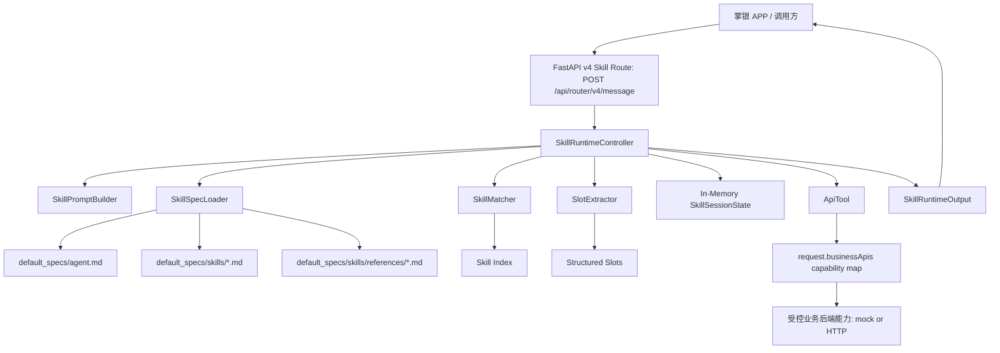
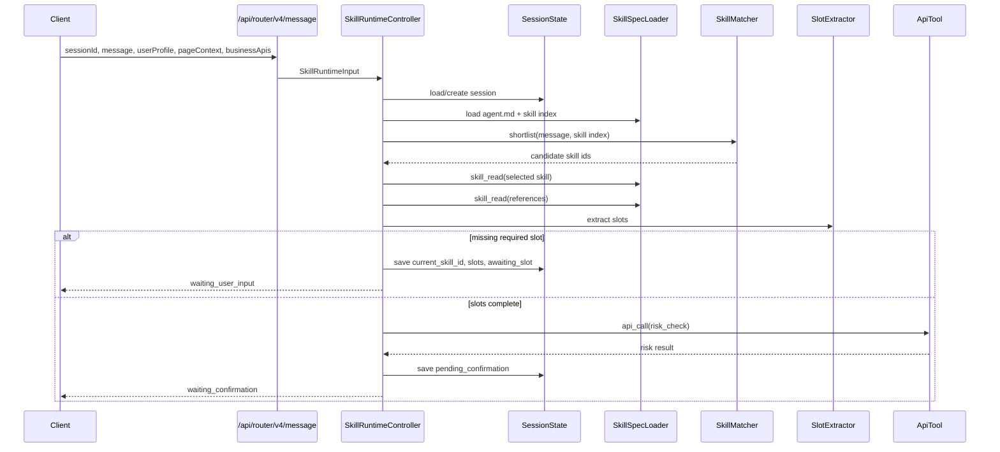
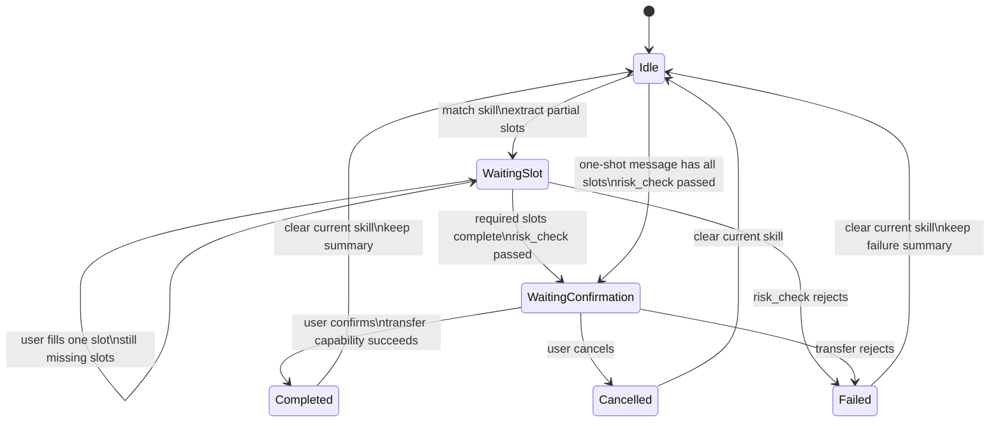

# V4 Markdown Skill Runtime Architecture v0.1

本文描述当前已落地的 v4 markdown-first Skill runtime MVP。目标是把业务流程放在 markdown Skill 中，把执行边界、会话状态、工具调用和 API 能力校验放在代码中。

## 1. 总体架构



关键约束：

- Runtime 不硬编码具体业务流程，流程来自 `skills/*.md`。
- Runtime 可以有通用基础设施规则，例如 Skill 加载、提槽、确认、状态保存、API capability 校验。
- 业务 API 地址不由 Runtime 自己发现，必须由请求 `businessApis` 注入。
- 只有 Skill 声明过、且请求授权过的 capability 才能调用。

## 2. 代码与规格文件布局

```text
backend/services/router-service/src/router_service/
├── api/routes/skill_runtime.py
├── core/skill_runtime/
│   ├── runtime.py
│   ├── skill_loader.py
│   ├── matcher.py
│   ├── slot_extractor.py
│   ├── tools.py
│   ├── prompt_builder.py
│   ├── models.py
│   └── default_specs/
│       ├── agent.md
│       └── skills/
│           ├── transfer.md
│           └── references/
│               ├── risk_rules.md
│               └── transfer_limits.md
```

## 3. 一轮请求处理



## 4. 多轮上下文处理

多轮不需要从头开始。上下文由代码里的 `SkillSessionState` 承载，而不是依赖把完整历史消息重新塞回模型。



当前 `SkillSessionState` 字段：

```text
session_id
current_skill_id
slots
awaiting_slot
pending_confirmation
turn_count
summary
```

示例：

```text
Turn 1: "帮我给张三转账"
  current_skill_id = transfer
  slots = {recipient: 张三}
  awaiting_slot = amount

Turn 2: "500"
  current_skill_id = transfer
  slots = {recipient: 张三, amount: 500}
  pending_confirmation = {skill_id: transfer, next_step_index: 3}

Turn 3: "确认"
  call transfer capability
  summary = 已成功向张三转账500元...
  clear current skill state
```

## 5. Skill 执行边界

```mermaid
flowchart LR
    Skill[transfer.md Machine Spec] --> Allowed[allowed_capabilities]
    Request[request.businessApis] --> Granted[granted endpoints]

    Allowed --> Gate{Runtime capability gate}
    Granted --> Gate

    Gate -->|allowed + granted| Call[ApiTool.call]
    Gate -->|missing or undeclared| Reject[failed response]

    Call --> Mock[mock:// handler]
    Call --> HTTP[http(s) POST]
```

这一层是 v0.1 的关键安全边界：即使后续换成 LLM planner，也不能让模型直接调用任意接口。模型最多提出下一步，Runtime 负责校验这一步是否符合 Skill 和请求授权。

## 6. v0.1 已实现范围

- `POST /api/router/v4/message`
- 默认 `transfer` Skill
- markdown frontmatter + JSON Machine Spec
- Skill index 读取与候选匹配
- Skill reference 读取审计日志
- 多轮提槽与确认态
- mock/http capability 调用
- `ROUTER_V4_SKILL_ROOT` 外部 Skill 根目录配置
- 本地 `.env.local` 自动加载
- CLI demo 与单元测试

## 7. v0.1 暂不包含

- 真实 LLM planner 接入
- embedding 预筛
- RAG 查询
- Redis/数据库 session 持久化
- 多副本 session 共享
- Skill 版本锁定
- 流式 v4 响应

后续演进应优先把 `SkillSessionState` 接到共享 session store，并把当前确定性 matcher/extractor 替换或增强为“embedding/LLM 生成建议 + Runtime 强校验”的模式。
